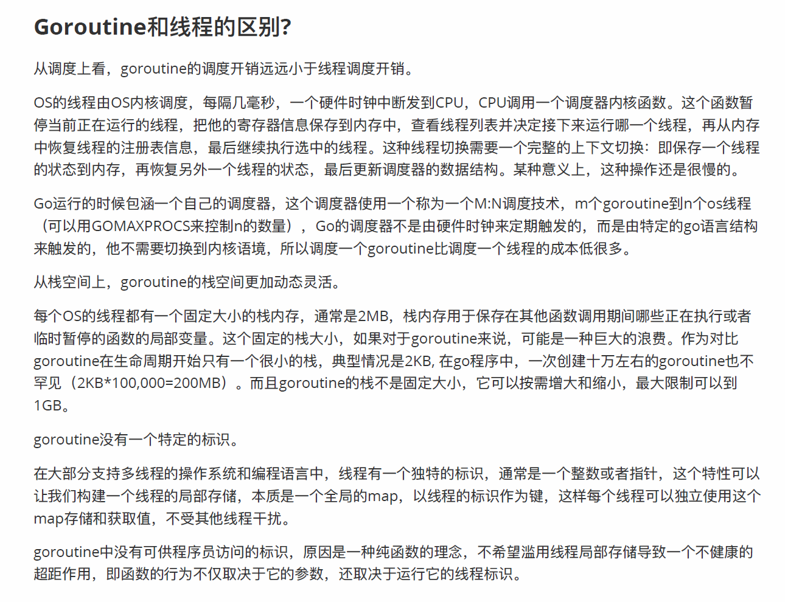
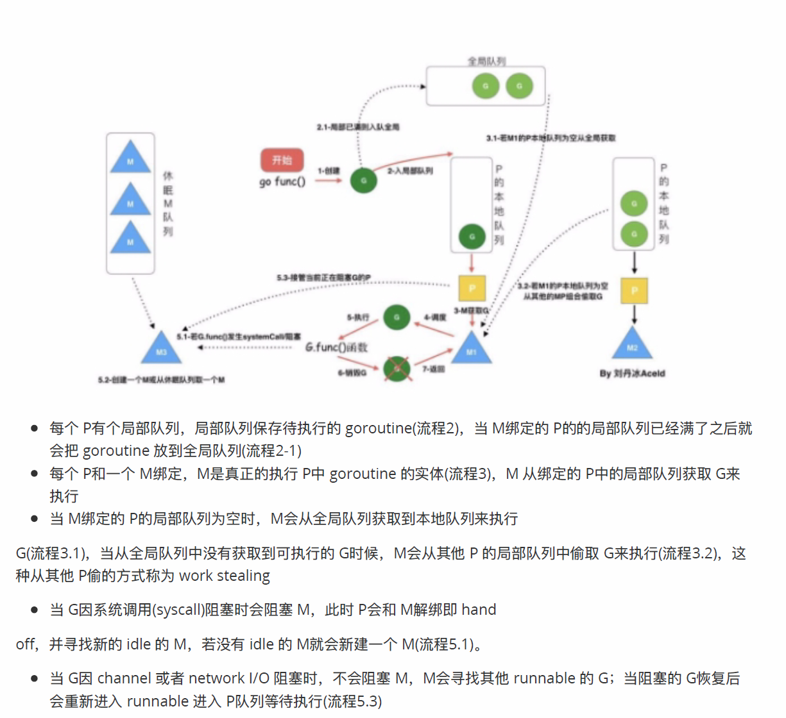

## Go基本面试题

### goroutinue和java线程的区别

https://www.jianshu.com/p/6168b10dee34

- 线程模型（内核、用户、混合）

### GMP

https://segmentfault.com/a/1190000023869478

### 协程和线程在创建的栈的大小

java线程中hotspot是1M。

go协程是1k。（可以动态调整）

