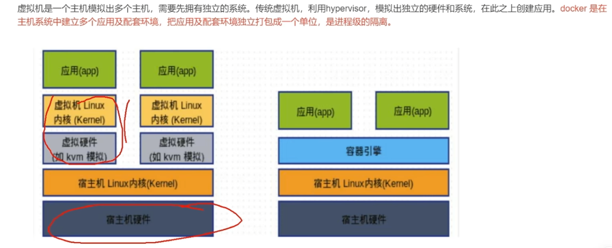
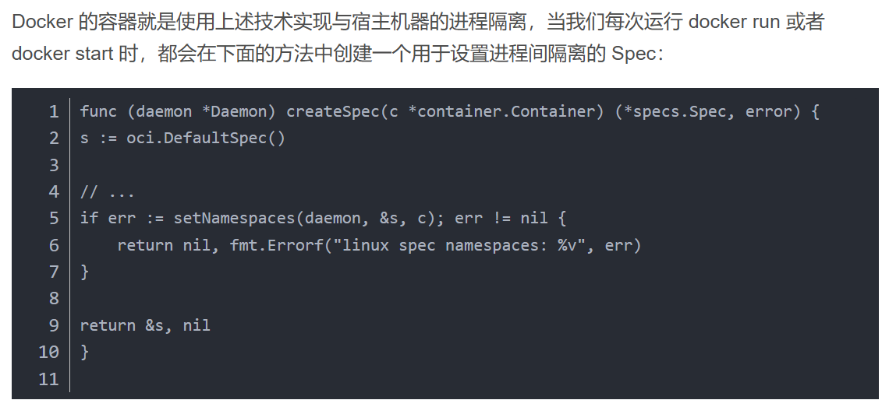
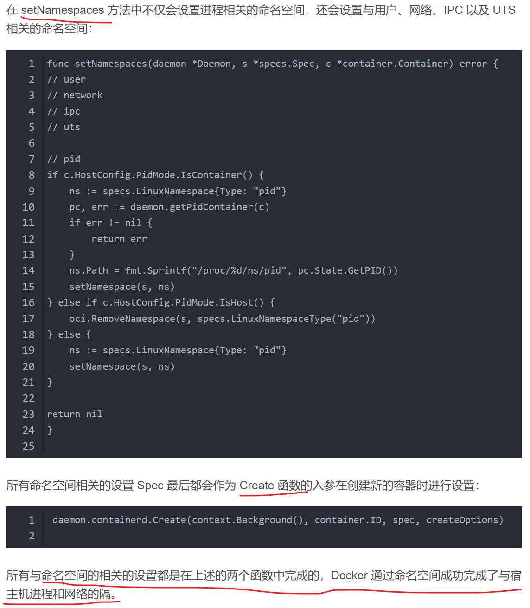
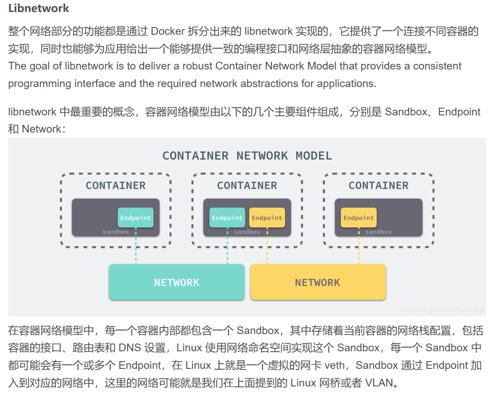
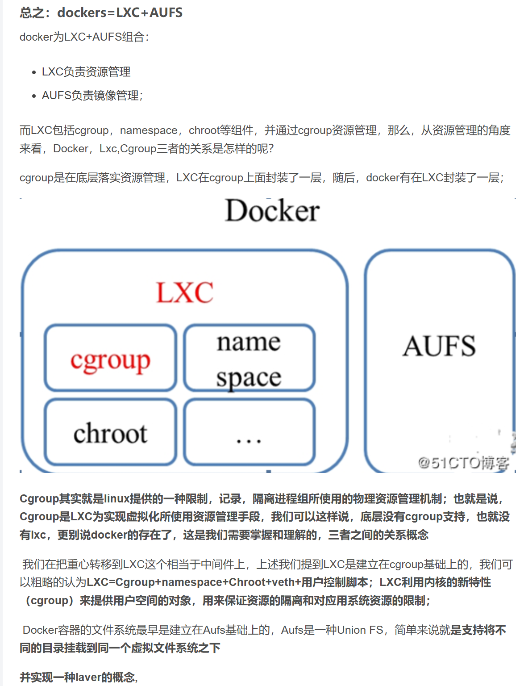
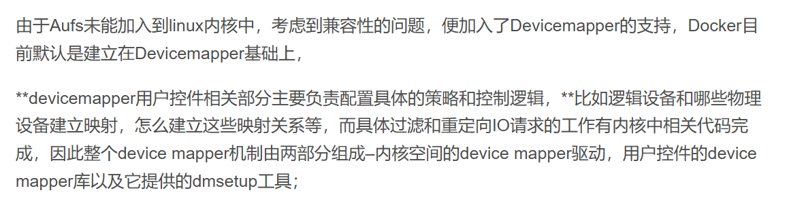

## Docker的基本使用

参考：[[csdn](https://blog.csdn.net/qq_38140292/article/details/123256877)]

### 安装

参考菜鸟教程。

 阿里云镜像加速器：[[aliyun](https://cr.console.aliyun.com/cn-hangzhou/instances/mirrors)]

### 部署springboot项目

参考：[[csdn](https://blog.csdn.net/m0_58847451/article/details/129774170)]

好的，这里给一个具体的例子，假设您有一个名为 myapp 的 Spring Boot 应用程序，需要将其运行在 Docker 中。

1. 创建 Dockerfile：在 myapp 项目的根目录下创建一个 Dockerfile 文件，内容如下：

```dockerfile
FROM openjdk:8-jdk-alpine

COPY target/myapp.jar /app.jar

EXPOSE 8080

ENTRYPOINT ["java", "-jar", "/app.jar"]
```

这个 Dockerfile 使用 openjdk:8-jdk-alpine 作为基础镜像，并将 myapp 项目打包出来的 JAR 文件复制到容器中。容器的 8080 端口也被暴露出来，这是因为 Spring Boot 默认使用的是 8080 端口。最后，使用 ENTRYPOINT 指令设置容器启动时运行的命令。

2. 构建 Docker 镜像：在终端中进入到 myapp 项目的根目录下，然后运行以下命令来构建 Docker 镜像：

```shell
docker build -t myapp .
```

该命令会将 myapp 项目打包并构建出一个名为 myapp 的 Docker 镜像。

3. 运行 Docker 容器：使用以下命令来启动 Docker 容器：

```shell
docker run -p 8080:8080 myapp
```

该命令会启动一个名为 myapp 的容器，并将容器的 8080 端口映射到主机的 8080 端口。这样，您就可以通过浏览器访问 [http://localhost:8080](http://localhost:8080/) 来访问应用程序了。

注意，此示例假定您已经在 myapp 项目中使用 Maven 或 Gradle 打包出了一个可执行的 JAR 文件。如果您还没有打包应用程序，可以在项目的根目录下运行以下命令：

```shell
./mvnw package
```

或者

```shell
./gradlew bootJar
```

这将使用 Maven 或 Gradle 打包出一个可执行的 JAR 文件，然后将其保存到 target 目录下。之后，您就可以使用 Dockerfile 将该 JAR 文件打包成 Docker 镜像并在 Docker 容器中运行了。

==ADD和COPY的区别：==

`COPY` 和 `ADD` 都可以将文件复制到 Docker 镜像中，但它们之间有几个区别：

1. `COPY` 只能复制本地文件或目录，而 `ADD` 还支持从 URL、tar 文件和压缩文件中复制文件到镜像中。
2. `ADD` 在复制文件的同时，还会将其解压缩。因此，如果您需要将文件复制到镜像中并解压缩，可以使用 `ADD` 命令。
3. `ADD` 支持的选项比 `COPY` 更多，例如 `--chown` 选项可以设置文件的所有者和用户组，`--chmod` 选项可以设置文件的权限等。

在 Spring Boot 应用程序的情况下，通常使用 `COPY` 命令将可执行的 JAR 文件复制到镜像中，因为 JAR 文件不需要解压缩。因此，示例 Dockerfile 中使用了 `COPY` 命令：

```bash
COPY target/myapp.jar /app.jar
```

如果您需要复制并解压缩其他类型的文件，可以使用 `ADD` 命令。例如，以下命令将复制并解压缩名为 `myapp.tar.gz` 的文件到镜像中：

```bash
ADD myapp.tar.gz /app
```

### Docker push镜像

可能出现的问题：denied: requested access to the resource is denied.

解决：[[csdn](https://blog.csdn.net/qq_14997473/article/details/110917351)]

`docker tag` 命令用于给一个本地镜像打上一个指定的标签，以便将其推送到远程镜像仓库。它的基本语法如下：

```bash
docker tag SOURCE_IMAGE[:TAG] TARGET_IMAGE[:TAG]
```

其中：

- `SOURCE_IMAGE[:TAG]`：要打标签的本地镜像的名称或 ID。可以包含可选的标签，例如 `my-image:latest`。
- `TARGET_IMAGE[:TAG]`：新标签的名称或 ID，用于标识已标记的镜像的位置。同样，可以包含可选的标签。

例如，要将名为 `my-image` 的本地镜像打上标签 `my-registry.com/my-image:v1` 并将其推送到远程镜像仓库，您可以执行以下命令：

```bash
docker tag my-image:latest my-registry.com/my-image:v1
```

这将为本地镜像 `my-image` 创建一个名为 `my-registry.com/my-image` 的新标签，版本号为 `v1`。接下来，您可以使用 `docker push` 命令将其推送到远程镜像仓库：

```bash
docker push my-registry.com/my-image:v1
```

注意，要成功推送标记的镜像，您必须先登录到远程镜像仓库，并具有相应的访问权限。

### 删除镜像

删除hub中的镜像，需要登录到hub网页中：


### docker基本命令

当使用 Docker 进行容器管理时，以下是一些基本的 Docker 命令和使用示例：

1. **镜像相关命令：**
   - `docker images`：列出本地已有的镜像。
   - `docker pull <image:tag>`：从 Docker 镜像仓库中下载指定的镜像。
   - `docker build -t <image:tag> <Dockerfile路径>`：根据 Dockerfile 构建一个新的镜像。
   - `docker push <image:tag>`：将本地的镜像推送到 Docker 镜像仓库。
   - `docker rmi <image_name:tag>`：用于删除本地的一个或多个镜像。`rmi` 是 "remove image" 的缩写。
   
2. **容器生命周期相关命令：**
   - `docker run <image:tag>`：创建并启动一个新的容器。
   - `docker start <container_id>`：启动一个已经停止的容器。
   - `docker stop <container_id>`：停止正在运行的容器。
   - `docker restart <container_id>`：重启一个容器。
   - `docker rm <container_id>`：删除一个已经停止的容器。
   - `docker ps`：列出正在运行的容器。
   - `docker ps -a`：列出所有的容器，包括已停止的容器。

3. **容器操作相关命令：**
   - `docker exec <container_id> <command>`：在运行的容器中执行指定的命令。
   - `docker attach <container_id>`：附加到正在运行的容器，可以查看容器的输出日志。
   - `docker logs <container_id>`：查看容器的日志输出。
   - `docker cp <container_id>:<source_path> <destination_path>`：将容器内的文件/目录复制到主机上。
   - `docker inspect <container_id>`：获取容器的详细信息。

4. **网络相关命令：**
   - `docker network ls`：列出 Docker 网络。
   - `docker network create <network_name>`：创建一个新的 Docker 网络。
   - `docker network connect <network_name> <container_id>`：将容器连接到指定的网络。
   - `docker network disconnect <network_name> <container_id>`：将容器从指定的网络中断开连接。

这些命令只是 Docker 命令的一小部分，可以帮助你开始使用 Docker。还有许多其他命令和选项可用于更高级的容器管理和操作。你可以使用 `docker --help` 命令查看完整的 Docker 命令列表，以及每个命令的详细说明和使用示例。

**命令行选项：**

在 Docker 中，`-e` 是一个用于设置环境变量的命令行选项。它用于在运行容器时将环境变量传递给容器内部的应用程序。

使用 `-e` 选项，你可以将键值对作为参数传递给 `docker run` 命令，然后在容器内部作为环境变量使用。例如：

```
docker run -e KEY=VALUE <image:tag>
```

上述命令将在运行容器时设置一个名为 `KEY` 的环境变量，并将其值设置为 `VALUE`。

在容器内部，你可以通过读取环境变量来访问传递的值。具体语法和方式取决于你所使用的编程语言或应用程序。

例如，在一个基于 Python 的应用程序中，你可以使用以下代码来访问环境变量：

```python
import os

value = os.environ.get('KEY')
print(value)
```

这将输出环境变量 `KEY` 的值。

通过使用 `-e` 选项，你可以方便地在运行容器时动态设置应用程序所需的配置信息，如数据库连接字符串、API 密钥等。这样，你可以在不修改容器镜像的情况下灵活地配置和部署容器化应用程序。

除了 `-e` 选项之外，Docker 还提供了其他一些常用的命令行选项用于容器的配置和运行，例如：

1. **-p 或 --publish**：用于将容器的端口映射到主机的端口，格式为 `-p host_port:container_port`。例如，`docker run -p 8080:80 <image:tag>` 将容器的 80 端口映射到主机的 8080 端口上。

2. **-v 或 --volume**：用于将主机上的目录或文件挂载到容器内部，格式为 `-v host_path:container_path`。例如，`docker run -v /host/path:/container/path <image:tag>` 将主机上的 `/host/path` 目录挂载到容器的 `/container/path` 目录。

3. **-d 或 --detach**：将容器在后台模式下运行，即使容器没有终端连接也可以保持运行。例如，`docker run -d <image:tag>`。

4. **--name**：为容器指定一个名称。例如，`docker run --name my_container <image:tag>`。

5. **--restart**：设置容器在退出时的重启策略。可以使用以下选项之一：`no`、`on-failure[:max-retries]`、`always`、`unless-stopped`。例如，`docker run --restart=always <image:tag>`。

6. **-it**：结合使用 `-i` 和 `-t` 选项，用于以交互模式启动容器，并分配一个伪终端。例如，`docker run -it <image:tag>`。

这些命令行选项提供了额外的配置和控制能力，以满足不同的容器运行需求。你可以根据需要使用这些选项来定制容器的行为。可以通过 docker run --help 命令获取更多关于 Docker 运行命令的详细信息。

#### docker ps

要查看已经启动的容器，可以使用`docker ps`命令。这个命令将列出所有正在运行的容器，并显示与它们相关的一些详细信息，如容器ID、镜像、创建时间、状态等。

在终端或命令行中执行以下命令即可查看已启动的容器：

```shell
docker ps
```

如果要查看包括已停止的容器在内的所有容器，可以使用`-a`选项：

```shell
docker ps -a
```

这将显示所有容器的列表，不论其状态是正在运行还是已停止。

#### docker run

`docker run` 是用于创建并运行容器的命令。以下是 `docker run` 的详细使用方式：

基本语法：
```
docker run [OPTIONS] IMAGE [COMMAND] [ARG...]
```

其中，`OPTIONS` 是一系列命令行选项，`IMAGE` 是要运行的镜像的名称或标识符，`COMMAND` 是容器启动时要执行的命令，`ARG...` 是传递给命令的参数。

常用选项包括：

- **-d, --detach**：在后台模式下运行容器。
- **-p, --publish**：将容器的端口映射到主机的端口。
- **-v, --volume**：挂载主机的目录或文件到容器内部。
- **-e, --env**：设置环境变量。
- **--name**：为容器指定一个名称。
- **--restart**：设置容器在退出时的重启策略。
- **-it**：以交互模式运行容器，并分配一个伪终端。

除了这些常用选项外，还有其他选项可用于更高级的容器配置和管理。

以下是 `docker run` 命令的示例用法：

1. 运行一个镜像：
```
docker run <image:tag>
```

2. 指定容器名称和端口映射：
```
docker run --name my_container -p 8080:80 <image:tag>
```

3. 挂载主机目录到容器内部：
```
docker run -v /host/path:/container/path <image:tag>
```

4. 设置环境变量：
```
docker run -e KEY=VALUE <image:tag>
```

5. 以交互模式运行容器：
```
docker run -it <image:tag>
```

这些示例仅展示了 `docker run` 命令的一小部分功能和选项。你可以根据具体需求使用适当的选项和参数，来创建和配置适合你的容器。使用 `docker run --help` 命令可以获取完整的命令用法和选项说明。

### Dockerfile编写

在编写 Dockerfile 时，你可以使用以下参数：

1. FROM：指定基础镜像，格式为 `FROM image:tag`。
2. MAINTAINER（已弃用）/ LABEL：用于指定镜像的作者和联系信息，格式为 `LABEL key=value`。
3. RUN：用于在容器内部执行命令，格式为 `RUN command`。可以使用多个 RUN 命令来运行多个命令，并且可以使用 && 来串联多个命令。
4. CMD：定义容器启动时要执行的默认命令。可以有多个 CMD 命令，但只有最后一个 CMD 命令会生效。
5. EXPOSE：声明容器在运行时监听的端口，格式为 `EXPOSE port`。
6. ENV：设置环境变量，格式为 `ENV key=value`。可以使用多个 ENV 命令来设置多个环境变量。
7. ADD/COPY：将本地文件复制到容器内部，格式为 `COPY source destination` 或 `ADD source destination`。COPY 只能复制本地文件，而 ADD 还支持解压缩和远程文件。
8. WORKDIR：指定容器的工作目录，格式为 `WORKDIR /path/to/directory`。
9. VOLUME：声明持久化挂载点，格式为 `VOLUME ["/data"]`。
10. ENTRYPOINT：配置容器启动时要执行的命令，可以与 CMD 配合使用。格式为 `ENTRYPOINT command`。
11. ARG：定义构建时的参数，格式为 `ARG key=value`。构建过程中可以使用这些参数，但在运行容器时不可用。
12. ONBUILD：定义触发器，当当前镜像被用作其他镜像的基础镜像时，会触发执行指定命令。
13. HEALTHCHECK：指定容器的健康检查命令，格式为 `HEALTHCHECK options CMD command`。

这些参数可以根据你的需求和具体的应用场景进行灵活组合和使用，以创建适合的 Docker 镜像。

例子：

```dockerfile
FROM openjdk:8
ENV workdir=/root/app/eureka-server
COPY . ${workdir}
WORKDIR ${workdir}
EXPOSE 8761
```

### docker中的一些基础概念

#### 镜像和容器

在 Docker 中，镜像（Image）和容器（Container）是两个关键概念，它们之间有着明显的区别和联系。

**镜像（Image）**是一个可执行的软件包，包含了运行特定应用程序所需的一切内容，包括代码、运行时环境、库文件、依赖项等。简单来说，镜像就是一个静态的文件，类似于一个模板或者快照，可以用来创建容器。镜像可以被制作、存储和共享，它们是 Docker 容器的基础。

**容器（Container）**是从镜像创建的运行实例。容器是镜像的动态状态，包含了正在运行的应用程序、其依赖项和所需的资源。每个容器都是独立、隔离的运行环境，可以在其中运行应用程序。容器提供了一种轻量级、可移植和可扩展的方式来打包和运行应用程序，而无需担心运行环境的差异和冲突。

关于镜像和容器之间的区别和联系，可以总结如下：

**区别**：
- 镜像是静态的文件，用于创建容器；容器是运行中的实例，基于镜像创建并具有独立的运行环境。
- 镜像包含了应用程序的代码、依赖项和运行时环境，是应用程序的静态描述；容器包含了镜像的副本，并添加了运行时状态和资源。
- 镜像可以被制作、存储和共享；容器是临时的，可以创建、启动、停止、删除。

**联系**：

- 容器是基于镜像创建的，每个容器都有一个关联的镜像。
- 镜像提供了创建容器所需的所有文件和配置信息。
- 镜像可以作为容器的模板，可以在多个容器之间共享和复用。
- 镜像可以更新和版本化，以便在需要时重新创建容器。
- 容器可以与其他容器和主机进行通信，共享资源和网络连接。

总而言之，镜像是应用程序的静态描述和模板，而容器是镜像的动态运行实例。镜像提供了一种可复制和可共享的打包机制，容器提供了一种轻量级、可隔离和可扩展的运行环境。

### 在ubuntu中安装docker

要在Ubuntu上安装Docker，您可以按照以下步骤进行操作：

**注意：**在执行以下步骤之前，请确保您具有管理员权限或sudo访问权限。

1. 更新系统软件包列表：

```bash
sudo apt update
```

2. 安装一些必要的软件包，以便可以通过HTTPS使用存储库：

```bash
sudo apt install apt-transport-https ca-certificates curl software-properties-common
```

3. 添加Docker官方存储库的GPG密钥：

```bash
curl -fsSL https://download.docker.com/linux/ubuntu/gpg | sudo gpg --dearmor -o /usr/share/keyrings/docker-archive-keyring.gpg
```

4. 添加Docker存储库：

```bash
echo "deb [arch=amd64 signed-by=/usr/share/keyrings/docker-archive-keyring.gpg] https://download.docker.com/linux/ubuntu $(lsb_release -cs) stable" | sudo tee /etc/apt/sources.list.d/docker.list > /dev/null
```

5. 更新软件包列表，以便包含Docker存储库：

```bash
sudo apt update
```

6. 安装Docker引擎：

```bash
sudo apt install docker-ce
```

7. 启动Docker服务并设置其在系统启动时自动启动：

```bash
sudo systemctl start docker
sudo systemctl enable docker
```

8. 验证Docker安装是否成功，可以运行以下命令检查Docker版本：

```bash
docker --version
```

您现在应该已经成功安装了Docker。您可以使用Docker运行容器化的应用程序和服务。如果需要，还可以安装Docker Compose来管理多个容器。

### Docker网络配置

Docker 的网络功能提供了容器间的通信机制，同时也管理容器与外部世界的连接。理解 Docker 网络对于配置和管理 Docker 容器非常重要。以下是 Docker 网络的主要类型及其配置方法的概述：

#### Docker 网络的类型

1. **桥接网络（Bridge）**：
   - 这是默认的网络模式。当运行一个未指定网络的容器时，它会自动连接到一个默认的桥接网络。
   - 容器在桥接网络中拥有自己的私有网络地址，并且通过网络地址转换（NAT）与外部世界通信。
   - 使用 `-p` 或 `--publish` 参数映射端口可以使外部网络访问到容器。

2. **主机网络（Host）**：
   - 使用主机网络的容器共享主机的网络命名空间，不进行网络隔离。
   - 这意味着容器直接使用主机的 IP 地址和端口，不需要端口映射。
   - 在性能要求高的情况下（如需要避免网络延迟或端口转发的开销）使用。

3. **覆盖网络（Overlay）**：
   - 用于 Docker Swarm 集群，可以在多个 Docker 主机上的容器之间提供网络连接。
   - 允许不同 Docker 守护进程的容器互相通信，适用于大规模的应用部署。

4. **无网络（None）**：
   - 设置为 `none` 的容器没有网络接口。
   - 这通常用于完全隔离的环境中。

5. **MACVLAN**：
   - MACVLAN 网络允许容器拥有自己的 MAC 地址，并且像是网络上的物理设备一样。
   - 适用于需要容器在物理网络上直接可见的高级场景。

#### 配置 Docker 网络

1. **创建自定义桥接网络**：
   ```bash
   docker network create --driver bridge my_bridge
   ```

2. **启动容器并连接到特定网络**：
   
   ```bash
   docker run --network=my_bridge -d my_image
   ```
   
3. **端口映射**：
   - 当使用桥接网络时，如果需要从外部访问容器内部的服务，需要设置端口映射：
   ```bash
   docker run -p 8080:80 my_image
   ```
   - 这里，主机的 8080 端口映射到容器的 80 端口。

4. **检查网络配置**：
   - 查看所有网络：
     ```bash
     docker network ls
     ```
   - 检查特定网络的详细信息：
     ```bash
     docker network inspect my_bridge
     ```

5. **连接/断开容器与网络**：
   
   - 将运行中的容器连接到网络：
     ```bash
     docker network connect my_bridge my_container
     ```
   - 从网络断开容器：
     ```bash
     docker network disconnect my_bridge my_container
     ```
   
6. **网络清理**：
   - 删除不再使用的网络可以帮助维护 Docker 环境的整洁：
     ```bash
     docker network prune
     ```

#### 注意事项

- **安全性**：使用主机网络模式时，容器的网络安全和主机一致，这可能增加安全风险。
- **性能**：网络模式选择应考虑性能和隔离之间的平衡。例如，桥接网络提供了较好的隔离，但可能比主机网络稍微慢一些。
- **端口冲突**：在主机网络模式下，如果容器内的服务使用的端口已经被主机上的其他服务占用，会导致冲突。
- **跨主机通信**：对于多

主机部署，覆盖网络提供了容器间的无缝通信机制。

了解这些网络类型及其配置方式是管理 Docker 容器的关键。根据您的应用需求和部署环境，选择合适的网络类型和配置策略至关重要。

#### 查看某个容器的网络配置

要查看 Docker 中某个容器的网络模式，您可以使用 `docker inspect` 命令，它提供了关于容器配置的详细信息，包括网络设置。以下是具体的步骤：

1. 首先，找到您想要检查的容器的 ID 或名称。如果您不知道容器的 ID 或名称，可以使用 `docker ps` 或 `docker ps -a` 命令列出所有运行中或所有容器。

2. 然后，使用 `docker inspect` 命令加上容器的 ID 或名称来获取详细信息。例如：

   ```bash
   docker inspect [container_id_or_name]
   ```

   将 `[container_id_or_name]` 替换为实际的容器 ID 或名称。

3. 在输出的 JSON 数据中，查找 `NetworkSettings` 部分。该部分包含了有关容器网络配置的信息，包括网络模式（如 `Bridge`, `Host`, `None` 等）。

   如果您想要更直接地查看网络模式，可以使用以下命令：

   ```bash
   docker inspect --format='{{.HostConfig.NetworkMode}}' [container_id_or_name]
   ```

   ```bash
   docker inspect -f '{{range .NetworkSettings.Networks}}{{.IPAddress}}{{end}}' elasticsearch
   ```
   
   这将直接输出该容器的网络模式。

这些命令对于深入理解容器的网络配置和故障排除非常有用。通过检查容器的网络设置，您可以更好地了解容器如何与其他容器以及宿主机进行通信。

### 虚拟机挂起再恢复docker0消失

==解决方法：重启虚拟机。==

当虚拟机挂起再恢复后，如果发现`docker0`网卡消失，这通常是由于网络服务没有正确恢复导致的。可以尝试以下几个步骤来解决这个问题：

1. **重启网络服务**：有时候，简单地重启网络服务可以解决这个问题。你可以使用类似`sudo systemctl restart network`的命令来重启网络服务，具体命令取决于你的操作系统和网络管理工具。

2. **重启Docker服务**：如果重启网络服务没有解决问题，尝试重启Docker服务。使用`sudo systemctl restart docker`命令来重启Docker服务。

3. **检查Docker配置**：确保Docker配置正确。检查`/etc/docker/daemon.json`文件（如果存在），确保里面的配置没有错误。

4. **检查虚拟机的网络设置**：确保虚拟机的网络设置没有改变，特别是在挂起和恢复过程中。

5. **查看系统日志**：查看系统日志文件，如`/var/log/syslog`或`/var/log/messages`，可能会提供一些关于问题的线索。

6. **重新安装Docker**：如果上述步骤都无法解决问题，可以考虑重新安装Docker。有时候，重新安装可以修复由于配置问题或其他原因造成的问题。

在执行这些步骤时，请确保你有足够的权限来执行系统级别的命令。如果问题依然存在，建议查阅具体的虚拟机和Docker文档，或者在相关论坛和社区寻求帮助。


## 图灵docker

### docker和虚拟机的区别





## 面试题

- https://blog.csdn.net/shanghongshen/article/details/121603303


## docker原理

https://blog.csdn.net/crazymakercircle/article/details/120747767

### UnionFS

AUFS是UnionFS的升级版。

博客中提到的命令：

```shell
mount -t aufs -o dirs=./home:./company none ./mnt
```

这个命令是用来挂载一个使用 Aufs (AUFS, Another Union File System) 文件系统的文件系统。让我们来分解一下这个命令的各个部分以便更好地理解它的含义：

- `mount`：这是 Linux 中用于挂载文件系统的命令。
- `-t aufs`：这里指定了要使用的文件系统类型为 AUFS。
- `-o`：这是选项（options）的标志，后面跟着的是具体的挂载选项。
- `dirs=./home:./company`：这是一个特定于 AUFS 的选项，它定义了一个或多个目录（layers）将被合并到一个虚拟的文件系统中。在这个例子中，`./home` 和 `./company` 目录会被合并。
- `none`：这里指定没有设备或远程文件系统需要被挂载，因为 AUFS 是一种叠加文件系统，它并不直接挂载任何实际的设备文件。
- `./mnt`：这是 AUFS 文件系统将被挂载到的目录。

总结来说，这条命令的作用是创建一个 AUFS 文件系统，该文件系统将 `./home` 和 `./company` 这两个目录的内容合并起来，并将这个组合后的文件系统挂载到 `./mnt` 目录下。通常这种类型的挂载会在 Docker 或其他容器技术中看到，因为它允许动态地叠加文件系统层，这对于开发环境和容器化应用是非常有用的。

### Namespace

Linux Namespaces 是 Linux 内核中的一个特性，它允许操作系统为进程提供隔离的视图，比如进程 ID、网络接口、主机名、用户 ID、文件系统、端口范围等。每个 namespace 都是一个独立的环境，进程在其内部看到的系统资源视图与外部不同。这样就可以实现进程之间的资源隔离，从而提高系统的安全性和灵活性。

Linux Namespaces 主要有以下几种类型：

1. **IPC (Inter-Process Communication) Namespace**:
   - 提供对系统 IPC 资源的隔离，如信号量、消息队列和共享内存。

2. **Network Namespace**:
   - 每个网络 namespace 有自己的网络设备、IP 地址、路由表、/proc/net 目录等。

3. **PID (Process ID) Namespace**:
   - 在这个 namespace 内部的进程拥有独立的 PID 视图，即每个 namespace 内部可以有自己的一套进程 ID，而这些 ID 在全局范围内可能是重复的。

4. **User Namespace**:
   - 允许模拟用户和组 ID，可以在一个 namespace 内作为 root 用户运行，但在全局范围内却不是真正的 root 用户。

5. **Mount Namespace**:
   - 提供对文件系统挂载点的隔离，允许每个 namespace 有自己独立的 /proc/mounts 表。

6. **UTS (Unix Time-sharing System) Namespace**:
   - 控制进程看到的内核参数，如 hostname 和 domainname。

7. **Cgroup (Control Group) Namespace**:
   - 使得控制组（cgroups）的层次结构对不同的进程看起来像是独立的。

Namespaces 是容器技术（如 Docker 和 LXC）的核心组件之一，它们提供了轻量级的操作系统级虚拟化能力，使得容器内的应用能够在一个相对独立且受控的环境中运行，而无需完全的硬件虚拟化。这不仅提高了资源利用率，还简化了应用的部署和管理。

通过使用 `unshare` 系统调用，一个进程可以选择进入一个新的 namespace，从而与其他进程隔离。此外，还可以通过 `clone` 系统调用创建新的进程并指定它应该在新的 namespace 中运行。

### Linux clone调用隔离namespace

在 Linux 中，你可以使用 `clone()` 系统调用来创建命名空间（namespace）。命名空间允许你为进程提供隔离的视图，例如进程 ID、网络接口、主机名、用户 ID、文件系统、端口范围等。通过使用 `clone()` 并设置适当的标志，你可以创建具有特定命名空间隔离的新进程。

下面是一个简单的示例，展示了如何使用 `clone()` 创建一个具有新的 UTS 命名空间的进程。UTS 命名空间允许进程有不同的主机名和域名。

**示例代码**

```c
#include <stdio.h>
#include <stdlib.h>
#include <unistd.h>
#include <sys/syscall.h>
#include <sched.h>
#include <string.h>

#define __NR_clone 220  // clone 系统调用号

// 线程函数
void *thread_function(void *arg)
{
    char *hostname = arg;
    // 设置新的主机名
    if (sethostname(hostname, strlen(hostname) + 1) < 0) {
        perror("sethostname");
        exit(EXIT_FAILURE);
    }

    printf("Child process running in new UTS namespace, PID: %d, Hostname: %s\n", (int)getpid(), gethostname());
    return NULL;
}

int main()
{
    // 新的 UTS 命名空间标志
    const int CLONE_NEWUTS = 0x04000000;

    // 新的主机名
    const char *new_hostname = "example.com";

    // 创建一个具有新 UTS 命名空间的子进程
    pid_t pid = syscall(__NR_clone, thread_function, NULL, CLONE_NEWUTS, new_hostname);

    if (pid == 0) {
        // 我们在子进程中
        // 子进程执行完毕后退出
        exit(EXIT_SUCCESS);
    } else if (pid > 0) {
        // 我们在父进程中
        printf("Parent process with PID: %d created a child process with PID: %d\n", getpid(), pid);
        // 等待子进程结束
        waitpid(pid, NULL, 0);
    } else {
        // 错误处理
        perror("clone");
        exit(EXIT_FAILURE);
    }

    return 0;
}
```

**代码解释**

1. **线程函数**：`thread_function` 是一个函数指针，它将在新创建的命名空间中的子进程中执行。在这个函数中，我们设置了新的主机名。

2. **clone() 系统调用**：我们使用 `syscall()` 函数来调用 `clone()`，这是因为 `clone()` 的标志在不同的 Linux 发行版之间可能有所不同。`__NR_clone` 是 `clone()` 系统调用的编号。

3. **命名空间标志**：`CLONE_NEWUTS` 标志告诉 `clone()` 创建一个新的 UTS 命名空间。

4. **设置主机名**：在 `thread_function` 中，我们使用 `sethostname()` 函数设置新的主机名。

5. **主进程和子进程的区别**：如果 `clone()` 返回值为 0，则表示我们在子进程中；如果返回值大于 0，则表示我们在父进程中，并且返回值是子进程的 PID。

6. **等待子进程**：父进程使用 `waitpid()` 函数等待子进程结束。

**注意事项**

- 在实际的应用中，你可能需要根据需要调整命名空间标志，例如使用 `CLONE_NEWPID` 创建一个新的 PID 命名空间，或者使用 `CLONE_NEWNET` 创建一个新的网络命名空间。
- 确保你的 Linux 内核支持你所需要的命名空间。
- 在编写更复杂的程序时，考虑错误处理和资源清理，确保程序的健壮性。

通过这种方式，你可以创建具有特定命名空间隔离的新进程。这对于实现容器技术、测试隔离环境或实现特定的系统管理任务都非常有用。


### docker的createSpec和Create

docker容器就是基于linux的namespace隔离机制实现的：






### 网络隔离

通过docker0网桥给每个容器创建的虚拟网卡，和宿主机的网卡进行通信。

### libnetwork




### /proc目录

`/proc` 目录是 Linux 系统中的一个虚拟文件系统，它并不存储实际的文件，而是提供了一种==访问内核数据结构的方式==，允许用户空间程序读取和修改内核的状态。`/proc` 目录中的内容反映了当前系统运行时的各种信息，包括进程信息、系统内存状态、硬件配置、网络状态等。这些信息对于系统监控、故障排除和性能优化都是非常有价值的。

**`/proc` 目录的主要内容**

以下是 `/proc` 目录中一些常见的重要文件和目录：

1. **进程信息**
   - `/proc/<pid>`：每个正在运行的进程都有一个对应的子目录，其中包含该进程的详细信息。例如，`/proc/<pid>/status` 包含了进程的状态信息，`/proc/<pid>/cmdline` 包含了进程启动时的命令行参数。
   - `/proc/<pid>/maps`：显示了进程的内存映射信息。
   - `/proc/<pid>/fd`：包含了进程打开的文件描述符列表，每个文件描述符都是一个链接到实际文件的软链接。

2. **系统信息**
   - `/proc/cpuinfo`：包含了系统 CPU 的信息。
   - `/proc/meminfo`：包含了系统内存的统计信息。
   - `/proc/version`：显示了当前内核的版本信息。
   - `/proc/filesystems`：显示了系统支持的文件系统类型。
   - `/proc/modules`：显示了当前加载的内核模块。

3. **硬件信息**
   - `/proc/bus`：包含了关于系统总线的信息，例如 PCI 设备。
   - `/proc/devices`：显示了当前系统中可用的设备类型。
   - `/proc/dma`：显示了 DMA 通道的使用情况。
   - `/proc/interrupts`：显示了中断请求的使用情况。

4. **网络信息**
   - `/proc/net`：包含了网络相关信息，如 `/proc/net/dev` 显示网络设备的统计数据，`/proc/net/tcp` 显示 TCP 连接状态。
   - `/proc/net/tcp` 和 `/proc/net/tcp6`：显示了 TCP 连接的统计信息。
   - `/proc/net/udp` 和 `/proc/net/udp6`：显示了 UDP 连接的统计信息。

5. **内核参数**
   - `/proc/sys`：包含了各种内核参数，可以通过读写这些文件来查询或修改内核的配置。例如，`/proc/sys/net/core/wmem_max` 可以用来查看或设置 TCP 发送缓冲区的最大值。

**示例**

下面是一些读取 `/proc` 目录中文件的例子：

1. **查看系统内存信息**：

   ```sh
   cat /proc/meminfo
   ```

   这条命令会显示系统的内存使用情况，包括总内存、已用内存、空闲内存等。

2. **查看 CPU 信息**：

   ```sh
   cat /proc/cpuinfo
   ```

   这条命令会显示 CPU 的详细信息，包括型号、速度、缓存大小等。

3. **查看进程信息**：

   ```sh
   cat /proc/<pid>/status
   ```

   替换 `<pid>` 为实际的进程 ID，这条命令会显示该进程的状态信息。

4. **查看网络设备信息**：

   ```sh
   cat /proc/net/dev
   ```

   这条命令会显示网络设备的统计数据，如接收和发送的字节数、数据包数等。

5. **查看当前 TCP 连接**：

   ```sh
   cat /proc/net/tcp
   ```

   这条命令会显示当前 TCP 连接的状态信息。

**总结**

`/proc` 目录是一个非常重要的系统监控工具，它提供了大量关于系统状态的信息。通过阅读 `/proc` 目录中的文件，你可以深入了解系统的运行状况，这对于系统管理员和开发者来说是非常有用的。同时，`/proc` 目录也可以用来动态地修改内核的一些参数，从而调整系统的运行行为。

### chroot

`chroot` 是一个在 Unix 和类 Unix 操作系统中广泛使用的命令，它允许你更改当前进程及其后代的根目录。`chroot` 命令可以将进程的根目录从系统的原始根目录（通常是 `/`）切换到另一个目录。这在很多场景中非常有用，例如：

1. **安全沙箱**：创建一个隔离的环境，限制应用程序只能访问特定的文件和资源。
2. **系统恢复**：在修复系统时，可以使用 `chroot` 进入一个损坏的文件系统，以便执行必要的修复操作。
3. **软件测试**：在一个隔离的环境中测试软件，以避免影响生产环境。
4. **容器技术**：早期的容器技术（如 OpenVZ 和早期版本的 LXC）使用 `chroot` 作为隔离的基础。

**chroot 命令的基本语法**

```sh
chroot [directory] [command [arguments...]]
```

- `[directory]`：你要切换到的新根目录。
- `[command [arguments...]]`：在新的根目录环境下要执行的命令及其参数。

**示例**

以下是一些使用 `chroot` 的示例：

1. **简单示例**：

   假设你有一个名为 `mychroot` 的目录，你想进入这个目录并执行 `bash` 命令：

   ```sh
   chroot mychroot /bin/bash
   ```

   这条命令会将当前进程的根目录更改为 `mychroot`，并在新根目录中启动一个交互式的 Bash shell。

2. **执行特定命令**：

   如果你只想在 `mychroot` 目录中执行一个命令，然后退出：

   ```sh
   chroot mychroot /bin/ls
   ```

   这条命令会列出 `mychroot` 目录下的内容。

**注意事项**

1. **目录准备**：
   - 在使用 `chroot` 之前，你需要确保目标目录包含完整的文件系统层次结构，包括基本的系统文件（如 `/bin`, `/lib`, `/etc` 等）。
   - 如果目标目录缺少必要的文件，`chroot` 后的环境可能无法正常工作。

2. **权限问题**：
   - `chroot` 通常需要 root 权限才能执行，因为它涉及到改变进程的根目录。
   - 在 `chroot` 环境中，你需要确保有足够的权限来执行命令和访问文件。

3. **退出 `chroot` 环境**：
   - 在 `chroot` 环境中执行完操作后，你可以通过 `exit` 命令退出 Bash shell，回到原来的根目录环境。

**使用 `chroot` 的注意事项**

1. **安全性**：
   - `chroot` 本身并不能提供完全的安全隔离，因为进程仍然运行在同一个内核中。因此，`chroot` 通常与其他隔离机制（如命名空间和 cgroups）结合使用，以提供更强的安全保障。
   - 确保 `chroot` 环境中的文件系统是干净的，没有恶意代码或其他安全隐患。

2. **文件系统一致性**：
   - 确保 `chroot` 目录中的文件系统是一致的，并且包含了所有必要的库和配置文件，以保证应用程序能够正常运行。

3. **环境变量**：
   - 在进入 `chroot` 环境前，最好清除一些环境变量，如 `PATH`、`LD_LIBRARY_PATH` 等，以避免意外地引用到 `chroot` 外的文件。

**总结**

`chroot` 是一个强大的工具，可以用来创建隔离的环境。它被广泛应用于系统维护、软件测试和容器技术中。然而，使用 `chroot` 时需要注意安全性问题，并确保目标目录包含完整的文件系统层次结构，以保证环境的完整性和安全性。


### CGroup


### dockers=LXC+AUFS



### devicemapper



`devicemapper` 是 Linux 内核中的一个模块，它提供了一种灵活的方式来管理和操作块设备。`devicemapper` 通过将物理块设备（如硬盘分区、RAID 卷等）映射到逻辑设备，从而实现了对这些设备的高级管理功能。这种映射机制使得管理员可以在逻辑上创建和管理存储卷，而不需要直接关心底层的实际物理设备。

#### devicemapper 的特点

1. **逻辑卷管理**：
   - `devicemapper` 可以创建逻辑卷（Logical Volume），这些逻辑卷可以跨越多个物理设备。
   - 逻辑卷可以动态扩展和缩小，而不需要停机。

2. **快照支持**：
   - `devicemapper` 支持创建快照（Snapshot），快照是一个特定时间点的数据备份，可以在不影响现有数据的情况下进行创建和恢复。

3. **加密支持**：
   - 逻辑卷可以被加密，从而增强数据的安全性。

4. **性能优化**：
   - 可以通过 striping（条带化）技术来提高 I/O 性能，通过将数据分散到多个物理设备上来提高读写速度。

5. **数据冗余**：
   - 支持 mirroring（镜像），可以创建冗余的逻辑卷，以提高数据的可靠性。

#### devicemapper 的应用场景

1. **容器技术**：
   - Docker 使用 `devicemapper` 作为存储驱动之一，用于管理容器的存储卷。
   - 容器的文件系统可以被映射到逻辑卷上，从而实现容器数据的持久化和隔离。

2. **云存储解决方案**：
   - 许多云存储解决方案利用 `devicemapper` 来管理虚拟机的磁盘。

3. **企业存储解决方案**：
   - 在企业环境中，`devicemapper` 可以用来创建和管理高性能的存储池。

#### devicemapper 的工作原理

`devicemapper` 的核心概念包括：

- **映射表（Mapping Table）**：描述了逻辑块地址到物理块地址的映射关系。
- **目标（Target）**：定义了如何处理数据块。例如，`linear` 目标用于直接映射到一个物理设备，`thin-pool` 目标用于支持精简配置（thin provisioning）。

#### 使用 devicemapper 的工具

1. **dmsetup**：
   - `dmsetup` 是一个用于管理 `devicemapper` 的命令行工具。
   - 通过 `dmsetup create` 可以创建逻辑卷，通过 `dmsetup remove` 可以移除逻辑卷。

2. **udev**：
   - `udev` 是 Linux 内核的设备管理器，它可以自动识别和配置 `devicemapper` 创建的逻辑设备。

#### 示例

以下是一些使用 `dmsetup` 的基本示例：

1. **创建一个线性映射的逻辑卷**：

   假设你有两个物理设备 `/dev/sdb1` 和 `/dev/sdc1`，并且你想创建一个跨越这两个设备的逻辑卷。

   ```sh
   # 创建一个映射表
   echo "0 2048 linear /dev/sdb1 0" > /etc/mydm.conf
   echo "2048 2048 linear /dev/sdc1 0" >> /etc/mydm.conf

   # 使用 dmsetup 创建逻辑卷
   dmsetup create mydm < /etc/mydm.conf

   # 查看创建的逻辑卷
   dmsetup info mydm
   ```

2. **删除逻辑卷**：

   ```sh
   dmsetup remove mydm
   ```

#### 总结

`devicemapper` 是一个功能强大的模块，它为 Linux 系统提供了一种灵活的存储管理方式。通过使用 `devicemapper`，可以轻松创建逻辑卷、快照、加密卷等，从而提高存储系统的可靠性和性能。在容器技术和云存储解决方案中，`devicemapper` 发挥了重要作用，尤其是在 Docker 中作为存储驱动之一。