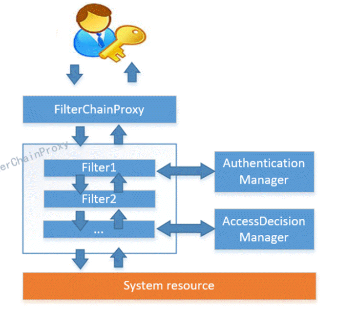
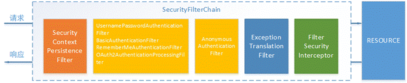
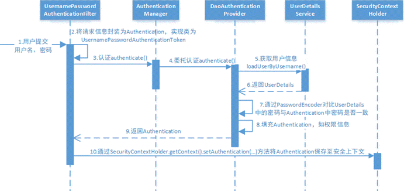
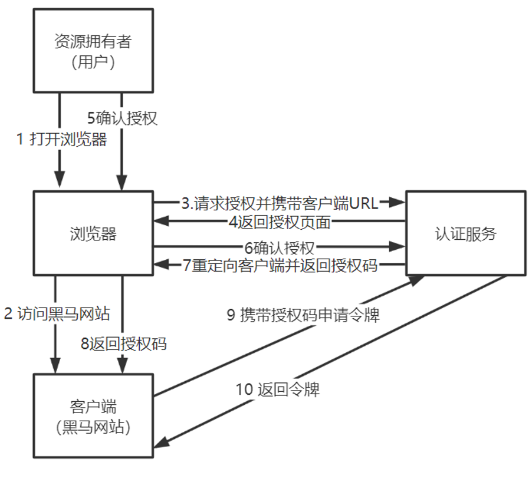
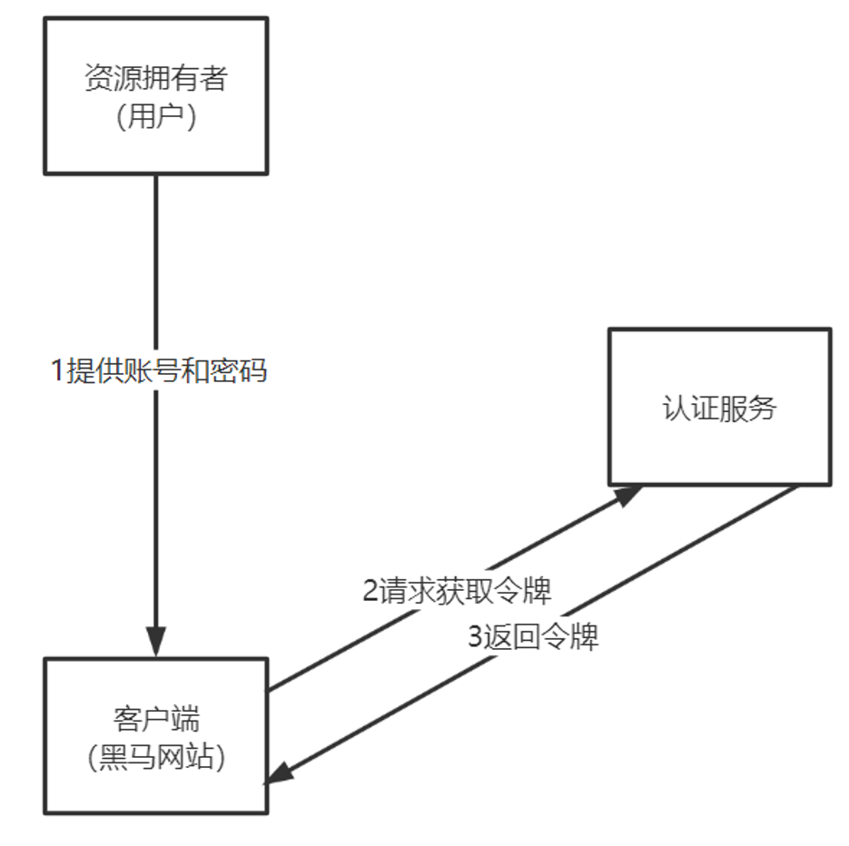

## Spring Security

### 介绍

Spring Security是一个功能强大且高度可定制的身份验证和访问控制框架，致力于为Java应用程序提供身份验证和授权的能力。它充分利用了Spring IoC、DI和AOP功能，为应用系统提供声明式的安全访问控制功能，减少了为企业系统安全控制编写大量重复代码的工作。

Spring Security的核心功能包括用户认证和用户授权。用户认证指的是验证某个用户是否为系统中的合法主体，即用户能否访问该系统，一般要求用户提供用户名和密码，系统通过校验用户名和密码来完成认证过程。用户授权指的是验证某个用户是否有权限执行某个操作，不同用户所具有的权限是不同的，系统会为不同的用户分配不同的角色，而每个角色则对应一系列的权限。

Spring Security基于Spring生态圈，可以轻松扩展以满足定制需求。它有两个重要概念，分别是Authentication（认证）和Authorization（授权），是Spring Security安全管理的核心。

在Spring Security中，访问控制是通过拦截器实现的，它可以在用户访问受保护资源时执行安全检查。Spring Security提供了许多内置的拦截器，包括登录拦截器、权限检查拦截器等。这些拦截器可以根据需要进行配置和扩展。

此外，Spring Security还提供了丰富的安全特性，如跨站请求伪造（CSRF）保护、跨站请求伪造（XSS）保护、跨站脚本攻击（XSS）保护等，以帮助开发者构建更加安全的应用程序。

总之，Spring Security是一个功能强大且高度可定制的身份验证和访问控制框架，它提供了丰富的安全特性，可以满足不同应用程序的安全需求。

### 工作原理

通过测试认证和授权两个功能，我们了解了Spring Security的基本使用方法，下边了解它的工作流程。

Spring Security所解决的问题就是**安全访问控制**，而安全访问控制功能其实就是对所有进入系统的请求进行拦截，校验每个请求是否能够访问它所期望的资源。根据前边知识的学习，可以通过Filter或AOP等技术来实现，Spring Security对Web资源的保护是靠Filter实现的，所以从这个Filter来入手，逐步深入Spring Security原理。

​    当初始化Spring Security时，会创建一个名为SpringSecurityFilterChain的Servlet过滤器，类型为 org.springframework.security.web.FilterChainProxy，它实现了javax.servlet.Filter，因此外部的请求会经过此类，下图是Spring Security过虑器链结构图：

FilterChainProxy是一个代理，真正起作用的是FilterChainProxy中SecurityFilterChain所包含的各个Filter，同时这些Filter作为Bean被Spring管理，它们是Spring Security核心，各有各的职责，但他们并不直接处理用户的**认证**，也不直接处理用户的**授权**，而是把它们交给了认证管理器（AuthenticationManager）和决策管理器（AccessDecisionManager）进行处理。

spring Security功能的实现主要是由一系列过滤器链相互配合完成。

下面介绍过滤器链中主要的几个过滤器及其作用：

**SecurityContextPersistenceFilter** 这个Filter是整个拦截过程的入口和出口（也就是第一个和最后一个拦截器），会在请求开始时从配置好的 SecurityContextRepository 中获取 SecurityContext，然后把它设置给 SecurityContextHolder。在请求完成后将 SecurityContextHolder 持有的 SecurityContext 再保存到配置好的 SecurityContextRepository，同时清除 securityContextHolder 所持有的 SecurityContext；

**UsernamePasswordAuthenticationFilter** 用于处理来自表单提交的认证。该表单必须提供对应的用户名和密码，其内部还有登录成功或失败后进行处理的 AuthenticationSuccessHandler 和 AuthenticationFailureHandler，这些都可以根据需求做相关改变；

**FilterSecurityInterceptor** 是用于保护web资源的，使用AccessDecisionManager对当前用户进行授权访问，前面已经详细介绍过了；

**ExceptionTranslationFilter** 能够捕获来自 FilterChain 所有的异常，并进行处理。但是它只会处理两类异常：AuthenticationException 和 AccessDeniedException，其它的异常它会继续抛出。

 

Spring Security的执行流程如下：

1. 用户提交用户名、密码被SecurityFilterChain中的UsernamePasswordAuthenticationFilter过滤器获取到，封装为请求Authentication，通常情况下是UsernamePasswordAuthenticationToken这个实现类。
2. 然后过滤器将Authentication提交至认证管理器（AuthenticationManager）进行认证
3. 认证成功后，AuthenticationManager身份管理器返回一个被填充满了信息的（包括上面提到的权限信息，身份信息，细节信息，但密码通常会被移除）Authentication实例。
4. SecurityContextHolder安全上下文容器将第3步填充了信息的Authentication，通过SecurityContextHolder.getContext().setAuthentication(…)方法，设置到其中。
5. 可以看出AuthenticationManager接口（认证管理器）是认证相关的核心接口，也是发起认证的出发点，它的实现类为ProviderManager。而Spring Security支持多种认证方式，因此ProviderManager维护着一个List\<AuthenticationProvider\>列表，存放多种认证方式，最终实际的认证工作是由AuthenticationProvider完成的。咱们知道web表单的对应的AuthenticationProvider实现类为DaoAuthenticationProvider，它的内部又维护着一个UserDetailsService负责UserDetails的获取。最终AuthenticationProvider将UserDetails填充至Authentication。

## Oauth2

### 介绍

在前边我们提到微信扫码认证，这是一种第三方认证的方式，这种认证方式是基于OAuth2协议实现，

OAUTH协议为用户资源的授权提供了一个安全的、开放而又简易的标准。同时，任何第三方都可以使用OAUTH认证服务，任何服务提供商都可以实现自身的OAUTH认证服务，因而OAUTH是开放的。业界提供了OAUTH的多种实现如PHP、JavaScript，Java，Ruby等各种语言开发包，大大节约了程序员的时间，因而OAUTH是简易的。互联网很多服务如Open API，很多大公司如Google，Yahoo，Microsoft等都提供了OAUTH认证服务，这些都足以说明OAUTH标准逐渐成为开放资源授权的标准。

 Oauth协议目前发展到2.0版本，1.0版本过于复杂，2.0版本已得到广泛应用。

参考：https://baike.baidu.com/item/oAuth/7153134?fr=aladdin

Oauth协议：https://tools.ietf.org/html/rfc6749

### 流程

扫码 -> 申请授权码 -> 携带授权码申请令牌 -> 携带令牌申请用户信息 -> 拿到用户信息成功登陆

### 授权模式

#### 授权码模式

注意：授权码是浏览器（发送get请求）向微信之间申请，令牌是客户端（发送post请求）携带浏览器给的授权码向微信申请。

#### 密码模式

就是最常见的用户输入密码的形式。

