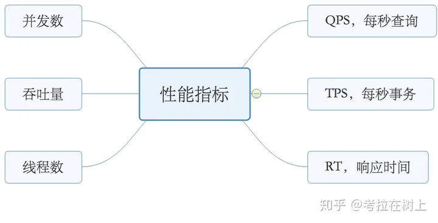
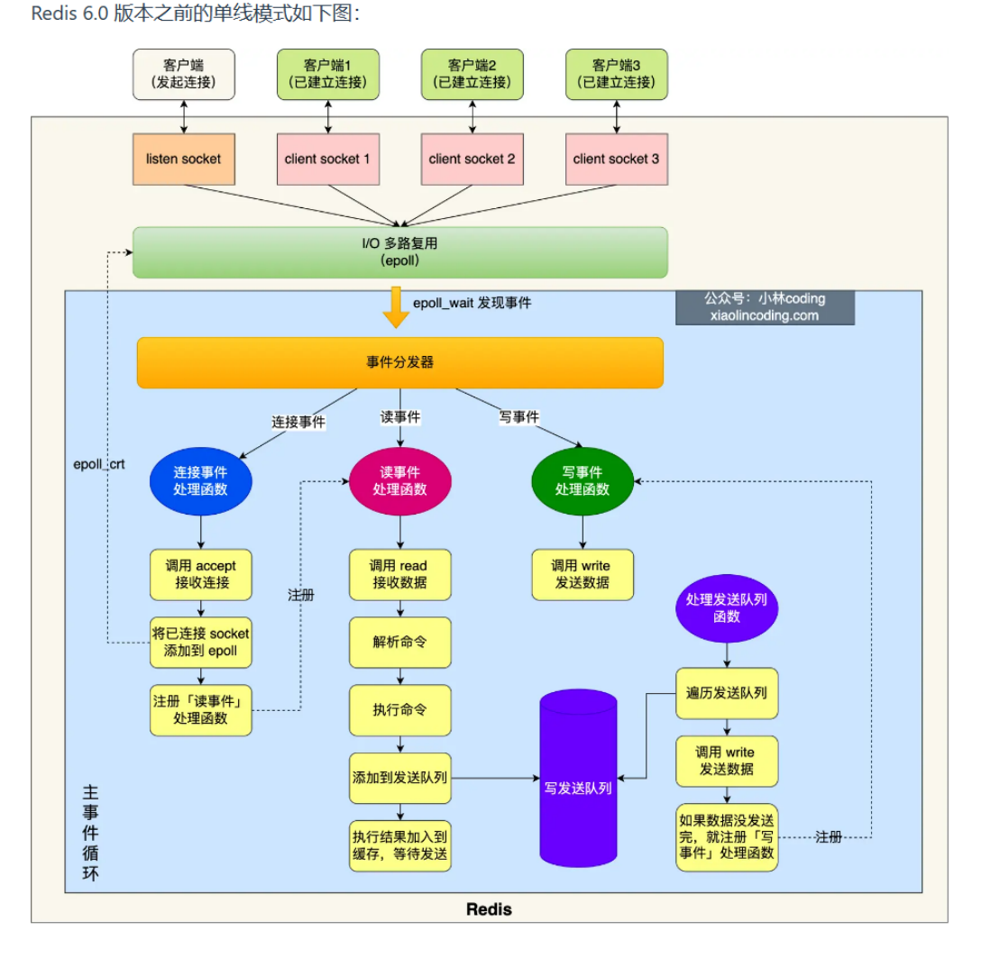
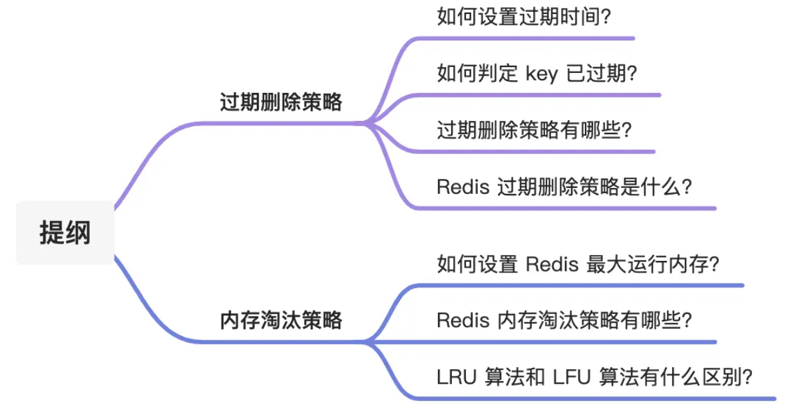
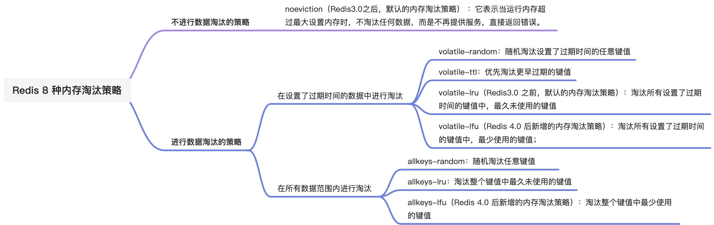
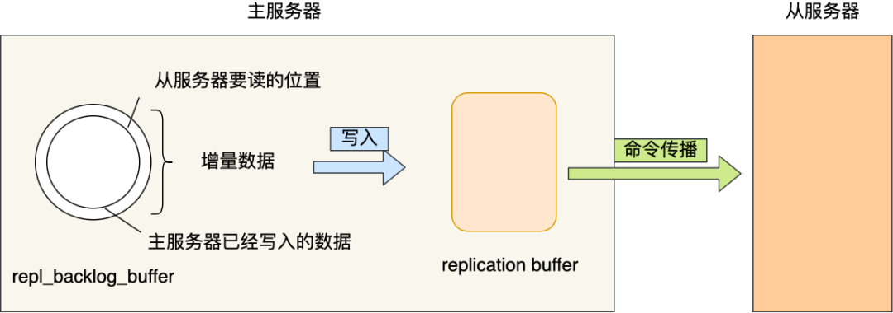

## Redis

### windwos安装

参考：[[csdn](https://blog.csdn.net/weixin_44893902/article/details/123087435)]

### docker安装redis

参考：[[csdn](https://blog.csdn.net/bhegi_seg/article/details/124451468)] [[zhihu](https://zhuanlan.zhihu.com/p/679089642)]

### 启动redis

```bash
sudo docker run -p 6379:6379 --name redis --restart=always -v /home/mkid/software/redis/data:/data -v /home/mkid/software/redis/redis2.conf:/etc/redis/redis.conf -d redis redis-server /etc/redis/redis.conf
```

```properties
vm.overcommit_memory = 1
#任何ip可以访问
bind 0.0.0.0
#守护进程
#daemonize yes
daemonize yes
#不启用保护模式
protected-mode no
#指定redis运行的端口
port 6379
tcp-backlog 511
timeout 0
#持久化⽂件名称
dbfilename xdclass.rdb
#持久化⽂件存储路径
dir /data/
#持久化策略, 10秒内有个1个key改动，执⾏快照
save 10 1
######之前配置######
#导出rdb数据库⽂件压缩字符串和对象,默认是yes，会浪费CPU但是节省空间
rdbcompression yes
# 导⼊时是否检查
rdbchecksum yes
#aof持久化配置
#appendonly yes
#appendfilename "appendonly.aof"
#appendfsync everysec
# aof重写期间是否同步
no-appendfsync-on-rewrite no
# 重写触发配置
auto-aof-rewrite-percentage 100
auto-aof-rewrite-min-size 64mb
# 加载aof时如果有错如何处理
# yes表示如果aof尾部⽂件出问题，写log记录并继续执⾏。
# no表示提示写⼊等待修复后写⼊
aof-load-truncated yes
```

---

```
WARNING Memory overcommit must be enabled! Without it, a background save or replication may fail under low memory condition. Being disabled, it can also cause failures without low memory condition, see https://github.com/jemalloc/jemalloc/issues/1328. To fix this issue add 'vm.overcommit_memory = 1' to /etc/sysctl.conf and then reboot or run the command 'sysctl vm.overcommit_memory=1' for this to take effect.

```

这个警告是关于系统内存过度分配的设置。在 Redis 中，如果系统的内存过度分配未启用，可能会在低内存条件下导致后台保存或复制失败。即使没有低内存条件，也可能导致一些问题。

要解决这个问题，您需要将系统的内存过度分配设置为启用。您可以按照警告中提到的步骤执行：

1. 添加下面这行到 `/etc/sysctl.conf` 文件中：
   
   ```
   vm.overcommit_memory = 1
   ```

   您可以使用文本编辑器（如 nano 或 vim）以管理员权限打开该文件，并添加这一行到文件的底部。

2. 重新加载 sysctl 配置以使更改生效：
   
   ```
   sudo sysctl -p
   ```

这将重新加载 sysctl.conf 文件中的配置，并且使 `vm.overcommit_memory` 设置生效。

请注意，在生产环境中，特别是在修改系统级配置之前，请确保了解这些更改的含义，并确保它们不会对系统的稳定性和安全性产生不利影响。

### 使用RDM访问虚拟机中的redis

RDF连接虚拟机里的Redis：https://blog.csdn.net/qq_39535807/article/details/106449156

### python连接redis

```python
redis_client = redis.StrictRedis(
    host="localhost",
    port=6379,
    db=2,
    decode_responses=True
)
```

### 缓存穿透、击穿、雪崩

参考：[[zhihu](https://zhuanlan.zhihu.com/p/346651831)]

穿透：恶意绕过缓存和数据库中都没有的数据。（黑名单、缓存空值、布隆过滤器）

击穿：热点key失效，访问热点的大量请求直接打到数据库上。（互斥锁、异步更新缓存、不设置过期时间）

雪崩：大量缓存key失效，大量请求直接达到数据库上。（大量数据同时过期：均匀设置过期时间、客户端访问互斥锁、后台更新缓存2种、缓存预热。Redis宕机：熔断和限流、集群）

### 基本数据类型

Redis 支持的基本数据类型主要有五种，分别是：

1. **字符串(String)**: Redis 的字符串是二进制安全的，这意味着它们可以包含任何数据，比如 jpg 图片或者序列化的对象。一个字符串类型的值最多可以是 512MB。

2. **哈希(Hash)**: Redis 哈希是键值对集合。Redis 哈希是字符串字段和字符串值之间的映射，因此它们是适合用来表示对象的理想选择。

3. **列表(List)**: Redis 列表是简单的字符串列表，按照插入顺序排序。你可以添加一个元素到列表的头部（左边）或者尾部（右边）。

4. **集合(Set)**: Redis 集合是字符串类型的无序集合。它是通过哈希表实现的，所以添加、删除、查找的复杂度都是 O(1)。

5. **有序集合(Sorted Set)**: Redis 有序集合和集合一样也是字符串类型的集合，不同的是每个元素都会关联一个浮点数类型的分数。Redis 正是通过分数来为集合中的成员进行从小到大的排序。由于是通过分数进行排序，所以即使是在有相同分数的情况下，成员也会根据二进制顺序进行排序。不过，由于存在分数，你可以非常快速地获取一个分数范围内的成员，这个操作的复杂度是 O(log(N))。

   Sorted Set的使用：[]

这些数据类型为 Redis 的使用提供了极大的灵活性，使其不仅仅能够被用作简单的键值存储，还可以用来实现复杂的数据结构服务器方案。

### 高级数据类型

除了前面提到的五种基本数据类型之外，Redis 还支持以下几种数据类型和特殊的数据结构：

6. **HyperLogLog**: 主要用于高效的基数统计，其核心优势在于，在使用极小的内存空间时，能够处理大量数据的基数估计问题。HyperLogLog 提供了一种不精确的去重计数方案，适用于大规模数据的去重计数，如统计网站访问量中的独立访客数。

   基数统计介绍：[[csdn](https://blog.csdn.net/qq_22473611/article/details/108216910)]

7. **地理位置(Geospatial)**: Redis 的地理位置类型允许你将用户定义的经纬度信息存储到 Redis 中，并可以进行地理位置相关的操作，比如计算两点之间的距离、查找某个半径内的点等。这是通过 Redis 的 Sorted Set 数据类型实现的，但提供了专门的命令来处理地理空间信息。

8. **流(Streams)**: 引入于 Redis 5.0，流是 Redis 的一个更加复杂的数据类型，设计用来存储一系列的消息。流可以被认为是一个日志类型的数据结构，可用于存储一系列的事件或消息。流使得 Redis 能够更好地用于消息队列的应用场景，支持多播、持久化、消息确认等特性。

这些数据类型和结构提供了更多的使用场景和可能性，让 Redis 不仅仅是一个简单的键值存储系统，而是一个多功能的数据结构服务器，能够支持各种各样的应用场景。

### 高并发指标

参考：[[zhihu](https://zhuanlan.zhihu.com/p/337708438)]



### 布隆过滤器

参考：[[csdn](https://blog.csdn.net/qq_41125219/article/details/119982158)]

### 分布式锁


### Redis 的有序集合底层为什么要用跳表，而不用平衡树、红黑树或者 B+树？

#### 跳表

参考：[[csdn](https://blog.csdn.net/Appleeatingboy/article/details/119948340)]

### Bitmap的使用

java guide 统计活跃用户：

这段 Redis 命令使用了 `SETBIT` 操作，它是一个位操作命令，用于设置字符串值的指定位(bit)的值。这个命令通常用于实现位数组，可以高效地存储和操作大量的布尔值（比如标记、开关状态等）。命令的格式如下：

```
SETBIT key offset value
```

- `key` 是你想要操作的键。
- `offset` 是位的位置（从 0 开始计数）。
- `value` 只能是 1 或 0，代表你想要设置的位的值。

对于你给出的命令：

1. `SETBIT 20210308 1 1`：在键 `20210308` 上，将位于位置 1 的位设置为 1。
2. `SETBIT 20210308 2 1`：在键 `20210308` 上，将位于位置 2 的位设置为 1。
3. `SETBIT 20210309 1 1`：在键 `20210309` 上，将位于位置 1 的位设置为 1。

每个命令的返回值 `(integer) 0` 表示在执行操作之前，指定的位的原始值是 0。如果原始值已经是 1，则命令会返回 1。这里，所有命令的返回值都是 0，说明在这些操作执行之前，所有指定的位都是 0。

这种类型的操作非常适合于记录和查询标记或者状态，例如记录用户的登录天数，或者标记某个特定的功能是否对用户可见。它能够以非常紧凑和高效的方式处理大量的布尔值。

这两个 Redis 命令使用了 `BITOP` 和 `BITCOUNT` 操作，分别用于对位进行逻辑运算和统计设置为 1 的位的数量。下面是对这两个命令的解释：

`BITOP`

```
BITOP operation destkey key [key ...]
```

- `operation` 是要执行的位操作，可以是 `AND`、`OR`、`XOR`、`NOT`。
- `destkey` 是存储操作结果的键。
- `key` 是参与操作的一个或多个键。

在你的例子中：

```
BITOP and desk1 20210308 20210309
```

这个命令执行了一个 `AND` 位操作，将键 `20210308` 和 `20210309` 的值进行按位与操作，并将结果存储在 `desk1` 中。返回值 `(integer) 1` 表示结果键 `desk1` 现在有 1 个字节的长度。

`BITCOUNT`

```
BITCOUNT key [start end]
```

- `key` 是要计算的键。
- `start` 和 `end` 参数（可选）定义了要统计的字节范围。

对于你的第二个命令：

```
BITCOUNT desk1
```

这个命令统计了 `desk1` 中设置为 1 的位的数量。返回值 `(integer) 1` 表示在 `desk1` 的值中，有 1 个位被设置为了 1。

结合你之前的 `SETBIT` 命令，我们可以推断出 `20210308` 和 `20210309` 在至少一个相同的位置上都设置了位为 1，因此 `AND` 操作后，`desk1` 中也至少有一个位是 1。`BITCOUNT` 命令的结果进一步确认了这一点，只有一个位被设置为 1。

这种操作通常用于处理和分析大量的布尔数据，例如统计多个事件共同发生的次数或者进行集合的交集操作。

### Redis线程模型

单线程模型。

为什么引入多线程？（提高网络IO的并行度）

后台线程？（lazyfree 线程、unlink key / flushdb async / flushall async）

unlink异步删除大key。



在linux系统中，所有服务都是文件。在图片的最上方，客户端的每个连接都是一个socket连接（socket文件），`epoll`系统调用的作用是多路监听文件标识符发生变化，所以当某个客户端的socket连接（文件）发生变化时，`epoll_wait`会检测到，触发事件分发器，执行后续的任务。

### Reactor 网络模型

参考：[[掘金](https://juejin.cn/post/7092436770519777311)]

IO多路复用（select/epoll）和事件驱动（异步IO的回调函数）。

IO读写涉及到用户态和内核态的转变。

单线程模型。（建立连接、数据读写都是一个线程）

多线程模型。（连接建立、IO事件读写、事件分发是一个线程，数据读写完之后，提交业务到线程池中处理）

主从线程模型。（主Reactor负责建立新连接、从Reactor负责IO读写事件-线程池/事件分发）

### 四种常见的IO模型，BIO、NIO、AIO

参考：[[csdn](https://blog.csdn.net/ldw201510803006/article/details/119767467)]

同步阻塞IO（BIO）、同步非阻塞IO（NIO）、IO多路复用、异步IO（AIO）。

#### select/epoll

`select` 和 `epoll` 都是用于处理多个文件描述符的输入/输出准备就绪的I/O多路复用机制。它们使得单个进程/线程可以监视多个文件描述符，以便知道是否有I/O操作可以执行，这对于实现高性能的网络服务尤其重要。

**select**

`select`是最早的I/O多路复用接口之一，它允许程序监视多个文件描述符，等待一个或多个文件描述符成为“就绪”状态，也就是说数据可读、可写或出现异常。它的基本原理是：

- 当你有多个文件描述符（比如套接字）需要同时监视时，你可以使用`select`函数。
- 你需要提供三个集合：读集合、写集合和异常集合，以及一个最大等待时间。
- `select`会阻塞当前线程，直到以下几种情况之一发生：
  - 至少有一个文件描述符就绪（对应的操作可以无阻塞地进行）。
  - 发生一个信号中断。
  - 超出了指定的最大等待时间。

`select`的缺点是它支持的文件描述符数量有限（通常受限于1024），并且随着监视的文件描述符数量增加，性能会线性下降。

**epoll**

`epoll`是在Linux 2.6及其以后版本中引入的，作为`select`和`poll`的现代替代品。`epoll`解决了`select`的一些主要限制，尤其是在处理大量文件描述符时的性能问题。它的特点包括：

- 支持的文件描述符数量远大于1024。
- 使用一种更高效的机制来通知哪些文件描述符就绪，这意味着不需要像`select`那样在每次调用时重新指定整个文件描述符集合。
- 支持“边缘触发”和“水平触发”两种工作模式，使其更加灵活。

`epoll`通过创建一个`epoll`实例，然后向这个实例中添加或删除文件描述符来工作。当调用`epoll_wait`时，它会返回自上次调用以来变为就绪状态的文件描述符，这种方式比`select`的轮询效率更高。

总结而言，`epoll`相对于`select`，在处理大量并发连接时具有更高的效率和更好的可扩展性，因此成为了高性能网络服务器编程的首选技术之一。

### Redis内存管理


### RDB和AOF

参考：[[zhihu](https://zhuanlan.zhihu.com/p/100885432)]

### Redis持久化

AOF刷盘和RDB快照。

aof的重写。（后台子进程：bgrewriteaof）

rdb的save个bgsave。

### Redis集群

redis的三种集群方式，脑裂导致的数据丢失。

### Redis为什么要给key设置过期时间

在Redis中设置键（key）的过期时间是一项非常重要的功能，主要基于以下几个理由：

1. **内存管理**：Redis是一个基于内存的存储系统，尽管它可以将数据持久化到磁盘上，但其主要操作都是在内存中进行的。内存资源有限，因此有效地管理内存非常关键。通过为键设置过期时间，可以自动删除不再需要的数据，从而释放宝贵的内存资源。这是一种自动的内存清理机制，有助于避免内存被无限期地消耗。

2. **数据有效性**：在很多应用场景中，数据都有其有效期。例如，缓存数据可能只在很短的时间内是有效的，之后就变得陈旧了；会话（session）数据在用户退出或会话超时后不再需要。为这些数据设置过期时间，可以确保数据的新鲜度和相关性，当数据过期后，Redis会自动将其删除。

3. **减少维护成本**：如果没有自动的过期机制，应用开发者需要自己实现数据清理逻辑，这不仅增加了开发的复杂性，还可能会导致程序效率降低，因为应用层面的数据清理通常不如Redis内部机制来得高效和可靠。

4. **优化性能**：通过删除过期的键来释放内存空间，可以保持Redis数据库的高性能。过多的冗余数据会降低数据操作的效率，尤其是在进行键的查找、数据的读写等操作时。保持数据集的紧凑可以提高操作效率，减少延迟。

5. **支持特定应用逻辑**：有些应用场景本身就需要基于时间的自动逻辑处理，比如临时访问令牌的过期处理、限时活动的数据管理等。Redis的过期时间功能天然支持这类需求，使得开发这类功能时更加简便和高效。

综上所述，设置键的过期时间是Redis管理内存、保证数据有效性、优化性能以及支持复杂应用逻辑的一个重要功能。这不仅减轻了开发者的负担，还提升了应用的整体性能和用户体验。

### 设置key过期时间的策略

在Redis中，设置键(key)的过期时间主要有以下几种策略：

1. **设置固定过期时间**：
   
   - `EXPIRE key seconds`：为键设置过期时间，时间单位为秒。
   - `PEXPIRE key milliseconds`：为键设置过期时间，时间单位为毫秒。
   这两个命令都是在设置键的过期时间时指定一个具体的时间长度，键会在指定的时间后自动被删除。
   
2. **设置具体过期的时间点**：
   - `EXPIREAT key timestamp`：将键的过期时间设置为UNIX时间戳表示的某一具体时间点，单位为秒。
   - `PEXPIREAT key millisecondsTimestamp`：将键的过期时间设置为UNIX时间戳表示的某一具体时间点，单位为毫秒。
   使用这两个命令可以设置键在某个具体的时间点过期，而不是从当前时间开始计算的一个时间段。

3. **设置键在不活动（idle）状态下的过期时间**：
   - Redis默认不支持基于不活动时间的自动过期策略。不过，可以通过自定义脚本或应用逻辑来模拟这种行为，比如定期检查键的最后访问时间，并删除那些超过特定不活动时间阈值的键。

     Redis本身不直接支持根据键的不活动时间自动设置过期时间，但你可以通过一些额外的逻辑来模拟这种行为。这里给出一个简单的例子，演示如何利用Redis的现有命令和一些外部逻辑来实现基于不活动时间的键过期策略：
   
     基本思路：
   
     1. 对于每个键，使用一个额外的键来记录最后一次访问时间。
     2. 定期运行一个脚本或任务，检查每个键的不活动时间。
     3. 如果某个键的不活动时间超过了预设的阈值，就删除该键。
   
     实现步骤：
   
     假设你有一个键`user:session:1234`，你想要在这个键30分钟内未被访问时自动删除它。
   
     **步骤 1：设置最后访问时间键**
   
     每次访问`user:session:1234`时，同时设置或更新一个与之关联的键来记录访问时间。例如，可以用`user:session:1234:last_access`作为记录最后访问时间的键。
   
     ```redis
     SET user:session:1234 "some data"
     SET user:session:1234:last_access `current unix timestamp`
     ```
   
     **步骤 2：定期检查不活动时间**
   
     编写一个脚本或在应用中实现逻辑，定期执行以下步骤：
   
     - 获取当前时间的UNIX时间戳。
     - 对于每个会话键，获取其`last_access`键的值。
     - 计算当前时间与最后访问时间的差值。
     - 如果差值超过了预设的不活动阈值（例如，1800秒表示30分钟），则删除该会话键及其`last_access`键。
   
     **示例脚本逻辑（伪代码）**：
   
     ```python
     current_time = get_current_unix_timestamp()
     keys = get_all_session_keys()  # 获取所有会话键
     
     for key in keys:
         last_access_key = key + ":last_access"
         last_access_time = get_value(last_access_key)  # 获取最后访问时间
         if current_time - last_access_time > 1800:  # 30分钟不活动
             delete_key(key)  # 删除会话键
             delete_key(last_access_key)  # 删除最后访问时间键
     ```
   
     **步骤 3：自动化执行检查任务**
   
     你可以使用cron作业（Linux）、计划任务（Windows）或者Redis自身的定时功能（如果通过Lua脚本实现）来定期执行上述检查脚本。
   
     这个方法虽然不能直接通过Redis命令实现不活动过期，但通过外部逻辑的辅助，可以满足需求。需要注意的是，这种方法可能会增加服务器负载，并且在高并发场景下需要谨慎处理并发访问和更新`last_access`键的情况。
   
4. **使用TTL命令查询剩余过期时间**：
   
   - `TTL key`：查询键的剩余过期时间（秒）。
   - `PTTL key`：查询键的剩余过期时间（毫秒）。
   这不是设置过期时间的策略，但与管理键的过期时间密切相关，可以帮助你了解键的当前过期状态。
   
5. **移除过期时间**：
   - `PERSIST key`：移除键的过期时间，使其变成一个永久键。
   如果之前为键设置了过期时间，但后来决定让该键持久存储，可以使用这个命令移除其过期时间。

6. **设置键值与过期时间**：
   - 在设置键值的同时设置过期时间，这可以通过`SET`命令的选项来完成，如`SET key value EX seconds` 或 `SET key value PX milliseconds`，这可以减少命令的发送次数，提高效率。

选择合适的过期时间策略取决于你的具体需求和场景。例如，对于缓存数据，通常会使用固定的过期时间；而对于需要在特定时间点过期的数据（比如临时活动信息），则会设置具体过期的时间点。

### Redis过期删除与内存淘汰



过期键的删除：过期字典。惰性删除+定时删除+定期删除。

持久化时，对过期的键如何处理：RDB阶段、AOF阶段。

主从模式的过期键处理。

内存淘汰策略：不进行数据淘汰、进行数据淘汰。

进行数据淘汰：设置了过期时间的淘汰、没设置过期时间淘汰。




### Redis缓存设计

雪崩、击穿、穿透。

动态缓存热点。zset（zadd, zrange）

常见的缓存更新策略。（旁路缓存、读穿/写穿缓存、写回策略-不用）

### Redis实现延迟队列

zset。

### Redis的大key如何处理

String 类型的值大于 10 KB；

Hash、List、Set、ZSet 类型的元素的个数超过 5000个；

1、redis-cli --bigkeys 查找大key

2、使用 SCAN 命令查找大 key

3、使用 RdbTools 工具查找大 key

删除

分批次删除
==异步删除（Redis 4.0版本以上）==（小林coding）

### Redis 管道有什么用？


### Redis 事务支持回滚吗？

支持。只支持命令的回滚，不保证事务的原子性。

### 如何用 Redis 实现分布式锁的？

setnx + 过期时间。

优缺点。

### Redis 如何解决集群情况下分布式锁的可靠性？

Redlock（红锁）。

### Redis + lua脚本示例

Redis 支持使用 Lua 脚本来执行复杂的操作，这允许你在 Redis 服务器端执行一系列命令，而无需往返于客户端和服务器之间，从而提高效率。下面是一个使用 Lua 脚本操作 Redis 集合（Set）的示例。

假设我们要编写一个 Lua 脚本，这个脚本的目标是：

1. 向一个集合中添加一些值。
2. 从另一个集合中移除一些值。
3. 返回第一个集合的所有成员。

在 Redis 中，我们可以使用 `SADD` 命令来添加元素到集合中，使用 `SREM` 命令来从集合中移除元素，使用 `SMEMBERS` 命令来获取集合的所有成员。

Lua 脚本示例：

```lua
-- 定义要操作的集合的键和要添加或移除的值
local addSetKey = KEYS[1]
local removeSetKey = KEYS[2]
local addValues = ARGV[1]
local removeValues = ARGV[2]

-- 向 addSetKey 集合中添加元素
for value in string.gmatch(addValues, "%S+") do
    redis.call('SADD', addSetKey, value)
end

-- 从 removeSetKey 集合中移除元素
for value in string.gmatch(removeValues, "%S+") do
    redis.call('SREM', removeSetKey, value)
end

-- 返回 addSetKey 集合的所有成员
return redis.call('SMEMBERS', addSetKey)
```

在这个脚本中，`KEYS[1]` 和 `KEYS[2]` 是 Redis 键名参数，`ARGV[1]` 和 `ARGV[2]` 是传递给脚本的值参数。`string.gmatch` 函数用于迭代参数中的每个值（假设值由空格分隔）。

使用该脚本的命令可能如下（示例）：

```shell
redis-cli --eval script.lua mySet1 mySet2 , "value1 value2 value3" "value4 value5"
```

在这个命令中，`mySet1` 和 `mySet2` 是操作的集合键，`"value1 value2 value3"` 是要添加到 `mySet1` 的值，`"value4 value5"` 是要从 `mySet2` 移除的值。请注意，逗号后面是 `ARGV` 参数的开始。

请记住，你需要将 `script.lua` 替换为你的 Lua 脚本文件的实际路径，或者你可以直接在命令行中使用 `EVAL` 命令并直接传递 Lua 脚本的内容（而不是文件路径）。

###  Redis 大 Key 对持久化有什么影响？

从aof和rdb两个方面说明。

### 主从复制是怎么实现的？

确定主服务器和从服务器。

第一次同步，三个阶段（全量复制）。（从 psync-> 主，主 FULLRESYNC-> 从，主rdb -> 从，主写入缓存 -> 从）。

命令传播（TCP长连接）。

从服务器（经理服务器）。

增量复制。（repl_backlog_buffer + replication offset）

### repl_backlog_buffer和replication buffer的区别

这两个都在主服务器上。



`repl_backlog_buffer`和`replication buffer`是Redis复制机制中的两个重要组件，它们在Redis的数据复制过程中扮演着关键的角色。尽管这两个组件在功能上有所重叠，它们的主要目的和使用场景有所不同。以下是它们各自的概述和区别：

#### repl_backlog_buffer

- **目的**：`repl_backlog_buffer`主要用于支持部分复制功能。它是一个固定大小的缓冲区，用于保存最近的写命令。当一个从服务器与主服务器失去连接并稍后重新连接时，它可以请求这个缓冲区中保存的命令来更新它丢失的数据，而不是进行全量复制。
- **特点**：这个缓冲区是环形的，意味着当它满了以后，新的写命令会覆盖最老的命令。缓冲区的大小可以配置，从而影响Redis可以支持的网络分区恢复时间和从服务器断开时间。
- **使用场景**：适用于网络不稳定或从服务器频繁断开连接的场景，在这些情况下，可以有效地减少数据同步的负担。

#### replication buffer

- **目的**：`replication buffer`用于存储正在复制到一个或多个从服务器的数据。当从服务器连接到主服务器请求数据时，主服务器会使用这个缓冲区来暂存要发送的数据。
- **特点**：与`repl_backlog_buffer`不同，`replication buffer`的生命周期与复制会话相关联。它的大小根据需要动态调整，以适应当前的复制负载。当复制完成或取消时，相关的复制缓冲区将被清空。
- **使用场景**：适用于全量复制的场景，比如当一个新的从服务器被添加到Redis集群中，或者一个从服务器因为故障或其它原因需要重新同步全部数据时。

#### 区别总结

- **用途差异**：`repl_backlog_buffer`用于支持部分复制，以减少因为网络问题或从服务器故障导致的数据重新同步需求；而`replication buffer`用于在全量复制过程中暂存数据。
- **生命周期**：`repl_backlog_buffer`是长期存在的，用于记录最近的写操作，其大小固定；而`replication buffer`的生命周期与复制会话相关，大小根据复制需求动态调整。
- **配置和管理**：两者的配置和管理也有所不同，反映了它们在Redis复制机制中的不同角色。

理解这两个组件及其区别有助于更好地管理和优化Redis的复制和数据同步机制。

### 哨兵机制

判断主节点故障。（哨兵ping  -> 主/从）

主观下线（quorum法定人数）-> 客观下线。

哨兵leader。

主从故障转移。（三个过程）

主从节点切换。（四个步骤）

哨兵集群是如何组成的？（通过主节点的`__sentinel__:hello`频道）

### 数据库和缓存如何保证一致性？

先更新数据库，还是先更新缓存？（都会出现数据不一致的情况）

先更新数据库，还是先删除缓存？（先更新数据库，再删除缓存可以保证一致性）

更新数据库和删除缓存两个分开进行，后者操作失败怎么办？（重试机制-消息队列、mysql binlog）


先删除缓存再更新数据库数据不一致。（延迟双删）


### Redis解决可能出现的并发问题

Redis和Lua脚本结合可以有效地解决一些并发问题，尤其是在多个客户端同时访问Redis数据库时。下面是一个简单的示例，演示如何使用Redis和Lua脚本来解决并发问题：

假设我们有一个需求：多个客户端需要同时对某个计数器进行操作，但是我们希望保证在任何时刻，计数器的值都是正确的，而不会出现竞态条件。

首先，我们可以使用Redis的INCR和DECR命令来实现计数器的自增和自减操作。但是，如果多个客户端同时尝试修改计数器的值，就会出现竞态条件，导致结果不确定。

为了解决这个问题，我们可以使用Lua脚本来将自增和自减操作原子化。以下是一个简单的Lua脚本示例：

```lua
local counter_key = KEYS[1]
local action = ARGV[1]

if action == "increment" then
    return redis.call('INCR', counter_key)
elseif action == "decrement" then
    return redis.call('DECR', counter_key)
else
    return nil
end
```

然后，我们可以将这个Lua脚本保存到Redis中，并通过调用EVAL命令来执行它。在调用EVAL命令时，我们需要传递计数器的键名和要执行的操作作为参数。

以下是一个示例的Python代码，演示了如何使用Redis-py库在Python中调用Lua脚本：

```python
import redis

# 连接到Redis服务器
r = redis.Redis(host='localhost', port=6379, db=0)

# 保存Lua脚本
lua_script = """
local counter_key = KEYS[1]
local action = ARGV[1]

if action == "increment" then
    return redis.call('INCR', counter_key)
elseif action == "decrement" then
    return redis.call('DECR', counter_key)
else
    return nil
end
"""

# 执行Lua脚本
def execute_lua_script(counter_key, action):
    return r.eval(lua_script, 1, counter_key, action)

# 使用示例
counter_key = 'my_counter'
print("Incrementing counter:", execute_lua_script(counter_key, 'increment'))
print("Decrementing counter:", execute_lua_script(counter_key, 'decrement'))
```

这样，无论多少个客户端同时尝试修改计数器的值，都可以保证操作的原子性，从而避免了竞态条件的发生。

### Redis的扩容机制

Redis的扩容机制主要涉及增加更多的内存资源和提升处理能力，以应对数据增长和访问压力。这种扩容通常通过增加更多的Redis节点来实现，分为两种基本模式：分片（Sharding）和复制（Replication）。在更复杂的场景下，Redis Cluster提供了一种综合使用分片和复制的解决方案来实现扩容和高可用。

**分片（Sharding）**

分片是通过分散数据到多个Redis服务器来减轻单个服务器的负担，每个分片处理数据集的一部分。这样，每个Redis实例只需存储总数据集的一部分，从而可以水平扩展数据库的存储能力和处理能力。客户端库通常负责确定数据应该存储在哪个分片上，这通常是通过一致性哈希或其他哈希机制来实现的。

优点：

- **水平扩展**：可以通过添加更多的Redis服务器来增加总体的存储容量和处理能力。
- **负载均衡**：均匀分布数据和请求可以防止任何单个节点成为瓶颈。

缺点：

- **数据管理复杂性增加**：需要确保数据均匀分布，避免某些节点过载。
- **跨节点操作受限**：例如，对于需要同时处理多个键的操作，如果这些键分布在不同的节点上，将难以实现。

**复制（Replication）**

复制是指将数据从一个Redis服务器复制到一个或多个Redis服务器的过程，通常用于提高数据的可用性和读取性能。复制允许在主节点上进行写操作，而从节点提供读服务。在出现故障时，可以从从节点进行故障转移。

优点：

- **高可用性**：如果主节点失败，从节点可以接管成为新的主节点，保证服务的可用性。
- **读扩展**：可以通过增加更多的从节点来扩展读取能力。

缺点：

- **写操作不扩展**：所有写操作都必须在主节点上执行，因此写能力的扩展受到限制。
- **数据延迟**：从节点复制数据可能会有延迟。

**Redis Cluster**

Redis Cluster是一个提供自动分片和数据复制的Redis部署方案，旨在提供高性能、线性扩展性和高可用性。它通过自动将数据分散到多个节点（每个节点存储数据集的一部分）并在这些节点之间进行复制来实现这一点。

特点：

- **自动分片**：数据自动分布在多个节点上，简化了分片管理。
- **高可用性**：通过数据复制和故障转移机制，确保服务即使在节点故障时也能继续运行。
- **读写扩展**：支持通过增加更多节点来扩展读写能力。

**实施扩容**

在实施Redis扩容时，应考虑以下因素：
- **数据迁移**：当添加新的节点时，可能需要重新分配现有数据，这可能会暂时影响性能。
- **客户端支持**：确保客户端库支持所选择的扩容方案，如自动分片支持或Redis Cluster。
- **监控和调整**：扩容后需要监控系统性能并根据实际情况进行调整，以确保系统达到预期的性能和稳定性目标。

Redis的扩容机制提供了灵活的方案来应对不断增长的数据和请求负载，但实施时需要综


