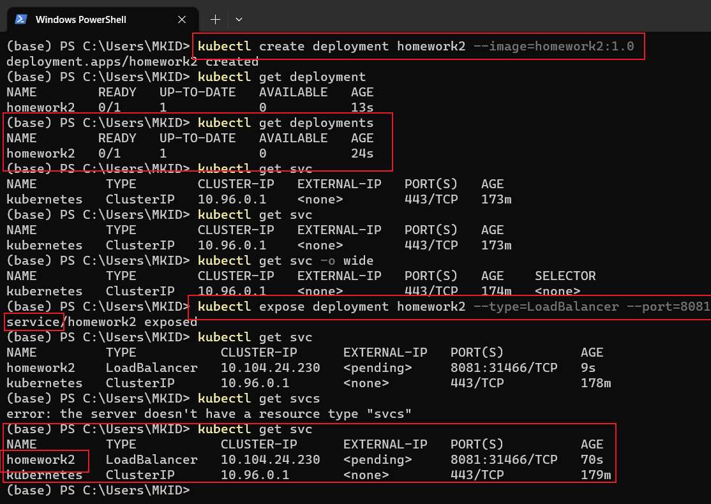

### k8s

参考教程：[[https://k8s.easydoc.net/docs/dRiQjyTY/28366845/6GiNOzyZ/9EX8Cp45](https://k8s.easydoc.net/docs/dRiQjyTY/28366845/6GiNOzyZ/9EX8Cp45)] [[bilibili](https://www.bilibili.com/video/BV1Tg411P7EB)] [[B站2](https://www.bilibili.com/video/BV1DL4y187cL)]

### minikube

#### 常用命令

#### 新建一个Pod

要在Minikube中添加一个新的Pod，您需要执行以下步骤：

1. 创建一个Pod描述文件。Pod描述文件是一个YAML文件，其中包含有关要创建的Pod的详细信息，例如Pod的名称、容器映像、容器端口等。以下是一个示例Pod描述文件：

```yaml
yamlCopy codeapiVersion: v1
kind: Pod
metadata:
  name: my-pod
spec:
  containers:
  - name: my-container
    image: my-image:latest
    ports:
    - containerPort: 80
```

2. 使用kubectl命令将Pod描述文件应用到Minikube集群中。您可以使用以下命令将该文件应用到Minikube集群：

```bash
kubectl apply -f path/to/pod/description/file.yaml
```

其中，`path/to/pod/description/file.yaml`是您创建的Pod描述文件的路径。

3. 等待Pod创建完成。您可以使用以下命令检查Pod的状态：

```bash
kubectl get pods
```

该命令将显示Minikube集群中所有的Pod以及它们的状态。

4. 如果Pod状态显示为“运行中”，则您已成功创建了一个新的Pod。如果状态显示为“错误”或“挂起”，则可能需要检查Pod描述文件并尝试重新应用它。

请注意，您必须先在Minikube集群中创建一个命名空间（Namespace），然后将Pod应用到该命名空间中。如果您不指定命名空间，则Pod将被应用到默认命名空间中。

#### 删除Pod

要在Kubernetes集群中使用kubectl删除一个Pod，您可以执行以下步骤：

1. 确定要删除的Pod的名称。您可以使用以下命令列出所有运行中的Pod及其名称：

```bash
kubectl get pods
```

该命令将显示所有运行中的Pod及其名称。

2. 执行删除Pod的命令。您可以使用以下命令删除指定名称的Pod：

```bash
kubectl delete pod <pod-name>
```

其中，`<pod-name>` 是您要删除的Pod的名称。

3. 等待Pod被删除。您可以使用以下命令查看Pod的状态，以确保它已被删除：

```bash
kubectl get pods
```

如果Pod已成功删除，该命令将不再显示该Pod的名称。

如果您要强制删除Pod，而不考虑其当前的运行状态，您可以在删除命令中添加`--force`和`--grace-period=0`选项，如下所示：

```bash
kubectl delete pod <pod-name> --force --grace-period=0
```

请注意，这将立即删除Pod，而不考虑其当前状态，可能导致数据丢失和服务中断。建议仅在必要时使用此选项。

#### 创建Pod时，yaml文件中各个字段的含义

在Minikube的YAML文件中，各个字段的含义如下：

```yaml
apiVersion: v1
kind: Pod
metadata:
  name: my-pod
  labels:
    app: my-app
spec:
  containers:
  - name: my-container
    image: my-image:latest
    ports:
    - containerPort: 80
    env:
    - name: MY_ENV_VAR
      value: "my-value"
```

- `apiVersion`: 用于指定使用的 Kubernetes API 版本。例如，使用 `apiVersion: v1` 意味着使用 Kubernetes v1 API。
- `kind`: 指定要创建的 Kubernetes 对象的类型。在此示例中，`kind: Pod` 表示要创建一个 Pod。
- `metadata`: 包含有关对象的元数据信息，例如名称和标签。
  - `name`: 对象的名称。在此示例中，`name: my-pod` 意味着创建的 Pod 的名称是 `my-pod`。
  - `labels`: 用于为对象分配标签。标签用于在 Kubernetes 中组织对象。在此示例中，`labels: app: my-app` 意味着为 Pod 分配了一个标签，名称为 `app`，值为 `my-app`。
- `spec`: 包含有关对象的规范信息，例如容器和卷。
  - `containers`: 容器列表。在此示例中，`containers` 中有一个容器 `my-container`。
    - `name`: 容器的名称。在此示例中，容器的名称为 `my-container`。（==可以和docker中的容器名称不一样==）
    - `image`: 容器所使用的镜像。在此示例中，容器使用名称为 `my-image` 的镜像的最新版本。
    - `ports`: 指定容器使用的端口。在此示例中，容器暴露端口 `80`。
    - `env`: 指定容器运行时使用的环境变量。在此示例中，容器使用名为 `MY_ENV_VAR` 的环境变量，并将其值设置为 `my-value`。

#### 部署应用

（除了下面的命令行创建部署，还可以使用和创建Pod一样的yaml文件，需要把kind换成deployment）

1. ~~首先`minikube start`，启动master节点。~~

2. ~~确保应用已经部署到了Docker中。（参考Docker中的部署步骤）~~

3. ~~用kubectl命令创建部署~~

   ```bash
   # 创建新部署
   kubectl create deployment homework2 --image=homework2:1.0
   # 创建服务，
   kubectl expose deployment homework2 --type=LoadBalancer --port=8081
   # 查看部署
   kubectl get deployments
   # 查看服务
   kubectl get svc
   ```

   

==使用yaml文件部署==

在Vscode中安装kubernets插件，可以直接生成符合k8s的配置文件。（注意，生成的Service最后的targetPort要修改为nodePort，即集群向外暴露的端口字段。）

镜像需要先push到hub中，以便k8s能直接拉取镜像。

```yaml
apiVersion: apps/v1
kind: Deployment
metadata:
  name: homework2
spec:
  replicas: 3
  selector:
    matchLabels:
      app: homework2
  template:
    metadata:
      labels:
        app: homework2
    spec:
      containers:
      - name: homework2
        image: mkid223/homework2:v1
        resources:
          limits:
            memory: "128Mi"
            cpu: "500m"
        ports:
        - containerPort: 8080
---
apiVersion: v1
kind: Service
metadata:
  name: homework2
spec:
  selector:
    app: homework2
  type: NodePort
  ports:
  - port: 8080
    nodePort: 30001
```

由于网络原因每个Pod拉取远程镜像时，可能速度比较慢。使用如下命令检查 Pod 的状态和事件，以查找有关为什么容器无法创建的更多信息：

```bash
kubectl describe pod <pod-name>
```

#### 访问应用

如果是在真实的集群中，成功部署应用之后，当然可以直接通过浏览器访问。但是，目前使用的minikube模拟集群，所以需要使用专门的`minikube service <服务名称>`的命令，这样minikube会自动在浏览器中打开我们的应用。

```bash
minikube service homework2
```

出现问题：在浏览器中访问不到应用，上述命令也不管用。

解决参考：[[stack overflow](https://stackoverflow.com/questions/70316547/minikube-services-cannot-be-accessed-over-nodeport-or-clusterip-on-windows10)]

解决：yaml文件中，Service配置中的nodePort没配置。

#### 停止正在运行的Pod

