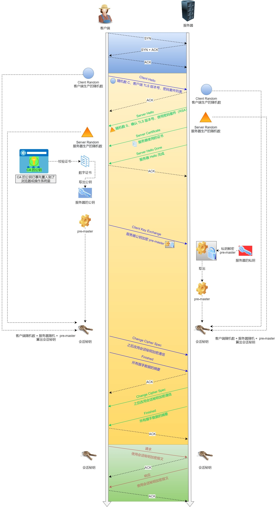
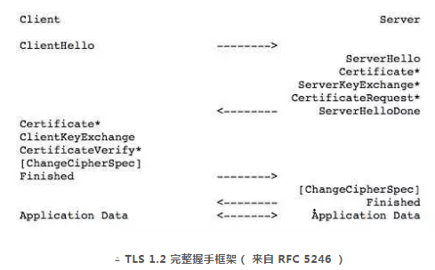
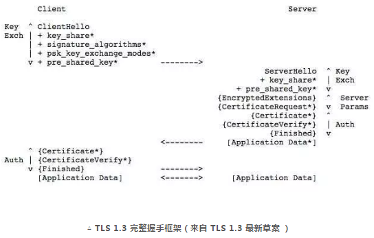

## 网络

### TCP/IP分层模型

4层（应用层、传输层、网络层、网络接口层）。

每一层的协议。

应用：HTTP、FTP、Telnet、DNS、SMTP

传输：TCP、UDP、逻辑传输

网络：IP（路由）

网络接口：物理链路传输

### 访问网页的流程

url -> dns -> 数据传输

### ICMP和ARP

#### ICMP协议（Internet Control Message Protocol）

ICMP，即互联网控制消息协议，是IP协议簇的一个组成部分。它主要用于网络设备之间的错误消息传递和操作信息的传递。ICMP工作在网络层，它不是高层协议如TCP或UDP，它主要用于传递控制消息。

主要特性和用途

- **错误报告**：ICMP用于报告错误，例如，当数据包无法达到目的地时，会发送一个ICMP错误消息给原发送者。
- **诊断工具**：ICMP被广泛用于网络诊断工具，如`ping`和`traceroute`。`ping`用于检测两个节点之间的连通性，而`traceroute`用于追踪数据包经过的路径。
- **类型和代码**：ICMP消息有许多不同的类型和代码，用于指定消息的具体用途，如目的地不可达、时间超时等。

工作机制

- ICMP消息通常被封装在IP数据报内部。
- 当一个IP节点接收到ICMP消息时，会根据消息的类型进行相应的处理。
- ICMP错误消息不会为ICMP错误消息生成新的错误消息，以防止错误消息的无限循环。

#### ARP协议（Address Resolution Protocol）

ARP，即地址解析协议，是用于解析网络层地址（如IPv4地址）到链路层地址（如以太网MAC地址）的一个网络协议。ARP工作在链路层。

主要特性和用途

- **地址映射**：ARP使得设备能够通过知道目标的IP地址来发现目标的物理地址（MAC地址）。
- **网络通信**：在发送数据之前，设备需要知道目标设备的MAC地址，ARP使这成为可能。

工作机制

- **ARP请求**：当一个主机需要发送数据到另一个主机但不知道其MAC地址时，它会在本地网络上广播一个ARP请求。
- **ARP回应**：网络上的所有设备都会接收到ARP请求，但只有目标设备会回应一个ARP回复，包含其MAC地址。
- **缓存**：发送ARP请求的设备会将收到的MAC地址存储在ARP缓存中，以供后续通信使用，减少ARP请求的发送。

ICMP和ARP都是IP网络的基本协议，分别负责网络的控制消息传递和地址解析功能，它们对于网络的正常运行至关重要。

### http状态码

1、2、3、4、5。

### http的常见字段

Host、Content-Length、Connection、Content-Type、Content-Encoding、Accept、Accept-Encoding

### get和post方法是安全和幂等的吗

get是，post不是

### http缓存

强制缓存和协商缓存。

强制缓存：浏览器决定（浏览器本地缓存、Cache-Control、Expires）

协商缓存：和服务端协商之后决定是都使用本地缓存，服务器资源更新了就不用缓存，没更新就使用缓存（状态码304、请求头If-Modified-Since==时间==、响应头Last-Modified、If-None-Match==Etag==、Etag）

Etag优先级更高。

先强制缓存，再协商缓存。

### 协商缓存

HTTP缓存中的“协商缓存”(Negotiated Caching)是一种缓存机制，它允许客户端与服务器之间进行协商，确定客户端缓存的资源是否仍然是最新的。如果资源是最新的，则可以避免重新下载资源，从而节省带宽并加快内容的加载时间。协商缓存依赖于特定的HTTP头来实现，主要包括`Last-Modified`/`If-Modified-Since`和`ETag`/`If-None-Match`。

**工作原理**

1. **首次请求资源：**
   - 客户端发起对资源的首次请求。
   - 服务器响应该请求，并在响应头中包含资源的`Last-Modified`日期或者`ETag`值（`ETag`是资源的一个唯一标识符）。
   - 客户端接收到资源，并将其连同响应头中的`Last-Modified`或`ETag`信息一起缓存。

2. **再次请求同一资源：**
   - 客户端需要再次获取之前请求过的资源。
   - 客户端在新的请求头中包含`If-Modified-Since`（带有之前服务器发回的`Last-Modified`日期）或`If-None-Match`（带有之前服务器发回的`ETag`值）。
   - 服务器接收到请求后，会检查资源是否自指定的日期以来已被修改（对于`If-Modified-Since`）或资源的`ETag`是否与请求中的`If-None-Match`相匹配。
     - 如果资源**没有被修改**（即内容是最新的），服务器将返回一个304 Not Modified状态码，而不是再次发送资源的完整内容。客户端随后使用已缓存的版本。
     - 如果资源**已被修改**，服务器将返回新的资源内容以及200 OK状态码，客户端将更新其缓存。

**优点**

- **节省带宽：** 如果内容没有更改，就不需要重新传输数据。
- **快速响应：** 减少了数据传输，从而提高了加载速度。

使用场景

协商缓存非常适用于那些不经常变化或者更新频率不是非常高的资源，如网站的logo图片、CSS文件和JavaScript文件等。通过合理利用协商缓存，可以在保证用户访问最新内容的同时，优化网站性能和用户体验。

### http/1.1优点和缺点

优点：简单、灵活和易于扩展、应用广泛和跨平台‘

缺点：无状态、明文传输、不安全

解决无状态使用cookie.

### http/1.1的性能

长连接、管道网络传输。

请求队头堵塞。

### http和https区别

http 80：明文 + tcp三次握手建立连接

https 443：加密报文 + tcp三次握手建立连接 + 网络层SSL/TLS握手 （需要申请证书）

### https的安全优化

信息加密（混合加密）、校验机制（摘要算法）、身份证书（数字证书）

混合加密：通信建立前非对称加密，通信过程是对称加密。

摘要算法+数字签名：非对称加密

数字证书：

### 公钥和私钥

服务器的公钥和私钥是公钥加密技术中使用的一对密钥，它们是实现安全通信（如HTTPS）的基础。这种密钥对由两部分组成：一部分是公开的（公钥），另一部分是保密的（私钥）。公钥和私钥在数学上是相关联的，但是从一个密钥计算出另一个密钥在计算上是不可行的。这种特性使得它们可以用于加密、解密和数字签名，确保通信的安全性、数据的完整性以及身份的验证。

**公钥**

- **公开可获取：** 服务器的公钥是公开的，可以安全地分享给任何请求者或分发给客户端。
- **用途：** 公钥主要用于加密数据和验证数字签名。客户端使用服务器的公钥加密信息，只有拥有对应私钥的服务器能解密这些信息。同样，使用公钥可以验证由私钥创建的数字签名，以确认信息确实来自于密钥的持有者并且未被篡改。

**私钥**

- **严格保密：** 私钥是服务器私有的，必须严格保密，不应外泄。
- **用途：** 私钥用于解密由公钥加密的数据和创建数字签名。服务器使用私钥解密客户端发送的加密信息。同时，服务器可以使用私钥对信息进行签名，客户端或其他接收者可以使用公钥验证这个签名，以确保信息的来源和完整性。

**公钥加密的应用**

- **HTTPS：** 在HTTPS协议中，服务器会将其公钥（通常嵌入在数字证书中）发送给客户端。客户端使用该公钥加密与服务器的通信，例如在发送敏感信息（如密码、信用卡号等）时，确保数据在传输过程中的安全。
- **数字签名：** 服务器可以使用其私钥对发送给客户端的数据进行签名。客户端接收到数据后，可以使用服务器的公钥验证签名，以确认数据未被篡改并验证数据来源的合法性。

这种基于公钥和私钥的加密机制是现代安全通信的核心，不仅用于Web服务器和浏览器之间的通信，还广泛应用于电子邮件加密、安全文件传输和多种认证系统中。

### https的建立过程

- 客户端向服务器索要并验证服务器的公钥。
- 双方协商生产「会话秘钥」。
- 双方采用「会话秘钥」进行加密通信。

### TLS四次握手

RSA算法、ECDHE算法

TLS：1. ClientHello、2. SeverHello、3.客户端回应、4. 服务器的最后回应

详细过程：[[小林coding](https://xiaolincoding.com/network/2_http/http_interview.html#https-%E6%98%AF%E5%A6%82%E4%BD%95%E5%BB%BA%E7%AB%8B%E8%BF%9E%E6%8E%A5%E7%9A%84-%E5%85%B6%E9%97%B4%E4%BA%A4%E4%BA%92%E4%BA%86%E4%BB%80%E4%B9%88)]

基于RSA算法的HTTPS存在前向安全问题。

### ECDHE握手解析

### https的应用数据如何保证完整性

TLS = 握手协议 + 记录协议

记录协议负责对消息（http数据）的压缩、加密、数据的认证

### 对称加密和非对称加密

- 对称加密: 加密和解密的秘钥使用的是同一个.
- 非对称加密: 与对称加密算法不同，非对称加密算法需要两个密钥：公开密钥（publickey）和私有密钥（privatekey）。

### https一定安全吗

不一定，接受中间服务器的证书后，数据传输就会被监听。

### 为什么抓包工具能截取 HTTPS 数据？

抓包工具自己作为中间服务器，给客户端签发中间证书。

### 如何避免被中间人抓取数据？

https双向认证。（服务端也验证客户端的身份）

### HTTP/1.1 相比 HTTP/1.0 提高了什么性能？

长连接、管道。

http1.1的缺点：header不压缩、发送冗长的首部、队头阻塞、没有请求控制优先级、只能客户端到服务器

### HTTP/2 做了什么优化？

头部压缩（hpack）、二进制格式（文本->帧）、并发传输（stream）、服务器主动推送资源（C/S两边都可以建立stream）

### HTTP/2 有什么缺陷？

解决了HTTP层面队头阻塞问题，但是TCP层面还是有队头阻塞。

TCP传输时的队头阻塞，TCP传输过程中丢失了数据，就要等待重传。

### HTTP/3 做了哪些优化？

为了解决http/2中的TCP的阻塞问题，把TCP换成了UDP。

QUIC协议：无队头阻塞（stream之间不互相影响）、更快的连接建立==（？）==、连接迁移

### TLS1.2和TLS13

TLS（传输层安全协议）是一种用于在网络中提供加密通信和安全数据传输的协议。TLS 1.2 和 TLS 1.3 是该协议的两个版本，它们之间存在一些关键的区别，这些区别影响了它们的安全性、性能和兼容性。下面详细描述两者的连接过程和主要区别：

#### TLS 1.2 连接过程

1. **客户端发送ClientHello**：客户端向服务器发送一个ClientHello消息，其中包括客户端支持的TLS版本、加密套件、压缩方法和可能的扩展。

2. **服务器响应ServerHello**：服务器选择一组最强的加密算法和一个TLS版本，回复ClientHello消息。它还会发送服务器证书（以及任何中间证书）。

3. **服务器密钥交换**：服务器可能会发送一个ServerKeyExchange消息，具体取决于所选的加密套件。

4. **服务器完成**：服务器发送ServerHelloDone消息，表示ServerHello阶段结束。

5. **客户端密钥交换**：客户端根据所选的加密套件发送相应的密钥交换消息。

6. **客户端发送证书验证**（可选）：如果服务器请求客户端认证，则客户端发送其证书。

7. **预主密钥生成并发送ChangeCipherSpec**：双方各自生成预主密钥，并使用ChangeCipherSpec消息通知对方即将切换到加密通信。

8. **客户端和服务器发送Finished消息**：双方各自发送Finished消息，这是第一个使用新协商的安全参数加密的消息。

#### TLS 1.3 连接过程

1. **客户端发送ClientHello**：与TLS 1.2相同，但还包括一个“预共享密钥”(PSK)扩展和“早期数据”支持，允许0-RTT（Round Trip Time）。

2. **服务器响应**：如果接受0-RTT，服务器立即以应用数据响应。否则，服务器发送ServerHello，选择了加密套件和TLS版本。它同时发送服务器证书、服务器密钥交换信息（现在包括在一个消息中）和Finished消息。

3. **客户端回应**：客户端发送包含客户端密钥交换信息的消息，如果需要，也发送客户端证书和Finished消息。此时，所有后续消息都使用协商的加密参数进行加密。

#### TLS 1.2 与 TLS 1.3 的主要区别

1. **性能提升**：TLS 1.3 通过减少握手过程中的往返次数（RTT）来提高性能。TLS 1.3 可以实现1-RTT建立新连接，甚至0-RTT在重复连接中。

2. **简化的加密套件**：TLS 1.3 简化了加密套件的选择，去除了许多不安全的选项，只保留了更安全的算法。

3. **更强的安全性**：TLS 1.3 引入了更多的安全特性，如前向保密，以及改进了密钥派生和更新过程。

4. **去除不安全的特性**：TLS 1.3 去除了TLS 1.2中的一些被认为不安全或者已经过时的特性，比如静态RSA和DH密钥交换。

5. **更好的隐私保护**：在TLS 1.3中，更多的握手消息被加密，提高了隐私保护水平。

总结来说，TLS 1.3在安全性、性能和效率方面都比TLS 1.2有显著的改进。通过简化加密

### HTTP/1.1优化

尽量避免发送 HTTP 请求；（请求数据本地缓存、Etag、）

在需要发送 HTTP 请求时，考虑如何减少请求次数；（减少重定向请求次数-代理服务器、合并请求-小文件合并大文件、延迟发送请求-有需求时再请求）

减少服务器的 HTTP 响应的数据大小；（有损/无损压缩）

### HTTPS RSA握手

同上TLS四次握手。

不支持前向保密。

### HTTPS ECDHE握手

离散对数、DH算法、DHE算法（保证前向安全）、ECDHE算法

ECDHE握手过程：[[小林coding](https://xiaolincoding.com/network/2_http/https_ecdhe.html#ecdhe-%E6%8F%A1%E6%89%8B%E8%BF%87%E7%A8%8B)]。注意第二次握手的时候RSA的签名认证由椭圆曲线生成的公钥。

### HTTP/1.1协议的性能问题

延迟难以下降、并发连接有限、队头阻塞问题、HTTP头部巨大且重复、不支持服务器推送消息。

### HTTP2对1.1做出的优化

兼容1.1、头部压缩（在body压缩的基础上，加了头部压缩-二进制编码）、

### HPACK算法

静态字典、动态字典、哈夫曼编码。

动态编码中的动态表占内存，服务器需要限制http/2对的连接时常和同一个连接的请求次数。

### 二进制帧

头部帧、数据帧。

### 并发传输

stream。==怎么进行流控制、流状态、依赖关系。。。。。。==

### 服务器主动推送资源

客户端发起的请求，必须使用的是奇数号 Stream，服务器主动的推送，使用的是偶数号 Stream。服务器在推送资源时，会通过 `PUSH_PROMISE` 帧传输 HTTP 头部，并通过帧中的 `Promised Stream ID` 字段告知客户端，接下来会在哪个偶数号 Stream 中发送包体。

### QUIC协议

无队头阻塞（多个stream之间互不影响）、1RTT建立连接、连接迁移通过连接ID实现。

### HTTP3协议

HPACK -> QPACK、静态表61 -> 静态表91、动态表第一次更新完就发送索引、QUIC中用于动态表同步的两个单项流。

### 既然有 HTTP 协议，为什么还要有 RPC？

### HTTP 和 RPC 有什么区别.

服务发现、底层连接形式（连接池）、传输的内容（http的消息冗余，rpc的消息格式可以自定义）。

### 既然有 HTTP 协议，为什么还要有 WebSocket？

### WebSocket是什么

TCP的全双工实现方式。

### 怎么建立WebSocket连接

浏览器在 TCP 三次握手建立连接之后，都统一使用 HTTP 协议先进行一次通信。如果这时候是想建立 WebSocket 连接，就会在 HTTP 请求里带上一些特殊的header 头。

### TCP头格式

字段包括：源/目标端口、序列号(seq)、确认序列号(ack)、状态码、窗口大小、校验和、数据。

### 什么是TCP

TCP 是面向连接的、可靠的、基于字节流的传输层通信协议。

### 什么是 TCP 连接？

socket + 序列号 + 窗口大小

### 如何唯一确定一个 TCP 连接呢？

源地址、源端口、目的地址、目的端口

### 有一个 IP 的服务端监听了一个端口，它的 TCP 的最大连接数是多少？

最大TCP连接数 = 客户端的IP数 × 客户端的端口数。

服务端的最大并发TCP连接受限：文件描述符限制（系统级、用户级、进程级）、内存限制。

### TCP 和 UDP 可以使用同一个端口吗？

可以。

传输层的「端口号」的作用，是为了区分同一个主机上不同应用程序的数据包。传输层有两个传输协议分别是 TCP 和 UDP，在内核中是两个完全独立的软件模块。

### TCP三次握手

client-syn-send -> server-syn-rcvd -> client-established -> server-established

前两次握手不携带数据，最后一次握手可以携带数据（client -> server）。

### TCP状态查询命令

略。

### 为什么是三次握手？不是两次、四次？

三次握手才可以阻止重复历史连接的初始化（主要原因）（在客户端终止掉连接之前，服务端可以想客户端发送消息，白白浪费掉了服务器资源）。

三次握手才可以同步双方的初始序列号（网络阻塞的话，会导致一方的序列号丢失）

三次握手才可以避免资源浪费

「两次握手」：无法防止历史连接的建立，会造成双方资源的浪费，也无法可靠的同步双方序列号；

「四次握手」：三次握手就已经理论上最少可靠连接建立，所以不需要使用更多的通信次数。

### 为什么每次建立 TCP 连接时，初始化的序列号都要求不一样呢？

如果每次建立连接，客户端和服务端的初始化序列号都是一样的话，很容易出现历史报文被下一个相同四元组的连接接收的问题。

### 既然 IP 层会分片，为什么 TCP 层还需要 MSS 呢？

为了提升重传分片的效率。（重发时以MSS为单位）

### 什么是 SYN 攻击？如何避免 SYN 攻击？

 TCP 半连接和全连接队列。

调大 netdev_max_backlog；增大 TCP 半连接队列；开启 tcp_syncookies；减少 SYN+ACK 重传次数

### TCP四次挥手

client-fin -> client-fin-wait-1 -> server-ack -> server-close-wait

client-fin-wait-2 -> server-fin -> server-last-ack -> client-ack -> client-time-wait

server-close -> 2MSL -> client-close

主动关闭连接的，才有 TIME_WAIT 状态。

### 为什么 TIME_WAIT 等待的时间是 2MSL？

2MSL时长 这其实是相当于至少允许报文丢失一次。比如，若 ACK 在一个 MSL 内丢失，这样被动方重发的 FIN 会在第 2 个 MSL 内到达，TIME_WAIT 状态的连接可以应对。

### 为什么需要 TIME_WAIT 状态？

防止历史连接中的数据，被后面相同四元组的连接错误的接收；

保证「被动关闭连接」的一方，能被正确的关闭；

### TIME_WAIT 过多有什么危害？

第一是占用系统资源，比如文件描述符、内存资源、CPU 资源、线程资源等；

第二是占用端口资源，端口资源也是有限的，一般可以开启的端口为 32768～61000，也可以通过net.ipv4.ip_local_port_range参数指定范围。

###  如何优化 TIME_WAIT？

打开 net.ipv4.tcp_tw_reuse 和 net.ipv4.tcp_timestamps 选项；

net.ipv4.tcp_max_tw_buckets

程序中使用 SO_LINGER ，应用强制使用 RST 关闭。

### 服务器出现大量 TIME_WAIT 状态的原因有哪些？

第一个场景：HTTP 没有使用长连接（Connection: Keep-Alive）

第二个场景：HTTP 长连接超时

第三个场景：HTTP 长连接的请求数量达到上限（调大ngnix的keepalive_requests参数）

### TCP 重传、滑动窗口、流量控制、拥塞控制

重传：超时重传、快速重传、SACK、D-SACK

超时重传：数据丢失、ACK丢失。

超时时间设置：超时重传时间 RTO 的值应该略大于报文往返 RTT 的值。

快速重传：连续3次收到相同的ACK。

SACK重传：选择性确认重传。D-SACK：使用了 SACK 来告诉「发送方」有哪些数据被重复接收了。

滑动窗口：累积确认和累计应答。

流量控制：不能同时减少缓存又收缩窗口，应该先收缩窗口再缩减缓存

窗口关闭：会出现死锁现象，探测报文解决

糊涂窗口综合症：服务端小窗口（小于 min( MSS，缓存空间/2 ) ）、发送端小数据（Nagle 算法，窗口大小>=MSS，且数据大小>=MSS，且收到ACK）

拥塞控制：慢启动、拥塞避免、拥塞发生、快速恢复

### 在 TIME_WAIT 状态的 TCP 连接，收到 SYN 后会发生什么？

- 如果客户端的 SYN 的「序列号」比服务端「期望下一个收到的序列号」要**大**，**并且**SYN 的「时间戳」比服务端「最后收到的报文的时间戳」要**大**。那么就会重用该四元组连接，跳过 2MSL 而转变为 SYN_RECV 状态，接着就能进行建立连接过程。
- 如果客户端的 SYN 的「序列号」比服务端「期望下一个收到的序列号」要**小**，**或者**SYN 的「时间戳」比服务端「最后收到的报文的时间戳」要**小**。那么就会**再回复一个第四次挥手的 ACK 报文，客户端收到后，发现并不是自己期望收到确认号，就回 RST 报文给服务端**。

### IP分片与重组

路由器只管转发数据包，接收方管重组IP报文。

### IP 协议相关技术

DNS 域名解析

ARP 与 RARP 协议

DHCP 动态获取 IP 地址（67端口、68端口、UDP广播），路由器不转发广播包

NAT 网络地址转换

ICMP 互联网控制报文协议

IGMP 因特网组管理协议

### ping的工作原理

ICMP的查询报文类型使用

### traceroute / tracert

故意设置特殊的 TTL，来追踪去往目的地时沿途经过的路由器。

