## 分库分表

### 读写分离

一主（写读）多从（读）

### 如何实现读写分离？

代理方式、组件方式（sharding-jdbc）

### 主从复制的原理

从数据库复制主数据库的binlog

### 如何避免主从延迟？

直接从主库里读（某些业务必须要求最新的数据）、延迟读取（用的少）

### 什么情况下会出现主从延迟？如何尽量减少延迟？

原因：主库更新binlog快从库接受慢，从库sql写快relaylog更新慢。

从库机器性能比主库差

从库处理的读请求过多

大事务

从库太多

网络延迟

单线程复制

复制模式（异步、同步、半同步）

### 分库分表

要解决的问题：如果 MySQL 一张表的数据量过大怎么办?我们该如何解决 MySQL 的存储压力呢？

### 什么是分库？

**分库** 就是将数据库中的数据分散到不同的数据库上，可以垂直分库，也可以水平分库。

垂直分库（业务划分）、水平分库（一张表分布式存储，一张订单表拆成多张订单表存到不同数据库中）

### 什么是分表？

垂直分表（拆分列成为单独的表）、水平分表（一张表水平拆成多张表）。

水平分表一版和水平分库一起用。

### 什么情况下需要分库分表？

单表的数据达到千万级别以上，数据库读写速度比较缓慢。

数据库中的数据占用的空间越来越大，备份时间越来越长。

应用的并发量太大（应该优先考虑其他性能优化方法，而非分库分表）。

### 常见的分片算法有哪些？

 哈希分片、范围分片、映射表分片、一致性哈希分片、融合算法分片

### 分片键如何选择？

具有共性，即能够覆盖绝大多数的查询场景，离散性，即能够将数据均匀地分散到各个分片上，稳定性，即分片键的值不会发生变化，扩展性，即能够支持分片的动态增加和减少

### 分库分表会带来什么问题呢？

join、事务（分布式事务）、分布式ID、跨库聚合查询问题

### 分库分表有没有什么比较推荐的方案？

Apache ShardingSphere

### 分库分表后，数据怎么迁移呢？

停机更新、双写更新


## 分库分表 - new

[[javaguide](https://javaguide.cn/high-performance/read-and-write-separation-and-library-subtable.html#%E5%88%86%E5%BA%93%E5%88%86%E8%A1%A8)]

[[bilibili-mysql分库分表](https://www.bilibili.com/video/BV14H4y1g7fr)]

#### b站教程

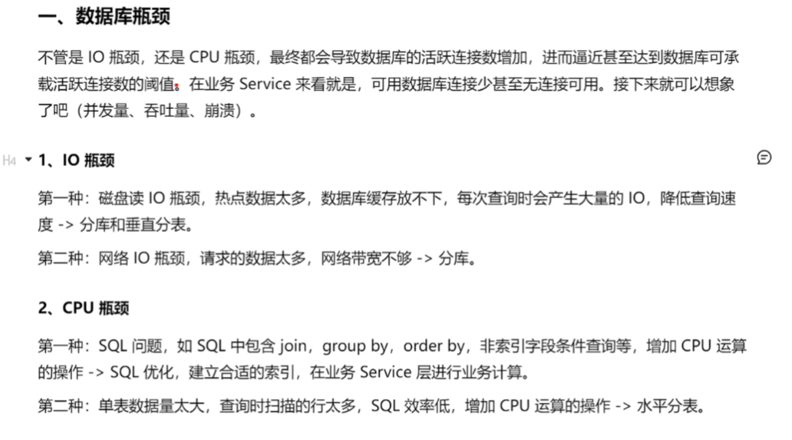

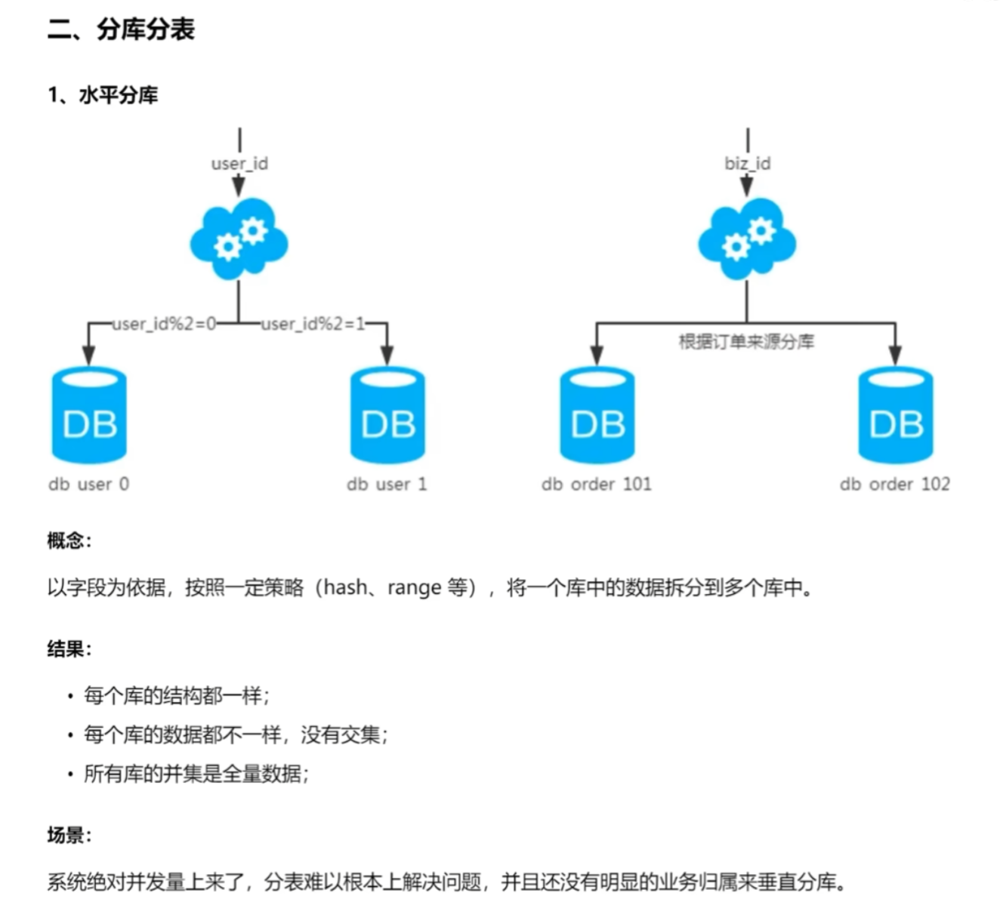

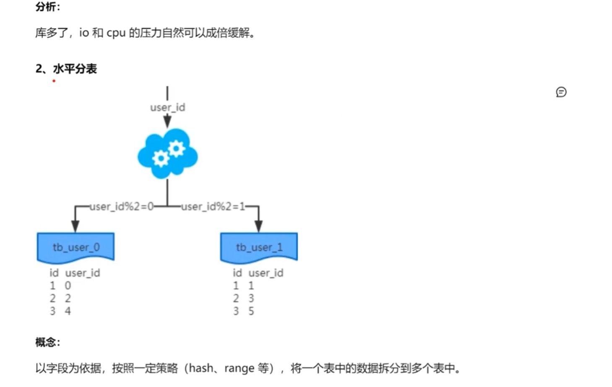

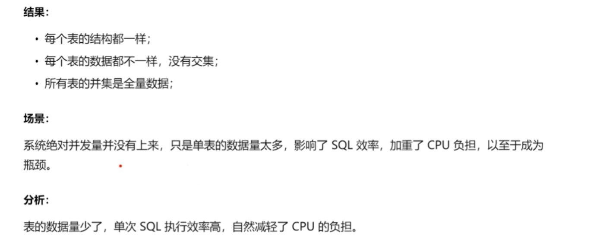

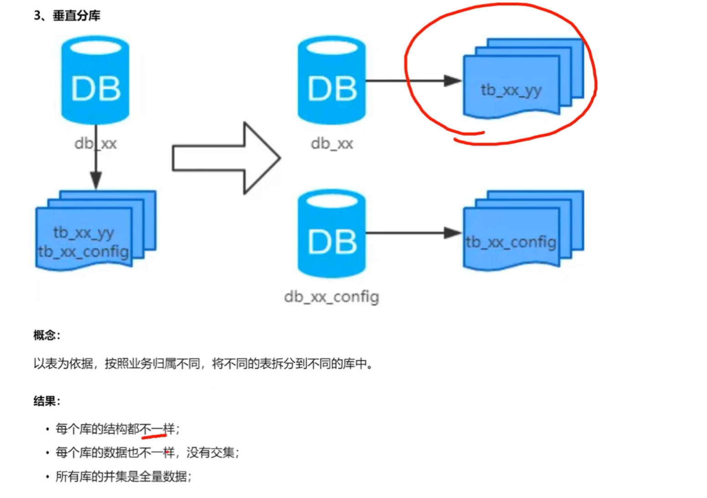

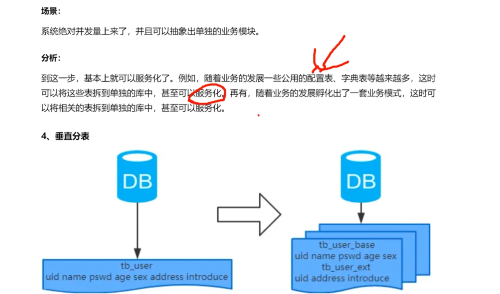

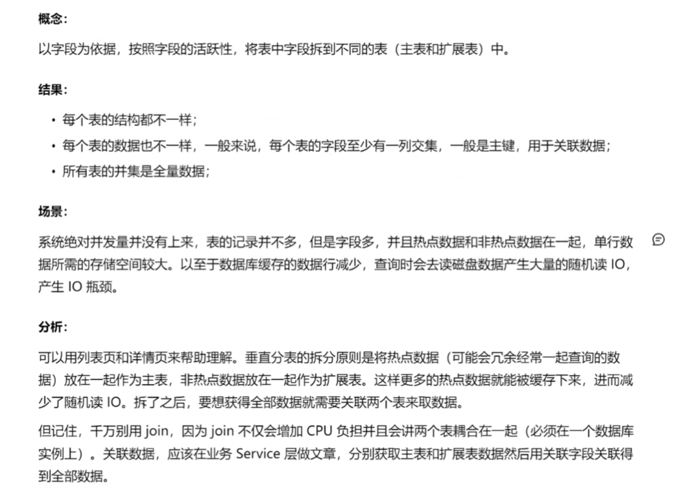

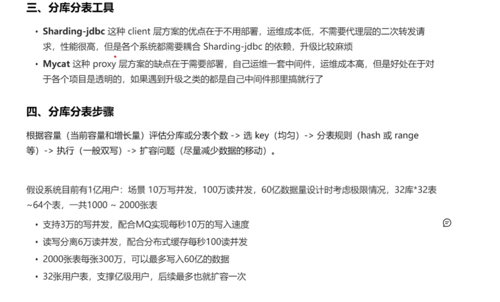

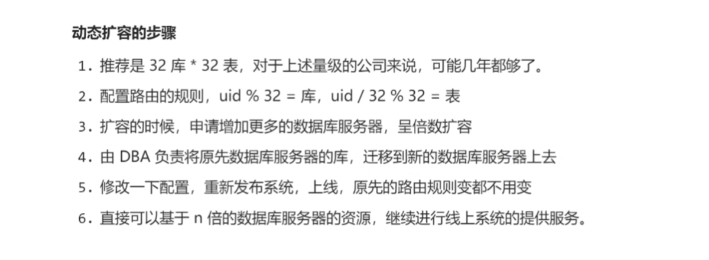

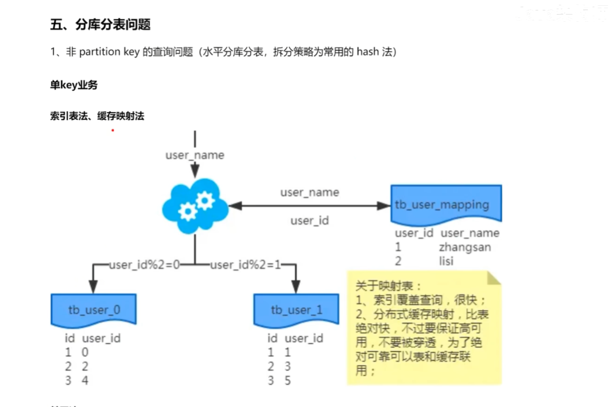

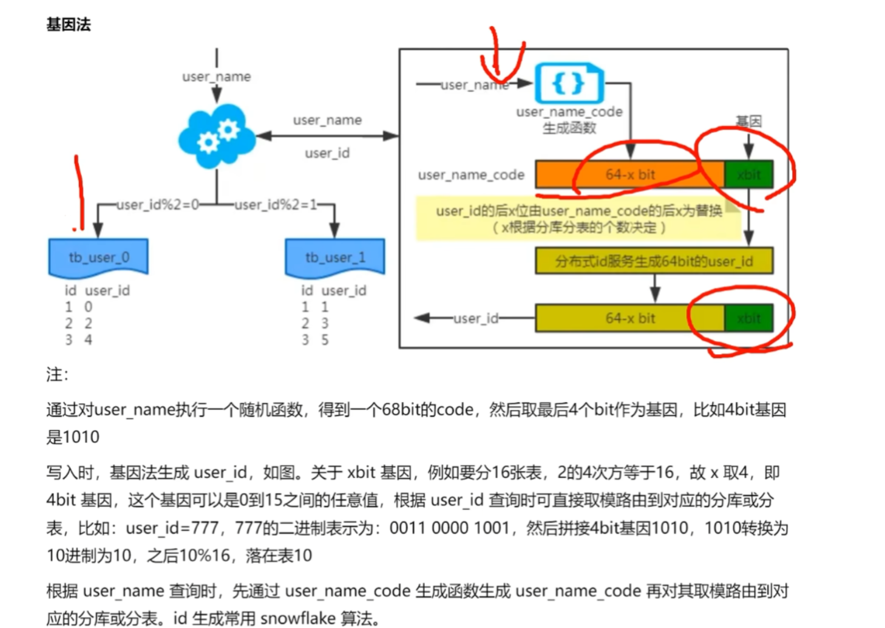

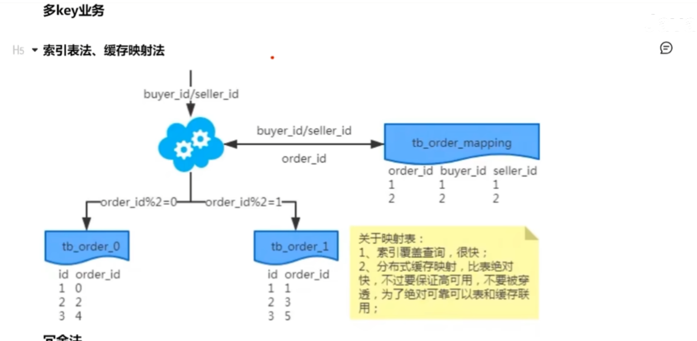

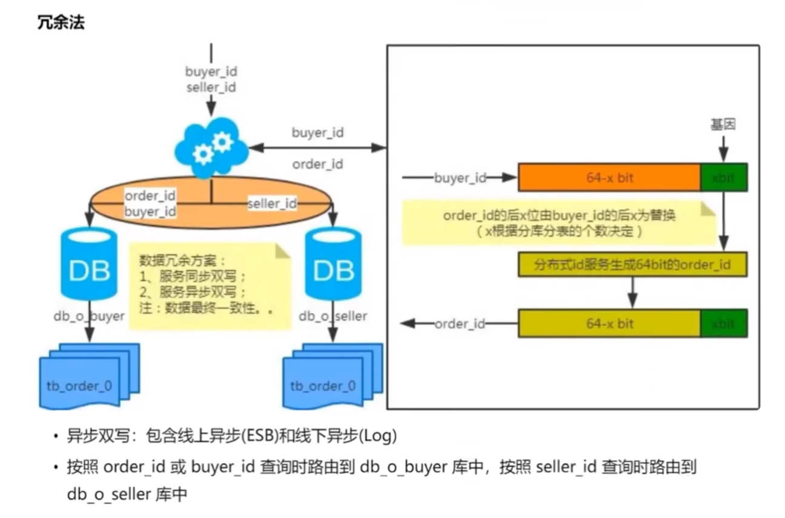


## Sharding-JDBC

黑马的版本比较旧、尚硅谷的版本新。

### 绑定表


## gorm-sharding

gorm官方的分库分表：https://github.com/go-gorm/sharding

### 基本使用

当然，gorm-sharding 是一个基于 Go 语言的 GORM 扩展库，它为 GORM 提供了数据分片（sharding）的支持。数据分片是一种数据库水平分割的技术，主要用于处理大规模数据集，通过将数据分布到多个数据库实例上来提高系统的可扩展性和性能。

#### gorm-sharding 的主要功能包括：

1. **数据分片**：允许开发者将数据分布在不同的数据库表或数据库实例上。
2. **查询路由**：根据预定义的规则自动将查询路由到正确的分片。
3. **聚合查询**：支持跨分片的聚合查询，例如 COUNT、SUM 等操作。
4. **事务支持**：对于涉及多个分片的操作提供事务支持。

#### 使用示例

以下是使用 gorm-sharding 的一个简单示例：

1. **安装 gorm-sharding**:
   ```bash
   go get -u github.com/xx-g/gorm-sharding/v2
   ```

2. **配置分片规则**:
   在项目中引入 `gorm-sharding` 并配置分片规则，例如基于 ID 进行模运算来决定数据应该存储在哪一个分片上。

3. **定义模型**:
   定义数据模型，类似于普通的 GORM 模型定义。

4. **执行 CRUD 操作**:
   使用 GORM 的 API 来执行数据操作，`gorm-sharding` 会自动处理分片相关的逻辑。

#### 示例代码

下面是一个简单的使用示例：

```go
package main

import (
	"fmt"
	"github.com/xx-g/gorm-sharding/v2"
	"github.com/xx-g/gorm-sharding/v2/sharding"
	"gorm.io/driver/mysql"
	"gorm.io/gorm"
)

type User struct {
	ID   uint   `gorm:"primaryKey"`
	Name string `gorm:"size:255"`
}

func main() {
	// 创建连接到各个分片数据库的连接池
	dsn := "user:password@tcp(127.0.0.1:3306)/database?charset=utf8mb4&parseTime=True&loc=Local"
	db, err := gorm.Open(mysql.Open(dsn), &gorm.Config{})
	if err != nil {
		panic("failed to connect database")
	}

	// 配置分片策略
	config := sharding.Config{
		TableShardingStrategy: func(db *gorm.DB, tableName string) (uint64, error) {
			// 假设 ID 字段是分片键
			var id uint64
			err := db.Model(&User{}).Select("id").First(&User{}, "id = ?", 1).Scan(&id).Error
			if err != nil {
				return 0, err
			}
			return id % 10, nil // 将 ID 模 10 来确定分片
		},
	}

	// 初始化分片数据库
	shardingDB, err := sharding.NewShardingDB(db, config)
	if err != nil {
		panic("failed to initialize sharding db")
	}

	// 使用分片数据库执行 CRUD 操作
	user := User{Name: "John Doe"}
	result := shardingDB.Create(&user)
	if result.Error != nil {
		fmt.Println("Error creating user:", result.Error)
	} else {
		fmt.Printf("Created user with ID: %v\n", user.ID)
	}
}
```

在这个示例中，我们定义了一个 `User` 结构体，并且配置了一个简单的分片策略。该策略基于 `ID` 字段对数据库进行分片，使用模运算来确定数据应该存储在哪一个分片上。

请注意，实际使用时需要根据具体的业务需求调整配置和分片策略。此外，上述代码仅作为示例，实际部署时需要考虑更多细节，例如错误处理、连接池管理等。


## 面试题

### 数据库分库分表，怎么跨库关联查询

1. （推荐）数据冗余，在修改数据的时候使用mq保证所有库数据的一致性。
2. 应用层对每张表查完之后做汇总，效率不高。
3. 直接用sharding sphere自带的关联表功能，只需要配置好关联表规则就行。
