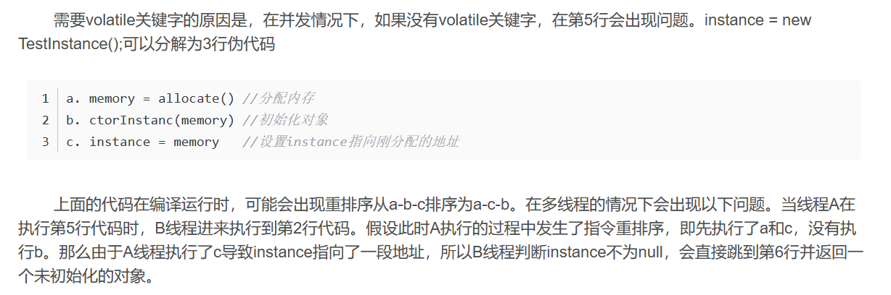

## JVM

### 方法区

在Java中，方法区（Method Area）是一种特殊的内存区域，用于存储类信息、常量、静态变量、即时编译器编译后的代码等。它是Java虚拟机规范中定义的一部分，属于线程共享的内存区域，每个JVM进程只有一个方法区。

方法区主要包括以下内容：

1. 类信息：存储每个类的完整结构，包括类的名称、父类的名称、类的方法、字段、访问控制权限等信息。
2. 常量池（Constant Pool）：存储类文件中的各种字面量和符号引用，包括字符串、类名、方法名、字段名等。
3. 静态变量：存储类的静态成员变量。
4. 即时编译器（Just-In-Time Compiler，JIT Compiler）编译后的代码。
5. 常量：存储在类文件中的静态final常量。

方法区在Java 8及之前的版本中实现为永久代（Permanent Generation），但在Java 8中被元数据区（Metaspace）所取代。元数据区的实现与永久代不同，它是直接使用本地内存来存储方法区的数据，因此避免了永久代的一些限制和问题。

### 四种引用类型

在 Java 中，引用类型用于引用对象而不是直接存储对象的实际数据。Java 中的引用类型包括以下几种：

1. **强引用（Strong Reference）**：
   - 强引用是最常见的引用类型，当我们使用 `new` 关键字创建一个对象时，默认情况下就会得到一个强引用。
   - 只要存在强引用指向一个对象，该对象就不会被垃圾回收器回收。

2. **软引用（Soft Reference）**：
   - 软引用允许在系统内存不足时被回收，但是只有在垃圾回收器确定内存不足时才会回收软引用。
   - 在 Java 中可以使用 `java.lang.ref.SoftReference` 类来创建软引用。

3. **弱引用（Weak Reference）**：
   - 弱引用是比软引用更弱的引用类型，在任何时候都可能被垃圾回收器回收。
   - 弱引用通常用于解决内存泄漏问题，比如对象缓存中，将对象的引用设置为弱引用，当对象没有被强引用持有时，就可以被垃圾回收。
   - 在 Java 中可以使用 `java.lang.ref.WeakReference` 类来创建弱引用。

4. **虚引用（Phantom Reference）**：
   - 虚引用是最弱的一种引用类型，它在任何时候都可能被垃圾回收器回收。
   - 虚引用主要用于跟踪对象被垃圾回收的情况，当虚引用关联的对象被垃圾回收器回收时，虚引用会被放入一个 ReferenceQueue 中，通知应用程序对象已经被回收。
   - 在 Java 中可以使用 `java.lang.ref.PhantomReference` 类来创建虚引用。

这些引用类型在 Java 中提供了不同程度的对象引用控制和内存管理功能，开发人员可以根据具体的需求选择合适的引用类型。

### volatile

https://blog.csdn.net/u012723673/article/details/80682208

单例模式的双重锁检查模式：

```java
public class TestInstance{
  private volatile static TestInstance instance;
  public static TestInstance getInstance(){   //1
    if(instance == null){   //2
      synchronized(TestInstance.class){   //3
        if(instance == null){   //4
          instance = new TestInstance(); //5
        }
      }
    }
    return instance;   //6
  }
}
```

new TestInstance的过程：

```c
a. memory = allocate() //分配内存
b. ctorInstanc(memory) //初始化对象
c. instance = memory   //设置instance指向刚分配的地址
```



### 对象创建

类加载 -> 分配内存 -> 初始化零值 -> 设置对象头 -> 智行init方法

### 垃圾回收器

### 内存分配和回收原则

### Classloader

在Java中，ClassLoader（类加载器）是一个重要的概念，它负责将 Java 字节码加载到 Java 虚拟机中，并生成相应的 Class 对象。ClassLoader 可以动态加载类，这意味着它可以在运行时根据需要从各种不同的数据源（如文件系统、网络、数据库等）加载类。

以下是一些关键的概念来理解 ClassLoader：

1. **加载方式**：ClassLoader 将类加载到内存中的过程分为三个阶段：加载、连接和初始化。加载阶段将类的字节码加载到内存中，连接阶段包括验证、准备（为类的静态变量分配内存并设置默认初始值）、解析等步骤，初始化阶段则是执行类的初始化代码。

2. **层次结构**：ClassLoader 之间存在层次结构，这个层次结构被称为类加载器层次结构。这个层次结构通常是树状结构，树的根节点是引导类加载器（Bootstrap ClassLoader），它是由本地代码实现的，并且负责加载核心的 Java 类库，例如 `java.lang.Object`。除了引导类加载器之外，每个类加载器都有一个父类加载器。当需要加载一个类时，ClassLoader 会先委托其父类加载器来尝试加载，只有在父类加载器无法加载时才会尝试自己加载。

3. **双亲委派模型**：ClassLoader 使用了双亲委派模型来保证类的唯一性和安全性。该模型要求每个类加载器在加载类时首先委派给其父加载器，只有当父加载器无法加载时才由子加载器自己加载。这样可以防止同一个类被重复加载，并且可以保证核心类库的安全性。

4. **自定义ClassLoader**：Java允许开发者自定义自己的 ClassLoader，通过继承 `java.lang.ClassLoader` 类并重写其中的方法，实现自定义的类加载逻辑。自定义ClassLoader常用于一些特殊的加载需求，比如热部署、类隔离等。

ClassLoader 在 Java 中扮演着重要的角色，它使得 Java 具有了动态加载和运行时扩展的能力，为 Java 应用程序的灵活性和可扩展性提供了基础支持。

### 虚拟机

Serial, ParNew（新多线程、老单线程）, parallel scavenge/old（标记-复制、多线程）, CMS，G1,ZGC

### 类加载

