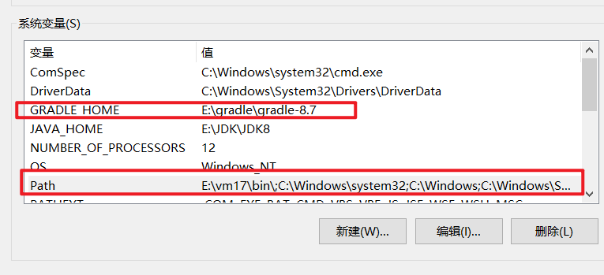

## Gradle

### 介绍

Gradle是一个基于Apache Ant和Apache Maven概念的**项目自动化构建开源工具**。它使用一种基于Groovy的特定领域语言（DSL）来声明项目设置，也增加了基于Kotlin语言的kotlin-based DSL，从而抛弃了基于XML的各种繁琐配置。

Gradle的主要功能和用途包括构建自动化、依赖管理、多项目构建以及丰富的插件生态系统。它可以自动执行项目构建过程，如编译源代码、运行单元测试、生成可执行文件、打包应用程序等。同时，Gradle提供了强大的依赖管理功能，能够自动下载和引入所需的依赖项，并处理依赖项之间的冲突。此外，Gradle还支持多项目构建，可以在一个构建脚本中管理和构建多个相关的子项目。

Gradle的特点包括灵活的构建脚本、强大的依赖管理、高度可定制、并行执行和增量构建，以及持续集成和自动化部署。它使用Groovy或Kotlin的DSL来编写易读、易维护的构建脚本，并提供了丰富的插件和扩展机制，可以根据项目需求定制构建流程，并集成各种工具和框架。

此外，Gradle还是Android的官方构建工具，并且被许多Java项目用于构建、测试、发布和其他任务。如需更多关于Gradle的详细信息，建议查阅相关文档或咨询专业人士。

### 和maven的区别

尽管Maven是一个非常强大和广泛使用的构建工具，但Gradle的出现和流行也有其独特的原因。以下是为什么在有了Maven的情况下，仍然有很多项目选择使用Gradle的一些主要原因：

1. **构建性能**：Gradle在构建性能上相对于Maven有着显著的优势。它采用了==增量构建==的概念，只编译项目中发生变化的部分，而不是每次都重新编译整个项目。这种特性在大型项目中特别有用，可以显著减少构建时间。
2. **灵活性**：Gradle使用Groovy或Kotlin DSL作为构建脚本，这使得构建过程更加灵活和易于理解。与Maven的XML配置相比，Gradle的DSL更加直观和强大，可以更容易地表达复杂的构建逻辑。
3. **插件生态系统**：虽然Maven拥有庞大的插件生态系统，但Gradle的插件系统同样强大且易于扩展。Gradle的插件生态系统涵盖了从基础构建任务到特定框架集成的各个方面，可以满足各种复杂的构建需求。
4. **多项目构建**：Gradle对多项目构建的支持非常出色。它允许在一个构建脚本中管理和构建多个相关的子项目，可以方便地处理项目之间的依赖关系，提高构建效率。
5. **跨平台支持**：由于Gradle是基于Java的，因此可以在各种平台上使用，具有良好的跨平台支持能力。
6. **集成性**：Gradle可以轻松地集成第三方工具和插件，如测试框架、代码质量检查工具等，使得整个开发流程更加顺畅。

综上所述，尽管Maven是一个非常优秀的构建工具，但Gradle凭借其出色的构建性能、灵活性、插件生态系统、多项目构建支持以及跨平台能力等优势，成为了很多项目的首选构建工具。当然，具体选择哪个工具还需要根据项目的实际需求和团队的偏好来决定。

## 教程-gradle-8.7

https://docs.gradle.org/current/userguide/getting_started_eng.html

Gradle根据构建脚本中的信息自动构建、测试和部署软件。


### gradle项目结构


1.Gradle目录用于存储包装文件等

2.用于依赖项管理的Gradle版本目录

3.Gradle wrapper 脚本

4.Gradle设置文件以定义根项目名称和子项目

5.分阶段构建两个子项目的脚本-和子项目-子项目-b

6.项目的源代码和/或附加文件

### 核心概念

#### 基础

单体项目（project），各个项目root : {sub1, sub2, ...}

任务（task）是一个基本的工作单元，例如编译代码或运行测试。

每个项目都包含一个或多个在构建脚本或插件中定义的任务。

#### gradle wrapper

执行任何Gradle构建的推荐方法是使用Gradle Wrapper。

Gradle Wrapper是Gradle的一个特性，它实际上是一个脚本，用于调用已经声明的Gradle版本。这个脚本允许开发者快速地启动并运行Gradle项目，无需手动安装Gradle，从而节省了时间成本。

Gradle Wrapper是Gradle的一层包装，它的主要作用在于在团队开发过程中统一Gradle构建的版本。通过它，团队成员都可以使用统一的Gradle版本进行项目构建，从而避免因Gradle版本不一致而带来的问题。

一般来说，在Gradle项目初始化（执行gradle init）后，项目都会自动带有Gradle Wrapper。这样，团队成员就可以直接使用Gradle Wrapper进行项目构建，而无需关心具体的Gradle安装和配置问题。

总的来说，Gradle Wrapper是一个方便、高效、且能够确保团队构建环境一致性的工具。

**使用wrapper**

不用wrapper

```shell
$ gradle build
```

linux使用wrapper

```shell
$ ./gradlew build
```

windows使用wrapper

```shell
$ .\gradlew.bat build
```

使用gradle wrapper构建项目时，要在项目的当前目录构建，要指定项目中的gradlew目录

```shell
$ ../gradlew build
```

windows使用示例

```shell
$ gradlew.bat build

Downloading https://services.gradle.org/distributions/gradle-5.0-all.zip
.....................................................................................
Unzipping C:\Documents and Settings\Claudia\.gradle\wrapper\dists\gradle-5.0-all\ac27o8rbd0ic8ih41or9l32mv\gradle-5.0-all.zip to C:\Documents and Settings\Claudia\.gradle\wrapper\dists\gradle-5.0-al\ac27o8rbd0ic8ih41or9l32mv
Set executable permissions for: C:\Documents and Settings\Claudia\.gradle\wrapper\dists\gradle-5.0-all\ac27o8rbd0ic8ih41or9l32mv\gradle-5.0\bin\gradle

BUILD SUCCESSFUL in 12s
1 actionable task: 1 executed
```

#### Command-Line Interface Basics - 常用命令

在命令行上执行Gradle符合以下结构：

```shell
gradle [taskName...] [--option-name...]
```

或

```
gradle [--option-name...] [taskName...]
```

如果指定了多个任务，则应使用空格将它们分隔开

```
gradle [taskName1 taskName2...] [--option-name...]
```

可以在选项和参数之间指定接受值的选项，也可以不指定=。建议使用=

```
gradle [...] --console=plain
```

启用行为（开始enable）的选项具有使用--no-指定反转的长格式选项。以下是相反的。

```
gradle [...] --build-cache
gradle [...] --no-build-cache
```

帮助

```
gradle --help
gradle -h
```

示例：

要在根项目上执行名为taskName的任务，请键入

```shell
$ gradle :taskName
```

要将选项传递给任务，请在选项名称前加上任务名称后的--

```shell
$ gradle taskName --exampleOption=exampleValue
```

#### settings.gradle配置

settings.gradle是每个Gradle项目的入口点。

settings.gradle的主要用途是将子项目添加到build中。

Gradle支持单项目和多项目构建。

对于单个项目生成，settings.gradle是可选的。

对于多项目生成，settings.gradle是必需的，并声明所有子项目。

只能使用Kotlin和Groovy写settings.gradle文件


#### build.gradle配置

详情：https://docs.gradle.org/current/userguide/writing_build_scripts.html#writing_build_scripts

通常，build.gradle会详细说明build配置、task和plugin。

每个Gradle构建都至少包含一个构建脚本。

在build.gradle中，可以添加两种类型的依赖项：

Gradle和构建脚本所依赖的库和/或插件。

项目源（即源代码）所依赖的库。


#### 依赖版本管理 - libs.versions.toml

[versions]来声明插件和库将引用的版本号。

[libraries]定义生成文件中使用的库。

[bundle]来定义一组依赖关系。

[plugins]定义插件。

```properties
[versions]
androidGradlePlugin = "7.4.1"
mockito = "2.16.0"

[libraries]
googleMaterial = { group = "com.google.android.material", name = "material", version = "1.1.0-alpha05" }
mockitoCore = { module = "org.mockito:mockito-core", version.ref = "mockito" }

[plugins]
androidApplication = { id = "com.android.application", version.ref = "androidGradlePlugin" }
```

==声明依赖==

若要将依赖项添加到项目中，请在build.gradle（.kts）文件的依赖项块中指定一个依赖项。

以下build.gradle.kts文件使用上面的版本目录向项目添加了一个插件和两个依赖项：


==查看项目依赖==

您可以使用在终端中查看依赖关系树 `./gradlew :app:dependencies` 依赖项命令

```shell
$ ./gradlew :app:dependencies

> Task :app:dependencies

------------------------------------------------------------
Project ':app'
------------------------------------------------------------

implementation - Implementation only dependencies for source set 'main'. (n)
\--- com.google.android.material:material:1.1.0-alpha05 (n)

testImplementation - Implementation only dependencies for source set 'test'. (n)
\--- org.mockito:mockito-core:2.16.0 (n)

...
```

#### 任务 - task

任务表示构建所执行的一些独立的工作单元，例如编译类、创建JAR、生成Javadoc或将档案发布到存储库。


构建任务

```shell
$ ./gradlew build
```

查看可用任务

```shell
$ ./gradlew tasks
```

```shell
Application tasks
-----------------
run - Runs this project as a JVM application

Build tasks
-----------
assemble - Assembles the outputs of this project.
build - Assembles and tests this project.

...

Documentation tasks
-------------------
javadoc - Generates Javadoc API documentation for the main source code.

...

Other tasks
-----------
compileJava - Compiles main Java source.

...
```

运行任务

```shell
$ ./gradlew run

> Task :app:compileJava
> Task :app:processResources NO-SOURCE
> Task :app:classes

> Task :app:run
Hello World!

BUILD SUCCESSFUL in 904ms
2 actionable tasks: 2 executed
```

任务之间的依赖，build之前要先编译compileJava任务

```shell
$ ./gradlew build

> Task :app:compileJava
> Task :app:processResources NO-SOURCE
> Task :app:classes
> Task :app:jar
> Task :app:startScripts
> Task :app:distTar
> Task :app:distZip
> Task :app:assemble
> Task :app:compileTestJava
> Task :app:processTestResources NO-SOURCE
> Task :app:testClasses
> Task :app:test
> Task :app:check
> Task :app:build

BUILD SUCCESSFUL in 764ms
7 actionable tasks: 7 executed
```

构建脚本可以选择性地定义任务相关性。然后Gradle自动确定任务执行顺序。

#### plugin

https://docs.gradle.org/current/userguide/plugin_basics.html

使用插件`build.gradle`

```
plugins {
    id «plugin id» version «plugin version»
}
```

#### 增量build和cache

Gradle使用两个主要功能来减少构建时间：增量构建和构建缓存。

增量生成是一种避免运行自上次生成以来输入未更改的任务的生成。如果这些任务只会重新产生相同的输出，那么重新执行这些任务是不必要的。

为了使增量构建发挥作用，任务必须定义其输入和输出。Gradle将确定输入或输出在构建时是否发生了更改。如果它们发生了更改，Gradle将执行该任务。否则，它将跳过执行。

增量构建始终处于启用状态，查看它们的最佳方式是打开详细模式。在详细模式下，每个任务状态都会在构建过程中进行标记：

```shell
$ ./gradlew compileJava --console=verbose

> Task :buildSrc:generateExternalPluginSpecBuilders UP-TO-DATE
> Task :buildSrc:extractPrecompiledScriptPluginPlugins UP-TO-DATE
> Task :buildSrc:compilePluginsBlocks UP-TO-DATE
> Task :buildSrc:generatePrecompiledScriptPluginAccessors UP-TO-DATE
> Task :buildSrc:generateScriptPluginAdapters UP-TO-DATE
> Task :buildSrc:compileKotlin UP-TO-DATE
> Task :buildSrc:compileJava NO-SOURCE
> Task :buildSrc:compileGroovy NO-SOURCE
> Task :buildSrc:pluginDescriptors UP-TO-DATE
> Task :buildSrc:processResources UP-TO-DATE
> Task :buildSrc:classes UP-TO-DATE
> Task :buildSrc:jar UP-TO-DATE
> Task :list:compileJava UP-TO-DATE
> Task :utilities:compileJava UP-TO-DATE
> Task :app:compileJava UP-TO-DATE

BUILD SUCCESSFUL in 374ms
12 actionable tasks: 12 up-to-date
```

要永久启用详细模式，请将org.gradle.console=verbose添加到gradle.properties文件中。

#### build caching - 从历史中恢复

增量构建是一个很好的优化，有助于避免已经完成的工作。如果开发人员连续更改单个文件，则可能不需要重新生成项目中的所有其他文件。

然而，当同一个开发人员切换到上周创建的新分支时，会发生什么？即使开发人员正在构建以前构建过的东西，文件也会重新构建。

这就是构建缓存的作用所在。

生成缓存存储以前的生成结果，并在需要时进行恢复。它防止了执行耗时且昂贵的过程所带来的冗余工作和成本。

当生成缓存已用于重新填充本地目录时，任务标记为FROM-cache：

```shell
$ ./gradlew compileJava --build-cache

> Task :buildSrc:generateExternalPluginSpecBuilders UP-TO-DATE
> Task :buildSrc:extractPrecompiledScriptPluginPlugins UP-TO-DATE
> Task :buildSrc:compilePluginsBlocks UP-TO-DATE
> Task :buildSrc:generatePrecompiledScriptPluginAccessors UP-TO-DATE
> Task :buildSrc:generateScriptPluginAdapters UP-TO-DATE
> Task :buildSrc:compileKotlin UP-TO-DATE
> Task :buildSrc:compileJava NO-SOURCE
> Task :buildSrc:compileGroovy NO-SOURCE
> Task :buildSrc:pluginDescriptors UP-TO-DATE
> Task :buildSrc:processResources UP-TO-DATE
> Task :buildSrc:classes UP-TO-DATE
> Task :buildSrc:jar UP-TO-DATE
> Task :list:compileJava FROM-CACHE
> Task :utilities:compileJava FROM-CACHE
> Task :app:compileJava FROM-CACHE

BUILD SUCCESSFUL in 364ms
12 actionable tasks: 3 from cache, 9 up-to-date
```

一旦本地目录被重新填充，下一次执行将把任务标记为UP-TO-DATE，而不是FROM-CACHE。

#### build scans

略。

### 入门教程

#### 安装gradle

https://docs.gradle.org/current/userguide/installation.html#installation

如果您只想运行一个现有的Gradle项目，那么如果构建使用Gradle Wrapper，则不需要安装Gradle。这可以通过项目根目录中存在`gradlew`或`gradle.bat`文件来识别。

否则，打开命令行查看是否已经安装

```shell
$ gradle -v
```

安装需要JDK8+，使用`java -version`查看。

在环境变量里使用`%JAVA_HOME%`把java的jdk路径替换一下：


windows安装：

下载最新版本的gradle：https://docs.gradle.org/current/userguide/installation.html#ex-installing-manually

把下载好的安装包解压到英文目录下，把路径加到环境变量中：




查看是否安装成功

```shell
$ gradle -v
```


#### 初始化项目

https://docs.gradle.org/current/userguide/part1_gradle_init.html

使用以下参数运行gradle init以生成Java应用程序：

```shell
$ gradle init --type java-application  --dsl groovy
```


在项目目录下生成的结构和上面的gradle项目结构一样。

**使用gradle wrapper**

推荐使用gradle wrapper构建项目。这些脚本（`gradlew.bat`）允许您运行Gradle构建，而无需在系统上安装Gradle。它还有助于确保不同开发人员以及本地和CI机器之间的构建使用相同版本的Gradle。从现在起，您将永远不会直接调用Gradle；相反，您将使用Gradle Wrapper。

```shell
$ .\gradlew.bat build
```

第一次使用gradle wrapper需要下载Gradle的binary版本。

在这种情况下，我们通过包装器调用Gradle来构建我们的项目，因此我们可以看到应用程序目录现在包括一个新的构建文件夹：


```shell
$ cd app
$ ls -al
```


**项目结构**

settings.gradle + root project + subprojects


在本教程中：

根项目称为tutorial，在settings.gradle文件中使用rootProject.name=“tutorial”定义。

该子项目称为app，在settings.gradle文件中使用include（“app”）进行定义。

根项目可以在顶级目录中，也可以有自己的目录。

用IDE打开这个项目，查看各个文件的内容。


文件中有自动生成的注释，自行查阅。

#### 运行任务

查看可用的任务

```shell
$ ./gradlew tasks
```

任务可能负责编译、复制和移动文件、创建JAR文件、生成Javadoc、将工件发布到存储库或许多其他离散的工作单元。

您还可以通过运行列出仅在应用程序子项目中可用的任务`./gradlew.bat :app:tasks`。

您可以使用--all选项在任务列表中获取更多信息：``./gradlew tasks --all``

之前已经使用`./gradle.bat build`构建了项目。

**任务是啥？**

