## Elasticsearch

参考：[https://cloud.tencent.com/developer/article/2175753](https://cloud.tencent.com/developer/article/2175753)

Elasticsearch是一个开源的分布式搜索和分析引擎，主要用于处理大规模数据的搜索、分析和存储。它可以快速地搜索和分析大量数据，支持实时搜索和聚合分析，具有高可用性和可扩展性。

与MySQL相比，Elasticsearch具有以下几个区别：

1. 数据结构：MySQL是关系型数据库，需要定义表和列，而Elasticsearch是==文档型数据库==，数据以文档的形式存储，可以自由定义字段。

2. 搜索方式：MySQL的搜索方式是基于SQL语句的查询，而Elasticsearch的搜索方式是基于全文搜索和过滤器的查询。

3. 扩展性：MySQL的扩展性有限，需要对数据库进行分库分表等操作，而Elasticsearch可以通过添加节点来实现水平扩展。

为什么要使用Elasticsearch：

1. 处理大规模数据：Elasticsearch能够处理海量的数据，支持实时搜索和聚合分析。

2. 实时性：Elasticsearch具有实时性，可以在数据更新后立即进行搜索和分析。

3. 可扩展性：Elasticsearch可以通过添加节点来实现水平扩展，支持集群部署。

4. 全文搜索：Elasticsearch支持全文搜索和过滤器查询，能够更加准确地匹配搜索关键字。

5. 高可用性：Elasticsearch具有高可用性，支持数据备份和恢复，可以保障数据的安全性和可靠性。

### 全文搜索和过滤器查询

全文搜索是指在文本数据中进行关键字搜索的方式。在Elasticsearch中，全文搜索是指对文档中的所有字段进行搜索匹配的方式，而不是只针对特定字段进行搜索。全文搜索可以使用各种查询方式，包括匹配查询、模糊查询、正则表达式查询等。

过滤器查询是指使用过滤器来对数据进行筛选的方式。在Elasticsearch中，过滤器查询可以对文档中的字段进行筛选，可以使用各种过滤器，包括范围过滤器、存在过滤器、缺失过滤器等。过滤器查询可以提高查询效率，因为它可以在搜索结果之前对数据进行过滤，从而减少搜索的数据量。

全文搜索和过滤器查询是Elasticsearch中两种常用的查询方式，它们可以组合使用，从而实现更加精确和高效的搜索和筛选。

### endpoint

Elasticsearch的endpoint是指与Elasticsearch进行交互的API接口地址。Elasticsearch提供了多种API接口，可以通过不同的endpoint来访问这些接口，进行搜索、索引、删除、更新等操作。

以下是一些常用的Elasticsearch endpoint：

1. _search：用于执行搜索操作，可以使用各种查询方式和过滤器查询。

2. _index：用于创建、更新和删除索引，可以指定索引的名称和设置。

3. _doc：用于创建、更新和删除文档，可以指定文档的ID和内容。

4. _bulk：用于批量操作文档，可以一次性处理多个文档。

5. _cat：用于查看集群、节点、索引等的状态信息。

6. _cluster：用于管理集群的设置和状态信息。

7. _nodes：用于查看节点的状态信息和统计数据。

8. _aliases：用于管理索引别名，可以创建、更新和删除别名。

以上是一些常用的Elasticsearch endpoint，可以通过这些endpoint来访问Elasticsearch的API接口，进行各种操作。

### enpoint使用示例

以下是一些常用的Elasticsearch endpoint的使用实例：

1. _search：执行搜索操作

```
POST /my_index/_search
{
  "query": {
    "match": {
      "title": "Elasticsearch"
    }
  }
}
```

该请求将在名为my_index的索引中搜索title字段包含“Elasticsearch”关键字的文档。

2. _index：创建索引

```
PUT /my_index
{
  "settings": {
    "number_of_shards": 1,
    "number_of_replicas": 0
  }
}
```

该请求将创建一个名为my_index的索引，并设置它的分片数为1，副本数为0。

3. _doc：创建文档

```
POST /my_index/_doc
{
  "title": "Elasticsearch入门",
  "content": "这是一篇Elasticsearch入门的文章"
}
```

该请求将在名为my_index的索引中创建一个新的文档，并设置它的title和content字段。

4. _bulk：批量操作文档

```
POST /my_index/_bulk
{ "index": { "_id": "1" } }
{ "title": "Elasticsearch入门", "content": "这是一篇Elasticsearch入门的文章" }
{ "delete": { "_id": "2" } }
```

该请求将一次性创建一个新文档和删除一个文档，其中新文档的ID为1，内容为title和content字段，要删除的文档ID为2。

5. _cat：查看状态信息

```
GET /_cat/indices?v
```

该请求将列出所有索引的状态信息，包括索引名称、分片数、文档数等。

6. _cluster：管理集群设置

```
PUT /_cluster/settings
{
  "transient": {
    "cluster.routing.allocation.enable": "all"
  }
}
```

该请求将设置集群的路由分配策略为“all”，即所有节点都可以分配分片。

以上是一些常用的Elasticsearch endpoint的使用实例，可以通过这些endpoint来访问Elasticsearch的API接口，进行各种操作。

### 倒排索引

倒排索引（Inverted Index）是一种数据结构，用于快速查找文档中包含某个单词的位置。它将每个单词映射到包含该单词的文档列表中，以便可以快速地找到包含特定单词的文档。

倒排索引通常用于搜索引擎中，以便用户可以快速地找到包含特定关键词的文档。当用户在搜索引擎中输入关键词时，搜索引擎会使用倒排索引来查找包含关键词的文档，并将这些文档按照相关性排序后返回给用户。

倒排索引的优点是可以快速地查找包含特定单词的文档，缺点是需要占用较大的存储空间，因为需要存储每个单词出现的位置。

### FST

FST（Finite State Transducer）是一种有限状态转换器，是一种自动机，用于在计算机科学中进行字符串匹配和文本处理。它可以将输入字符串映射到输出字符串，也可以将输入字符串映射到状态序列，或者将状态序列映射到输出字符串。

FST通常用于自然语言处理、语音识别、机器翻译、信息检索等领域。它可以用于实现自动化的文本转换、词法分析、语法分析、文本分类等任务。

FST的基本思想是将输入字符串转换为状态序列，然后根据状态序列执行某些操作（如输出字符串）。FST由状态、转移和输出组成，其中状态表示自动机的当前状态，转移表示从一个状态到另一个状态的转换，输出表示从一个状态到另一个状态的转换所对应的输出字符串。

FST的优点是可以高效地处理大量的文本数据，缺点是需要耗费大量的计算资源和存储空间，因为需要存储状态、转移和输出。

**例子**

一个简单的FST例子是将英语单词的复数形式转换为单数形式。假设我们有一个FST，输入是一个英语单词的复数形式，输出是该单词的单数形式。

例如，输入单词“cats”会被转换为输出单词“cat”，输入单词“dogs”会被转换为输出单词“dog”。这个FST可以通过以下步骤实现：

1. 定义状态：FST的状态表示当前处理的字符位置和单词的复数形式是否已经处理完。我们可以定义三种状态：开始状态、中间状态和结束状态。

2. 定义转移：FST的转移表示从一个状态到另一个状态的转换。我们可以定义以下转移：

   a. 从开始状态到中间状态，如果输入字符是一个辅音字母（如c、d、g等）。

   b. 从开始状态到中间状态，如果输入字符是一个元音字母（如a、e、i等）。

   c. 从中间状态到中间状态，如果输入字符是一个辅音字母。

   d. 从中间状态到中间状态，如果输入字符是一个元音字母。

   e. 从中间状态到结束状态，如果输入字符是字母s。

3. 定义输出：FST的输出表示从一个状态到另一个状态的转换所对应的输出字符串。在这个例子中，输出是单数形式的单词。我们可以定义以下输出：

   a. 从开始状态到中间状态，不输出任何字符。

   b. 从中间状态到中间状态，不输出任何字符。

   c. 从中间状态到结束状态，删除最后一个字符（即字母s）。

这样，当输入一个英语单词的复数形式时，FST会按照以上步骤进行转换，最终输出该单词的单数形式。

### BKD-Tree

BKD-Tree（Bounded Box K-Dimensional Tree）是一种用于高维空间数据索引的树形数据结构。它是KD-Tree（K-Dimensional Tree）的一种扩展，能够更好地处理高维数据。

BKD-Tree的基本思想是将数据点递归地划分到不同的子空间中，并将子空间存储在树的节点中。与KD-Tree不同的是，BKD-Tree在每个节点中存储一个有界框（bounding box），用于表示该节点所包含的子空间的范围。这样可以避免在高维空间中出现维度灾难的问题，从而提高了查询效率。

BKD-Tree的构建过程与KD-Tree类似，也是通过递归地划分数据点来构建树形结构。不同之处在于，BKD-Tree在划分数据点时，会选择一个方差最大的维度进行划分，以保证每个子空间的大小相对均衡。

BKD-Tree在高维数据索引中具有很好的性能，能够快速地进行范围查询、最近邻查询等操作。但是，由于需要存储每个节点的有界框，BKD-Tree的存储空间开销较大，因此在处理大规模数据时可能会面临存储空间不足的问题。

### es查询模型

我们首先来看下 ES 总体的查询模型。 ES 的任意节点可作为写入请求的协调节点，接收用户请求。协调节点将请求转发至对应一个或多个数据分片的主或者从分片进行查询，各个分片查询结果最后在协调节点汇聚，返回最终结果给客户端。

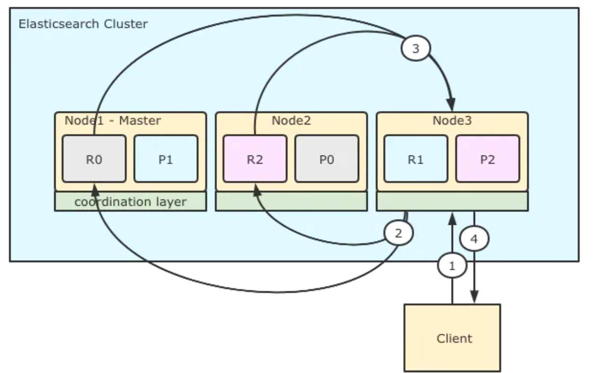

ES 的分布式查询主要有2个阶段，Query阶段跟Fetch阶段。

- Query 阶段：协调节点将查询拆分成多个分片任务，发送到数据分片上通过调用Lucene 执行查 “倒排索引”，查询满足条件的文档id集合。Query 内又可以细分为2个阶段，本质上是一个基于CBO的倒排合并过程：
  （1） 对查询语句进行拆解，预估每个子语句的匹配结果数量；
  （2） 对符合条件的最小结果集进行遍历，检查其是否匹配其他查询子语句，得到一个最终的结果集。
- Fetch 阶段：归并生成最终的检索、聚合结果。Fetch 也可以细分为以下2个阶段：
  （1）对Query 阶段的多个分片结果进行归并；
  （2）抓取用户需要的字段信息。
  如果只有一个分片，那ES 会将流程合并为 QueryAndFetch 一个阶段。

### es索引设计

ES的底层是Lucene，可以说Lucene的查询性能就决定了ES的查询性能。Lucene内最核心的倒排索引，本质上就是Term到所有包含该Term的文档的DocId列表的映射。ES 默认会对写入的数据都建立索引，并且常驻内存，主要采用了以下几种数据结构：

1. 倒排索引：保存了每个term对应的docId的列表，采用skipList的结构保存，用于快速跳跃。
2. FST（Finite State Transducer）：原理上可以理解为==前缀树==，用于保存term字典的二级索引，用于加速查询，可以在FST上实现单Term、Term范围、Term前缀和通配符查询等。内部结构如下：

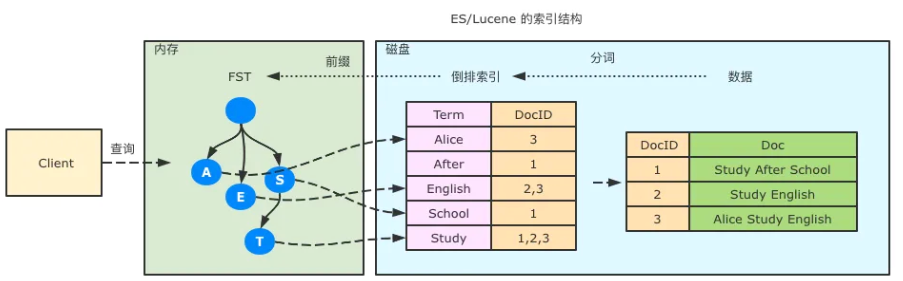

3. BKD-Tree：BKD-Tree是一种保存多维空间点的数据结构，主要用于数值类型(包括空间点)的快速查找。0

### 元数据字段和业务字段

在Elasticsearch（ES）中，元数据字段和业务字段是两种不同类型的数据字段，它们在索引和查询数据时扮演不同的角色。

1. 元数据字段（Metadata Fields）：
元数据字段是Elasticsearch自动生成的字段，用于存储有关文档的元信息。这些字段不是用户定义的，而是由Elasticsearch内部管理和使用。元数据字段对于用户来说是只读的，不能在索引或查询时直接修改。常见的元数据字段包括：

- `_index`：文档所属的索引名称。
- `_type`：文档的类型（在Elasticsearch 7.0及更高版本中已被移除）。
- `_id`：文档的唯一标识符。
- `_version`：文档的版本号。
- `_score`：搜索结果的相关性得分。
- `_source`：包含文档所有字段的JSON对象。

2. 业务字段（Business Fields）：
业务字段是用户在创建索引时自定义的字段，用于存储与业务相关的数据。这些字段可以根据业务需求进行定义，例如用户信息、订单详情、产品描述等。业务字段是可读写的，可以在索引和查询时进行修改。业务字段的名称和类型由用户在创建索引时定义。

例如，在一个订单管理系统中，我们可能会创建如下业务字段：

- `order_id`：订单的唯一标识符。
- `customer_name`：下单的客户姓名。
- `product_id`：购买的产品ID。
- `quantity`：购买的产品数量。
- `price`：产品的价格。

总结一下，元数据字段是Elasticsearch自动生成的字段，用于存储文档的元信息；而业务字段是用户自定义的字段，用于存储与业务相关的数据。这两类字段在Elasticsearch中分别用于不同的目的。

### es的字段存储

#### 行存和列存

这句话主要是在讨论 Elasticsearch（简称 ES）中的数据存储方式。在 ES 中，除了使用索引来加速查询之外，还提供了两种额外的数据存储策略：行存（stored fields，_source）和列存（doc _value）。

1. **行存（Stored Fields, _source）**：主要用于字段值的展示，例如Kibana 。

   （1） ES内置元数据字段（\_index,\_id,\_score等等）默认开启store。
   （2） 所有业务字段默认关闭store，但业务字段的store 都会被存到 _source。(自定义的字段不会添加索引，会把所有业务字段不拆分，保存成一个完整的json)
   （3）默认通过 index.codec 压缩算法进行压缩。查询时需要解压。
   （4）内部结构：

   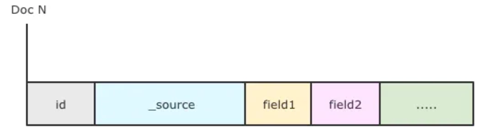

   1. \_source Field ： 是Stored Fields 中的一个特殊的超大字段，包含该条文档输入时的所有业务字段的原始值。
      （1）大部分特性同 Stored Fields。
      （2）\_source 字段是该行中的第一个存储字段。优先读取。

* 行存是指将文档的原始字段值存储起来。当你执行某些查询时，ES 可以直接从行存中获取整个文档的数据，而无需重新从索引中解析。
* 行存对于需要频繁获取整个文档内容的场景非常有用，例如在搜索结果展示中。

2. **列存（Doc Values）**：

   doc_value Fields：类似于大数据场景中的列存，按列存储，主要用于聚合跟排序等分析场景。

   （1） 不同文档的相同字段的值一起连续存储在内存中，默认不通过压缩算法压缩。可以“几乎”直接访问某个文档的某个字段。调用方式： "docvalue_fields": ["tag1"]。

   （2） 数据被编码后，精度跟格式可能会发生变化。

   （3）非text 默认开启doc_value。text 字段无法直接开启 doc_value。

   （4） 内部结构：如下图，列式存储很容易通过字典编码跟偏移量压缩。

   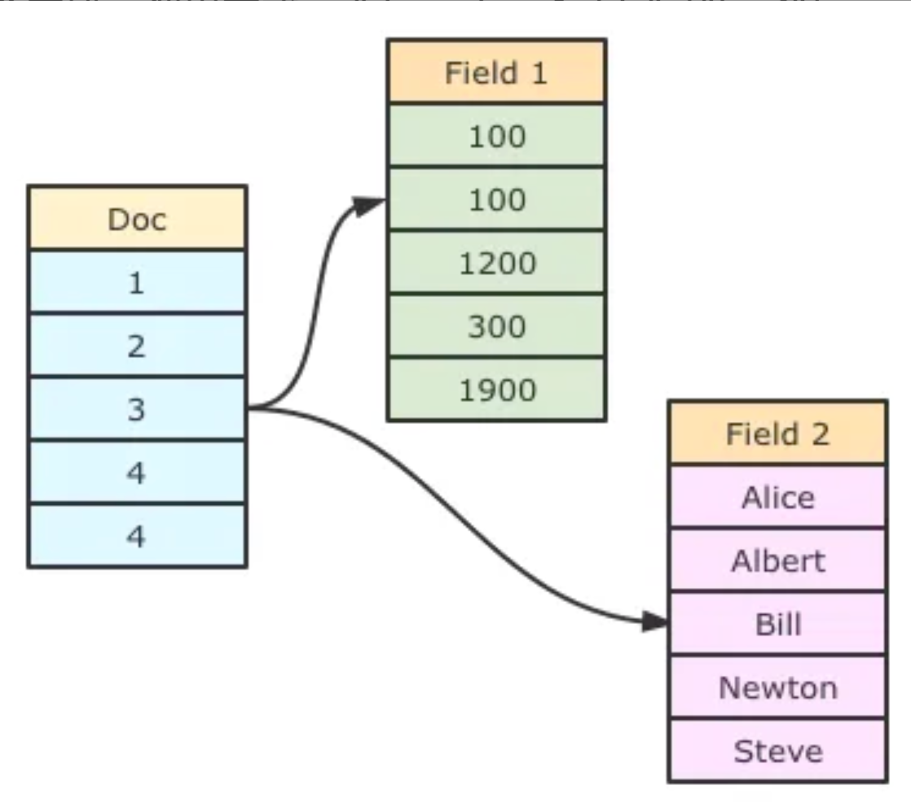

* 列存是针对特定字段的一种优化存储方式，主要用于加速某些类型的查询，如排序、聚合等。
* 在列存中，每个字段的所有值都被存储在一个连续的内存区域或磁盘块中，这使得对这些值的读取和比较变得非常高效。
* 列存不存储字段的原始文本值，而是存储经过处理的、适合快速访问的值。

3. **存储占比与开关接口**：

* 行存和列存在 ES 中的存储占比大致相当，各占约一半的存储空间。它们是用户数据存储的主要部分。
* ES 提供了 API 接口，允许用户根据需要开启或关闭行存和列存功能。这为用户提供了灵活的存储管理选项，可以根据实际业务需求和性能考虑进行调整。

总之，Elasticsearch 通过结合索引、行存（_source）和列存（doc_value）等多种存储策略，实现了高效且灵活的数据检索和管理能力。

#### 行存列存示例

假设我们有一个在线书店的应用，其中包含了大量的书籍信息，每本书都有标题、作者、出版日期、价格等字段。我们希望能够在用户搜索书籍时快速返回相关书籍的详细信息，并且能够对书籍的价格进行排序。

在这个场景中，我们可以使用 Elasticsearch 来存储和管理书籍信息。以下是使用行存和列存的示例：

1. **索引创建**：首先，我们需要创建一个索引来存储书籍信息。在创建索引时，我们可以指定字段的类型和分析器，以便更好地支持搜索。

```json
PUT /books
{
  "mappings": {
    "properties": {
      "title": {
        "type": "text",
        "analyzer": "standard"
      },
      "author": {
        "type": "keyword"
      },
      "publish_date": {
        "type": "date"
      },
      "price": {
        "type": "float"
      }
    }
  }
}
```

2. **行存（_source）**：默认情况下，Elasticsearch 会将整个文档的原始字段值存储在 `_source` 字段中。这意味着当我们查询书籍信息时，可以直接获取到完整的文档内容。这对于需要展示书籍详细信息的场景非常有用。

```json
GET /books/_search
{
  "query": {
    "match": {
      "title": "Elasticsearch"
    }
  }
}
```

上述查询将返回包含完整书籍信息的文档，包括标题、作者、出版日期和价格等字段。

3. **列存（Doc Values）**：为了加速对价格的排序操作，我们可以使用列存。在创建索引时，我们可以为 `price` 字段启用列存。

```json
PUT /books
{
  "mappings": {
    "properties": {
      ...
      "price": {
        "type": "float",
        "doc_values": true
      }
    }
  }
}
```

现在，当我们执行基于价格的排序操作时，Elasticsearch 将使用列存来提高性能。

```json
GET /books/_search
{
  "query": {
    "match_all": {}
  },
  "sort": [
    {
      "price": {
        "order": "asc"
      }
    }
  ]
}
```

通过结合行存和列存，我们可以在满足搜索需求的同时，提高查询性能和存储效率。在实际应用中，我们可以根据业务需求和性能要求灵活地调整这些存储策略。

### es索引生命周期

在ES中，索引数据的自动滚动和过期是两种管理索引数据的机制。

自动滚动：当一个索引中的数据量很大时，一次查询可能需要返回大量的结果（一次查询中的限制条件比较模糊时会出现这种情况），这会导致网络和内存资源的浪费。为了解决这个问题，ES提供了自动滚动机制。自动滚动允许将查询结果分成多个分片，每次只返回一部分结果，然后再逐步滚动到下一个分片，直到所有结果都被返回。这样可以减少网络和内存的负担，提高查询效率。

过期：当索引中的数据不再需要时，为了释放存储空间，可以将其标记为过期。过期的数据不会立即被删除，而是在后台定期进行清理。ES提供了TTL（Time to Live）机制，允许为索引中的每个文档设置过期时间。一旦文档过期，ES会自动删除它。这样可以避免索引数据占用过多的存储空间，同时也可以保护用户的隐私。

### Term

在ES中，term是一种查询方式，用于精确匹配某个字段的值。它是一种基于词项的查询方式，只会匹配精确的词项，不会进行分词处理。

具体来说，term查询会在指定的字段中查找与查询词完全匹配的文档，不会对查询词进行分词处理。例如，如果查询词是“apple”，那么只会匹配字段中包含“apple”的文档，而不会匹配包含“apples”或“apple pie”的文档。

term查询适用于需要精确匹配某个字段值的场景，例如匹配某个特定的ID或关键字。但是需要注意的是，由于term查询不进行分词处理，因此它不适用于文本搜索场景。在文本搜索场景中，通常需要使用match或phrase查询等方式，对查询词进行分词处理。

### Elasticsearch 的查询优化 “三十六计”

### 5.1 分片数，副本数，索引规模的合理评估


### 5.2 Mapping 的设计

Mapping的设计对于如何发挥ES的查询性能非常重要。ES 的Mapping 类似于传统关系型数据库的表结构定义。在ES 中，一旦一个字段被定义在了 mapping中，是无法被修改的（新增字段除外），所以一般我们需要修改索引的话，都会滚动或者重建索引，并采用 reindex 或logstach 来迁移数据。 为了高效发挥mapping 的性能并降低存储成本，介绍一些常见的使用技巧：

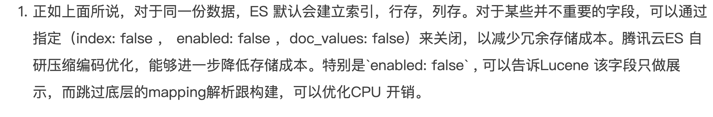

ES 默认对于数值字段建立BKDTree 索引，但是倒排索引能够最大发挥Lucene 的查询性能。所以对于有限枚举值的数值字段，也建议使用keyword 类型以创建倒排索引。

（火焰图大头都是BKD数值查询，这说明大量查询进了数值查询的分支，结合慢查询进行分析）

```sql
// 慢查询
questions/_search
{
	"from": 0,
	"size": 40,
	"query": {
		"bool": {
			"filter": [{
				"term": {
					"paperid": {
						"value": 8491342,
						"boost": 1.0
					}
				}
			}]
		}
	}
}
// mapping
 {.   ....
     "papered": {
           "type": "integer"       
       }
 }
```

paperid字段是 interger 是个数值，底层lucene会构建BKD数值索引，但是被当成term去查询，相对倒排索引而言查询会非常的低效。我们建议用户将这个字段采用keyword 类型，底层会构建倒排索引，term 查起来会十分高效。

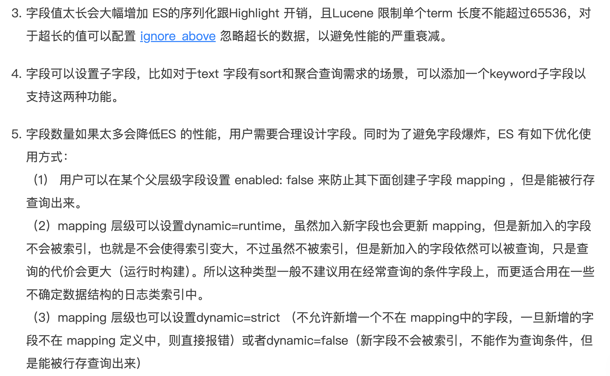

### 5.3 查询 Routing 路由优化

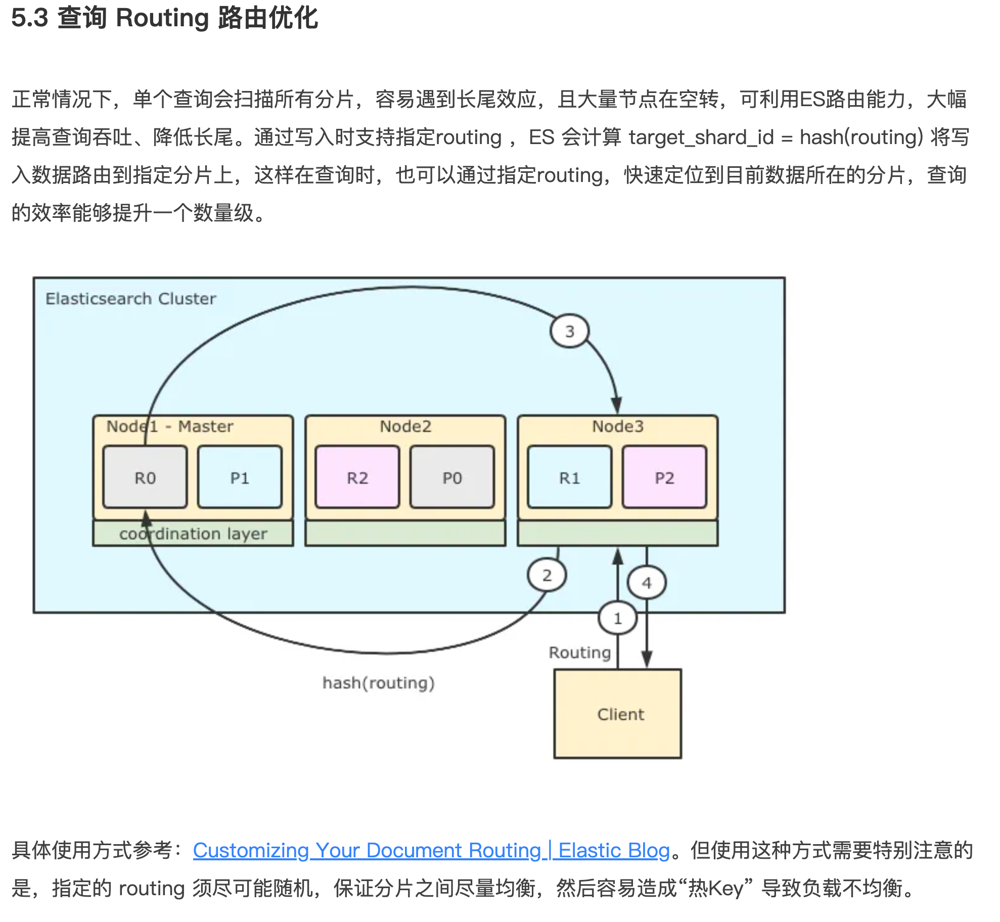

### 5.4 查询裁剪

1. **单个查询扫描所有分片**：在Elasticsearch中，数据被分布在多个分片（shards）上。当执行一个查询时，如果不对查询进行优化，系统可能需要扫描所有的分片来找到匹配的数据。这会导致查询性能下降，尤其是在分片数量较多的情况下。
2. **长尾效应**：长尾效应指的是查询响应时间的不均匀分布。在这种情况下，大部分查询很快返回结果，但少数查询需要花费很长时间，因为它们可能需要检查更多的分片或处理更多的数据。这种不均匀性会影响整体查询性能。

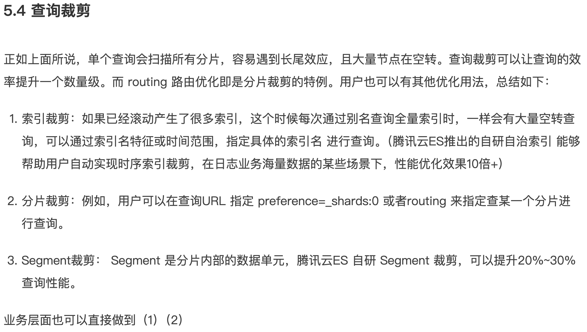

### 5.5 Index Sorting 优化

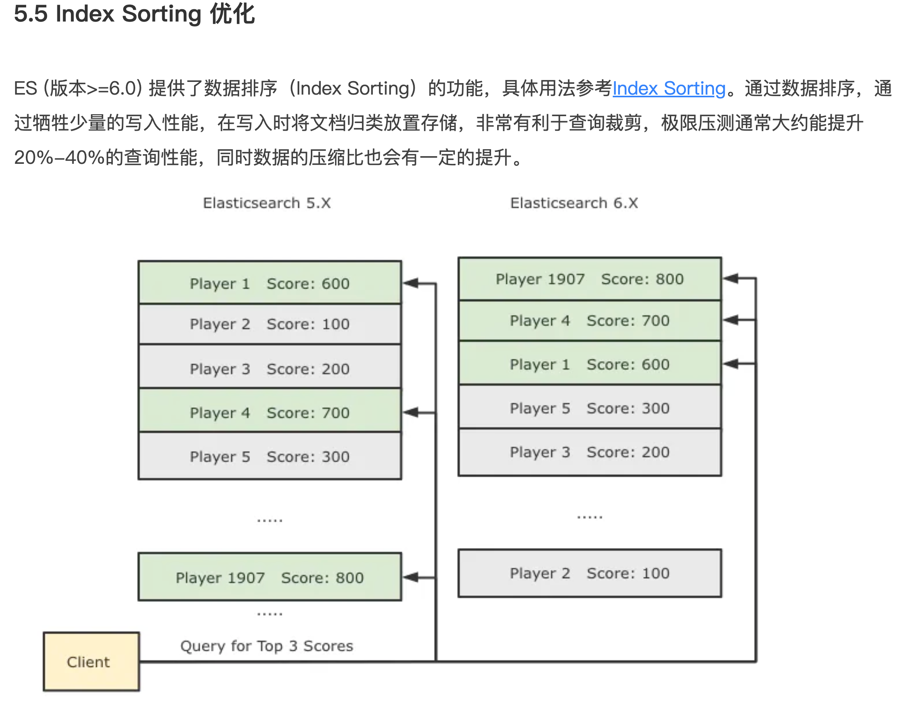

### 5.6 Fetch 字段性能优化：不同类型字段拉取性能优化对比

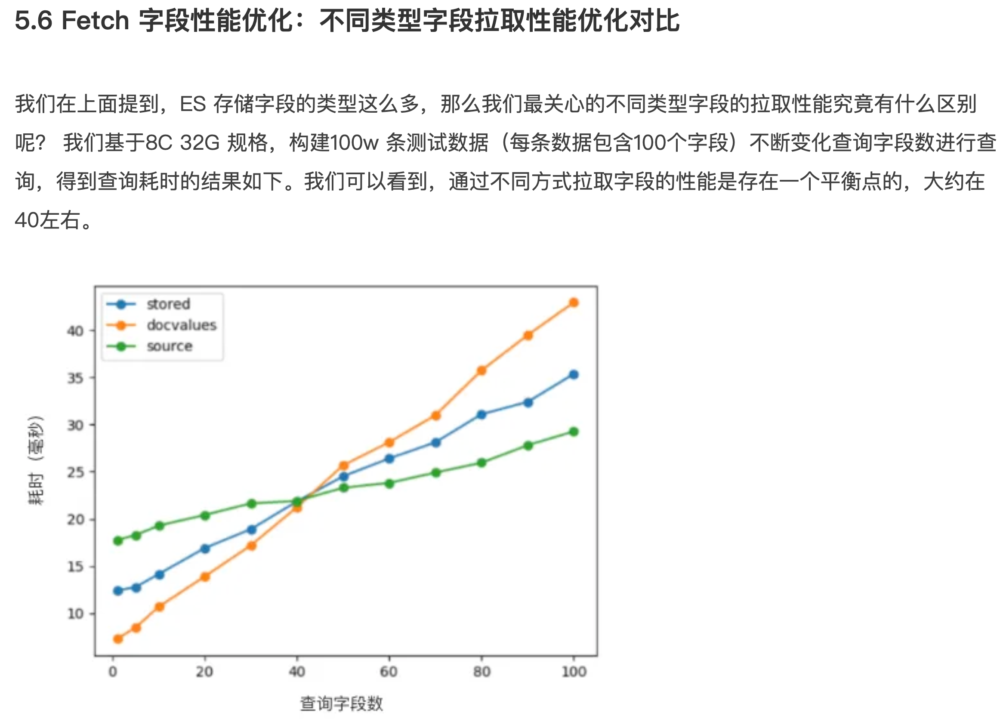

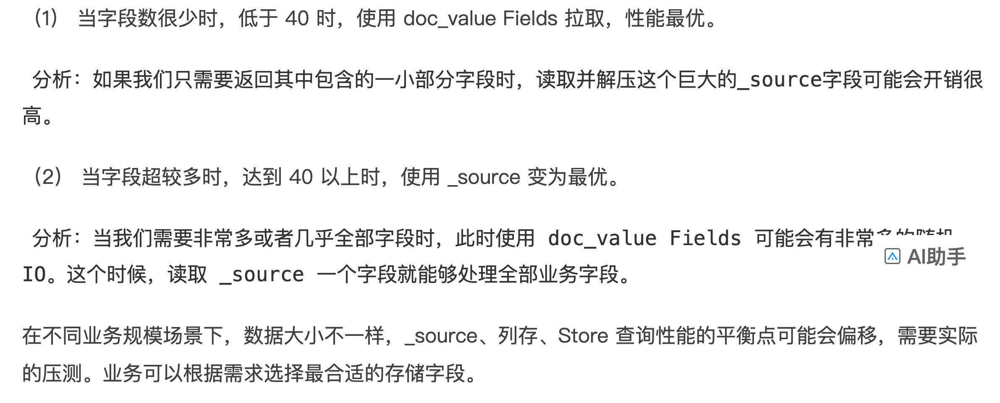

### 5.7 Merge 优化

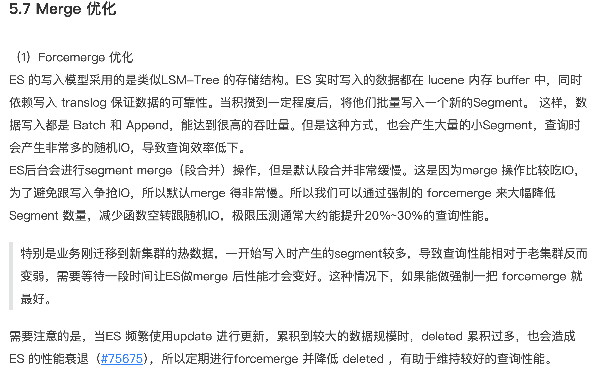

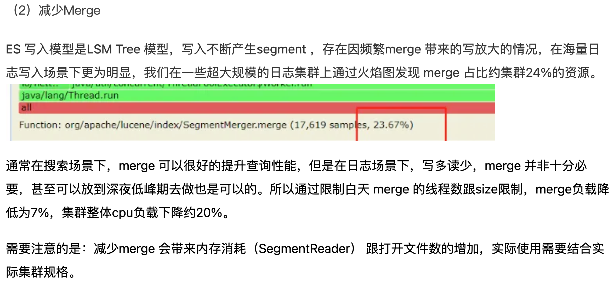

### ？5.8 如何用好缓存：ES 的缓存设计

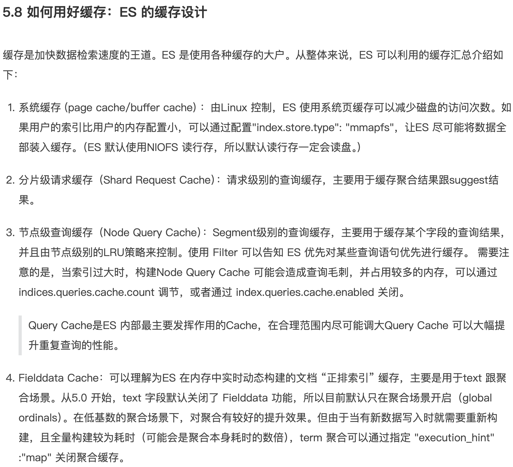


5.3 查询 Routing 路由优化

5.4 查询裁剪

5.5 Index Sorting 优化

5.6 Fetch 字段性能优化：不同类型字段拉取性能优化对比

5.7 Merge 优化

5.8 如何用好缓存：ES 的缓存设计

5.9 聚合优化

5.10 减少查询结果的序列化开销

5.11 批量从ES拉取数据的最佳方式

5.12 慢查询定位跟瓶颈分析工具

5.13 负载不均的优化

5.14 JDK&GC算法优化

5.15 K-NN向量检索加速

5.16 升级到最新版本

六、 结语

【腾讯云ES】让你的ES查询性能起飞：Elasticsearch 搜索场景优化攻略“一网打尽” 

热榜最高第8名

[boicehuang](https://km.woa.com/user/boicehuang)

2022-11-24 18:52

2338

18

181


AI摘要

## 一、 背景

Elasticsearch是一个基于Lucene库的开源搜索引擎，简称ES。腾讯联合 Elastic 公司在腾讯云上提供了内核增强版 ES 云服务，目前在腾讯内外部广泛应用于日志实时分析、结构化数据分析、全文检索等场景。海量规模、丰富的应用场景不断推动着腾讯云ES团队对原生ES进行持续的高可用、高性能、低成本等全方位的优化。 本文旨在介绍腾讯云ES 在优化查询性能之路上的探索历程，是对大量内外部客户不断优化实践的一个阶段性总结。本文会先从ES基本原理入手，在此基础上，从内核角度引导大家如何才能充分“压榨” ES 的查询性能。

## 二、Elasticsearch 的查询模型

我们首先来看下 ES 总体的查询模型。 ES 的任意节点可作为写入请求的协调节点，接收用户请求。协调节点将请求转发至对应一个或多个数据分片的主或者从分片进行查询，各个分片查询结果最后在协调节点汇聚，返回最终结果给客户端。


ES 的分布式查询主要有2个阶段，Query阶段跟Fetch阶段。

- Query 阶段：协调节点将查询拆分成多个分片任务，发送到数据分片上通过调用Lucene 执行查 “倒排索引”，查询满足条件的文档id集合。Query 内又可以细分为2个阶段，本质上是一个基于CBO的倒排合并过程：
  （1） 对查询语句进行拆解，预估每个子语句的匹配结果数量；
  （2） 对符合条件的最小结果集进行遍历，检查其是否匹配其他查询子语句，得到一个最终的结果集。
- Fetch 阶段：归并生成最终的检索、聚合结果。Fetch 也可以细分为以下2个阶段：
  （1）对Query 阶段的多个分片结果进行归并；
  （2）抓取用户需要的字段信息。
  如果只有一个分片，那ES 会将流程合并为 QueryAndFetch 一个阶段。

## 三、 Elasticsearch 的索引设计

ES的底层是Lucene，可以说Lucene的查询性能就决定了ES的查询性能。Lucene内最核心的倒排索引，本质上就是Term到所有包含该Term的文档的DocId列表的映射。ES 默认会对写入的数据都建立索引，并且常驻内存，主要采用了以下几种数据结构：

1. 倒排索引：保存了每个term对应的docId的列表，采用skipList的结构保存，用于快速跳跃。
2. FST（Finite State Transducer）：原理上可以理解为前缀树，用于保存term字典的二级索引，用于加速查询，可以在FST上实现单Term、Term范围、Term前缀和通配符查询等。内部结构如下：
   
3. BKD-Tree：BKD-Tree是一种保存多维空间点的数据结构，主要用于数值类型(包括空间点)的快速查找。

## 四、 Elasticsearch 的字段存储

除了索引外，ES 同时提供了行存（stored fields ， _source）、列存（doc_value）来进行业务字段的存储，并提供了开启跟关闭的接口。行存跟列存各自约占一半的存储，是用户存储的大头。

1. Stored Fields ：类似于MySQL 的行存，按行存储，主要用于字段值的展示，例如Kibana 。
   （1） ES内置元数据字段（_index,_id,_score等等）默认开启store。
   （2） 所有业务字段默认关闭store，但业务字段的store 都会被存到 _source。
   （3）默认通过 index.codec 压缩算法进行压缩。查询时需要解压。
   （4）内部结构：
   
2. _source Field ： 是Stored Fields 中的一个特殊的超大字段，包含该条文档输入时的所有业务字段的原始值。
   （1）大部分特性同 Stored Fields。
   （2）_source 字段是该行中的第一个存储字段。优先读取。
3. doc_value Fields：类似于大数据场景中的列存，按列存储，主要用于聚合跟排序等分析场景。
   （1） 不同文档的相同字段的值一起连续存储在内存中，默认不通过压缩算法压缩。可以“几乎”直接访问某个文档的某个字段。调用方式： "docvalue_fields": ["tag1"]。
   （2） 数据被编码后，精度跟格式可能会发生变化。
   （3）非text 默认开启doc_value。text 字段无法直接开启 doc_value。
   （4） 内部结构：如下图，列式存储很容易通过字典编码跟偏移量压缩。
   

## 五、 Elasticsearch 的查询优化 “三十六计”

### 5.1 分片数，副本数，索引规模的合理评估

ES (版本>=6.6) 提供了索引生命周期管理功能。索引生命周期管理可以通过 API 或者 kibana 界面配置，详情可参考 [index-lifecycle-management](https://www.elastic.co/guide/en/elasticsearch/reference/6.6/index-lifecycle-management.html#index-lifecycle-management)。使用索引生命周期管理，可以实现索引数据的自动滚动跟过期，并结合冷热分离架构进行数据的降冷跟删除。 为了让分片查询性能发挥到最优，需要对规模进行限制，我们通常有以下使用原则：

1. 集群总分片数建议控制在5w以内，单个索引的规模控制在 1TB 以内，单个分片大小控制在30 ~ 50GB ，docs数控制在10亿内，如果超过建议滚动；
2. 分片的数量通常建议小于或等于ES 的数据节点数量，最大不超过总节点数的2倍，通过增加分片数可以提升并发，如果负载用上不去，可以适当的增加分片；
3. 每个业务查询都会拆分成多个分片小请求，分片数越多，长尾效应越明显，所以分片数并不是越多越好，在搜索场景合理控制分片数也可以提升性能。

增加副本数，也可以分摊查询的负载，提升查询的性能。
考虑到用户自我管理分片容易考虑不周全，腾讯云ES推出的[自研自治索引](https://cloud.tencent.com/document/product/845/74396)，作为一站式索引全托管解决方案，提供分片自动调优、滚动周期动态调整、查询裁剪、故障自动修复、索引生命周期管理等功能。可在降低运维与管理成本的同时，提高使用效率与读写性能。以后大家可以不用为索引生命周期管理、分片动态调整等操作烦恼了。

### 5.2 Mapping 的设计

Mapping的设计对于如何发挥ES的查询性能非常重要。ES 的Mapping 类似于传统关系型数据库的表结构定义。在ES 中，一旦一个字段被定义在了 mapping中，是无法被修改的（新增字段除外），所以一般我们需要修改索引的话，都会滚动或者重建索引，并采用 reindex 或logstach 来迁移数据。 为了高效发挥mapping 的性能并降低存储成本，介绍一些常见的使用技巧：

1. 正如上面所说，对于同一份数据，ES 默认会建立索引，行存，列存。对于某些并不重要的字段，可以通过指定（index: false ， enabled: false ，doc_values: false）来关闭，以减少冗余存储成本。腾讯云ES 自研压缩编码优化，能够进一步降低存储成本。特别是`enabled: false` , 可以告诉Lucene 该字段只做展示，而跳过底层的mapping解析跟构建，可以优化CPU 开销。

2. ES 默认对于数值字段建立BKDTree 索引，但是倒排索引能够最大发挥Lucene 的查询性能。所以对于有限枚举值的数值字段，也建议使用keyword 类型以创建倒排索引。举一个例子，我们在线上集群分析高负载节点的CPU火焰图如下：

   （火焰图大头都是BKD数值查询，这说明大量查询进了数值查询的分支，结合慢查询进行分析）

   ```json
   // 慢查询
   questions/_search
   {
   	"from": 0,
   	"size": 40,
   	"query": {
   		"bool": {
   			"filter": [{
   				"term": {
   					"paperid": {
   						"value": 8491342,
   						"boost": 1.0
   					}
   				}
   			}]
   		}
   	}
   }
   // mapping
    {.   ....
        "papered": {
              "type": "integer"       
          }
    } 
   ```

   paperid字段是 interger 是个数值，底层lucene会构建BKD数值索引，但是被当成term去查询，相对倒排索引而言查询会非常的低效。我们建议用户将这个字段采用keyword 类型，底层会构建倒排索引，term 查起来会十分高效。

3. 字段值太长会大幅增加 ES的序列化跟Highlight 开销，且Lucene 限制单个term 长度不能超过65536，对于超长的值可以配置 [ignore_above](https://www.elastic.co/guide/en/elasticsearch/reference/current/ignore-above.html) 忽略超长的数据，以避免性能的严重衰减。

4. 字段可以设置子字段，比如对于text 字段有sort和聚合查询需求的场景，可以添加一个keyword子字段以支持这两种功能。

5. 字段数量如果太多会降低ES 的性能，用户需要合理设计字段。同时为了避免字段爆炸，ES 有如下优化使用方式：
   （1） 用户可以在某个父层级字段设置 enabled: false 来防止其下面创建子字段 mapping ，但是能被行存查询出来。
   （2）mapping 层级可以设置dynamic=runtime，虽然加入新字段也会更新 mapping，但是新加入的字段不会被索引，也就是不会使得索引变大，不过虽然不被索引，但是新加入的字段依然可以被查询，只是查询的代价会更大（运行时构建）。所以这种类型一般不建议用在经常查询的条件字段上，而更适合用在一些不确定数据结构的日志类索引中。
   （3）mapping 层级也可以设置dynamic=strict （不允许新增一个不在 mapping中的字段，一旦新增的字段不在 mapping 定义中，则直接报错）或者dynamic=false（新字段不会被索引，不能作为查询条件，但是能被行存查询出来）

### 5.3 查询 Routing 路由优化

正常情况下，单个查询会扫描所有分片，容易遇到长尾效应，且大量节点在空转，可利用ES路由能力，大幅提高查询吞吐、降低长尾。通过写入时支持指定routing ，ES 会计算 target_shard_id = hash(routing) 将写入数据路由到指定分片上，这样在查询时，也可以通过指定routing，快速定位到目前数据所在的分片，查询的效率能够提升一个数量级。


具体使用方式参考：[Customizing Your Document Routing | Elastic Blog](https://www.elastic.co/cn/blog/customizing-your-document-routing)。但使用这种方式需要特别注意的是，指定的 routing 须尽可能随机，保证分片之间尽量均衡，然后容易造成“热Key” 导致负载不均衡。

### 5.4 查询裁剪

正如上面所说，单个查询会扫描所有分片，容易遇到长尾效应，且大量节点在空转。查询裁剪可以让查询的效率提升一个数量级。而 routing 路由优化即是分片裁剪的特例。用户也可以有其他优化用法，总结如下：

1. 索引裁剪：如果已经滚动产生了很多索引，这个时候每次通过别名查询全量索引时，一样会有大量空转查询，可以通过索引名特征或时间范围，指定具体的索引名 进行查询。（腾讯云ES推出的自研自治索引 能够帮助用户自动实现时序索引裁剪，在日志业务海量数据的某些场景下，性能优化效果10倍+）
2. 分片裁剪：例如，用户可以在查询URL 指定 preference=_shards:0 或者routing 来指定查某一个分片进行查询。
3. Segment裁剪： Segment 是分片内部的数据单元，腾讯云ES 自研 Segment 裁剪，可以提升20%~30%查询性能。

业务层面也可以直接做到（1）（2）

### 5.5 Index Sorting 优化

ES (版本>=6.0) 提供了数据排序（Index Sorting）的功能，具体用法参考[Index Sorting](https://www.elastic.co/guide/en/elasticsearch/reference/current/index-modules-index-sorting.html)。通过数据排序，通过牺牲少量的写入性能，在写入时将文档归类放置存储，非常有利于查询裁剪，极限压测通常大约能提升 20%-40%的查询性能，同时数据的压缩比也会有一定的提升。 

### 5.6 Fetch 字段性能优化：不同类型字段拉取性能优化对比

我们在上面提到，ES 存储字段的类型这么多，那么我们最关心的不同类型字段的拉取性能究竟有什么区别呢？ 我们基于8C 32G 规格，构建100w 条测试数据（每条数据包含100个字段）不断变化查询字段数进行查询，得到查询耗时的结果如下。我们可以看到，通过不同方式拉取字段的性能是存在一个平衡点的，大约在40左右。


（1） 当字段数很少时，低于 40 时，使用 doc_value Fields 拉取，性能最优。

```
分析：如果我们只需要返回其中包含的一小部分字段时，读取并解压这个巨大的_source字段可能会开销很高。
```

（2） 当字段超较多时，达到 40 以上时，使用 _source 变为最优。

```
分析：当我们需要非常多或者几乎全部字段时，此时使用 doc_value Fields 可能会有非常多的随机IO。这个时候，读取 _source 一个字段就能够处理全部业务字段。
```

在不同业务规模场景下，数据大小不一样，_source、列存、Store 查询性能的平衡点可能会偏移，需要实际的压测。业务可以根据需求选择最合适的存储字段。

### 5.7 Merge 优化

（1）Forcemerge 优化
ES 的写入模型采用的是类似LSM-Tree 的存储结构。ES 实时写入的数据都在 lucene 内存 buffer 中，同时依赖写入 translog 保证数据的可靠性。当积攒到一定程度后，将他们批量写入一个新的Segment。 这样，数据写入都是 Batch 和 Append，能达到很高的吞吐量。但是这种方式，也会产生大量的小Segment，查询时会产生非常多的随机IO，导致查询效率低下。
ES后台会进行segment merge（段合并）操作，但是默认段合并非常缓慢。这是因为merge 操作比较吃IO，为了避免跟写入争抢IO，所以默认merge 得非常慢。所以我们可以通过强制的 forcemerge 来大幅降低Segment 数量，减少函数空转跟随机IO，极限压测通常大约能提升20%~30%的查询性能。

特别是业务刚迁移到新集群的热数据，一开始写入时产生的segment较多，导致查询性能相对于老集群反而变弱，需要等待一段时间让ES做merge 后性能才会变好。这种情况下，如果能做强制一把 forcemerge 就最好。

需要注意的是，当ES 频繁使用update 进行更新，累积到较大的数据规模时，deleted 累积过多，也会造成ES 的性能衰退（[#75675](https://github.com/elastic/elasticsearch/issues/75675)），所以定期进行forcemerge 并降低 deleted ，有助于维持较好的查询性能。

（2）减少Merge

ES 写入模型是LSM Tree 模型，写入不断产生segment ，存在因频繁merge 带来的写放大的情况，在海量日志写入场景下更为明显，我们在一些超大规模的日志集群上通过火焰图发现 merge 占比约集群24%的资源。

通常在搜索场景下，merge 可以很好的提升查询性能，但是在日志场景下，写多读少，merge 并非十分必要，甚至可以放到深夜低峰期去做也是可以的。所以通过限制白天 merge 的线程数跟size限制，merge负载降低为7%，集群整体cpu负载下降约20%。

需要注意的是：减少merge 会带来内存消耗（SegmentReader） 跟打开文件数的增加，实际使用需要结合实际集群规格。

### 5.8 如何用好缓存：ES 的缓存设计

缓存是加快数据检索速度的王道。ES 是使用各种缓存的大户。从整体来说，ES 可以利用的缓存汇总介绍如下：

1. 系统缓存 (page cache/buffer cache) ：由Linux 控制，ES 使用系统页缓存可以减少磁盘的访问次数。如果用户的索引比用户的内存配置小，可以通过配置"index.store.type": "mmapfs"，让ES 尽可能将数据全部装入缓存。（ES 默认使用NIOFS 读行存，所以默认读行存一定会读盘。）

2. 分片级请求缓存（Shard Request Cache）：请求级别的查询缓存，主要用于缓存聚合结果跟suggest结果。

3. 节点级查询缓存（Node Query Cache）：Segment级别的查询缓存，主要用于缓存某个字段的查询结果，并且由节点级别的LRU策略来控制。使用 Filter 可以告知 ES 优先对某些查询语句优先进行缓存。 需要注意的是，当索引过大时，构建Node Query Cache 可能会造成查询毛刺，并占用较多的内存，可以通过 indices.queries.cache.count 调节，或者通过 index.queries.cache.enabled 关闭。

   Query Cache是ES 内部最主要发挥作用的Cache，在合理范围内尽可能调大Query Cache 可以大幅提升重复查询的性能。

4. Fielddata Cache：可以理解为ES 在内存中实时动态构建的文档 “正排索引” 缓存，主要是用于text 跟聚合场景。从5.0 开始，text 字段默认关闭了 Fielddata 功能，所以目前默认只在聚合场景开启（global ordinals）。在低基数的聚合场景下，对聚合有较好的提升效果。但由于当有新数据写入时就需要重新构建，且全量构建较为耗时（可能会是聚合本身耗时的数倍），term 聚合可以通过指定 "execution_hint" :"map" 关闭聚合缓存。

### 5.9 聚合优化

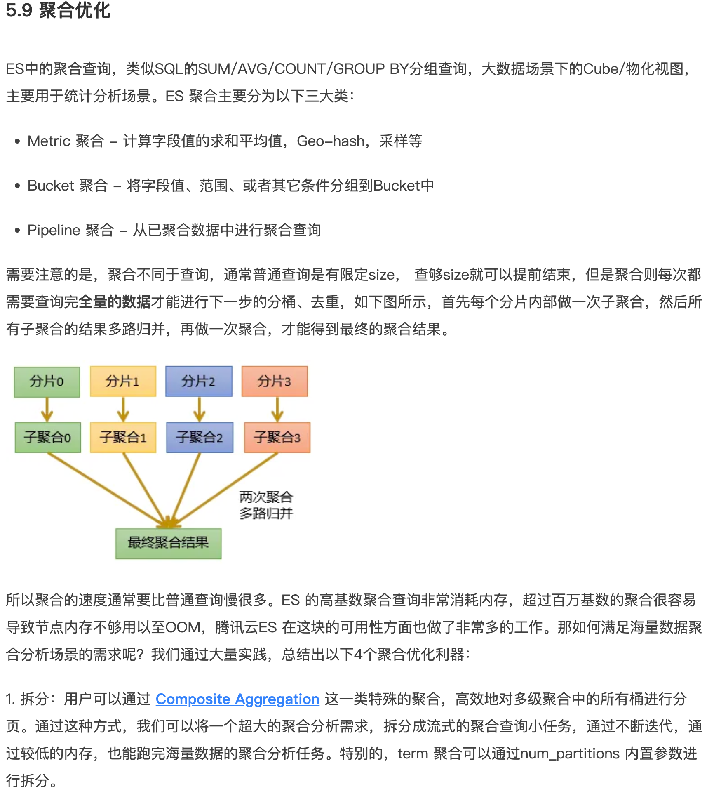

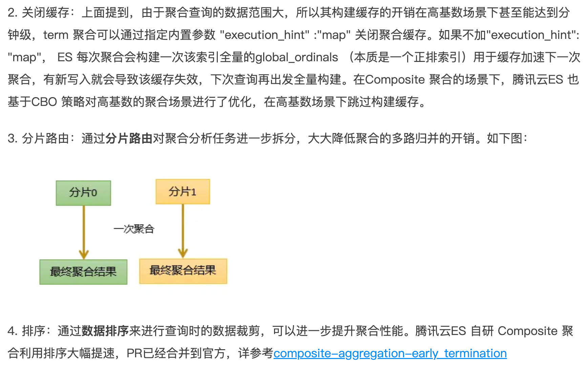

### 5.10 减少查询结果的序列化开销

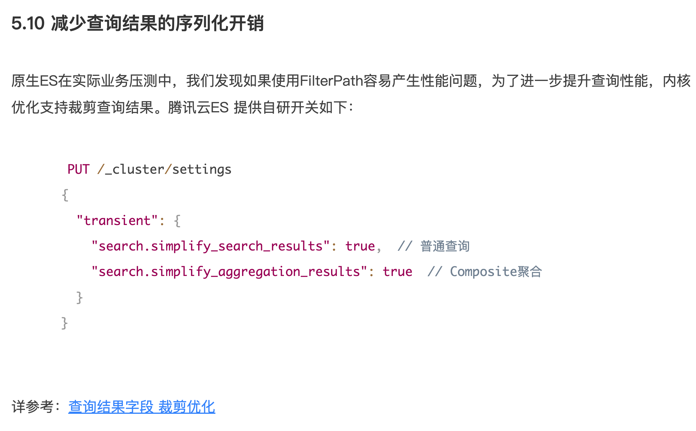

### 5.11 批量从ES拉取数据的最佳方式

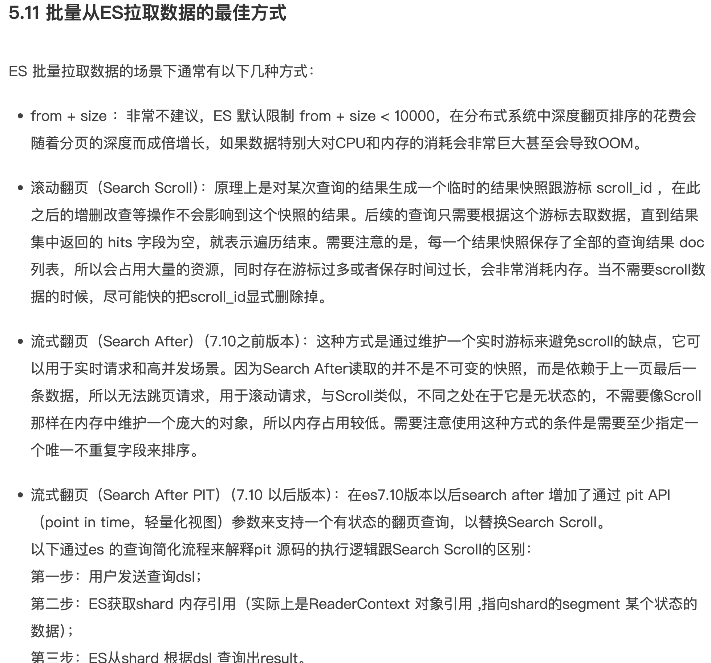

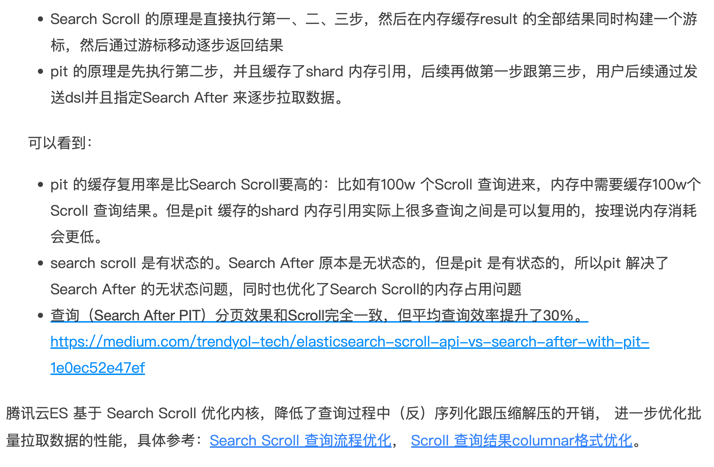

### 5.12 慢查询定位跟瓶颈分析工具

当我们需要针对性的对业务的查询场景进行分析，定位性能瓶颈时，我们首先需要读懂监控，跟慢日志。

1. 首先需要关注的是CPU 使用率，内存使用率以及 磁盘IO Util ，当其中一项达到瓶颈，查询性能就可能上不去了。
2. 其次需要关注是否有长耗时的查询任务 跟查询拒绝率，当这些指标出现异常时，说明大概率出现了大查询，导致查询线程池长期被占用，需要分析大查询并进行优化。
3. 通过慢日志，我们可以针对性的对大查询进行针对性的 profile 分析跟优化，配置方式参考[Elasticsearch 中的慢日志](https://cloud.tencent.com/developer/article/1733497)。
4. ES 自身也提供了一些接口，可以查看节点执行查询的一些状态：
   - profile：统计单个查询任务每个阶段的耗时；
   - _nodes/stats：节点统计信息，包括线程池、Cache 使用情况；
   - _tasks：节点活跃任务信息，可以看到集群当前正在处理的查询任务并进行分析；
   - _nodes/hot_threads：节点热点堆栈，用于分析热点，也可以使用 Jstack，火焰图。

### 5.13 负载不均的优化

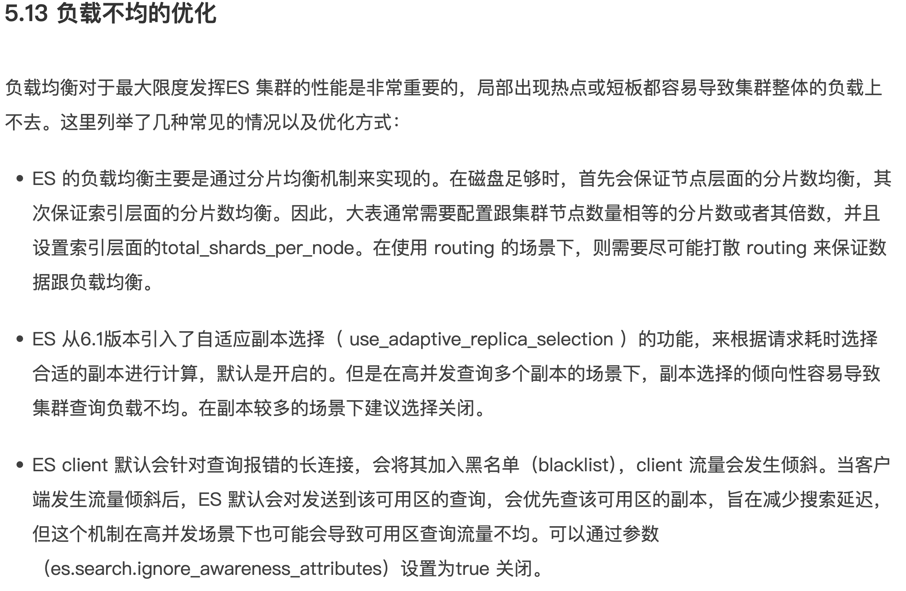

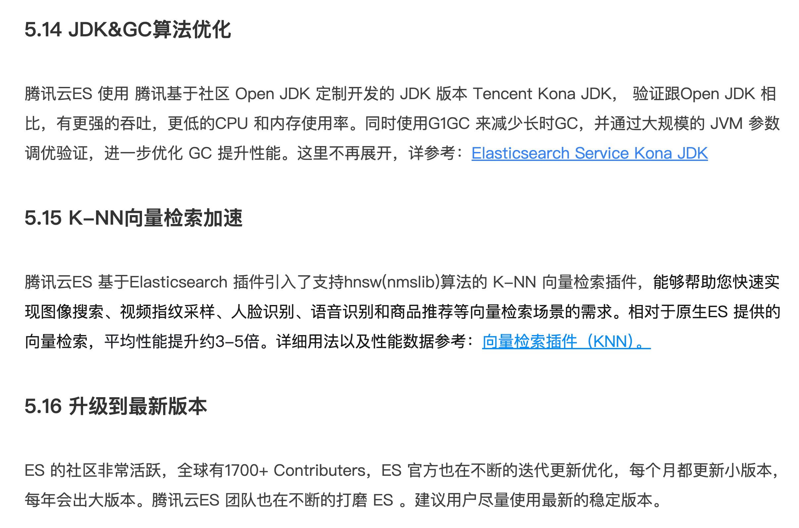

