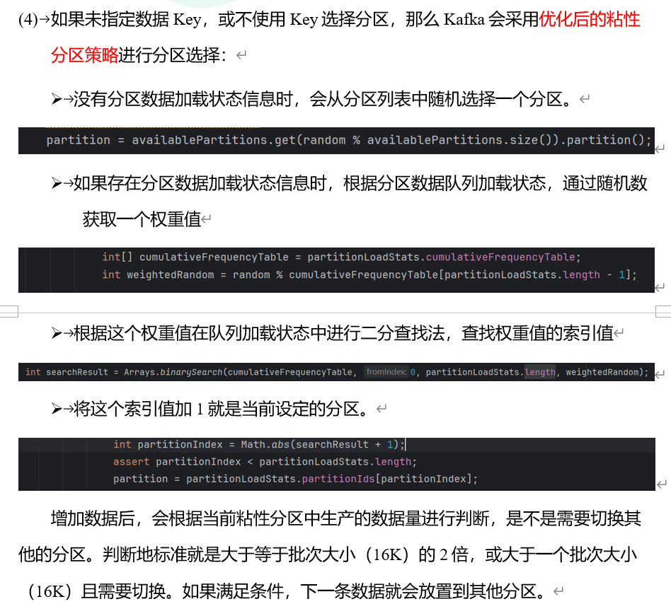
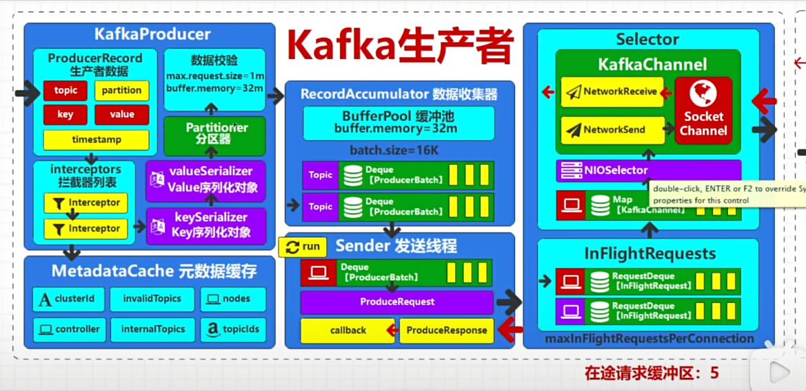
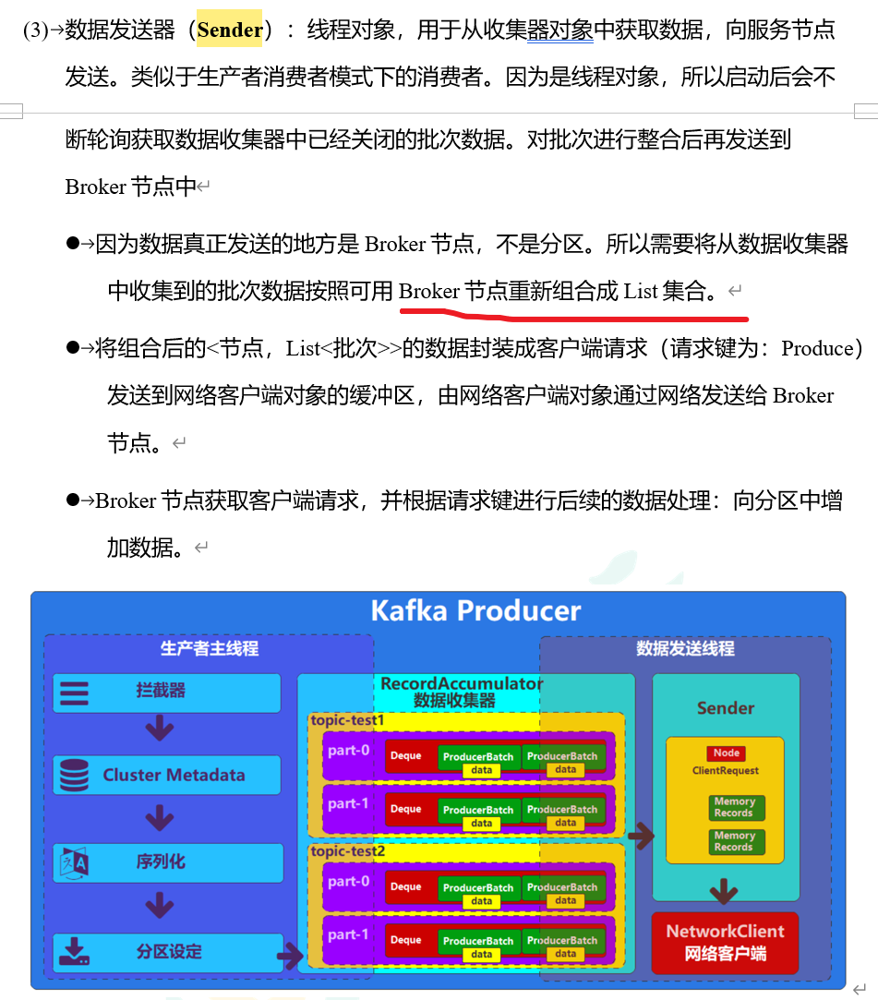
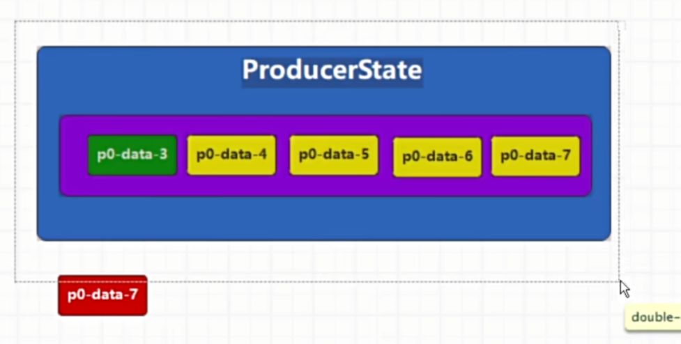

## Kafka

### 基本概念

Kafka的基本概念：Broker、Topic、Partition、副本Replication、副本类型Leader/Follower。Zookeeper的作用。

- 可以用数据库分库分表的逻辑理解上面的概念。当查询/写入请求并发太大时，一台机器的网络IO和CPU处理不过来，这时要多加机器，把请求分发到不同的机子上，避免太多请求把数据库打挂（数据分库），在Kafka上就是创建多个Broker分流Producer的写入请求和Consumer的查询请求。

- Kafka是发布-订阅模式，分布式消息系统的常用架构，如果有了解机器人的ROS系统，那么这个就比较好理解。依然类比数据库的概念，所有数据写入一张表（Topic），表太大时需要分表，在Kafka中就是创建多个Partition，把一个Topic中的数据均匀的分散到每个Partition上。但是，注意：一个Broker上的某一Topic只能有一个对应的Partition（仅指Leader写入，和副本管理区别开），这点和数据库中的概念不一样。

- 副本Replication指的是Partition的备份，别因为Broker宕机数据丢了。每个Partition的副本数量可以自己设置，但不超过Broker的数量。Patition的Leader副本（只有Leader能写入）和Follower副本不在一个Broker上，要不然Broker宕机副本也丢了。

- Zookeeper帮助Kafka实现Broker的主从架构。在Kafka集群中，要选定一个Broker当主节点（Controller节点），这里涉及到Controller选举算法（八股）。

- 主Broker的作用是：①发挥主从架构中的Master节点的作用，监听Broker的增减；②管理Topic，新增/更新/删除Topic；②管理Partition，分区重新分配（负载均衡）；③副本管理，通知副本同步情况、副本的Leader选举、副本分布在哪个Broker上。

### 默认副本分配策略

Apache Kafka 使用一种称为“范围分区副本分配策略”（Range Partition Replication Strategy）作为其默认的副本分配策略。这种策略确保了数据的均衡分布以及副本在不同节点之间的分散。

当一个主题（Topic）被创建时，每个分区（Partition）的主副本（Leader Replica）和从副本（Follower Replica）都会按照一定的规则分布在不同的broker上。Kafka 采用以下步骤来分配副本：

1. **第一个副本**（通常是主副本Leader）被放置在一个随机选择的broker上。
2. **第二个副本**被放置在与第一个副本不同的broker上，并且这个broker是集群中剩余broker中ID最小的那个。
3. **第三个副本**被放置在剩余broker中ID最小的那个，以此类推，直到达到所需的副本因子（Replication Factor）。

例如，如果一个主题有三个分区，每个分区需要两个副本，并且集群中有三个broker，则副本将按如下方式分布：

- 分区0: 第一个副本位于Broker A，第二个副本位于Broker B。
- 分区1: 第一个副本位于Broker B，第二个副本位于Broker C。
- 分区2: 第一个副本位于Broker C，第二个副本位于Broker A。

这样可以确保即使某个broker失败，数据仍然可用，并且负载可以在所有broker之间均匀分布。如果需要更改副本分配策略，可以通过配置或使用管理工具进行调整。

### 生产者分区器

- 自己指定分区号，但是kafka不做校验

- 重写分区器里的获取分区号的方法

- 有消息Key时，对Key采用默认的murmur2算法，算key的hash值，然后对分区总数取模得到分区号

- 否则不知道发送到哪个分区（未知分区）

  

### 生产者-Sender发送线程

Sender线程读取数据收集器（主线程放到这里的）中的数据发送：

不按照Topic-Partition的方式直接发送，考虑到网络传输效率问题，把在同一个Broker上的不同Topic的所有消息包装成一个批次统一发送。

### 生产者确定数据正确发送

异步发送：不管sender线程发送是否成功，只要数据收集器中有数据，就连续发送。（2.4.3.3异步发送）

同步发送：sender成功发送的kafka中，并且收到响应后再继续发送。（2.4.3.4同步发送）

### ACKS数据接收应答机制（消息可靠性）

2.4.5 消息可靠性

- ack = 0，sender发送到network client就响应，不保证数据被写入到Broker
- ack = 1，写入到leader副本响应，不保证Broker宕机数据可靠性
- ack = -1，待同步的副本全部同步完成后响应，保证数据可靠性

数据吞吐量随着下降。

### 数据重复和乱序的原因和原理

2.4.6 消息去重 & 有序

幂等性操作的要求：ack=1、开启重试机制、在途请求缓冲区的数据不能超过5。

幂等性只能对同一个分区起作用。

Broker里有一个保存生产者生产数据的分区状态，里面保存了5条数据，每次来数据都会比较新数据和生产者状态区中的5条信息做比对，重复或者顺序不对就重发。

一条record由（生产者id-数据-序列号）确定，但是当生产者重启后，生产者id会发生变化，此时都是同一条数据但是生产者id不同，仍然会出现消息重复。Kafka无法保证跨分区的幂等，但可以通过事务实现多会话的幂等（同一个生产者重启）。

### 幂等操作-数据事务

生产者在生产数据时，设置一个生产者id，那么通过事务操作，生产者每次重启，自动生成的id是保持不边的。

分布式事务，采用两阶段提交的模式：①Producer向Broker的事务协调器提交事务（预提交）；②事务协调器向Leader副本发送数据marker，通知Broker数据已提交（已提交）。

只保证数据的最终一致性，不保证数据的中间一致性。

