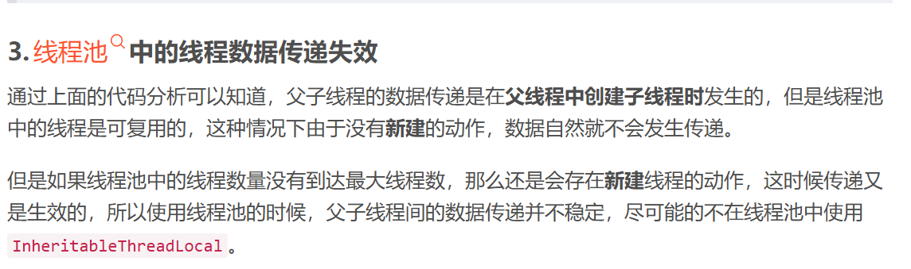

## ThreadLocal

https://xiaolincoding.com/interview/juc.html#threadlocal%E4%BD%9C%E7%94%A8-%E5%8E%9F%E7%90%86-%E5%85%B7%E4%BD%93%E9%87%8C%E9%9D%A2%E5%AD%98%E7%9A%84key-value%E6%98%AF%E5%95%A5-%E4%BC%9A%E6%9C%89%E4%BB%80%E4%B9%88%E9%97%AE%E9%A2%98-%E5%A6%82%E4%BD%95%E8%A7%A3%E5%86%B3

### 父子线程之间怎么传数据

https://blog.csdn.net/qq_38249409/article/details/114300384

使用 InheritableThreadLocal

### 线程池父子线程传递数据失效

