### spring相关面试题

### Spring AOP是如何实现的？它和AspectJ有什么区别？

https://www.bilibili.com/video/BV1bH4y1D7Qv/?spm_id_from=333.999.0.0&vd_source=011a8ef55e4c6f234efbc95d85340fc1

  

### jdk动态代理和cglib代理

区别：是否实现一个接口

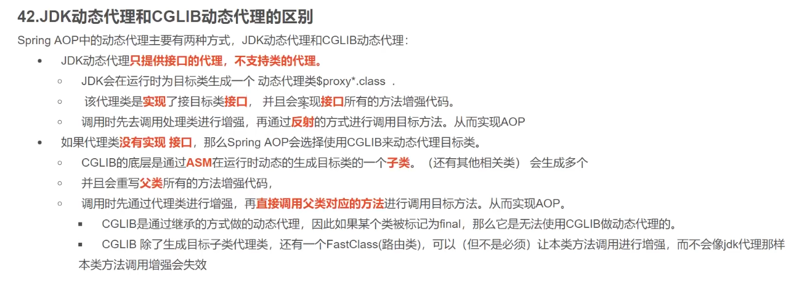

参考：https://blog.csdn.net/weixin_43935152/article/details/130514814

例子：sboot2/com.example.learn/proxy

### 循环依赖和三级缓存

https://www.cnblogs.com/daimzh/p/13256413.html

https://www.bilibili.com/video/BV18W421c7jo

#### 循环依赖的原因

教程：[[bilibili](https://www.bilibili.com/video/BV18W421c7jo/?spm_id_from=333.999.0.0&vd_source=011a8ef55e4c6f234efbc95d85340fc1)]26:09左右。

循环依赖的原因是发生在属性注入的时候。一个对象实例化完成后，接着要注入属性，比如A.b，但此时B在==单例池（一级缓存）==中还没有，这时会去创建B，而到属性注入时，B.a的A在单例池中也没有，就会递归创建，出现循环依赖。

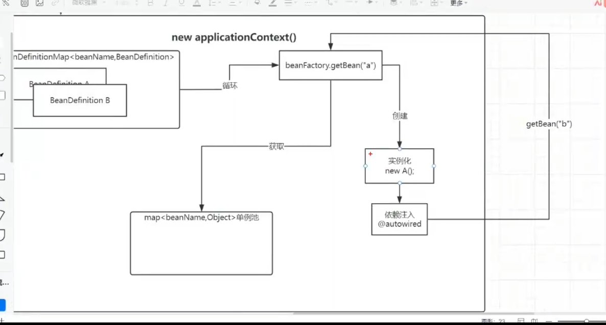

ioc创建bean的流程：

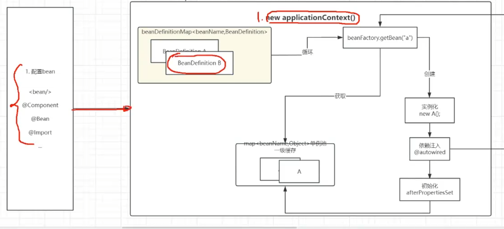

spring的动态代理对象是在Bean初始化完成之后创建的。

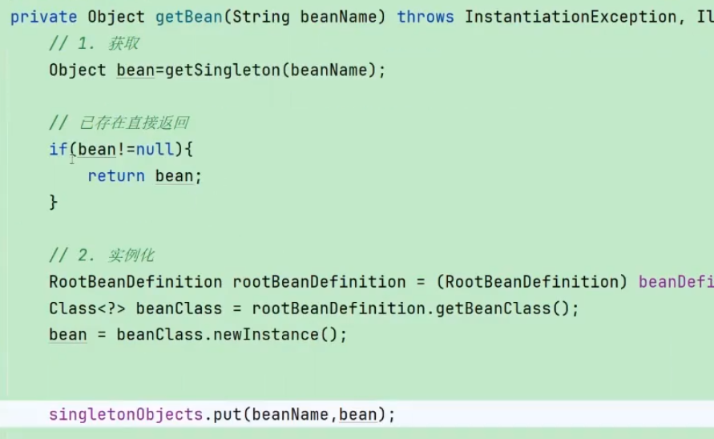

线程并发情况下，会出现线程安全问题：如果把一级缓存加在实例化bean之后，两个线程中会有一个B.a=null，其中的a是不完整的对象，这时出现了线程安全问题。

#### 二级缓存（临时缓存）

教程：[[b站](https://www.bilibili.com/video/BV18W421c7jo/?spm_id_from=333.999.0.0&vd_source=011a8ef55e4c6f234efbc95d85340fc1)]56:10左右

为了防止上述出现的线程安全问题，如果对一级缓存加锁，那么问题就可以解决：

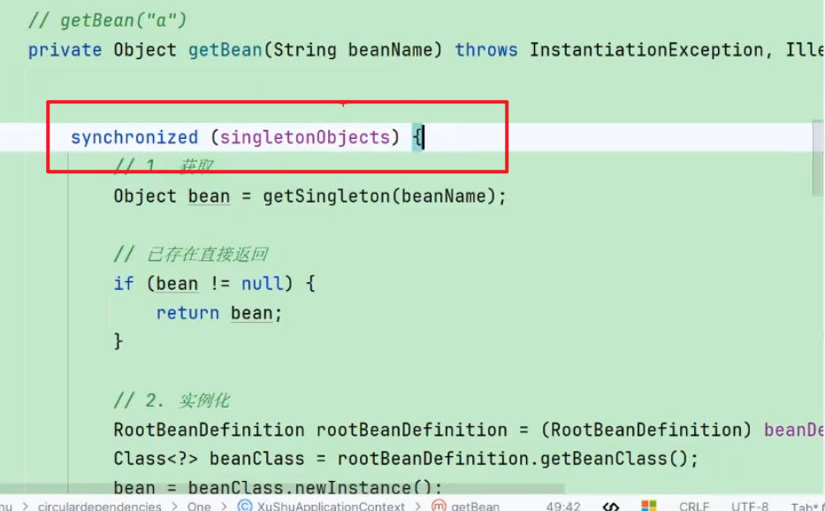

但是在这里，锁的粒度太大了，会阻塞获取已经创建好的Bean的线程。所以不让一级缓存参与到实例化的过程中，新建一个二级缓存，专门用来存示例化之后的bean，一级缓存只存初始化后的完成的bean：

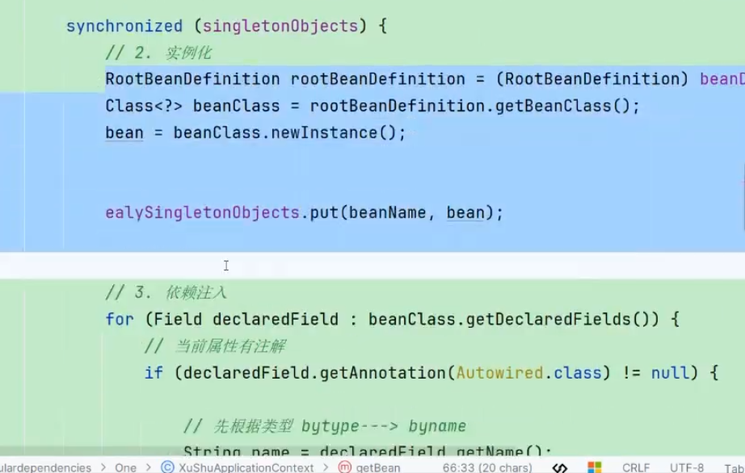

但是此时，实例化的过程没有出口，如果一级缓存中，没有该对象，就会还会出现获取对象为null的情况，所以在这里要新加个示例化后的出口（二级缓存）：

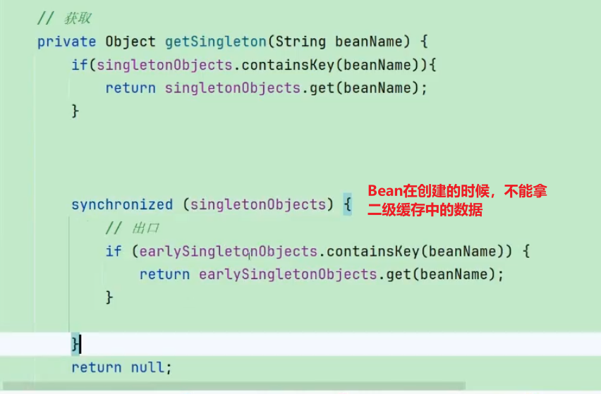

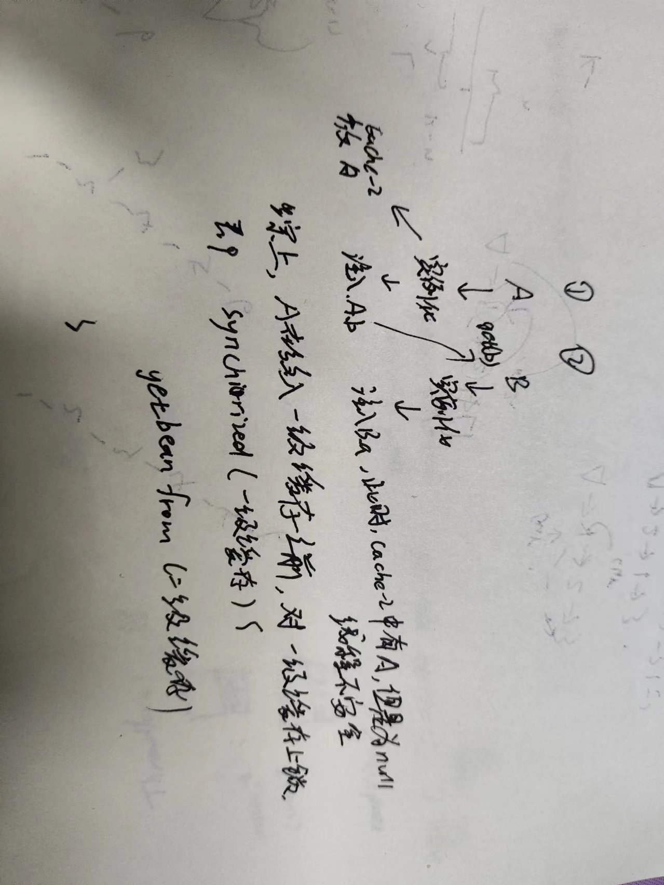

~~现在，如果有两个线程获取对象A、C，其中C已经创建好了，线程1进入到getSingleton，此时A没有创建，对singletonObjects上锁~~

解决了并发条件下的性能问题，暂存bean生命周期中直接实例化后的对象，在bean创建完成后在把该不完整的对象从二级缓存中删除。

二级缓存解决，bean属性注入为null或者不完整的情况， 二级缓存是bean示例化后的出口。

使用双重检查锁解决。

一级缓存中的bean都是完整的bean，二级缓存专门存bean创建过程中实例化后的bean。为什么？避免因为对一级缓存上锁造成的性能问题，使用了二级缓存之后，直接对二级缓存上锁就行。

#### 三级缓存（解决aop动态代理的循环依赖，也是临时缓存）

三级缓存存的是：(beanName, bean的动态代理对象)，其中bean的动态代理对象存的是一段创建的代码。

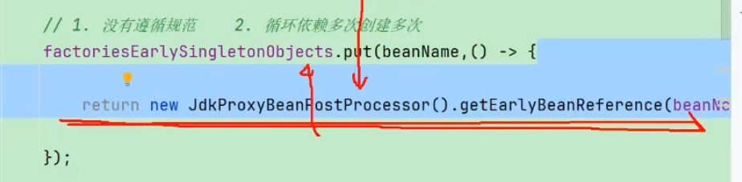

spring规范规定，aop动态代理对象要在bean初始化完成之后创建，只有出现循环依赖的时候，才会在实例化bean后创建。

循环依赖注入的属性，一定是动态代理对象，而不是原对象。例如A.b中的b一定得是动态代理对象。

在判断为循环依赖的时候调用创建动态代理的回调方法。

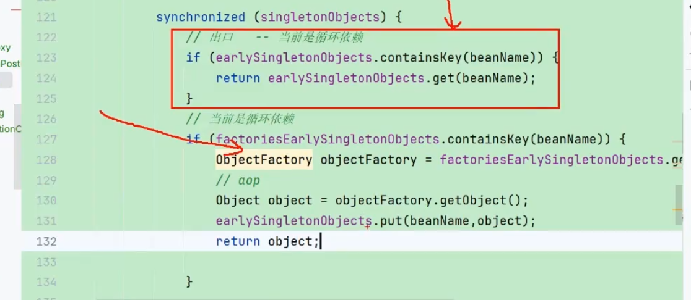

### Bean的生命周期

创建的过程：

 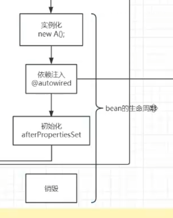
