### spring相关面试题

### Spring AOP是如何实现的？它和AspectJ有什么区别？

https://www.bilibili.com/video/BV1bH4y1D7Qv/?spm_id_from=333.999.0.0&vd_source=011a8ef55e4c6f234efbc95d85340fc1

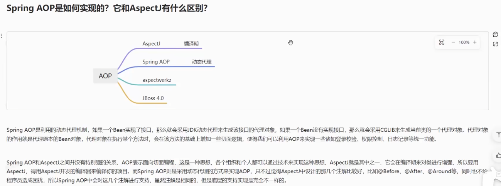

  

### jdk动态代理和cglib代理

区别：是否实现一个接口

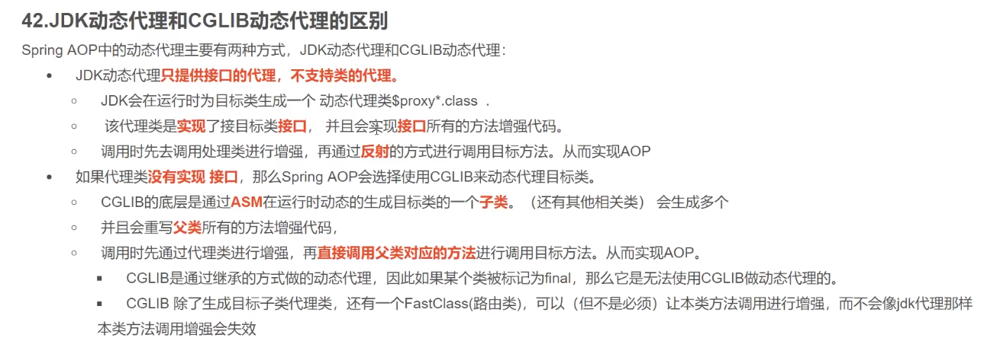

参考：https://blog.csdn.net/weixin_43935152/article/details/130514814

例子：sboot2/com.example.learn/proxy

### 循环依赖和三级缓存

https://www.cnblogs.com/daimzh/p/13256413.html

https://www.bilibili.com/video/BV18W421c7jo

#### 循环依赖的原因

教程：[[bilibili](https://www.bilibili.com/video/BV18W421c7jo/?spm_id_from=333.999.0.0&vd_source=011a8ef55e4c6f234efbc95d85340fc1)]26:09左右。

循环依赖的原因是发生在属性注入的时候。一个对象实例化完成后，接着要注入属性，比如A.b，但此时B在==单例池（一级缓存）==中还没有，这时会去创建B，而到属性注入时，B.a的A在单例池中也没有，就会递归创建，出现循环依赖。

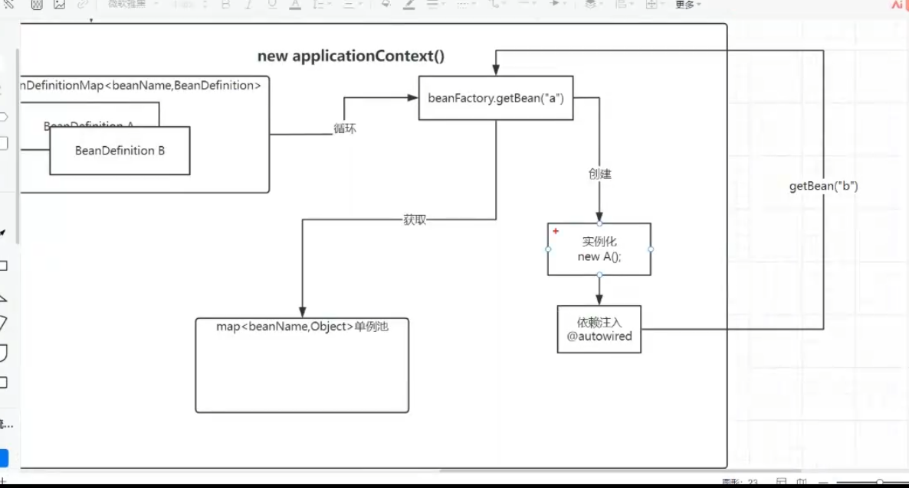

ioc创建bean的流程：

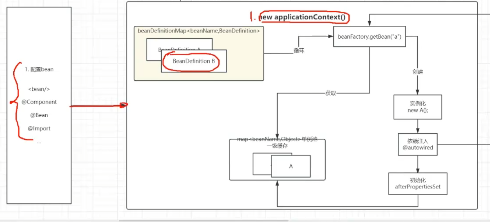

spring的动态代理对象是在Bean初始化完成之后创建的。

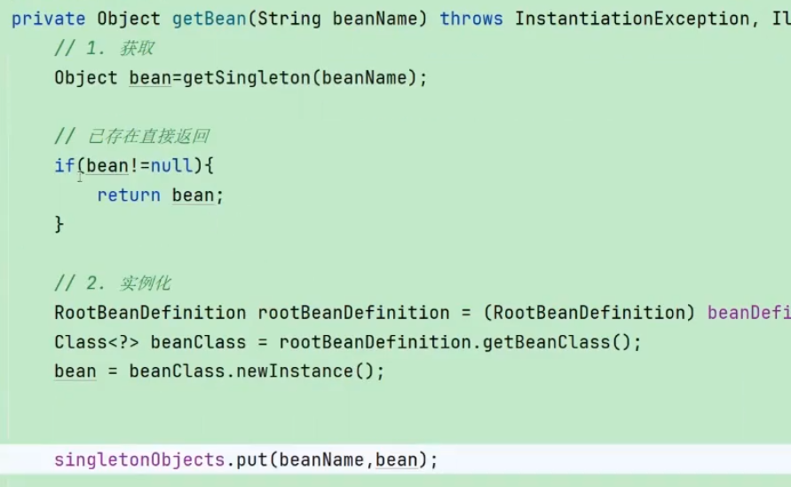

线程并发情况下，会出现线程安全问题：如果把一级缓存加在实例化bean之后，两个线程中会有一个B.a=null，其中的a是不完整的对象，这时出现了线程安全问题。

#### 二级缓存（临时缓存）

教程：[[b站](https://www.bilibili.com/video/BV18W421c7jo/?spm_id_from=333.999.0.0&vd_source=011a8ef55e4c6f234efbc95d85340fc1)]56:10左右

为了防止上述出现的线程安全问题，如果对一级缓存加锁，那么问题就可以解决：

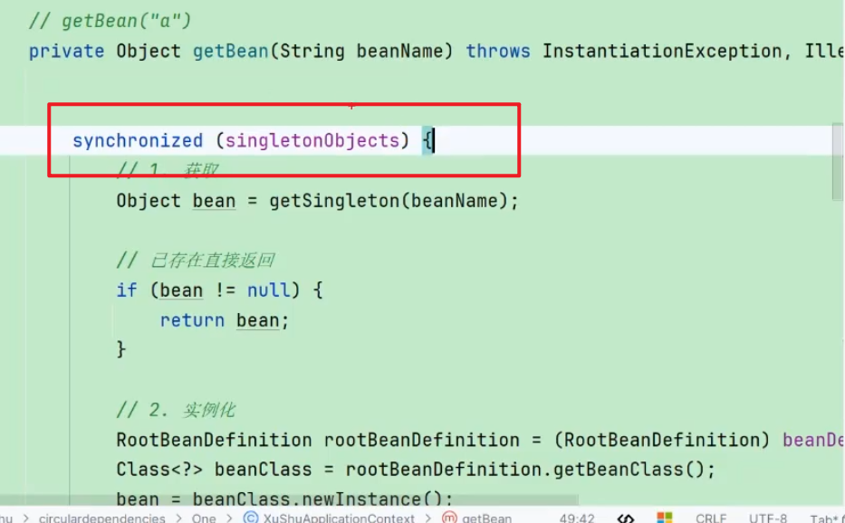

但是在这里，锁的粒度太大了，会阻塞获取已经创建好的Bean的线程。所以不让一级缓存参与到实例化的过程中，新建一个二级缓存，专门用来存示例化之后的bean，一级缓存只存初始化后的完成的bean：

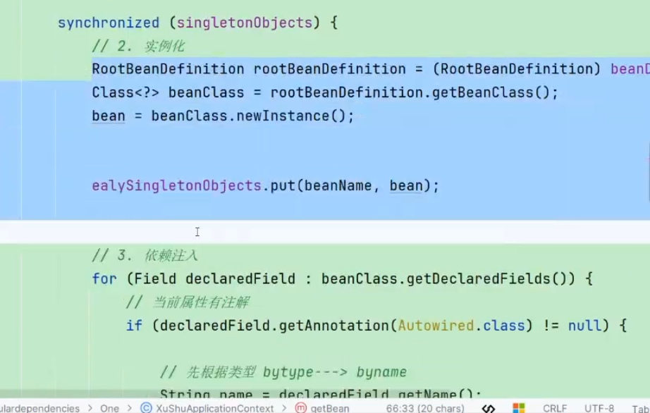

但是此时，实例化的过程没有出口，如果一级缓存中，没有该对象，就会还会出现获取对象为null的情况，所以在这里要新加个示例化后的出口（二级缓存）：

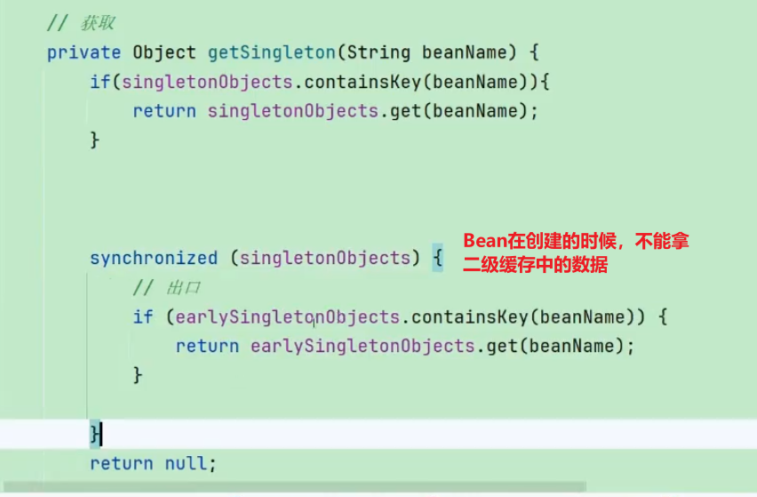

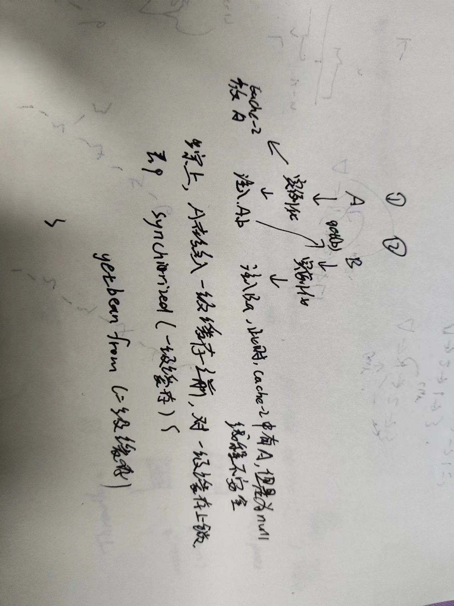

~~现在，如果有两个线程获取对象A、C，其中C已经创建好了，线程1进入到getSingleton，此时A没有创建，对singletonObjects上锁~~

解决了并发条件下的性能问题，暂存bean生命周期中直接实例化后的对象，在bean创建完成后在把该不完整的对象从二级缓存中删除。

二级缓存解决，bean属性注入为null或者不完整的情况， 二级缓存是bean示例化后的出口。

使用双重检查锁解决。

一级缓存中的bean都是完整的bean，二级缓存专门存bean创建过程中实例化后的bean。为什么？避免因为对一级缓存上锁造成的性能问题，使用了二级缓存之后，直接对二级缓存上锁就行。

#### 三级缓存（解决aop动态代理的循环依赖，也是临时缓存）

三级缓存存的是：(beanName, bean的动态代理对象)，其中bean的动态代理对象存的是一段创建的代码。

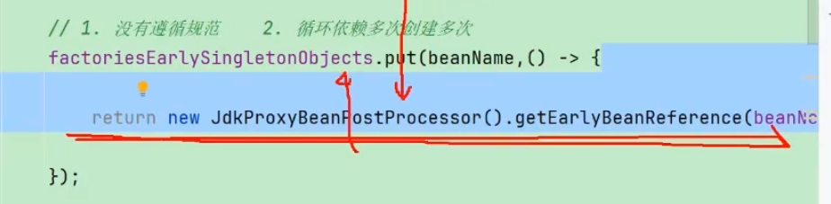

spring规范规定，aop动态代理对象要在bean初始化完成之后创建，只有出现循环依赖的时候，才会在实例化bean后创建。

循环依赖注入的属性，一定是动态代理对象，而不是原对象。例如A.b中的b一定得是动态代理对象。

在判断为循环依赖的时候调用创建动态代理的回调方法。

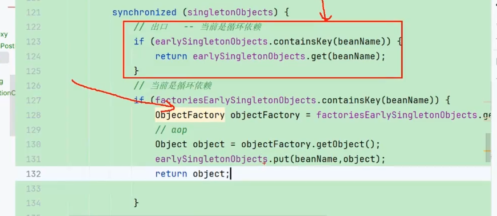


### Bean的生命周期

创建的过程：

 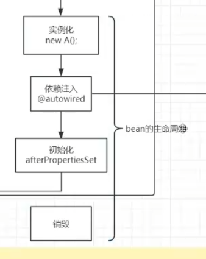


### spring事务

事务失效：https://www.cnblogs.com/chanshuyi/p/head-first-of-spring-transaction.html#%E4%BA%8B%E5%8A%A1%E4%BC%A0%E6%92%AD%E7%B1%BB%E5%9E%8B

事务实现原理：

2023最新Spring全家桶面试题

- [[b站](https://www.bilibili.com/video/BV1yK41187nQ)]

- https://www.cnblogs.com/insaneXs/p/13638034.html

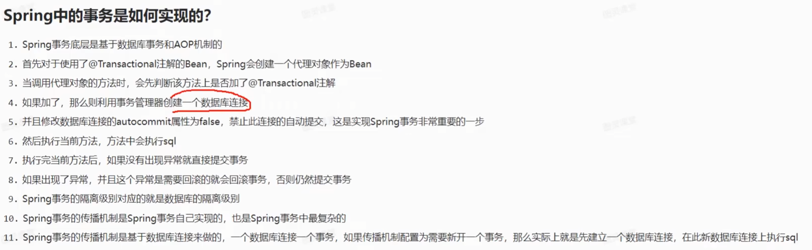

### 事务环绕

事务环绕就是利用Advisor和AOP在参加事务的Bean的生命周期中添加事务控制，这个就叫事务环绕。

### Advisor

在Spring框架中，`Advisor`（顾问）是一个设计模式中的概念，它用于实现面向切面编程（AOP）。在Spring AOP中，`Advisor`是一个接口，它定义了如何将Advice（通知）与切入点（pointcut）组合在一起。简而言之，一个`Advisor`就是一个包含了一个Advice和一个pointcut的封装，用来决定哪些连接点（join point，通常是方法执行的开始）应该执行这个Advice中的行为。

Spring支持两种类型的`Advisor`：

1. **Pointcut Advisor**：这是最常见的类型，它包含了一个pointcut和一个Advice。pointcut定义了哪些连接点与Advice相关联。

2. **Introduction Advisor**：这种类型的`Advisor`不仅包含了一个Advice，还引入了新的接口到目标类上，使得目标类似乎实现了这些接口。

`Advice`本身表示的是在特定连接点上要采取的行动，比如在方法执行前后做一些事情，如日志记录、事务管理等。

当然，下面是一个简单的Spring AOP示例，展示如何使用`Advisor`来实现日志记录的功能。在这个例子中，我们将创建一个简单的业务服务，并使用一个`Advisor`来自动添加日志记录。

首先，我们需要定义一个切面（Aspect），该切面包含了日志记录的逻辑以及切入点表达式。

**定义切面**

假设我们有一个`LoggingAspect`类，它实现了日志记录的功能：

```java
import org.aspectj.lang.ProceedingJoinPoint;
import org.aspectj.lang.annotation.Around;
import org.aspectj.lang.annotation.Aspect;

@Aspect
public class LoggingAspect {

    @Around("execution(* com.example.service.*.*(..))")
    public Object logAround(ProceedingJoinPoint joinPoint) throws Throwable {
        System.out.println("Before method: " + joinPoint.getSignature().getName());
        try {
            Object result = joinPoint.proceed();
            System.out.println("After method: " + joinPoint.getSignature().getName());
            return result;
        } catch (Exception e) {
            System.out.println("Exception in method: " + joinPoint.getSignature().getName() + ", exception: " + e.getMessage());
            throw e;
        }
    }
}
```

这里我们定义了一个环绕通知（around advice），它会在方法调用之前和之后打印日志信息。

**配置Advisor**

接下来，我们需要配置一个`Advisor`，它将`LoggingAspect`中的通知与一个特定的切入点匹配起来。由于我们在切面中已经指定了切入点表达式，因此我们可以直接将整个切面注册为一个`Advisor`：

```xml
<!-- Spring 配置文件 -->
<bean id="loggingAspect" class="com.example.LoggingAspect" />

<aop:config>
    <aop:aspect ref="loggingAspect">
        <!-- 切面中的通知已经定义好了 -->
    </aop:aspect>
</aop:config>
```

如果你使用Java配置方式，可以这样做：

```java
@Configuration
@EnableAspectJAutoProxy
public class AppConfig {

    @Bean
    public LoggingAspect loggingAspect() {
        return new LoggingAspect();
    }
}
```

**使用**

现在我们有一个简单的业务服务类：

```java
public class BusinessService {

    public void doSomething() {
        System.out.println("Doing something...");
    }
}
```

当我们在应用程序中调用`BusinessService.doSomething()`时，由于我们配置了`Advisor`，所以会自动在方法调用前后添加日志记录。

这只是一个基本的例子，实际应用中你可以根据需要调整切入点表达式和通知逻辑。

### spring事务传播

2023最新Spring全家桶面试题 61.Spring事务传播行为实现原理

https://www.cnblogs.com/chanshuyi/p/head-first-of-spring-transaction.html#%E4%BA%8B%E5%8A%A1%E4%BC%A0%E6%92%AD%E7%B1%BB%E5%9E%8B

事务传播级别可以在@Transactional注解上设置

```java
@Transactional(propagation = Propagation.REQUIRED)
```

- REQUIRED：父子方法共享一个事务

  **当前方法存在事务时，子方法加入该事务。此时父子方法共用一个事务，无论父子方法哪个发生异常回滚，整个事务都回滚。即使父方法捕捉了异常，也是会回滚。而当前方法不存在事务时，子方法新建一个事务。** 

- REQUIRES_NEW：父子方法各持有一个事务。子事务要自己处理异常，否则会导致父事务也会失效。

  **无论当前方法是否存在事务，子方法都新建一个事务。此时父子方法的事务时独立的，它们都不会相互影响。但父方法需要注意子方法抛出的异常，避免因子方法抛出异常，而导致父方法回滚。** 

- NESTED：父子事务嵌套。父事务捕捉了子事务的异常，父事务就不会回滚。

  **当前方法存在事务时，子方法加入在嵌套事务执行。当父方法事务回滚时，子方法事务也跟着回滚。当子方法事务发送回滚时，父事务是否回滚取决于是否捕捉了异常。如果捕捉了异常，那么就不回滚，否则回滚。**

例子：

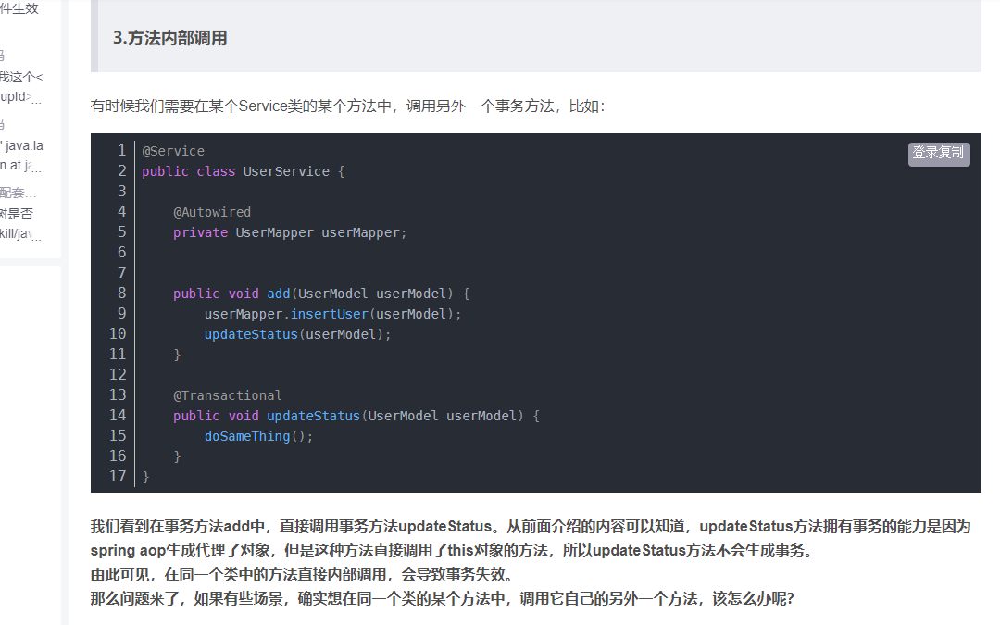

解决：参考学成在线，4.4.5 Service事务优化

```java
public class UserService {
    @Autowired
    private UserService userServiceProxy;  // 代理对象（aop扫描到@Transactional注解，会为UserService创建AOP代理对象）
    
    // 修改为
    public void add(UserModel userModel) {
        userMapper.insertUser(userModel);
        userServiceProxy.updateStatus(userModel);
    }
}
```

上面连接中的博客中，提到的例子：因为是通过tableService调的子方法，所以在事务的控制范围内。

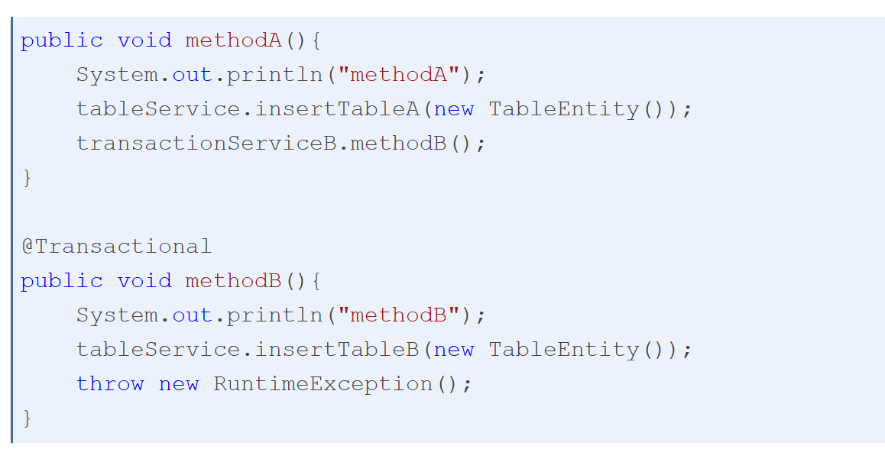

### spring事件


### spring父子容器

https://blog.csdn.net/qq_43842093/article/details/122008820


### IOC容器加载过程

就是bean的生命周期。


### 自动装配

https://javaguide.cn/system-design/framework/spring/spring-boot-auto-assembly-principles.html#%E4%BB%80%E4%B9%88%E6%98%AF-springboot-%E8%87%AA%E5%8A%A8%E8%A3%85%E9%85%8D

- @SpringBootApplication注解里的@EnableAutoConfiguration
- 主要用@AutoConfigurationImportSelector里的selectImports函数解析需要往IOC里自动注入的类
- selectImports函数里用getAutoConfigurationEntry实现。
- 主要扫描启动类所在包下的所有路径，存在@Compoment之类注解的都装配进来。jar包中有META-INF/spring.factories的包也会自动装配进来。

### @Import注解

在Spring框架中，`@Import`是一个类级别的注解，它用于将一个或多个类定义自动注册到Spring的IoC容器中。使用这个注解可以替代在XML配置文件中定义bean的方式，使得配置更加简洁，并且保持了使用Java配置的优势。

`@Import`注解接受一个或多个类作为参数，并且这些类通常实现了`ImportSelector`接口或者`ImportBeanDefinitionRegistrar`接口。这两种方式允许你在运行时决定哪些bean应该被注册到容器中。

1. **ImportSelector**：实现此接口的类会在容器启动时提供一组需要注册的bean定义。它根据给定的元数据来选择要导入的类。

2. **ImportBeanDefinitionRegistrar**：这是一个更灵活的选择，它允许你在运行时获取到bean定义注册器，并注册bean定义。使用这种方法，你可以根据条件来动态地注册不同的bean。

这里是一个简单的例子，展示如何使用`@Import`来注册一个类：

```java
@Configuration
@Import(MyConfiguration.class)
public class AppConfig {
}

// MyConfiguration.java
public class MyConfiguration {
    // 可以在这里定义@Bean方法来注册组件
}
```

在这个例子中，`AppConfig` 类使用 `@Import` 注解导入了 `MyConfiguration` 类。如果 `MyConfiguration` 类标记为 `@Configuration` 并且包含了 `@Bean` 方法，那么这些方法定义的bean就会被添加到应用上下文中。

总的来说，`@Import`提供了一种方便的方式来向Spring IoC容器注册bean，而不需要显式地创建额外的配置类或者使用复杂的编程模型。


### springboot启动流程

https://blog.csdn.net/weixin_46047193/article/details/123557570

https://www.bilibili.com/video/BV1Ya4y1X7f8/

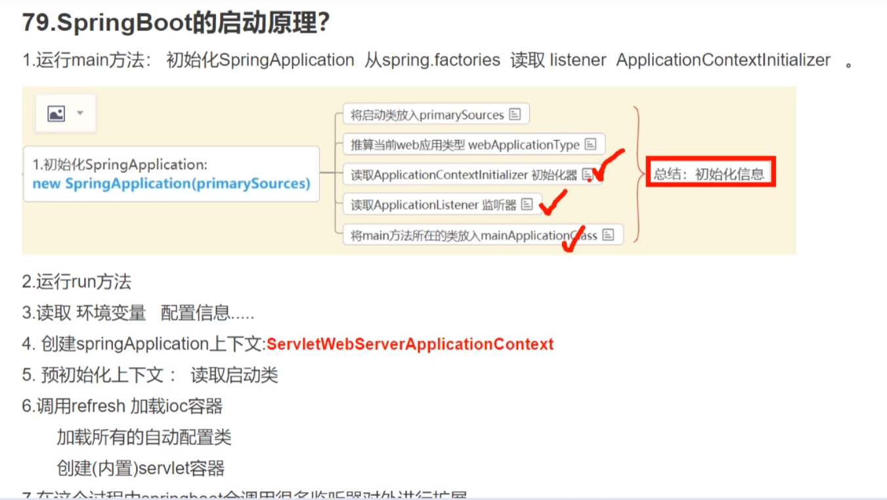

### @Autowired和@Resource的区别

`@Autowired` 和 `@Resource` 都是 Spring 框架中用来进行依赖注入（Dependency Injection, DI）的注解。但是它们之间存在一些区别：

1. **来源不同**：
   - `@Autowired` 是由 Spring 提供的，它属于 Spring 框架的一部分。
   - `@Resource` 是 Java 的 JSR-250 规范的一部分，并且是由 Java EE 平台提供的。

2. **默认行为不同**：
   - `@Autowired` 默认是按照类型（type）来装配依赖对象的，如果要按名称装配，则需要使用 `@Qualifier` 注解来指定。
   - `@Resource` 默认是按照名称（name）来装配依赖对象的，如果找不到匹配的名字则会退而求其次按照类型（type）来装配。如果不希望按名称装配，可以使用 `name=""` 属性或者省略属性来按照类型装配。

3. **配置属性**：
   - `@Autowired` 可以使用 `required` 属性来控制是否必须注入该依赖，如果设置为 `false`，则当找不到匹配的bean时不会抛出异常。
   - `@Resource` 同样可以指定是否必须注入依赖，通过 `lookup` 属性来实现，但是这个属性的使用并不如 `@Autowired` 的 `required` 直观。

4. **使用场景**：
   - 通常情况下，`@Autowired` 更加适合用于 Spring 应用程序中，因为它与 Spring 的 IOC 容器紧密结合。
   - 而 `@Resource` 则更倾向于在 Java EE 环境下使用，它不仅可以在 Spring 中使用，也可以在没有 Spring 的环境中使用，比如在 EJB 中。

总结来说，如果你的应用是一个纯粹的 Spring 应用，那么推荐使用 `@Autowired`；如果你的应用是一个 Java EE 应用，那么 `@Resource` 会更加合适。当然，在实际开发过程中，两者都可以实现依赖注入的功能，选择哪一个主要取决于你的具体需求以及个人偏好。


### Spring DeferredResult

`DeferredResult` 是 Spring MVC 提供的一种异步处理机制，它允许控制器方法立即返回一个 `DeferredResult` 对象给客户端，而实际的计算或数据获取可以在后台线程中进行。一旦结果准备好，就会通过 `DeferredResult` 设置最终的结果，然后这个结果会被发送回客户端。这种方式非常适合需要长时间处理的任务，可以避免阻塞主线程，提高应用的响应性和吞吐量。

以下是 `DeferredResult` 的一些关键特性和使用方式：

1. **非阻塞处理**：`DeferredResult` 允许 Web 应用在等待后台任务完成时保持非阻塞状态，这有助于改善服务器的并发性能。

2. **超时设置**：你可以为 `DeferredResult` 设置超时时间。如果在指定时间内没有结果可用，可以定义一个默认的结果或者触发一个超时事件处理器。

3. **回调支持**：你可以注册成功、失败和超时的回调函数来处理不同的情况。

4. **与异步请求处理集成**：Spring MVC 支持将 `DeferredResult` 与 `Callable` 或者 `WebAsyncTask` 结合使用，以实现更复杂的异步逻辑。

下面是一个简单的 `DeferredResult` 使用示例：

```java
import org.springframework.web.bind.annotation.GetMapping;
import org.springframework.web.bind.annotation.RestController;
import org.springframework.web.context.request.async.DeferredResult;

import java.util.concurrent.ExecutorService;
import java.util.concurrent.Executors;

@RestController
public class AsyncController {

    private final ExecutorService executor = Executors.newFixedThreadPool(5);

    @GetMapping("/long-running-task")
    public DeferredResult<String> longRunningTask() {
        // 创建 DeferredResult 实例
        DeferredResult<String> deferredResult = new DeferredResult<>(3000L, "Default Result"); // 3秒超时

        // 定义超时后的处理
        deferredResult.onTimeout(() -> {
            System.out.println("DeferredResult timed out");
        });

        // 在另一个线程中执行耗时操作
        executor.submit(() -> {
            try {
                // 模拟长时间运行的任务
                Thread.sleep(2000);
                String result = "Task Completed";
                // 设置最终结果
                deferredResult.setResult(result);
            } catch (InterruptedException e) {
                // 处理异常
                deferredResult.setErrorResult(e.getMessage());
            }
        });

        return deferredResult;
    }
}
```

在这个例子中，当用户访问 `/long-running-task` 端点时，控制器会立即返回一个 `DeferredResult` 对象。然后，一个后台任务会在另一个线程中执行，并在完成后通过 `deferredResult.setResult()` 方法将结果设置到 `DeferredResult` 中。如果任务在3秒内未完成，则会触发超时处理器，并且客户端会收到默认的结果 `"Default Result"`。
