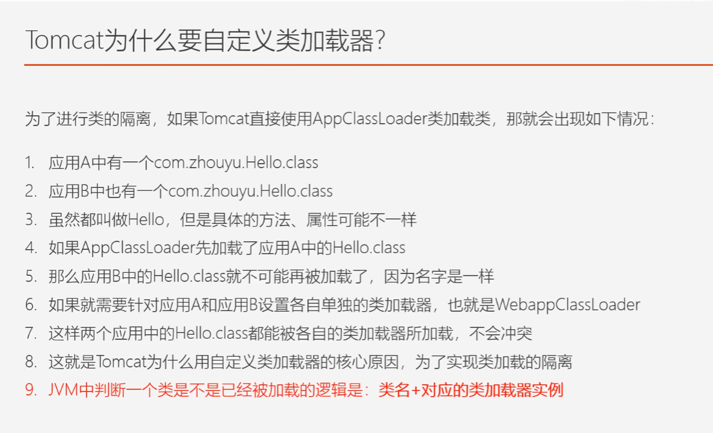
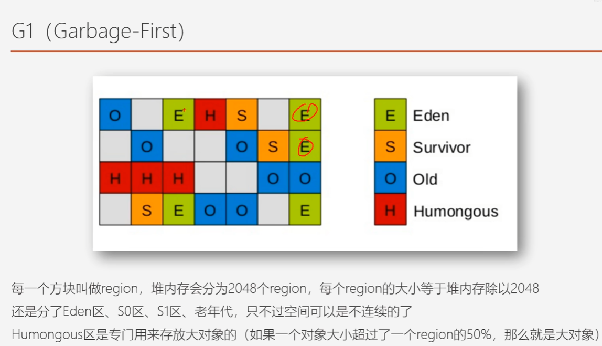

# JVM大家族
### 虚拟机始祖：Sun Classic/Exact VM
1996年1月23日，Sun发布JDK1.0，其中所带的虚拟机就是Classic VM，只能解释不能编译，若想编译则需要外挂编译器，在编译器工作时解释器不能工作，所以要编译只能把整个工程完全编译。
为了解决这个问题诞生了发布于JDK1.2中的Exact VM，这一虚拟机使用准确式内存管理（Exact Memory Management），即虚拟机可以知道内存中的数据具体是什么类型。抛弃了基于句柄的查找对象的方式，使得每次查找对象都少了一次寻址，大幅提升了性能。同时，它还支持热点探测、两级即时编译、编译器与解释器混合工作等编译特性。

### 武林盟主：HotSpotVM（目前的主流）
Sun/OracleJDK和Open JDK中的默认虚拟机，也是目前使用最广的虚拟机。
HotSpotVM具有热点探测能力，即可以通过执行计数器找出哪些代码是最经常被使用的，然后通知即时编译器以方法为单位编译这些代码。

### 小家碧玉：Mobile/Embedded VM
面对嵌入式系统和移动市场的虚拟机。
### 天下第二：BEA JRockit/IBM J9 VM
分别由BEA公司和IBM公司开发
### 软硬结合：BEA Liquid VM/Azul VM
绑定特定硬件平台，需要特定软件配合的虚拟机。前者由BEA开发，运行于Hypervsor系统上，目前项目已停止，后者由Azul Systems公司开发，运行于公司专有硬件Vega系统上。每个Azul实例可以管理至少数十个CPU和数百G内存，并且拥有巨大内存范围内停顿时间可控的内农村收集器（即ZGC和C4内存收集器）。
### 其余略
# 内存分配
### 运行时数据区构成
《Java虚拟机规范》中规定，Java内存区域包括以下几个运行时数据区域
##### 程序计数器
一块较小的内存空间，可以理解为记录当前线程所执行的字节码的行号。
为了保证线程恢复，每个线程都有自己的程序计数器。各个线程计数器之间互不影响，即属于线程私有的内存区域。

##### Java 虚拟机栈
线程私有，生命周期于线程相同。由多个栈帧组成，栈帧里存储了局部变量表、操作数栈、动态连接、方法出口等信息。局部变量表存放了编译器已知的基本数据类型、对象引用和返回值地址（returnAddress）类型的数据。

如果线程请求的栈深度大于虚 拟机所允许的深度，将抛出StackOverflowError异常；如果Java虚拟机栈容量可以动态扩展[2]，当栈扩 展时无法申请到足够的内存会抛出OutOfMemoryError异常。

##### 本地方法栈
与Java虚拟机栈差不多，只不过它是为了执行本地方法服务的。HotSpot将本地方法栈和Java虚拟机栈合二为一了。

本地方法:简单来说就是Java调用非Java的方法。

##### Java堆

对于Java应用程序来说，Java堆（Java Heap）是虚拟机所管理的内存中最大的一块。Java堆是被所 有线程共享的一块内存区域，在虚拟机启动时创建。此内存区域的唯一目的就是存放对象实例。

Java堆是垃圾收集器管理的内存区域，因此一些资料中它也被称作“GC堆”（Garbage Collected Heap）。从回收内存的角度看，由于现代垃圾收集器大部分都是基于分 代收集理论设计的，所以Java堆中经常会出现“新生代”“老年代”“永久代”“Eden空间”“From Survivor空 间”“To Survivor空间”等名词，这些区域划分仅仅是一部分垃圾收集器的共同特性或者说设计风格而已，而非某个Java虚拟机具体 实现的固有内存布局，更不是《Java虚拟机规范》里对Java堆的进一步细致划分。

从分配内存的角度看，所有线程共享的Java堆中可以划分出多个线程私有的分配缓冲区 （Thread Local Allocation Buffer，TLAB），以提升对象分配时的效率。

##### 方法区

各个线程共享的内存区域，它用于存储已被虚拟机加载的类型信息、常量、静态变量、即时编译器编译后的代码缓存等数据。

早期的HotSpot的方法区全部放在“永久代”里，但使用永久代来实现方法区的决定并不是一个好主意，这种设计导致了Java应用更容易遇到 内存溢出的问题而且有极少数方法 （例如String::intern()）会因永久代的原因而导致不同虚拟机下有不同的表现。到了 JDK 8，终于完全废弃了永久代的概念，改用与JRockit、J9一样在本地内存中实现的元空间（Metaspace）来代替，把JDK 7中永久代还剩余的内容（主要是类型信息）全部移到元空间中。

##### 运行时常量池

方法区的一部分。Class文件中除了有类的版本、字 段、方法、接口等描述信息外，还有一项信息是常量池表（Constant Pool Table），用于存放编译期生成的各种字面量与符号引用，这部分内容将在类加载后存放到方法区的运行时常量池中。

##### 直接内存

直接内存（Direct Memory）并不是虚拟机运行时数据区的一部分，但是这部分内存也被频繁地使用，而且也可能导致OutOfMemoryError异常出现。

在JDK 1.4中新加入了NIO（New Input/Output）类，引入了一种基于通道（Channel）与缓冲区 （Buffer）的I/O方式，它可以使用Native函数库直接分配堆外内存，然后通过一个存储在Java堆里面的 DirectByteBuffer对象作为这块内存的引用进行操作。这样能在一些场景中显著提高性能，因为避免了 在Java堆和Native堆中来回复制数据。

### HotSpot对象创建过程

##### 类加载检查

当Java虚拟机遇到一条字节码new指令时，首先将去检查这个指令的参数是否能在常量池中定位到 一个类的符号引用，并且检查这个符号引用代表的类是否已被加载、解析和初始化过。如果没有，那必须先执行相应的类加载过程。

##### 为新生对象分配内存

在类加载检查通过后，接下来虚拟机将为新生对象分配内存。对象所需内存的大小在类加载完成 后便可完全确定（如何确定在2.3.2节中介绍），为对象分配空间的任务实际上便等同于把一块确定 大小的内存块从Java堆中划分出来。

分两者情况：

1. 堆中的内存是规整的，则把那 个指针向空闲空间方向挪动一段与对象大小相等的距离，这种分配方式称为“指针碰撞”。
2. 堆中的内存不是规整的，则维护一个列表，记录上哪些内存块是可用的，在分 配的时候从列表中找到一块足够大的空间划分给对象实例，并更新列表上的记录，这种分配方式称 为“空闲列表”（Free List）。

选择哪种分配方式由Java堆是否规整决定。因此，当使用Serial、ParNew等带压缩 整理过程的收集器时，系统采用的分配算法是指针碰撞，既简单又高效；而当使用CMS这种基于清除 （Sweep）算法的收集器时，理论上[1]就只能采用较为复杂的空闲列表来分配内存。

如果不做任何保护，对象的创建在并发情况下并不是线程安全的，可能出现正在给对象 A分配内存，指针还没来得及修改，对象B又同时使用了原来的指针来分配内存的情况。

两种可选方案：

1. 是对分配内存空间的动作进行同步处理——实际上虚拟机是采用CAS（对比交换操作）配上失败 重试的方式保证更新操作的原子性
2. 把内存分配的动作按照线程划分在不同的空间之中进 行，即每个线程在Java堆中预先分配一小块内存，称为本地线程分配缓冲（Thread Local Allocation Buffer，TLAB），哪个线程要分配内存，就在哪个线程的本地缓冲区中分配，只有本地缓冲区用完 了，分配新的缓存区时才需要同步锁定。虚拟机是否使用TLAB，可以通过-XX：+/-UseTLAB参数来 设定。

##### 内存初始化

内存分配完成之后，虚拟机必须将分配到的内存空间（但不包括对象头）都初始化为零值，如果 使用了TLAB的话，这一项工作也可以提前至TLAB分配时顺便进行。

接下来，Java虚拟机还要对对象进行必要的设置，例如这个对象是哪个类的实例、如何才能找到 类的元数据信息、对象的哈希码（实际上对象的哈希码会延后到真正调用Object::hashCode()方法时才 计算）、对象的GC分代年龄等信息。这些信息存放在对象的对象头（Object Header）之中。根据虚拟 机当前运行状态的不同，如是否启用偏向锁等，对象头会有不同的设置方式。

##### 执行构造函数

在上面工作都完成之后，从虚拟机的视角来看，一个新的对象已经产生了。但是从Java程序的视 角看来，对象创建才刚刚开始——构造函数，即Class文件中的<init>()方法还没有执行，所有的字段都 为默认的零值，对象需要的其他资源和状态信息也还没有按照预定的意图构造好。一般来说（由字节 码流中new指令后面是否跟随invokespecial指令所决定，Java编译器会在遇到new关键字的地方同时生成 这两条字节码指令，但如果直接通过其他方式产生的则不一定如此），new指令之后会接着执行 ()方法，按照程序员的意愿对对象进行初始化，这样一个真正可用的对象才算完全被构造出来。

### HotSpot对象的内存结构

分为三个部分：对象头（Header）、实例数据（Instance Data）和对齐填充（Padding）。

##### 对象头

第一类是用于存储对象自身的运行时数据，如哈希码（HashCode）、GC分代年龄、锁状态标志、线程持有的锁、偏向线程ID、偏向时间戳等，这部 分数据的长度在32位和64位的虚拟机（未开启压缩指针）中分别为32个比特和64个比特，官方称它 为“Mark Word”。


第二类是类型指针，即对象指向它的类型元数据的指针，Java虚拟机通过这个指针 来确定该对象是哪个类的实例。并不是所有的虚拟机实现都必须在对象数据上保留类型指针，换句话 说，查找对象的元数据信息并不一定要经过对象本身。

##### 实例数据

对象真正存储的有效信息。

这部分的存储顺序会 受到虚拟机分配策略参数（-XX：FieldsAllocationStyle参数）和字段在Java源码中定义顺序的影响。 HotSpot虚拟机默认的分配顺序为longs/doubles、ints、shorts/chars、bytes/booleans、oops（Ordinary Object Pointers，OOPs）。

##### 对齐填充

并不是必然存在的，也没有特别的含义，它仅仅起着占位符的作用。通过占位符保证对象所占的内存是8字节的整数倍。

### HotSpot对象的访问定位

通过栈上的reference数据来操作堆上的具 体对象。

如果使用句柄访问的话，Java堆中将可能会划分出一块内存来作为句柄池，reference中存储的就是对象的句柄地址，而句柄中包含了对象实例数据与类型数据各自具体的地址信息。 

如果使用直接指针访问的话，Java堆中对象的内存布局就必须考虑如何放置访问类型数据的相关 信息，reference中存储的直接就是对象地址，如果只是访问对象本身的话，就不需要多一次间接访问 的开销。

HotSpot主要使用第二种方式进行对象访问。（有例外情况，如果使用了Shenandoah收集器的 话也会有一次额外的转发）。

# 垃圾回收器（GC）

程序计数器、虚拟机栈、本地方法栈3个区域随线程而生，随线程而灭，栈中的栈帧随着方法的进入和退出而有条不紊地执行着出栈和入栈操作，几乎不存在内存回收的问题。

Java堆和方法区则不同。只有处于运行期间，我们才 能知道程序究竟会创建哪些对象，创建多少个对象，这部分内存的分配和回收是动态的。垃圾收集器 所关注的正是这部分内存该如何管理。

### 判断对象是否已经“死去”

##### 引用计数法

对象中添加一个引用计数器，每当有一个地方 引用它时，计数器值就加一；当引用失效时，计数器值就减一；任何时刻计数器为零的对象就是不可 能再被使用的。

由于很多例外情况（如循环引用问题）要考虑，主流的Java虚拟机里面没有选用引用计数算法来管理内存。

##### 可达性分析算法

主流的商用程序语言（Java、C#，上溯至前面提到的古老的Lisp）的内存管理子系统，都是 通过可达性分析（Reachability Analysis）算法来判定对象是否存活的。

基本思路就是通过 一系列称为“GC Roots”的根对象作为起始节点集，从这些节点开始，根据引用关系向下搜索，搜索过 程所走过的路径称为“引用链”（Reference Chain），如果某个对象到GC Roots间没有任何引用链相连， 或者用图论的话来说就是从GC Roots到这个对象不可达时，则证明此对象是不可能再被使用的。

在Java技术体系里面，固定可作为GC Roots的对象包括以下几种： 

·在虚拟机栈（栈帧中的本地变量表）中引用的对象，譬如各个线程被调用的方法堆栈中使用到的 参数、局部变量、临时变量等。 

·在方法区中类静态属性引用的对象，譬如Java类的引用类型静态变量。 

·在方法区中常量引用的对象，譬如字符串常量池（String Table）里的引用。 

·在本地方法栈中JNI（即通常所说的Native方法）引用的对象。

 ·Java虚拟机内部的引用，如基本数据类型对应的Class对象，一些常驻的异常对象（比如 NullPointExcepiton、OutOfMemoryError）等，还有系统类加载器。 

·所有被同步锁（synchronized关键字）持有的对象。 

·反映Java虚拟机内部情况的JMXBean、JVMTI中注册的回调、本地代码缓存等。

目前最新的几款垃圾收集器 如OpenJDK中的G1、Shenandoah、ZGC以及Azul的PGC、C4这些收集器。无一例外都具备了局部回收的特征，为了避免GC Roots包含过多对 象而过度膨胀，它们在实现上也做出了各种优化处理。

###### 引用的定义

JDK 1.2版之前，Java里面的引用是很传统的定义： 如果reference类型的数据中存储的数值代表的是另外一块内存的起始地址，就称该reference数据是代表 某块内存、某个对象的引用。这种定义下只有“被引用”或者“未被引用”两种状态，过于狭隘。例如我们希望能描述一类对象：当内存空间还足够时，能保留在内存之中，如果内存空 间在进行垃圾收集后仍然非常紧张，那就可以抛弃这些对象——很多系统的缓存功能都符合这样的应 用场景。这类引用无法被以传统的方法定义。

在JDK 1.2版之后，Java对引用的概念进行了扩充，将引用分为强引用（Strongly Re-ference）、软 引用（Soft Reference）、弱引用（Weak Reference）和虚引用（Phantom Reference）4种，这4种引用强 度依次逐渐减弱。 

.强引用是最传统的“引用”的定义，是指在程序代码之中普遍存在的引用赋值，即类似“Object obj=new Object()”这种引用关系。无论任何情况下，只要强引用关系还存在，垃圾收集器就永远不会回收掉被引用的对象

 ·软引用是用来描述一些还有用，但非必须的对象。只被软引用关联着的对象，在系统将要发生内存溢出异常前，会把这些对象列进回收范围之中进行第二次回收，如果这次回收还没有足够的内存， 才会抛出内存溢出异常。在JDK 1.2版之后提供了SoftReference类来实现软引用。

 ·弱引用也是用来描述那些非必须对象，但是它的强度比软引用更弱一些，被弱引用关联的对象只能生存到下一次垃圾收集发生为止。当垃圾收集器开始工作，无论当前内存是否足够，都会回收掉只 被弱引用关联的对象。在JDK 1.2版之后提供了WeakReference类来实现弱引用。

 ·虚引用也称为“幽灵引用”或者“幻影引用”，它是最弱的一种引用关系。一个对象是否有虚引用的 存在，完全不会对其生存时间构成影响，也无法通过虚引用来取得一个对象实例。为一个对象设置虚 引用关联的唯一目的只是为了能在这个对象被收集器回收时收到一个系统通知。在JDK 1.2版之后提供 了PhantomReference类来实现虚引用。

###### 什么时候进行GC

即使在可达性分析算法中判定为不可达的对象，也不是“非死不可”的，这时候它们暂时还处于“缓 刑”阶段，要真正宣告一个对象死亡，至少要经历两次标记过程：

如果对象在进行可达性分析后发现没 有与GC Roots相连接的引用链，那它将会被第一次标记，随后进行一次筛选，筛选的条件是此对象是 否有必要执行finalize()方法。假如对象没有覆盖finalize()方法，或者finalize()方法已经被虚拟机调用 过，那么虚拟机将这两种情况都视为“没有必要执行”。

如果这个对象被判定为确有必要执行finalize()方法，那么该对象将会被放置在一个名为F-Queue的 队列之中，并在稍后由一条由虚拟机自动建立的、低调度优先级的Finalizer线程去执行它们的finalize() 方法。这里所说的“执行”是指虚拟机会触发这个方法开始运行，但并不承诺一定会等待它运行结束。 这样做的原因是，如果某个对象的finalize()方法执行缓慢，或者更极端地发生了死循环，将很可能导 致F-Queue队列中的其他对象永久处于等待，甚至导致整个内存回收子系统的崩溃。finalize()方法是对 象逃脱死亡命运的最后一次机会，稍后收集器将对F-Queue中的对象进行第二次小规模的标记，如果对 象要在finalize()中成功拯救自己——只要重新与引用链上的任何一个对象建立关联即可，譬如把自己 （this关键字）赋值给某个类变量或者对象的成员变量，那在第二次标记时它将被移出“即将回收”的集 合；如果对象这时候还没有逃脱，那基本上它就真的要被回收了。

任何一个对象的finalize()方法都只会被系统自动调用一次，如果对象面临 下一次回收，它的finalize()方法不会被再次执行。也就是说，一个方法最多只能通过finalize方法“拯救”自己一次。

### 回收方法区

《Java虚 拟机规范》中提到过可以不要求虚拟机在方法区中实现垃圾收集，事实上也确实有未实现或未能完整 实现方法区类型卸载的收集器存在（如JDK 11时期的ZGC收集器就不支持类卸载）。

方法区的垃圾收集主要回收两部分内容：废弃的常量和不再使用的类型。例如，假如一个字符串“java”曾经进入常量池 中，但是当前系统又没有任何一个字符串对象的值是“java”，换句话说，已经没有任何字符串对象引用 常量池中的“java”常量，且虚拟机中也没有其他地方引用这个字面量。如果在这时发生内存回收，而且 垃圾收集器判断确有必要的话，这个“java”常量就将会被系统清理出常量池。常量池中其他类（接 口）、方法、字段的符号引用也与此类似。

判断类是否不再被使用的三个条件：

1. 该类所有的实例都已经被回收，也就是Java堆中不存在该类及其任何派生子类的实例。 
2. 加载该类的类加载器已经被回收，这个条件除非是经过精心设计的可替换类加载器的场景，如 OSGi、JSP的重加载等，否则通常是很难达成的。 
3. 该类对应的java.lang.Class对象没有在任何地方被引用，无法在任何地方通过反射访问该类的方 法。

在大量使用反射、动态代理、CGLib等字节码框架，动态生成JSP以及OSGi这类频繁自定义类加载 器的场景中，通常都需要Java虚拟机具备类型卸载的能力，以保证不会对方法区造成过大的内存压 力。

### 垃圾回收算法

只重点介绍分代收集理论和几种算法思想及其发展过程。

##### 分代收集理论

两个分代假说：

​	 1）弱分代假说（Weak Generational Hypothesis）：绝大多数对象都是朝生夕灭的。

​	 2）强分代假说（Strong Generational Hypothesis）：熬过越多次垃圾收集过程的对象就越难以消 亡。

这两个分代假说共同奠定了多款常用的垃圾收集器的一致的设计原则：收集器应该将Java堆划分 出不同的区域，然后将回收对象依据其年龄（年龄即对象熬过垃圾收集过程的次数）分配到不同的区域之中存储。

在Java堆划分出不同的区域之后，垃圾收集器才可以每次只回收其中某一个或者某些部分的区域 ——因而才有了“Minor GC”“Major GC”“Full GC”这样的回收类型的划分；也才能够针对不同的区域安 排与里面存储对象存亡特征相匹配的垃圾收集算法——因而发展出了“标记-复制算法”“标记-清除算 法”“标记-整理算法”等针对性的垃圾收集算法。

把分代收集理论具体放到现在的商用Java虚拟机里，设计者一般至少会把Java堆划分为新生代 （Young Generation）和老年代（Old Generation）两个区域。顾名思义，在新生代中，每次垃圾收集 时都发现有大批对象死去，而每次回收后存活的少量对象，将会逐步晋升到老年代中存放。分代收集并非只是简单划分一下内存区域那么容易，它至少存在一个明显的困难：对象不 是孤立的，对象之间会存在跨代引用。为了解决这个问题，就需要对分 代收集理论添加第三条经验法则： 

​	3）跨代引用假说（Intergenerational Reference Hypothesis）：跨代引用相对于同代引用来说仅占极 少数。

依据这条假说，我们就不应再为了少量的跨代引用去扫描整个老年代，也不必浪费空间专门记录 每一个对象是否存在及存在哪些跨代引用，只需在新生代上建立一个全局的数据结构（该结构被称 为“记忆集”，Remembered Set），这个结构把老年代划分成若干小块，标识出老年代的哪一块内存会存在跨代引用。此后当发生Minor GC时，只有包含了跨代引用的小块内存里的对象才会被加入到GC Roots进行扫描。

##### 标记-清除（Mark-Sweep）算法

首先标记出所有需要回 收的对象，在标记完成后，统一回收掉所有被标记的对象，或者反过来标记所有存活的对象。

主要缺点有两个：第一个是执行效率不稳定，如果Java堆中包含大量对 象，而且其中大部分是需要被回收的，这时必须进行大量标记和清除的动作，导致标记和清除两个过 程的执行效率都随对象数量增长而降低；

第二个是内存空间的碎片化问题，标记、清除之后会产生大 量不连续的内存碎片，空间碎片太多可能会导致当以后在程序运行过程中需要分配较大对象时无法找 到足够的连续内存而不得不提前触发另一次垃圾收集动作。

##### 标记-复制算法

1969年Fenichel提出了一种称为“半区复制”（Semispace Copying）的垃圾收集算法，它将可用 内存按容量划分为大小相等的两块，每次只使用其中的一块。当这一块的内存用完了，就将还存活着 的对象复制到另外一块上面，然后再把已使用过的内存空间一次清理掉。

如果内存中多数对象都是存 活的，这种算法将会产生大量的内存间复制的开销。对于多数对象都是可回收的情况，算法需要复制的是占少数的存活对象，而且每次都是针对整个半区进行内存回收，分配内存时也就不用考虑有 空间碎片的复杂情况，只要移动堆顶指针，按顺序分配即可。这样实现简单，运行高效，不过其缺陷 也显而易见，这种复制回收算法的代价是将可用内存缩小为了原来的一半，空间浪费未免太多了一 点。

现在的商用Java虚拟机大多都优先采用了这种收集算法去回收新生代。

1989年提出了“Appel式回收”，HotSpot虚拟机的Serial、ParNew等新生代收集器均采用了这种策略来设 计新生代的内存布局[1]。Appel式回收的具体做法是把新生代分为一块较大的Eden空间和两块较小的 Survivor空间，每次分配内存只使用Eden和其中一块Survivor。发生垃圾搜集时，将Eden和Survivor中仍 然存活的对象一次性复制到另外一块Survivor空间上，然后直接清理掉Eden和已用过的那块Survivor空 间。HotSpot虚拟机默认Eden和Survivor的大小比例是8∶1，也即每次新生代中可用内存空间为整个新 生代容量的90%。

##### 标记-整理算法

针对老年代对象的存亡特征，1974年Edward Lueders提出了另外一种有针对性的“标记-整 理”（Mark-Compact）算法，其中的标记过程仍然与“标记-清除”算法一样，但后续步骤不是直接对可 回收对象进行清理，而是让所有存活的对象都向内存空间一端移动，然后直接清理掉边界以外的内 存。

HotSpot虚拟机里面关注吞吐量的Parallel Scavenge收集器是基于标记-整理算法的，而关注延迟的CMS收集器则是基于标记-清除算法的，这也从 侧面印证这点。 另外，还有一种“和稀泥式”解决方案可以不在内存分配和访问上增加太大额外负担，做法是让虚 拟机平时多数时间都采用标记-清除算法，暂时容忍内存碎片的存在，直到内存空间的碎片化程度已经 大到影响对象分配时，再采用标记-整理算法收集一次，以获得规整的内存空间。前面提到的基于标 记-清除算法的CMS收集器面临空间碎片过多时采用的就是这种处理办法。

### HotSpot算法的细节实现（略）

### 经典垃圾回收器

“经典”是指JDK  7 Update 4之后（在这个版本中正式提供了商用的G1收集器，此前G1仍处于实验状态）、JDK 11正式发布之前，OracleJDK中的HotSpot虚拟机所包含的全部可用的垃圾收集器。


其中，如果两个收集器之间存在连线，就说明它们可以搭配使用。

##### Serial收集器

最早的收集器，一个单线程工作的收集器，“单线程”不仅仅是说明它只会使用一个处理器或一条收集线程去完成垃圾收集工作，更重要的是强调在它进行垃圾收集时，必须暂停其他所有工作线程，直到它收集结束。


虽然不可用时间较长，但是简单而高效，在用户桌面的应用场景以及近年来流行的部分微服务应用中，分配给虚拟机管理的内存一般来说并不会特别大，收集几十兆甚至一两百兆的新生代（仅仅是指新生代使用的 内存，桌面应用甚少超过这个容量），垃圾收集的停顿时间完全可以控制在十几、几十毫秒，最多一 百多毫秒以内，只要不是频繁发生收集，这点停顿时间对许多用户来说是完全可以接受的。

##### ParNew收集器

Serial收集器的多线程并行版本。


除了Serial收集器外，目前只有它能与CMS 收集器配合工作。CMS收集器是HotSpot虚拟机中第一款真正意义上支持并发的垃圾收集器，它首次 实现了让垃圾收集线程与用户线程（基本上）同时工作。

CMS作为老年代的收集器，却无法与JDK 1.4.0中已经存在的新生代收集器Parallel Scavenge配合工作，所以在JDK 5中使用CMS来收集老年代的时候，新生代只能选择ParNew或者 Serial收集器中的一个。

G1是一个面向全堆的收集器，不再需要其他新生代收集器的配合工作。所以自JDK 9开始，ParNew加CMS收集器的组合就不再是官方 推荐的服务端模式下的收集器解决方案了。官方希望它能完全被G1所取代，甚至还取消了ParNew加 Serial Old以及Serial加CMS这两组收集器组合的支持（其实原本也很少人这样使用）。

##### Paralel Scavenge收集器

Parallel Scavenge收集器的特点是它的关注点与其他收集器不同，CMS等收集器的关注点是尽可能 地缩短垃圾收集时用户线程的停顿时间，而Parallel Scavenge收集器的目标则是达到一个可控制的吞吐量（Throughput）。

吞吐量:处理器用于运行用户代码的时间与处理器总消耗时间的比值.

##### Serial Old收集器

Serial Old是Serial收集器的老年代版本，它同样是一个单线程收集器，使用标记-整理算法。

一般也用在客户端上，用在服务端上可能有两种用 途：一种是在JDK 5以及之前的版本中与Parallel Scavenge收集器搭配使用[1]，另外一种就是作为CMS 收集器发生失败时的后备预案，在并发收集发生Concurrent Mode Failure时使用。

##### Paralel Old收集器

Parallel Scavenge收集器的老年代版本，支持多线程并发收集，基于标记-整理算法实现。

JDK6发布，此前老年代收集器中只有Serial Old能和它配合。由于Serial Old收集器在吞吐量上的拖累，导致Parallel Scavenge收集器吞吐量的优点也得不到发挥。

直到Parallel Old收集器出现后，“吞吐量优先”收集器终于有了比较名副其实的搭配组合，在注重 吞吐量或者处理器资源较为稀缺的场合，都可以优先考虑Parallel Scavenge加Parallel Old收集器这个组 合。

##### CMS收集器（Concurrent Mark Sweep）

以获取最短回收停顿时间为目标的收集器。目前很 大一部分的Java应用集中在互联网网站或者基于浏览器的B/S系统的服务端上，这类应用通常都会较为 关注服务的响应速度，希望系统停顿时间尽可能短，以给用户带来良好的交互体验。CMS收集器就非 常符合这类应用的需求。

运行过程分为四个步骤，包括： 

1）初始标记（CMS initial mark） （用户线程停止）

2）并发标记（CMS concurrent mark） 

3）重新标记（CMS remark） （用户线程停止）

4）并发清除（CMS concurrent sweep）

初始标记仅仅只是标记一下GC Roots能直接关联到的对象，需要停止用 户线程，但速度很快；并发标记阶段就是从GC Roots的直接关联对象开始遍历整个对 象图的过程，这个过程耗时较长但是不需要停顿用户线程。

重 新标记阶段则是为了修正并发标记期间，因用户程序继续运作而导致标记产生变动的那一部分对象的 标记记录（详见3.4.6节中关于增量更新的讲解），这个阶段的停顿时间通常会比初始标记阶段稍长一 些，但也远比并发标记阶段的时间短；最后是并发清除阶段，清理删除掉标记阶段判断的已经死亡的 对象，由于不需要移动存活对象，所以这个阶段也是可以与用户线程同时并发的。


优点：响应速度快、几乎与用户线程同时工作

缺点：

1. 对处理器资源非常敏感。（并发程序的通病）因为GC要单独占一些线程，故当核心数较少时对吞吐量影响大。
2. 无法处理“浮动垃圾”（Floating Garbage），有可能出现“Con-current Mode Failure”失败进而导致另一次完全“Stop The World”的Full GC的产生。浮动垃圾：在并发标记和并发处理阶段产生的垃圾，CMS只能在下次GC时处理它们。
3. 是一款基于“标记-清除”算法实现的收集器，收集结束时会有大量空间碎片产生。空间 碎片过多时，将会给大对象分配带来很大麻烦，往往会出现老年代还有很多剩余空间，但就是无法找 到足够大的连续空间来分配当前对象，而不得不提前触发一次Full GC的情况。

##### Garbage First收集器（G1收集器）

垃圾收集器技术发展历史上的里程碑式的成果，它开创了收集器面向局部收集的设计思路和基于Region的内存布局形式。

一款主要面向服务端应用的垃圾收集器。

1. 面向局部收集：一次只回收内存的一部分而不是全部，这样可以使停顿时间可控。
2. 基于Region的内存布局：是把连续的Java堆划分为多个大小相等的独立区域（Region），每一个Region都可以 根据需要，扮演新生代的Eden空间、Survivor空间，或者老年代空间。收集器能够对扮演不同角色的 Region采用不同的策略去处理。G1收集器将Region作 为单次回收的最小单元，即每次收集到的内存空间都是Region大小的整数倍。
3. Humongous区域：专门用来存储大对象。G1认为只要大小超过了一个 Region容量一半的对象即可判定为大对象。超过了整个Region容量的超级大对象， 将会被存放在N个连续的Humongous Region之中。

如果内存回收的速度赶不上内存分配的速度，G1收集器也要被迫冻结用户线程执行，导致Full GC而产生长时间“Stop The World”。

运作过程：

1. 初始标记：标记GC Roots能直接关联到的对象。这个阶段需要 停顿线程，但耗时很短。
2. 并发标记：从GC Root开始对堆中对象进行可达性分析，递归扫描整个堆 里的对象图，找出要回收的对象，这阶段耗时较长，但可与用户程序并发执行。
3. 最终标记：：对用户线程做另一个短暂的暂停，用于处理并发阶段结束后仍遗留 下来的最后那少量的SATB记录。
4. 筛选回收：负责更新Region的统计数据，对各个Region的回 收价值和成本进行排序，根据用户所期望的停顿时间来制定回收计划，可以自由选择任意多个Region 构成回收集，然后把决定回收的那一部分Region的存活对象复制到空的Region中，再清理掉整个旧 Region的全部空间。这里的操作涉及存活对象的移动，是必须暂停用户线程，由多条收集器线程并行 完成的


G1设置的期望停顿值应该在一个可控范围内，若太小可能垃圾回收的速度赶不上垃圾产生的速度，这样会导致Full GC，反而降低可用性。一般设置为一两百或两三百比较合适。

###### G1与CMS的比较

G1的优点：可以指定最大停顿时间、分Region的内存布局、按收益动态确定回、不会产生内存空间碎片，垃圾收集完成之后能提供规整的可用内存。

G1的不足：

1. 在用户程序运行过程 中，G1无论是为了垃圾收集产生的内存占用（Footprint）还是程序运行时的额外执行负载 （Overload）都要比CMS要高。
2. G1的卡表实现更为复杂。而且堆中每个Region，无论扮演的是新生代还是老年代角色，都必须有一份卡表，这导致G1的记忆集（和 其他内存消耗）可能会占整个堆容量的20%乃至更多的内存空间；相比起来CMS的卡表就相当简单， 只有唯一一份，而且只需要处理老年代到新生代的引用，反过来则不需要，由于新生代的对象具有朝 生夕灭的不稳定性，引用变化频繁，能省下这个区域的维护开销是很划算的。

《深入理解Java虚拟机第三版》：目前在小内存应用上CMS的表现大概率仍然要会优于G1，而在大内存应用上G1则大多能发挥其优势，这个优劣势的Java堆容量平衡点通常在6GB至8GB之间。

### 低延迟垃圾收集器

##### Shenandoah收集器

第一款不由Oracle（包括以前的Sun）公 司的虚拟机团队所领导开发的HotSpot垃圾收集器。只有OpenJDK才会包含。高运行负担下的吞吐量下降，但是延迟时间相对于G1收集器大幅降低。

##### ZGC收集器

jdk11中发布，jdk15中提供稳定版。

ZGC几乎全部过程都是并发进行的（除了最开始的标记阶段），使用了读屏障、染色指针和内存多重映射来实现可ing发的标记——压缩算法。

四个阶段：并发标记——并发预备重分配——并发重分配——并发映射。

内存布局：

小型Region（Small Region）：容量固定为2MB，用于放置小于256KB的小对象。 ·中型Region（Medium Region）：容量固定为32MB，用于放置大于等于256KB但小于4MB的对 象。 ·大型Region（Large Region）：容量不固定，可以动态变化，但必须为2MB的整数倍，用于放置 4MB或以上的大对象。每个大型Region中只会存放一个大对象。

ZGC的核心问题——并发整理算法的实现。Shenandoah使用转发指针和读屏障来实现并 发整理，ZGC虽然同样用到了读屏障，但用的却是一条与Shenandoah完全不同，更加复杂精巧的解题思路。


# 类文件结构

### 平台无关性

实现语言无关性的基础仍然是虚拟机和字节码存储格式。Java虚拟机不与包括Java语言在内的任何 程序语言绑定，它只与“Class文件”这种特定的二进制文件格式所关联，Class文件中包含了Java虚拟机 指令集、符号表以及若干其他辅助信息。

Java语言中的各种语法、关键字、常量变量和运算符号的语义最终都会由多条字节码指令组合来 表达。

### Class类文件结构

1. 一个Class文件对应一个类或接口，但一个类或接口不一定对应一个Class文件（例如也可以动态生成）。

2. Class文件是以8个字节为单位的二进制流。

3. Class文件中包含两种数据类型：“无符号数”和“表”。表是由无符号数和其他表组成的，习惯上表以_info结尾。u1、u2、u4、u8分别表示长度为1、2、4、8的无符号数。

4. 集合：由一个前置计数器和多个同类型的数据项组成，用以描述多个同类型数据。

##### 1. 魔数、版本号

每个Class文件的头4个字节，用以确定这个文件是否为 一个能被虚拟机接受的Class文件，很多文件格式标准也采用这个办法。Class文件的魔数为0xCAFEBABE。

接下来的四个的4个字节存储的是Class文件的版本号。高版本的JDK能向下兼容以前版本的Class文件。

##### 2. 常量池

入口：一个u2类型的常量，代表常量池容量计数值，从1开始计数（比较特殊，只有常量池是这样的）。即当计数值为22时常量有21个，索引为1~21。每一项常量是一个表（常量表）。

入口的计数器后面跟着常量池。

常量池主要存放两大常量：字面值和符号引用。字面值就是声明的常量，符号引用包含要导出的包、类和接口的名字（全名，即被编译器处理过的名字），字段名、方法名、方法句柄和类型、动态常量。

**javac编译没有“链接”这一步，而是在虚拟机加载class文件时动态链接。也就是说，没有被加载过的class文件中的变量在内存中的地址是不确定的。**

常量池中的常量有17种，常量表的第一位是一个u1类型的标志位，表示表的类型，每个类型的常量表的格式完全不相同。

例如某个类解析完后内容如下：


则0-7字节是魔数和版本号，8-9字节表示常量池中有21个常量（u_16=22），从10字节可以看出第一个常量表的类型为CONSTANT_Class_info，这个常量表表示类或接口的符号引用，结构如下：


故10-12字节为表CONSTANT_Class_info中的内容。tag就是类型标志位。其中name_index是常量池的索引值，指向CONSTANT_Utf8_info类型的常量表，这个常量表表示类的全限定名。

可以看出这个例子中的name_index=2，指向第二个变量表，即起始地址为0x0000000D的变量表。这个表结构如下：


这里的length变量表示接下来有多少个字节表示类名。由于length最大值为65536，故当变量名大于64kB时无法编译。

##### 3. 访问标志

2个字节，用于识别类或接口的访问信息，如Class是类还是接口，是狗为public类型，是否为abstract类型，是否为final。

##### 4. 类索引、父类索引与接口文件索引集合

都是u2类型数据或u2类型数据的集合。

类索引用于确定这个类的全限定名，父类索引用于确定这个类的父类的全限定名。接口索引集合用来描述这个类实现了哪些接口。

接口索引集合的第一项是一个u2类型的接口计数器。后面是一系列的索引。

这些索引值索引的对象都是常量池中的常量。即通过这些值索引到常量池中对应的常量表，即可找到自己的类名、父类类名和接口名。

##### 5.字段表集合

同样，由一个u2 类型的数据为容量计数器fields_count作为入口。下面两个集合也一样。 


* access_flags:字段修饰符，其标志位表示字段是否为public、是否是volatile、时候由编译器自动产生等信息
* name_index、descriptor_index:分别表示字段的简单名称和描述符。**描述符：用来描述字段的数据类型、方法的参数列表和返回值。基本数据类型用一个大写字母表示如int对应I，对象用L+对象全限定名，如String对象表示为Ljava/lang/String，数组类型用[+描述符组成，如int\[][]用描述符表示就是[[I.方法名为（参数列表）返回值列表，如方法int indexOf(char[]source，int sourceOffset，int sourceCount，char[]target， int targetOffset，int targetCount，int fromIndex)的描述符为“([CII[CIII)I”。**
* 之后的几项:用来存储一些额外信息，如final static int m=123则会存储ConstantValue属性，这一属性指向常量123.

##### 6. 方法表集合

结构与字段表一模一样。方法的代码被放在属性表中的Code属性中了。

##### 7. 属性表（attribute_info）集合

跟前面的差不多，存储一些属性信息，每个类文件、字段表、方法表甚至属性表都可以有自己的属性表。

每个属性都要从常量池中引用一个个CONSTANT_Utf8_info类型的常量来表示。

###### Code属性

接口和抽象类里没有这个属性


其中，max_stack代表了操作数栈（Operand Stack）深度的最大值。max_locals表示局部变量所需的存储空间，单位为变量槽（Slot），长度不超过32位的数据用一个变量槽来存放，long和double这种长64位的需要2个变量槽。max_locals不是局部变量的总和，Java虚拟机的做法是将局 部变量表中的变量槽进行重用，当代码执行超出一个局部变量的作用域时，这个局部变量所占的变量 槽可以被其他局部变量所使用，Javac编译器会根据变量的作用域来分配变量槽给各个变量使用，根据 同时生存的最大局部变量数量和类型计算出max_locals的大小。

异常表不是一定会有。其结构如下：


字段含义为：如果当字节码从第start_pc行到第end_pc行之间（不含第end_pc行，这里的行指的是代码的字节码的偏移量。）出现了类型为catch_type或者其子类的异常 （catch_type为指向一个CONSTANT_Class_info型常量的索引），则转到第handler_pc行继续处理。当 catch_type的值为0时，代表任意异常情况都需要转到handler_pc处进行处理。

###### Exception属性

列出方法中可能抛出的受查异常。


###### LineNumberTable属性

用于描述Java源码行号与字节码行号之间的对应关系。debug时用。

非必须，可以在Javac中使用-g：none或-g：lines 选项来取消或要求生成这项信息。

###### ConstantValue属性

作用是通知虚拟机自动为静态变量赋值。目前的Javac的做法是如果同时使用final和static来修饰一个变量（按照习惯，这里称“常量”更贴切），并且这个变量的数据类型是基本类型或者java.lang.String的话，就将会生成ConstantValue属性来进行初始化，否则会使用类构造器\<clinit>()来初始化。

###### InnerClasses属性

记录内部类与宿主类之间的关联。如果一个类中定义了内部类，那编译器将 会为它以及它所包含的内部类生成InnerClasses属性。


###### 模块化相关属性

JDK 9的一个重量级功能是Java的模块化功能，因为模块描述文件（module-info.java）最终是要编 译成一个独立的Class文件来存储的，所以，Class文件格式也扩展了Module、ModulePackages和 ModuleMainClass三个属性用于支持Java模块化相关功能。 Module属性是一个非常复杂的变长属性，除了表示该模块的名称、版本、标志信息以外，还存储 了这个模块requires、exports、opens、uses和provides定义的全部内容.

###### 运行时注解相关属性

JDK5加入RuntimeVisibleAnnotations、 RuntimeInvisibleAnnotations、RuntimeVisibleParameterAnnotations和RuntimeInvisibleParameterAnnotations，JDK8加入RuntimeVisibleTypeAnnotations和 RuntimeInvisibleTypeAnnotation。

###### 等等

### 字节码

Java虚拟机字节码长度为1字节，每个指令可以有0个到多个操作数

由于Java虚拟机采用面向操作数栈而不是面向寄存器的架构，故大部分指令没有操作数，指令的参数都放在操作数栈中。

与类型相关的操作数的形式：类型——操作，如iload表示从局部变量表中加载int型的数据到操作数栈中。

大部分指令都没有支持整数类型byte、char和short，甚至没有任何指令 支持boolean类型。编译器会在编译期或运行期将byte和short类型的数据带符号扩展（Sign-Extend）为 相应的int类型数据，将boolean和char类型数据零位扩展（Zero-Extend）为相应的int类型数据。与之类 似，在处理boolean、byte、short和char类型的数组时，也会转换为使用对应的int类型的字节码指令来 处理。因此，大多数对于boolean、byte、short和char类型数据的操作，实际上都是使用相应的对int类 型作为运算类型（Computational Type）来进行的。

##### 加载与存储指令

用于将数据在栈帧中的局部变量表和操作数栈之间来回传输

注：操作数栈位于虚拟机栈中的栈帧中，是线程独享的，其大小受Code属性中的max_stack字段说明。

如iload、iload\_\<n>  (代表了一组指令iload_0、iload_1、iload_2和iload_3这几条指令，分别表示将0、1、2、3号局部变量槽入栈，很多其他指令也有类似的对应的指令组)、istore、bipush分别是将一个局部变量加载到操作栈、将一个数值从操作数栈存储到局部变量表、将一个常量加载到操作数栈。

##### 运算指令

用于对两个操作数栈上的值进行某种特定运算

加法指令：iadd、ladd、fadd、dadd 

·减法指令：isub、lsub、fsub、dsub

 ·乘法指令：imul、lmul、fmul、dmul 

·除法指令：idiv、ldiv、fdiv、ddiv

·按位异或指令：ixor、lxor

......

##### 类型转换指令

般用于实现用户代码中的显 式类型转换操作。

支持由小范围类型向大范围类型的安全转换而无需显式类型转换：

· int类型到long、float或者double类型

 · long类型到float、double类型

 · float类型到double类型

窄化类型转换：必须显式进行，包括i2b、i2c、i2s、l2i、f2i、f2l、d2i、d2l和d2f。

##### 对象创建与访问指令

创建对象：new

创建数组：newarray、anewarray、multianewarray

##### 操作数栈管理：

一个或两个元素出栈：pop、pop2

复制栈顶一个或两个数值并将复制值或双份的复制值重新压入栈顶：dup、dup2、dup_x1、 dup2_x1、dup_x2、dup2_x2 

将栈最顶端的两个数值互换：swap

##### 控制转移指令

在有条件或无条件地修改PC寄存 器的值。

·条件分支：ifeq、iflt、ifle、ifne、ifgt、ifge、ifnull、ifnonnull、if_icmpeq、if_icmpne、if_icmplt、 if_icmpgt、if_icmple、if_icmpge、if_acmpeq和if_acmpne

 ·复合条件分支：tableswitch、lookupswitch 

·无条件分支：goto、goto_w、jsr、jsr_w、ret

##### 方法调用和返回指令

·invokevirtual指令：用于调用对象的实例方法，根据对象的实际类型进行分派（虚方法分派）， 这也是Java语言中最常见的方法分派方式。

 ·invokeinterface指令：用于调用接口方法，它会在运行时搜索一个实现了这个接口方法的对象，找 出适合的方法进行调用。 

·invokespecial指令：用于调用一些需要特殊处理的实例方法，包括实例初始化方法、私有方法和 父类方法。

 ·invokestatic指令：用于调用类静态方法（static方法）。

 ·invokedynamic指令：用于在运行时动态解析出调用点限定符所引用的方法。并执行该方法。前面 四条调用指令的分派逻辑都固化在Java虚拟机内部，用户无法改变，而invokedynamic指令的分派逻辑 是由用户所设定的引导方法决定的。

##### 异常处理指令

抛出异常：athrow指令

处理异常：不是由字节码，而是由异常表完成的。

##### 同步指令（Monitor）

方法级的同步：隐式的，由方法调用操作实现。当方法调用时，调用指令将会检查方法的ACC_SYNCHRONIZED访问标志是否被设置，如 果设置了，执行线程就要求先成功持有管程，然后才能执行方法，最后当方法完成（无论是正常完成 还是非正常完成）时释放管程。

一段指令集序列的同步：有monitorenter和monitorexit两条指令来支持synchronized关键字。

monitorenter:以操作数栈栈顶元素为锁进入缓存。

### 公有设计，私有实现

公有设计：任何一款Java虚拟机实现都必须能够读 取Class文件并精确实现包含在其中的Java虚拟机代码的语义。

私有实现：在设计一款虚拟机时，在满足《Java虚拟机规 范》的约束下对具体实现做出修改和优化。

# 类加载机制

### 类的生命周期

加载 （Loading）、验证（Verification）、准备（Preparation）、解析（Resolution）、初始化 （Initialization）、使用（Using）和卸载（Unloading）

加载、验证、准备、初始化和卸载这五个阶段的顺序是确定的。什么时候解析不一定。有且只有六种情况必须立即对类进行“初始化”：

1）遇到new、getstatic、putstatic或invokestatic这四条字节码指令时，如果类型没有进行过初始化，则需要先触发其初始化阶段。

2）使用java.lang.reflect包的方法对类型进行反射调用的时候，如果类型没有进行过初始化，则需 要先触发其初始化。

3）当初始化类的时候，如果发现其父类还没有进行过初始化，则需要先触发其父类的初始化。

4）当虚拟机启动时，用户需要指定一个要执行的主类（包含main()方法的那个类），虚拟机会先 初始化这个主类。 

5）当使用JDK 7新加入的动态语言支持时，如果一个java.lang.invoke.MethodHandle实例最后的解 析结果为REF_getStatic、REF_putStatic、REF_invokeStatic、REF_newInvokeSpecial四种类型的方法句 柄，并且这个方法句柄对应的类没有进行过初始化，则需要先触发其初始化。

 6）当一个接口中定义了JDK 8新加入的默认方法（被default关键字修饰的接口方法）时，如果有 这个接口的实现类发生了初始化，那该接口要在其之前被初始化。

这六种场景中的行为称为对一个类型进行主动引用。除此之外，所有引用类型的方式都不会触发初始化，称为被动引用。例如创建一个子类引用去访问父类的静态变量，则只有父类会被初始化。再例如访问static final类型的实例，由于这个实例会被加载如类的常量池，在编译时会进行常量传播优化，故相当于访问常量，不会初始化类。


如上，执行这段代码时SuperClass不会被加载，因为new的是一个数组对象，触发的是 “[Lorg.fenixsoft.classloading.SuperClass”的类的初始化阶段，它是一个由虚拟机自动生成的、直接继承于java.lang.Object的子类，创建动作由 字节码指令newarray触发。

### 类加载过程

##### 加载

1）通过一个类的全限定名来获取定义此类的二进制字节流。 

2）将这个字节流所代表的静态存储结构转化为方法区的运行时数据结构。 

3）在内存中生成一个代表这个类的java.lang.Class对象，作为方法区这个类的各种数据的访问入 口。

加载阶段既可以使用Java虚拟机里内置的引导类加 载器来完成，也可以由用户自定义的类加载器去完成，开发人员通过定义自己的类加载器去控制字节流的获取方式（重写一个类加载器的findClass()或loadClass()方法），实现根据自己的想法来赋予应用 程序获取运行代码的动态性。

注：一个类只能被一个类加载器加载一次，如果想加载多次，实现类的隔离，需要使用多个类加载器。

##### 验证

是确保Class文件的字节流中包含的信息符合《Java虚 拟机规范》的全部约束要求，保证这些信息被当作代码运行后不会危害虚拟机自身的安全。

##### 准备

正式为类中定义的变量（即静态变量，被static修饰的变量）分配内存并设置类变量初始值。

##### 解析

Java虚拟机将常量池内的符号引用替换为直接引用。

·符号引用（Symbolic References）：符号引用以一组符号来描述所引用的目标，符号可以是任何形式的字面量，只要使用时能无歧义地定位到目标即可。符号引用与虚拟机实现的内存布局无关，引用的目标并不一定是已经加载到虚拟机内存当中的内容。各种虚拟机实现的内存布局可以各不相同，但是它们能接受的符号引用必须都是一致的，因为符号引用的字面量形式明确定义在《Java虚拟机规范》的Class文件格式中。

·直接引用（Direct References）：直接引用是可以直接指向目标的指针、相对偏移量或者是一个能间接定位到目标的句柄。直接引用是和虚拟机实现的内存布局直接相关的，同一个符号引用在不同虚拟机实例上翻译出来的直接引用一般不会相同。如果有了直接引用，那引用的目标必定已经在虚拟机的内存中存在。

《Java虚拟机规范》之中并未规定解析阶段发生的具体时间。虚拟机实现可以根据需 要来自行判断，到底是在类被加载器加载时就对常量池中的符号引用进行解析，还是等到一个符号引 用将要被使用前才去解析它。

##### 初始化

是类加载过程的最后一个步骤，执行类构造器\<clinit\>()方法。\<clinit\>()方法是Javac编译器的自动生成物.是由编译器自动收集类中的所有类变量的赋值动作和静态语句块（static\{}块）中的 语句合并产生的，静态语句块中只能访问到定义在静态语句块之前的变量，定义在它之后的变量，在前面的静态语句块可以赋值，但是不能访问.

\<clinit\>()方法与类的构造函数（即在虚拟机视角中的实例构造器\<clinit\>()方法）不同，它不需要显 式地调用父类构造器，Java虚拟机会保证在子类的\<clinit\>()方法执行前，父类的\<clinit\>()方法已经执行 完毕。因此在Java虚拟机中第一个被执行的\<clinit\>()方法的类型肯定是java.lang.Object。这**意味着父类中定义的静态语句块要优先于子类的变量赋值操作。**

如果一个类中没有静态语句块，也没有对变量的 赋值操作，那么编译器可以不为这个类生成\<clinit\>()方法。

Java虚拟机必须保证一个类的\<clinit\>()方法在多线程环境中被正确地加锁同步，如果多个线程同时去初始化一个类，那么只会有其中一个线程去执行这个类的\<clinit\>()方法，其他线程都需要阻塞等 待，直到活动线程执行完毕\<clinit\>()方法。如果在一个类的\<clinit\>()方法中有耗时很长的操作，那就 可能造成多个进程阻塞[2]，在实际应用中这种阻塞往往是很隐蔽的。

### 类加载器

Java虚拟机设计团队有意把类加载阶段中的“通过一个类的全限定名来获取描述该类的二进制字节 流”这个动作放到Java虚拟机外部去实现，以便让应用程序自己决定如何去获取所需的类。实现这个动 作的代码被称为“类加载器”（Class Loader）。

##### 类和类加载器的关系

JVM角度的类是由这个类本身和类加载器公共绝定的。即，使这两个类来源于同一个 Class文件，被同一个Java虚拟机加载，只要加载它们的类加载器不同，那这两个类就必定不相等。（两者的Class对象的equals()方法、isAssignableFrom()方法、isInstance() 方法的返回结果和在instanceof的结果都不一样）。

##### 双亲委派模型

对于JVM角度来讲，只有两种类加载器

1. 启动类加载器（Bootstrap ClassLoader）:用C++实现，是虚拟机自身的一部分。
2. 其他：用Java语言实现，继承自java.lang.ClassLoader，存在于虚拟机外部。

三层加载器模型：


1. ·启动类加载器（Bootstrap Class Loader）：负责加载存放在 \lib目录，或者被-Xbootclasspath参数所指定的路径中存放的类库。
2. 扩展类加载器（Extension Class Loader）：在类sun.misc.Launcher$ExtClassLoader 中以Java代码的形式实现的。它负责加载\lib\ext目录中，或者被java.ext.dirs系统变量所 指定的路径中所有的类库。这个目录里存放着用户编写的用来扩展JavaSE功能的类库。
3. 应用程序类加载器（Application Class Loader）：由 sun.misc.Launcher$AppClassLoader来实现。应用程序类加载器是ClassLoader类中的getSystemClassLoader()方法的返回值，负责加载用户类路径 （ClassPath）上所有的类库，开发者同样可以直接在代码中使用这个类加载器。如果应用程序中没有 自定义过自己的类加载器，一般情况下这个就是程序中默认的类加载器。

双亲委派模型：


如图，类加载器之间的层次关系被称为类加载器的“双亲委派模型（Parents Delegation Model）”。双亲委派模型要求除了顶层的启动类加载器外，其余的类加载器都应有自己的父类加载器。不过这里类加载器之间的父子关系一般不是以继承（Inheritance）的关系来实现的，而是通常使用组合（Composition）关系来复用父加载器的代码。

不强制用户使用，只是个建议。

双亲委派模型的工作过程：如果一个类加载器收到了类加载的请求，它首先不会自己去尝试加 载这个类，而是把这个请求委派给父类加载器去完成，每一个层次的类加载器都是如此，因此所有的 加载请求最终都应该传送到最顶层的启动类加载器中，只有当父加载器反馈自己无法完成这个加载请 求（它的搜索范围中没有找到所需的类）时，子加载器才会尝试自己去完成加载。

好处：使得类具有了一直带有优先级的层级关系。如类java.lang.Object，它存放在rt.jar之中，无论哪一 个类加载器要加载这个类，最终都是委派给处于模型最顶端的启动类加载器进行加载，因此Object类 在程序的各种类加载器环境中都能够保证是同一个类。

实现：

```java
    protected synchronized Class<?> loadClass(String name, boolean resolve) throws ClassNotFoundException {
		// 首先，检查请求的类是否已经被加载过了
        Class c = findLoadedClass(name);
        if (c == null) {
            try {
                if (parent != null) {
                    c = parent.loadClass(name, false);
                } else {
                    c = findBootstrapClassOrNull(name);
                }
            } catch (ClassNotFoundException e) {
			// 如果父类加载器抛出ClassNotFoundException
			// 说明父类加载器无法完成加载请求
            }
            if (c == null) {
			// 在父类加载器无法加载时
			// 再调用本身的findClass方法来进行类加载
                c = findClass(name);
            }
        }
        if (resolve) {
            resolveClass(c);
        }
        return c;
    }
```

##### 破坏双亲委派模型

历史上三次不符合双亲委派模型的设计：

1. 刚引入时：由于很多用户已经写过了，没办法禁止loadClass的重写了。
2. 上层模型要调用下层的类加载器。如JNDI。为了解决这个问题，设计了线程上下文类加载器 （Thread Context ClassLoader）。这个类加载器可以通过java.lang.Thread类的setContextClassLoader()方 法进行设置，如果创建线程时还未设置，它将会从父线程中继承一个，如果在应用程序的全局范围内 都没有设置过的话，那这个类加载器默认就是应用程序类加载器。
3. 由于用户对程序动态性的追求，即代码热替换（Hot Swap）、模块热部署（Hot Deployment）等。IBM公司主导的JSR-291（即OSGi R4.2）提案。实现模块化热部署的关键是它自定义的类加载器机制的实现，每一个程序模块（OSGi中称为 Bundle）都有一个自己的类加载器，当需要更换一个Bundle时，就把Bundle连同类加载器一起换掉以实 现代码的热替换。在OSGi环境下，类加载器不再双亲委派模型推荐的树状结构，而是进一步发展为更 加复杂的网状结构。

##### 类加载器与JVM启动

当JVM启动时，会通过自己内置的Bootstrap ClassLoader加载并初始化一个Launcher类，这个类的创建过程中就会创建扩展类加载器和应用程序类加载器。其中扩展加载器会被赋值给Launcher对象的extClassLoader成员（这是一个单例对象）。然后通过这个extClassLoader加载一个应用加载器AppClassLoader并赋值给this.loader。最终会将当前线程的上下文类加载器设置为这个AppClassLoader。

如果将线程想看到双亲委派模型想加载自己的“下面”的类加载器，则可以将这个类的类加载器放在上下文类加载器中并访问。正常情况下使用完这个类加载器后应该重新将上下文类加载器设置回应用类加载器。

线程上下文类加载器的使用原则：取出、使用、放回。


```java
ClassLader cl= Thread.currentThread().getContentClassLoader();

try{

Thread.currentThread().setContentClassLoader(自己指定的加载器);

//method()方法

}finally{

//设定的用完之后，将原线程的加载器放回

Thread.currentThread().setContentClassLoader(cl);

}
```

### 模块化系统

在JDK 9中引入的Java模块化系统实现了可配置的封装隔离机制。Java的模块定义包含依赖其他模块的列表、导出及开放的包的列表、使用的服务列表、提供服务的实现列表。

模块路径:JVM看JAR文件是不是模块只看它是否在模块路径（module-path）下，而不管是否包含了module-info.class文件。它会将所有类路径下的JAR包打包成一个匿名模块。匿名模块能访问具名模块导出的包，具名模块只能访问它的依赖文件里声明的包。

##### 模块化下的类加载器

1. 扩展类加载器（Extension Class Loader）被平台类加载器（Platform Class Loader）取代。由于模块化，故没有必要再保留 \lib\ext目录了。
2. 平台类加载器和应用程序类加载器都不再派生自java.net.URLClassLoader,而是派生自jdk.internal.loader.BuiltinClassLoader。
3. 委派关系发生变动。当平台及应用程序类加载器收到类加载请求，在委派给父加载器加载前，要先判断该类是否能 够归属到某一个系统模块中，如果可以找到这样的归属关系，就要优先委派给负责那个模块的加载器 完成加载。注：这是由于有的模块是由启动类加载器加载的，而有的是由平台类加载器加载的。

# 字节码执行引擎

### 栈帧结构

栈帧存储了方法的局部变量表、操作数栈、动态连接和方法返回地址等信息。

栈帧需要的最大的局部变量表和操作数栈在编译时就计算出来了。

##### 局部变量表

以变量槽的形式存储。属于线程私有的部分。


# 图灵JVM

字节码保存在磁盘上 --> 类加载到方法区。


### 类加载子系统


### 类加载器

jvm通过类加载器加载类。


这三个类管加载不同目录下的类。

### 双亲委派


`BootStrapClassLoader`, `ExtClassLoader`, 和 `AppClassLoader` 是 Java 类加载器层次结构中的三个重要组成部分。它们负责加载不同类型的类，并且按照特定的顺序来完成这个任务。下面分别解释这三个类加载器的作用：

1. **BootStrap ClassLoader (启动类加载器)**:
   - 这个类加载器也被称为“启动类加载器”，它是最基础的类加载器，用来加载 Java 核心类库（位于 `$JAVA_HOME/jre/lib` 下的 rt.jar 或其他核心jar文件），比如 java.lang, java.util 等包下的类。
   - 它是由本地代码（C/C++）实现的，并且是无父类加载器的。
   - BootStrap ClassLoader 不会加载任何外部的应用程序类。

2. **ExtClassLoader (扩展类加载器)**:
   - 扩展类加载器负责加载 Java 的扩展类库（通常位于 `$JAVA_HOME/jre/lib/ext` 或者由 java.ext.dirs 系统属性指定的位置）。
   - 它是一个用 Java 编写的类加载器，它的父类加载器是 BootStrap ClassLoader。
   - 如果应用程序试图加载一个类而该类没有被 BootStrap ClassLoader 加载，则 ExtClassLoader 将尝试加载。

3. **AppClassLoader (应用程序类加载器)**:
   - 应用程序类加载器，也被称作系统类加载器，它负责加载应用程序的类路径（ClassPath）中指定的类。
   - 它也是用 Java 实现的，其父类加载器是 ExtClassLoader。
   - 当应用程序需要加载一个类时，如果该类没有被 ExtClassLoader 加载，则 AppClassLoader 将尝试加载。

每个类加载器都有自己的命名空间，这意味着两个不同的类加载器可以加载完全相同的类名但是被认为是不同的类。这种机制保证了系统的安全性和灵活性。

类加载的过程遵循委托模型，==即一个类加载器在加载类之前会先委托给它的父类加载器去加载，如果父类加载器无法加载则才会自己尝试加载==。这样可以确保核心类库不会被重新定义。

### Tomcat为什么要自定义类加载器

参考：https://blog.csdn.net/wdj_yyds/article/details/132344142



Apache Tomcat 服务器采用了一种特殊的类加载器实现，这主要是为了支持 Web 应用程序之间的隔离，同时也为了保证系统的稳定性和安全性。Tomcat 的类加载器设计遵循了 Java 类加载器的委托模式，并在此基础上进行了增强，以满足 Web 应用服务器的特殊需求。

以下是 Tomcat 自定义类加载器的主要原因：

1. **类隔离**:
   - 每个 Web 应用程序都可以拥有自己的类加载器，这意味着不同应用之间不会因为类名冲突而导致问题。
   - 这种隔离有助于防止一个应用程序对另一个应用程序的影响，即使它们使用了相同名称但不同版本的类库。

2. **父最后委托（Parent-Last Delegation）**:
   - 默认情况下，Java 的类加载器遵循父优先委托模型（Parent-First Delegation），即子类加载器会在加载类之前先请求父类加载器加载。
   - Tomcat 采用了父最后委托模型，在这种模型下，如果一个类没有被找到，那么子类加载器会尝试先自己加载该类，然后再委托给父类加载器。这样做可以确保应用程序的类优先于系统类库中的类被加载，从而允许应用程序覆盖标准库中的类。

3. **安全性**:
   - 自定义类加载器可以帮助保护系统不受恶意或错误代码的影响。
   - 通过控制类加载的方式，Tomcat 可以确保只有经过验证的类被加载到运行环境中，从而提高了整个系统的安全性。

4. **可维护性**:
   - 当应用程序需要更新或修补时，自定义类加载器使得替换或升级变得容易管理，因为它减少了不同应用程序之间的相互依赖。
   - 这也有助于更容易地管理不同版本的库，因为每个应用可以拥有自己的库版本。

5. **模块化和重用**:
   - 允许应用程序之间共享类库，同时保持足够的隔离度，使得某些类库可以在多个应用程序之间重用而不产生冲突。

通过这种方式，Tomcat 提供了一个健壮且灵活的平台，能够支持多种多样的 Web 应用程序，同时确保每个应用都能独立运行，互不影响。这种设计对于大型部署环境尤其重要，它有助于简化部署过程，提高系统的整体稳定性。

### 运行时数据区


- java方法栈是每个线程都有一个自己的栈区。
- 本地方法栈是程序在执行本地的native方法时分配内存的区域。

### java方法栈（虚拟机栈）


### 栈帧


### 本地方法栈


在 Java 中，本地方法是指那些用 `native` 关键字声明的方法。本地方法本身不在 Java 代码中实现，而是通过本地代码（通常是 C 或 C++）编写，并通过 Java Native Interface (JNI) 调用。JNI 是 Java 平台的一部分，它提供了一套标准的 API，允许 Java 代码与本地代码进行交互。

以下是一些常见的 Java 本地方法的例子：

1. **Java 标准库中的本地方法**:
   - 在 Java 的标准库中，有许多类都包含了本地方法，这些方法通常用于访问操作系统底层的功能，比如文件操作、内存管理、线程控制等。
   - 例如，`java.lang.System` 类中的 `native` 方法 `nanoTime()` 用于获取当前的纳秒时间戳，`arraycopy()` 用于复制数组的内容等。
   - `java.lang.Runtime` 类中的 `freeMemory()`, `totalMemory()`, `maxMemory()` 等方法也使用了本地方法来获取有关 JVM 内存使用情况的信息。

2. **Java I/O 操作**:
   - `java.io.FileDescriptor` 类中的方法，如 `sync()` 用于同步文件描述符的数据到存储设备上。

3. **图形和声音**:
   - `java.awt.Graphics` 类中的某些绘图操作可能依赖于本地方法以提高性能。
   - `javax.sound.sampled` 包中的音频处理类也可能使用本地方法来实现。

4. **安全相关的本地方法**:
   - `java.security.AccessController` 类中的方法可能使用本地方法来检查权限。

5. **网络编程**:
   - `java.net.Socket` 类中的本地方法用于创建和管理套接字连接。

6. **多线程**:
   - `java.lang.Thread` 类中的 `native` 方法 `currentThread()` 用于获取当前线程的信息。

7. **垃圾回收**:
   - 虽然垃圾回收器本身是 JVM 的一部分，但在某些情况下，像 `System.gc()` 这样的方法可能会触发垃圾回收，尽管它只是一个建议，并不保证会被执行。

8. **JavaFX**:
   - 在 JavaFX 中，一些图形和媒体功能可能依赖于本地方法来实现高性能渲染。

当你看到一个方法前有 `native` 关键字时，意味着这个方法的实际实现是在本地代码中完成的。要使用这些本地方法，开发者需要编写相应的本地代码，并通过 JNI 的机制进行调用。本地方法的实现通常保存在一个或多个动态链接库（DLL，在 Windows 上）、共享对象（SO，在 Linux 上）或框架（framework，在 macOS 上）中。这些库需要放置在 JVM 可以找到的位置，并且必须正确配置以确保 Java 代码能够调用它们。

### 堆


s0和s1放不下的大对象，直接放到老年代。

### YoungGC、OldGC、FullGC


### 引用计数法和可达性分析法


### GC算法


**为什么要分代回收？**


### 常见的垃圾收集器


### STW

在垃圾收集（Garbage Collection，简称GC）算法中，STW是指“Stop-The-World”操作。这是一种在垃圾回收过程中发生的现象，在这期间，应用程序的所有活动线程都会被暂停，直到垃圾收集过程完成。这意味着在这段时间内，应用程序的响应会暂停，因为所有的内存整理工作需要独占使用系统的资源。

STW暂停是不可避免的，因为要保证内存的一致性和正确性，垃圾收集器需要在一个没有外部修改的状态下进行清理工作。然而，现代的垃圾收集器设计尽可能地优化了STW的时间，以减少对应用程序性能的影响。不同的垃圾收集器策略和技术（如并发标记-清除算法、增量收集、分代收集等）都旨在减少STW暂停的持续时间和频率。

### CMS

CMS：并发标记清除算法。


### G1

在GC的时候回收的是一整个region，如果一个region中有可达性分析之后，不用回收的对象，那么就会把这个对象复制到空的region中。




### 并发标记中的三色标记

参考：[[b站](https://www.bilibili.com/video/BV1KU4y1Y7cu/?spm_id_from=333.337.search-card.all.click&vd_source=011a8ef55e4c6f234efbc95d85340fc1)]

可达性分析标记中，会出现并发安全问题。（双色标记算法）

在并发标记的过程中，GC在进行到下图这个状态的时候已经暂停，线程切换到用户代码线程中了：


用户线程创建了A到C之间的引用，删除了B到D的引用：


此时，线程切换到GC线程，但是之前已经遍历到A，A后面没有引用，现在只遍历B那个分支，B到D的引用被删除了，那么CD联通的三个节点就会被认为是不可达，从而被GC，产生安全问题。


- green是正在工作的节点
- gray表示在某个阶段还未完成工作的节点
- white表示已经完成工作的节点

在GC的时候，如果遇到gray节点要继续进行可达性分析，这样就不会误删。

用户程序在新增引用的时候，会把目标节点涂成gray色。
