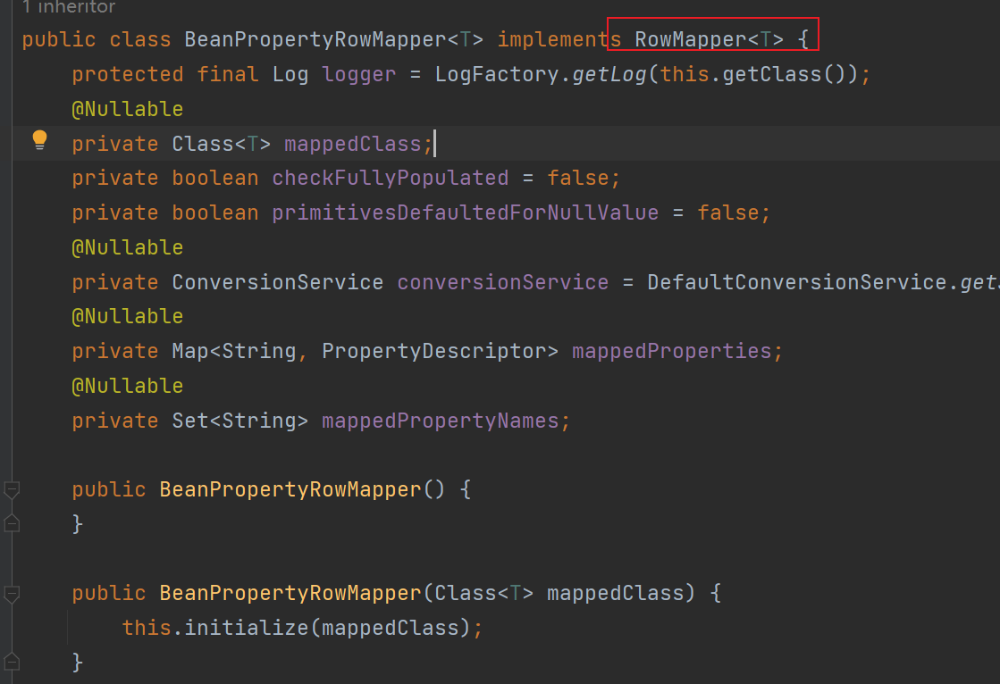

### JDBC查询操作

`jdbcTemplate.queryForObject`可以把数据库返回的结果转换成一个Java对象。

查询结果是单行时，用自己定义的Bean接收结果。

```java
@Test
void test02() {
    String sql = "select * from article where id=?";
    // 使用ArticlePO类接收结果
    ArticlePO articlePO = jdbcTemplate.queryForObject(sql,
            new BeanPropertyRowMapper<>(ArticlePO.class), 1);  // 这里的1表示sql语句中的?位置的参数，有几个?号就有几个值
    System.out.println("articlePO = " + articlePO);
}
```

这里的`BeanPropertyRowMapper`是实现了`RowMapper`接口，那么我们也能自己实现`RowMapper`接口，自定义怎么接收一行数据。



### 自定义RowMapper

```java
@Test
void test03() {
    String sql = "select * from article where id=?";
   
    ArticlePO articlePO = jdbcTemplate.queryForObject(sql,
            (rs, rownum) -> {
                var id = rs.getInt("id");
                var userId = rs.getInt("user_id");
                var title = rs.getString("title");
                var summary = rs.getString("summary");
                var readCount = rs.getInt("read_count");
                var createTime = new Timestamp(rs.getTimestamp("create_time").getTime()).toLocalDateTime();
                var updateTime = new Timestamp(rs.getTimestamp("update_time").getTime()).toLocalDateTime();
                return new ArticlePO(id, userId, title, summary, readCount, createTime, updateTime);
            },1);
    System.out.println("查询文章 = " + articlePO);
}
```

