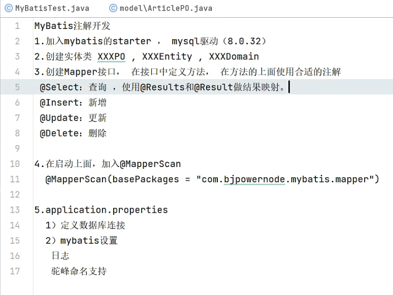

### Mybatis使用流程

先配置application.properties文件：

```properties
# 配置数据源
spring.datasource.driver-class-name=com.mysql.cj.jdbc.Driver
spring.datasource.url=jdbc:mysql://localhost:3306/blog?serverTimezone=Asia/Shanghai&useUnicode=true&characterEncoding=utf8&autoReconnect=true&useSSL=false
spring.datasource.username=root
spring.datasource.password=123456

# 设置执行数据库脚本 always:总是执行 never:不执行脚本了
spring.sql.init.mode=never
```

写查询的Mapper类：

```java
public interface ArticleMapper {
    @Select("""
            select id,user_id,title,summary,read_count,create_time,update_time
                from article where id=#{articleId}
            """)
    // 这里的@Param("articleId")指定上面的占位符是什么
    ArticlePO selectById(@Param("articleId") Integer id);
}
```

启动类加入扫描注解：

```java
@MapperScan(basePackages = {"com.example.mybatis.mapper"})  // Mybatis注解扫描
@SpringBootApplication
public class Lession10MybatisApplication {

    public static void main(String[] args) {
        SpringApplication.run(Lession10MybatisApplication.class, args);
    }

}
```

怎么调用：

```java
@Autowired
private ArticleMapper articleMapper;
@Test
void test01() {
    ArticlePO articlePO = articleMapper.selectById(1);
    System.out.println(articlePO);
}
```

### Results参数

上面的字段如果和类里的属性名称不一一对应的话，会出现查询是null的情况。解决方法有两种：

在application.properties中设置

```properties
# 驼峰，下划线命名
mybatis.configuration.map-underscore-to-camel-case=true
```

或者数据库中的字段名和类中的属性一一对应：

```java
public interface ArticleMapper {

    String field_list = "id,user_id,title,summary,read_count,create_time,update_time";

    @Select("select " + field_list + " from article where id=#{articleId}")
    @Results({
            @Result(id = true, column = "id", property = "id"), // id = true表示主键
            @Result(column = "user_id", property = "userId"),
            @Result(column = "read_count",property = "readCount"),
            @Result(column = "create_time",property = "createTime"),
            @Result(column = "update_time",property = "updateTime"),
    })
    ArticlePO selectById(@Param("articleId") Integer id);
}
```

### 插入数据（下面的操作都是单表查询）

开启Mybatis输出日志：

```properties
# 开启Mybatis日志
mybatis.configuration.log-impl=org.apache.ibatis.logging.stdout.StdOutImpl
```

```java
// Mapper
@Insert("insert into article(user_id,title,summary,read_count,create_time,update_time) values(#{userId},#{title},#{summary},#{readCount},#{createTime},#{updateTime})")
int insertArticle(ArticlePO articlePO);

// 使用
@Test
void test02() {
    ArticlePO article = new ArticlePO();
    article.setTitle("什么时候用微服务");
    article.setSummary("微服务优缺点");
    article.setUserId(219);
    article.setReadCount(560);
    article.setCreateTime(LocalDateTime.now());
    article.setUpdateTime(LocalDateTime.now());
    articleMapper.insertArticle(article);
}
```

### 更新和删除数据

```java
@Update("update article set read_count=#{num} where id=#{id}")
int updateArticle(@Param("id") Integer id, @Param("num") Integer num);

@Delete("delete from article where id=#{id}")
int deleteById(Integer id);

@Test
void test03() {
    articleMapper.updateArticle(1, 9000);
}

@Test
void test04() {
    articleMapper.deleteById(3);
}
```

### 总结


