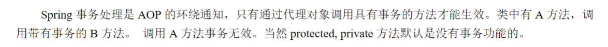
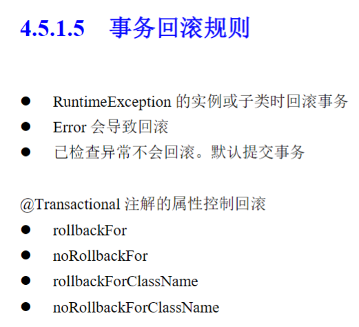

### 事务概述

参考springboot3 pdf教程里的内容。

### 准备事务测试环境

配置数据库连接：application.properties

```properties
# 配置数据源
# 默认连接池，可以修改为其他的，比如Tomcat，DBCP
spring.datasource.type=com.zaxxer.hikari.HikariDataSource
spring.datasource.driver-class-name=com.mysql.cj.jdbc.Driver
spring.datasource.url=jdbc:mysql://localhost:3306/blog?serverTimezone=Asia/Shanghai&useUnicode=true&characterEncoding=utf8&autoReconnect=true&useSSL=false
spring.datasource.username=root
spring.datasource.password=123456
# 连接池的一些配置
spring.datasource.hikari.auto-commit=true
spring.datasource.hikari.maximum-pool-size=10
spring.datasource.hikari.connection-test-query=select 1

# 设置执行数据库脚本 always:总是执行 never:不执行脚本了
spring.sql.init.mode=never

# 驼峰，下划线命名
mybatis.configuration.map-underscore-to-camel-case=true
# 开启Mybatis日志
mybatis.configuration.log-impl=org.apache.ibatis.logging.stdout.StdOutImpl
```

Mapper：

注意配置文件中的驼峰-下划线配置只对Select生效，Insert还是要自己对应数据库字段名和类的属性名。


```java
public interface ArticleMapper {

    @Select("""
        select * from article where id=#{id}
            """)
    ArticlePO selectTest(Integer id);

    @Insert("""
        insert into article(user_id,title,summary,read_count,create_time,update_time) \
            values(#{userId},#{title},#{summary},#{readCount},#{createTime},#{updateTime})
            """)
    @Options(useGeneratedKeys = true, keyColumn = "id", keyProperty = "id")  // 读取自动增长的id值，赋值给参数里的ArticlePO对象的id属性
    int insertArticle(ArticlePO article);

    @Insert("""
        insert into article_detail(article_id,content) \
            values(#{articleId},#{content})
            """)
    int insertArticleContent(ArticleDetailPO articleDetail);
}
```

ServiceImpl：

```java
public class ArticleServiceImpl implements ArticleService {

    @Autowired
    private ArticleMapper articleMapper;

    @Override
    public boolean postNewArticle(ArticlePO article, String content) {

        // 新增文章
        int row = articleMapper.insertArticle(article);

        // 新增文章内容
        ArticleDetailPO articleDetailPO = new ArticleDetailPO();
        articleDetailPO.setArticleId(article.getId());
        articleDetailPO.setContent(content);
        int detailRow = articleMapper.insertArticleContent(articleDetailPO);

        return (row + detailRow) == 2 ? true : false;
    }
}
```

测试：

```java
@Autowired
private ArticleService articleService;

@Test
void testAddArticle() {
    ArticlePO articlePO = new ArticlePO();
    articlePO.setUserId(new Random().nextInt(5000));
    articlePO.setTitle("Spring 事务管理");
    articlePO.setSummary("Spring 事务属性，事务实现");
    articlePO.setReadCount(new Random().nextInt(1000));
    articlePO.setCreateTime(LocalDateTime.now());
    articlePO.setUpdateTime(LocalDateTime.now());
    boolean add = articleService.postNewArticle(articlePO, "Spring 统一事务管理。事务管理器管理本地事务");
    System.out.println("是否成功添加：" + add);
}
```

### 添加事务注解

@Transactional事务注解一般添加在方法上面，因为不是所有的方法都需要事务管理。

```java
@Service
public class ArticleServiceImpl implements ArticleService {

    @Autowired
    private ArticleMapper articleMapper;

    /**
     * @Transactional: 事务注解控制 -- 位置：1.方法的上面，2.类的上面
     *
     * 事务回滚：
     *  1.默认对运行时异常，执行回滚操作
     *  2.rollbackFor：需要回滚的异常列表
     */
    @Transactional(rollbackFor = { RuntimeException.class })
    @Override
    public boolean postNewArticle(ArticlePO article, String content) {

        // 新增文章
        int row = articleMapper.insertArticle(article);

        if(article.getReadCount() < 1) {
            throw new RuntimeException("文章阅读数量小于1");
        }

        // 新增文章内容
        ArticleDetailPO articleDetailPO = new ArticleDetailPO();
        articleDetailPO.setArticleId(article.getId());
        articleDetailPO.setContent(content);
        int detailRow = articleMapper.insertArticleContent(articleDetailPO);

        return (row + detailRow) == 2 ? true : false;
    }
}
```

在启动类上添加开始事务管理注解：

```java
@EnableTransactionManagement  // 开启事务管理注解，可以不加，默认自动开启。
@MapperScan(basePackages = "com.example.trans.mapper")
@SpringBootApplication
public class Lession11TransApplication {

    public static void main(String[] args) {
        SpringApplication.run(Lession11TransApplication.class, args);
    }

}
```

测试：

阅读数量小于1，插入文章会回滚。

```java
@Test
void testTransaction() {
    ArticlePO articlePO = new ArticlePO();
    articlePO.setUserId(new Random().nextInt(5000));
    articlePO.setTitle("Spring 事务管理");
    articlePO.setSummary("Spring 事务属性，事务实现");
    articlePO.setReadCount(0);  // 阅读数量小于1，会抛出异常
    articlePO.setCreateTime(LocalDateTime.now());
    articlePO.setUpdateTime(LocalDateTime.now());
    boolean add = articleService.postNewArticle(articlePO, "Spring 统一事务管理。事务管理器管理本地事务");
    System.out.println("是否成功添加：" + add);
}
```

### 无效事务1



什么事务是无效的：A方法调用B方法（带有事务），这样的事务无效。Spring只拦截调用方法A的事务，不拦截B的事务。

### 无效事务2

事务只在同一个线程中有效，新线程中事务无效。

```java
@Transactional
    @Override
    public boolean postNewArticleThread(ArticlePO article, String content) {
        System.out.println("Start 父线程：" + Thread.currentThread().getId());
        Thread thread = new Thread(() -> {  // 箭头函数重写Thread类的Runnable方法
            System.out.println("Start 子线程：" + Thread.currentThread().getId());
            int row = articleMapper.insertArticle(article);

            if(article.getReadCount() < 1) {
                throw new RuntimeException("====子线程====文章阅读数量小于1");
            }

            // 新增文章内容
            ArticleDetailPO articleDetailPO = new ArticleDetailPO();
            articleDetailPO.setArticleId(article.getId());
            articleDetailPO.setContent(content);
            int detailRow = articleMapper.insertArticleContent(articleDetailPO);
        });
        thread.start();  // 启动子线程
        try {
            thread.join();  // 等待子线程运行完成，再继续后面的代码
        } catch (Exception e) {
            e.printStackTrace();
        }
        System.out.println("End 父线程：" + Thread.currentThread().getId());

        return true;
    }
```

测试：

```java
@Test
void testTransactionThread() {
    ArticlePO articlePO = new ArticlePO();
    articlePO.setUserId(new Random().nextInt(5000));
    articlePO.setTitle("===无效事务2（子线程不存在事务）===Spring 事务管理");
    articlePO.setSummary("===无效事务2（子线程不存在事务）===Spring 事务属性，事务实现");
    articlePO.setReadCount(0);  // 阅读数量小于1，会抛出异常
    articlePO.setCreateTime(LocalDateTime.now());
    articlePO.setUpdateTime(LocalDateTime.now());
    boolean add = articleService.postNewArticleThread(articlePO, "===无效事务2（子线程不存在事务）===Spring 统一事务管理。事务管理器管理本地事务");
    System.out.println("是否成功添加：" + add);
}
```

### 事务回滚规则


