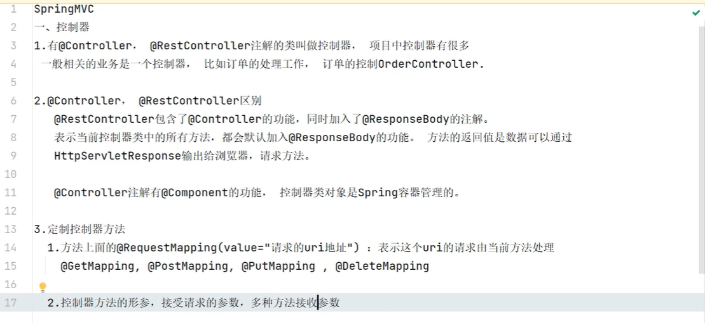
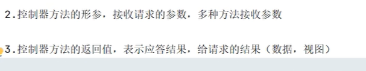
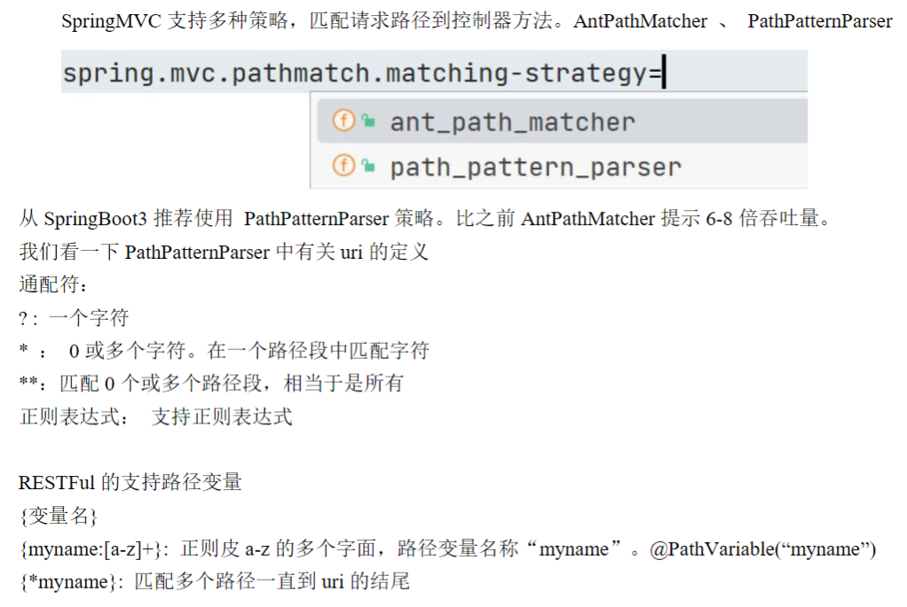
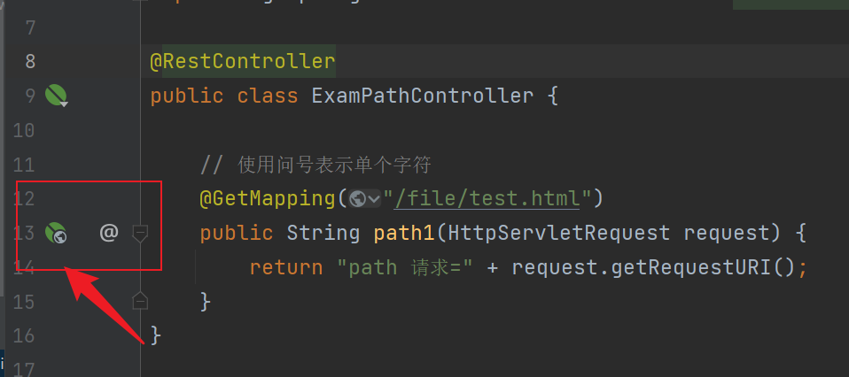
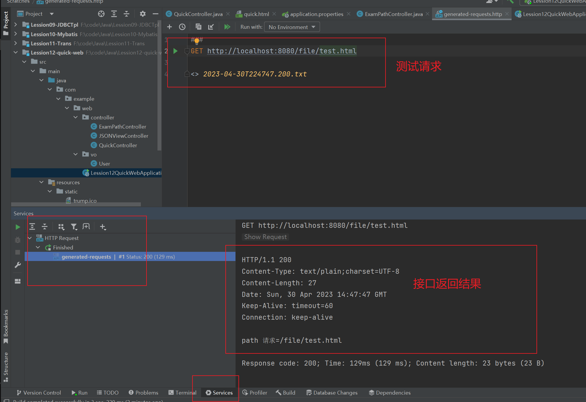

### 控制器

- URI和URL的区别：

  在Java中，URI（Uniform Resource Identifier）和URL（Uniform Resource Locator）是两个常用的概念，它们都用于标识一个资源的唯一位置。尽管这两个概念有时被用来代表相同的事情，但它们之间还是有一些区别的。

  1. URL 是 URI 的一个子集。URL 是一种具体的 URI，它指定了如何定位资源并且确定了访问该资源所需的协议。所以说，URL 是一种可以被解析的 URI。
  2. URI 用于标识某个资源的唯一位置，而不仅仅是定位它。一个 URI 可以是一个 URL，也可以是一个 URN（Uniform Resource Name）或者是一个 URC（Uniform Resource Citation）。URL 是 URI 的一种特定类型，它使用了某种协议（如HTTP、FTP、SMTP等）来定位资源。
  3. 在 Java 中，URI 类是用来处理标识符的，包括 URN 和 URL。它提供了许多方法来解析、构造、规范化、比较和转换 URI。URL 类则是用来表示 URL 地址的，它继承自 URI 类，提供了一些额外的方法，如打开连接和获取连接信息等。

  综上所述，URI 是一种用于标识资源的通用方式，而 URL 则是一种特定的 URI，用于定位并访问资源。在 Java 中，URI 类可以处理任何类型的 URI，而 URL 类则仅限于处理 URL。

`@Controller`和`@RestController`注解都表示当前类是控制器，`@RestController`包括`@Controller`的功能，比多了一个`@ResponeBody`这个注解，可以直接返回一个对象，不用手动写了。





### 匹配请求路径到控制器方法



application.properties配置文件：

```properties
spring.mvc.pathmatch.matching-strategy=path_pattern_parser
```

```java
@RestController
public class ExamPathController {

    // 使用问号表示单个字符
    @GetMapping("/file/t?st.html")
    public String path1(HttpServletRequest request) {
        return "path 请求=" + request.getRequestURI();
    }
}
```

在测试接口的时候，除了直接重启服务器，在浏览器中以地址访问，还能使用PostMan，或者IDEA中自带的HttpClient测试接口，这样就不用每次重启服务器了。

直接在接口的地方点下面这个图标：



