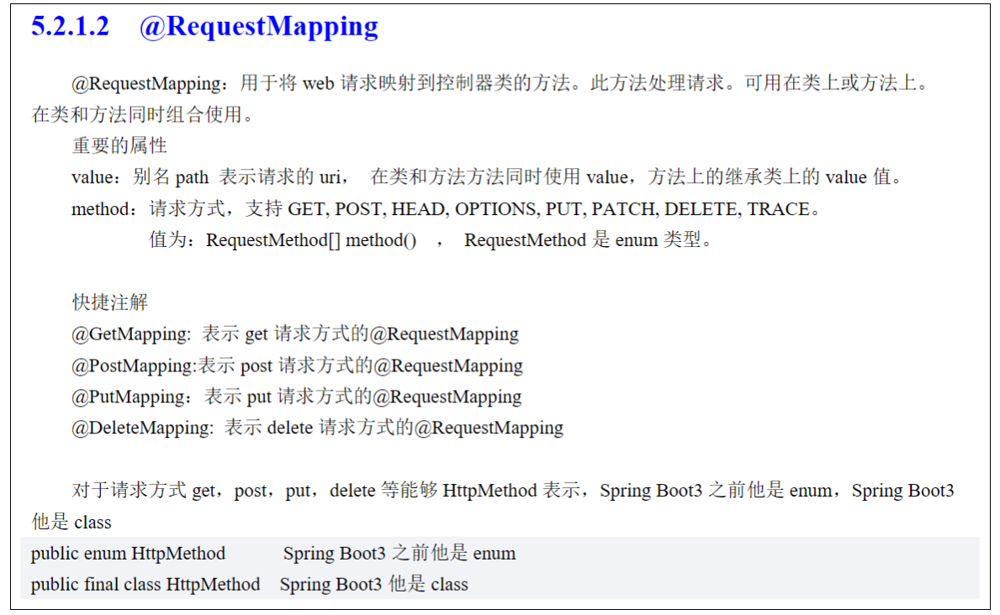

### @RequestMapping



### 控制器方法参数类型与可用返回值类型

参考pdf教程5.2.1.3

### 接收URI参数的几中方法

```java
@RestController
public class ParamController {

    // 一一对应，适合接收简单类型的数据：String, int, long, double, float，参数数量少，比如时@2,3
    // http://localhost:8080/p?name=lisi&age=20&sex=m
    @GetMapping("/param/p1")
    public String p1(String name, Integer age, String sex) {
        return "接收参数：" + name + age + sex;
    }

    @GetMapping("/param/json")
    public String p2(Person person, String type) {
        return "对象转json格式：" + person.toString() + ",type=" + type;
    }

    @GetMapping("/param/request")
    public String p3(HttpServletRequest request) {
        String name = request.getParameter("name");
        String age = request.getParameter("age");
        String sex = request.getParameter("sex");
        return "name=" + name + ",age=" + age + ",sex=" + sex;
    }

    @GetMapping("/param/p4")
    public String p4(@RequestParam(value = "name", required =true) String name,
                     @RequestParam(value = "age", required = false, defaultValue = "33") Integer age) {
        return "p4, name=" + name + ",age=" + age;
    }

    // 使用RequestHeader
    @GetMapping("/param/head")
    public String p5(String name, @RequestHeader("Accept") String accept) {
        return "header: name=" + name + ",accept_type=" + accept;
    }


    /**
     * 前端数据：{"name":"lzh, "age":20, "sex":"m"}
     * @RequestBody：从请求体中读取json数据，将数据转为形参对象的属性值
     *               框架创建User对象，将name,age,sex key的值赋值给三个同名的属性
     */
    @PostMapping("/param/body")
    public String p6(@RequestBody Person person) {
        return "RequestBody: json=" + person.toString();
    }

}
```

测试：

```http
### 逐一接收参数
GET http://localhost:8080/param/p1?name=lzh&age=22&sex=m

<> 2023-05-01T172037.200.txt

### 对象接收参数
GET http://localhost:8080/param/json?name=lzh&age=22&sex=m&type=ttt

<> 2023-05-01T172206.200.txt

### request.getParameter获取参数
GET http://localhost:8080/param/request?name=lzh&age=22&sex=m

<> 2023-05-01T172308.200.txt

### @RequestParam注解，指定参数key值
GET http://localhost:8080/param/p4?name=lzh&age=23

<> 2023-05-01T172431.200.txt

### @RequestParam注解，指定参数key值，设置默认值
GET http://localhost:8080/param/p4?name=lzh

<> 2023-05-01T172447.200.txt

### @RequestHeader注解
GET http://localhost:8080/param/head?name=lzh
Accept: application/json

<> 2023-05-01T172605.200.json

### @RequestBody接收前端传来的json格式数据
POST http://localhost:8080/param/body
Content-Type: application/json

{"name":"lzh", "age":20, "sex":"m"}

<> 2023-05-01T172946.200.txt
```

