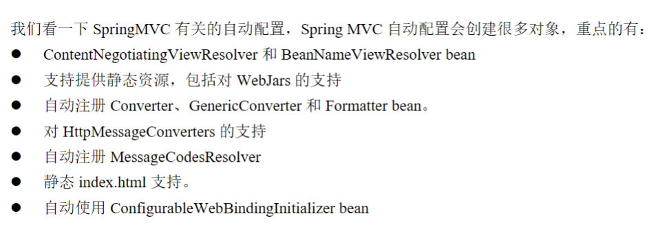
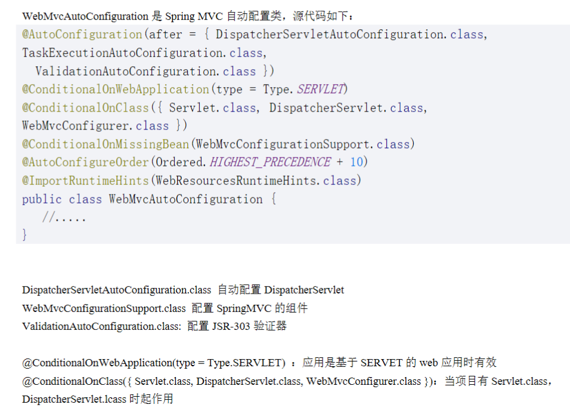

### SpringMVC 自动配置

Springboot的自动配置类的路径如下：`org\springframework\boot\spring-boot-autoconfigure\3.0.6\spring-boot-autoconfigure-3.0.6.jar!\META-INF\spring\org.springframework.boot.autoconfigure.AutoConfiguration.imports`

DispatcherServlet类由SpringBoot框架中的SpringMVC自动配置创建。

WebMvcAutoConfiguration 是 Spring MVC 自动配置类，包括在springboot的自动配置类下。

