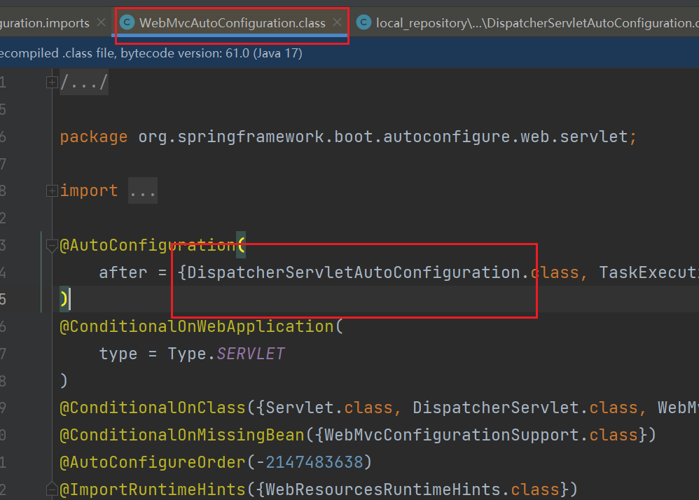
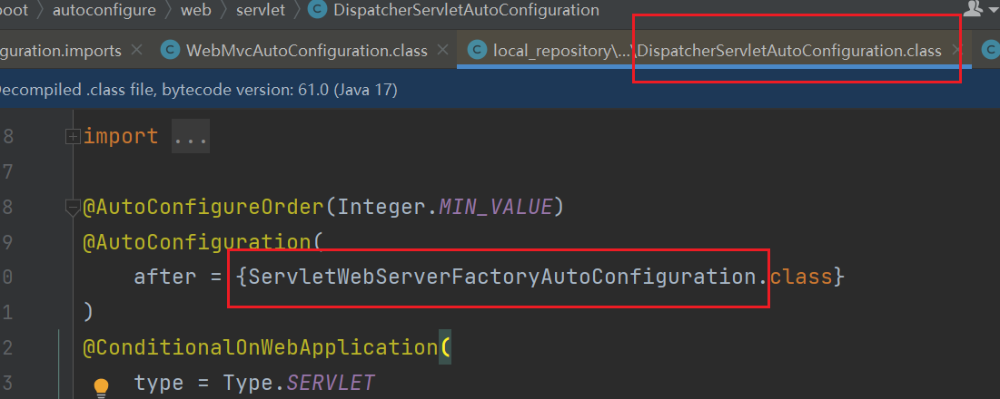
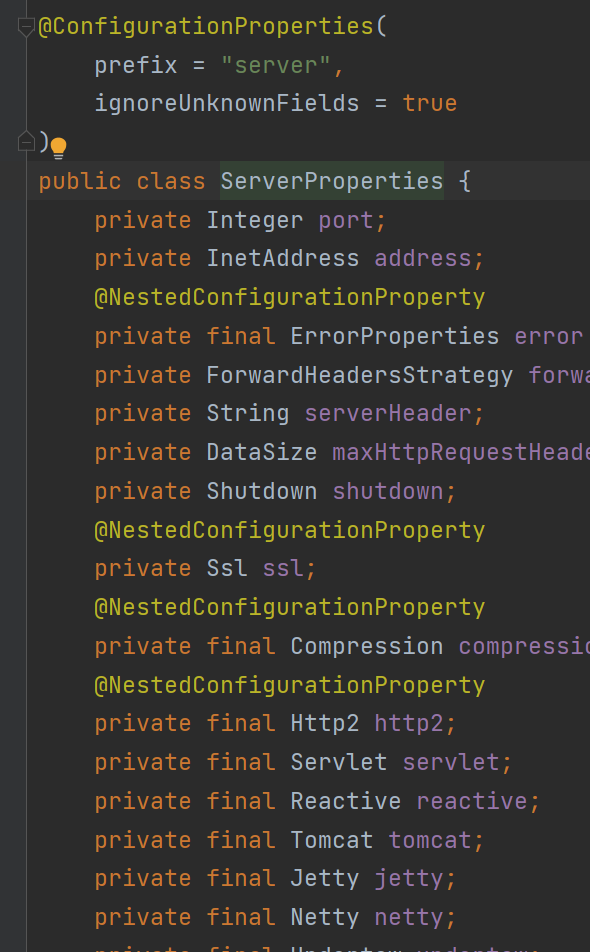

### 自动配置Web服务器







### 内置Tomcat服务器配置

```properties
#服务器端口号
server.port=8001
#上下文访问路径
server.servlet.context-path=/api
#request，response 字符编码
server.servlet.encoding.charset=utf-8
#强制 request，response 设置 charset 字符编码
server.servlet.encoding.force=true
#日志路径
#server.tomcat.accesslog.directory=D:/logs
#启用访问日志
server.tomcat.accesslog.enabled=true
#日志文件名前缀
server.tomcat.accesslog.prefix=access_log
#日志文件日期时间
server.tomcat.accesslog.file-date-format=.yyyy-MM-dd
#日志文件名称后缀
server.tomcat.accesslog.suffix=.log
#post 请求内容最大值，默认 2M
server.tomcat.max-http-form-post-size=2000000
#服务器最大连接数
server.tomcat.max-connections=8192
```

