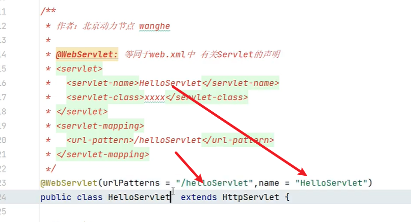

### 注解方式创建HttpServlet



```java
@WebServlet(urlPatterns = "/helloServlet", name = "HelloServlet")
public class HelloServlet extends HttpServlet {

    @Override
    protected void doGet(HttpServletRequest req, HttpServletResponse resp) throws ServletException, IOException {
        resp.setContentType("text/html;charset=utf-8");
        PrintWriter writer = resp.getWriter();
        writer.println("Hello, Servlet!");
        writer.flush();
        writer.close();
    }
}
```

```java
@ServletComponentScan(basePackages = {"com.example.web.servlet"})
@SpringBootApplication
public class Lession13ServletFilterApplication {

	public static void main(String[] args) {
		SpringApplication.run(Lession13ServletFilterApplication.class, args);
	}
}
```

### 不需要注解的方式创建Servlet

能够编码方式控制 Servlet，不需要注解。

配置类：

```java
@Configuration
public class WebAppConfig {

    @Bean  // 注意这个Bean
    public ServletRegistrationBean addServlet() {
        // 创建ServletRegistrationBean 登录一个或多个Servlet
        ServletRegistrationBean registrationBean = new ServletRegistrationBean();
        registrationBean.setServlet(new LoginServlet());
        registrationBean.addUrlMappings("/user/login");
        registrationBean.setLoadOnStartup(1);
        return registrationBean;
    }
}
```

Servlet类：

```java
public class LoginServlet extends HttpServlet {

    @Override
    protected void doGet(HttpServletRequest req, HttpServletResponse resp) throws ServletException, IOException {
        resp.setContentType("text/html;charset=utf-8");
        PrintWriter writer = resp.getWriter();
        writer.println("Hello, Servlet!不需要注解创建的Servlet");
        writer.flush();
        writer.close();
    }
}
```

