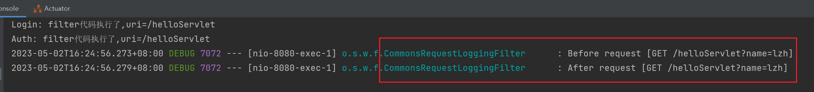

### 过滤器的作用和创建

请求处理的中间件。

Filter 对象使用频率比较高，比如记录日志，权限验证，敏感字符过滤等等。Web 框架中包含内置的 Filter，
SpringMVC 中也包含较多的内置 Filter，比如 CommonsRequestLoggingFilter，CorsFilter，FormContentFilter...

```java
@WebFilter(urlPatterns = "/*")
public class LoginFilter implements Filter {

    @Override
    public void doFilter(ServletRequest request, ServletResponse response, FilterChain chain) throws IOException, ServletException {
        String requestUri = ((HttpServletRequest)request).getRequestURI();
        System.out.println("filter代码执行了,uri=" + requestUri);
        chain.doFilter(request, response);
    }
}
```

```java
@ServletComponentScan(basePackages = {"com.example.web.servlet", "com.example.web.filter"})
@SpringBootApplication
public class Lession13ServletFilterApplication {

   public static void main(String[] args) {
      SpringApplication.run(Lession13ServletFilterApplication.class, args);
   }

}
```

### 无注解创建

```java
@Configuration
public class WebAppConfig {

    @Bean
    public ServletRegistrationBean addServlet() {
        // 创建ServletRegistrationBean 登录一个或多个Servlet
        ServletRegistrationBean registrationBean = new ServletRegistrationBean();
        registrationBean.setServlet(new LoginServlet());
        registrationBean.addUrlMappings("/user/login");
        registrationBean.setLoadOnStartup(1);
        return registrationBean;
    }

    @Bean
    public FilterRegistrationBean addFilter() {
        FilterRegistrationBean filterRegistrationBean = new FilterRegistrationBean();
        filterRegistrationBean.setFilter(new LoginFilter());
        filterRegistrationBean.addUrlPatterns("/*");
        return filterRegistrationBean;
    }
}
```

### 控制Filter执行顺序

- 在`FilterRegistrationBean`中使用`filterRegistration.setOrder(1)`方法，设置Filter在chain中的执行顺序。

- 不用这个属性就根据FIlter类名的字典序先后执行。

```java
@Bean
public FilterRegistrationBean addFilterAuth() {
    FilterRegistrationBean filterRegistrationBean = new FilterRegistrationBean();
    filterRegistrationBean.setFilter(new AuthFilter());
    filterRegistrationBean.addUrlPatterns("/*");
    filterRegistrationBean.setOrder(1);
    return filterRegistrationBean;
}

@Bean
public FilterRegistrationBean addFilterLogin() {
    FilterRegistrationBean filterRegistrationBean = new FilterRegistrationBean();
    filterRegistrationBean.setFilter(new LoginFilter());
    filterRegistrationBean.addUrlPatterns("/*");
    filterRegistrationBean.setOrder(0);
    return filterRegistrationBean;
}
```

### 内置过滤器

```java
@Bean
public FilterRegistrationBean embedFilter() {
    FilterRegistrationBean registrationBean = new FilterRegistrationBean();
    CommonsRequestLoggingFilter commonsRequestLoggingFilter = new CommonsRequestLoggingFilter();
    // 包含请求uri
    commonsRequestLoggingFilter.setIncludeQueryString(true);
    // 登记Filter
    registrationBean.setFilter(commonsRequestLoggingFilter);
    registrationBean.addUrlPatterns("/*");
    return registrationBean;
}
```

```properties
logging.level.web=debug
```

