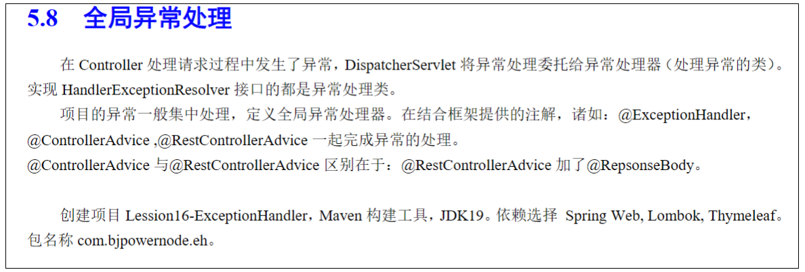

### 全局异常处理



### 全局异常处理器

`handler/GlobalExceptionHandler`：

```java
@ControllerAdvice
public class GlobalExceptionHandler {

    // 用视图页面作为展示
    @ExceptionHandler({ArithmeticException.class})
    public String handleArithmeticException(ArithmeticException e, Model model) {
        String err = e.getMessage();
        model.addAttribute("err", err);
        return "exp";
    }

    // 其他异常
    @ExceptionHandler({Exception.class})
    @ResponseBody  // 不返回视图，直接返回数据
    public Map<String, Object> handleRootException(Exception e) {
        String err = e.getMessage();
        HashMap<String, Object> map = new HashMap<>();
        map.put("错误原因", err);
        map.put("解决方法", "请稍后重试");
        return map;
    }
}
```

`controller/DivideController`：

```java
@RestController
public class DivideController {

    @GetMapping("/divide")
    public String divide(Integer n1, Integer n2) {
        int res = n1 / n2;
        return "n1 / n2 = " + res;
    }
}
```

`static/input.html`：

```html
<!DOCTYPE html>
<html lang="en">
<head>
    <meta charset="UTF-8">
    <title>除法</title>
</head>
<body>
    <form action="divide" method="get">
        除&nbsp;&nbsp;&nbsp;数：<input name="n1" /> <br/>
        被除数：<input name="n2" /> <br/>
        <input type="submit" value="计算">
    </form>
</body>
</html>
```

`templates/exp.html`:

```html
<!DOCTYPE html>
<html lang="en">
<head>
    <meta charset="UTF-8">
    <title>Title</title>
</head>
<body>
  错误原因：<h3 th:text="${err}"></h3>
</body>
</html>
```

### BeanValidator 异常处理

使用 JSR-303 验证参数时，每个Controller方法都需要加`BindingResult br`获取校验结果，这样的操作是十分繁琐的，可以使用全局异常统一处理。

`controller/OrderController`:

```java
@RestController
public class OrderController {

    @PostMapping("/order/new")
    public String createOrder(@Validated @RequestBody OrderVO orderVO) {
        return "订单信息是: " + orderVO.toString();
    }
}
```

`handler/OrderExceptionHandler`:

```java
@RestControllerAdvice
public class OrderExceptionHandler {

    // 检测数据异常
    @ExceptionHandler({BindException.class})
    public Map<String, Object> handleJSR303Exception(BindException e) {
        HashMap<String, Object> map = new HashMap<>();

        BindingResult bindingResult = e.getBindingResult();
        if (bindingResult.hasErrors()) {
            List<FieldError> list = bindingResult.getFieldErrors();
            list.forEach(err -> {
                map.put("错误原因: " + err.getField(), err.getDefaultMessage());
            });
        }
        return map;
    }
}
```

`vo/OrderVO`:

```java
@Data
public class OrderVO {

    @NotBlank(message = "订单名称不能为空")
    private String name;

    @NotNull(message = "商品数量必须有值")
    private Integer amount;

    @NotNull(message = "用户不能为空")
    private Integer userId;

}
```

```http
###
POST http://localhost:8080/order/new
Content-Type: application/json

{
  "name": "lzh",
  "amount": 0,
  "userId": 0
}
```