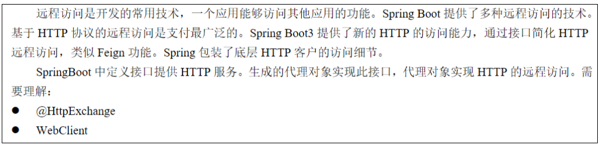
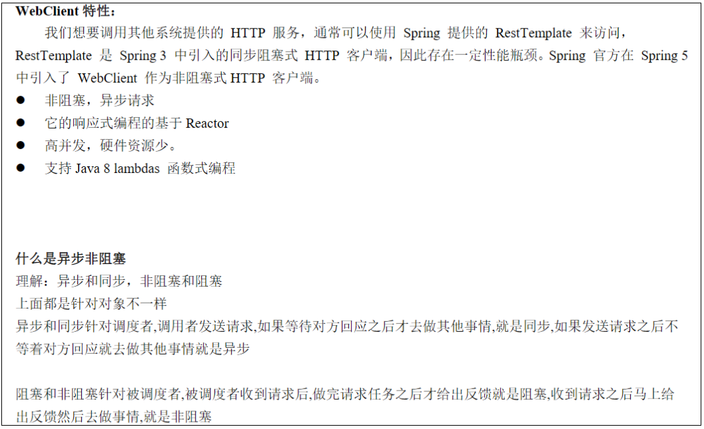
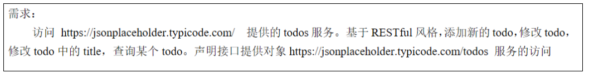
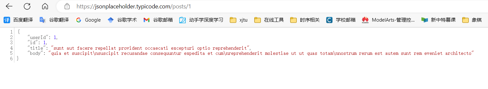

### HttpExchange远程访问

通过HttpExchange访问别的App的接口，获取相关数据处理自己的业务逻辑。



### WebClient

Java 平台中没有名为 WebClient 的标准类，但是有多种库和框架可以用来实现类似的功能。以下是其中几个常用的库和框架：

1. java.net.HttpURLConnection：这是 Java 标准库中的一个类，可以用来发送 HTTP 请求和接收响应。HttpURLConnection 类提供了一系列的方法和属性，可以设置请求头、请求方法、请求参数等，并可以读取服务器返回的响应数据。
2. Apache HttpClient：这是一个功能强大的 HTTP 客户端库，它提供了更多的功能和灵活性，可以用来处理各种类型的 HTTP 请求和响应。Apache HttpClient 支持连接池、连接重用、身份验证、Cookie 管理等功能，可以提高网络通信的效率和可靠性。
3. OkHttp：这是一个轻量级的 HTTP 客户端库，由 Square 公司开发。OkHttp 具有简单易用、性能优秀、支持 HTTP/2 等特点，是一个非常流行的 HTTP 客户端库。

以上这些库都可以用来实现类似 WebClient 的功能，开发者可以根据自己的需求选择合适的库来完成网络通信。



### 免费的远程接口

介绍一个免费的、24h 在线的 Rest Http 服务，每月提供近 20 亿的请求，关键还是免费的、可公开访问的[https://jsonplaceholder.typicode.com]。

### 通过WebClient远程访问Get接口





创建接收数据的对象。

```java
@Data
public class Todo {

    private Integer userId;
    private Integer id;
    private String title;
    private String body;
}
```

调用`@GetExchange`注解，使用代理WebClient对象访问远程Http服务。

```java
@Service
public interface TodeService {

    // 一个方法就是一个远程服务（远程调用）
    @GetExchange("/todos/{id}")
    Todo getTodobody(@PathVariable("id") Integer id);
}
```

工厂模式为TodoService创建WebClient代理对象。

```java
// 创建HTTP服务代理对象
@Configuration(proxyBeanMethods = false)
public class HttpConfiguration {

    @Bean
    public TodeService requestService() {
        WebClient webClient = WebClient.builder().baseUrl("https://jsonplaceholder.typicode.com").build();
        HttpServiceProxyFactory factory = HttpServiceProxyFactory.builder(WebClientAdapter.forClient(webClient)).build();
        return factory.createClient(TodeService.class);
    }
}
```

四种访问方式：

```java
@Service
public interface TodeService {

    // 一个方法就是一个远程服务（远程调用）
    @GetExchange("/todos/{id}")
    Todo getTodobody(@PathVariable("id") Integer id);

    // 创建一个新的Todo
    @PostExchange("/posts")
    Todo createTodo(@RequestBody Todo newTodo);

    // 更新Todo，ResponseEntity拿到相应的请求头等信息
    @PutExchange("/posts/{id}")
    ResponseEntity<Todo> updateTodo(@PathVariable("id") Integer id, @RequestBody Todo updateTodo);

    // 删除Todo
    @DeleteExchange("/posts/{id}")
    void removeTodo(@PathVariable("id") Integer id);
}
```

测试方法：

```java
@SpringBootTest
class Lession18HttpExchangeApplicationTests {

    @Autowired
    private TodeService todeService;

    @Test
    void testGet() {
        Todo todo = todeService.getTodobody(2);
        System.out.println(todo.toString());
    }

    @Test
    void testPost() {
        Todo todo = new Todo();
        todo.setUserId(1);
        todo.setBody("lzh");
        todo.setTitle("lzhlzh");
        Todo res = todeService.createTodo(todo);
        System.out.println(res.toString());
    }

    @Test
    void testUpdate() {
        Todo todo = new Todo();
        todo.setUserId(2);
        todo.setBody("lzh");
        todo.setTitle("lzhlzh");
        ResponseEntity<Todo> todoResponseEntity = todeService.updateTodo(1, todo);
        HttpStatusCode statusCode = todoResponseEntity.getStatusCode();
        HttpHeaders headers = todoResponseEntity.getHeaders();
        Todo body = todoResponseEntity.getBody();
        System.out.println(statusCode + "==" + headers + "==" + body.toString());
    }
}
```