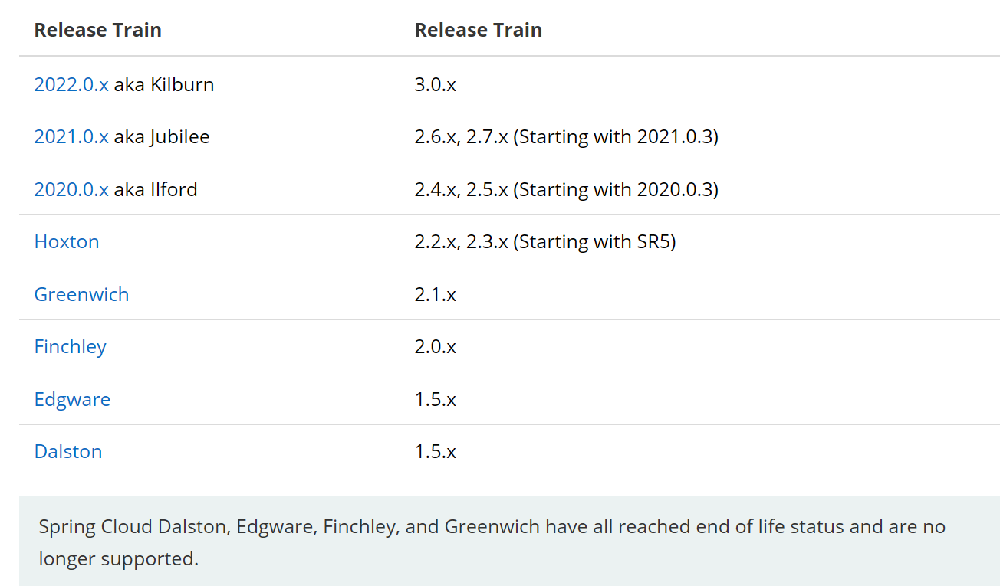
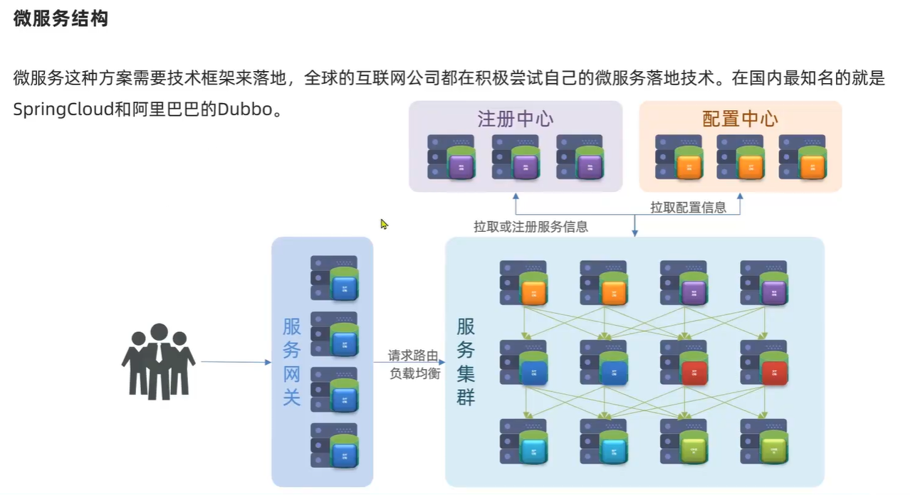
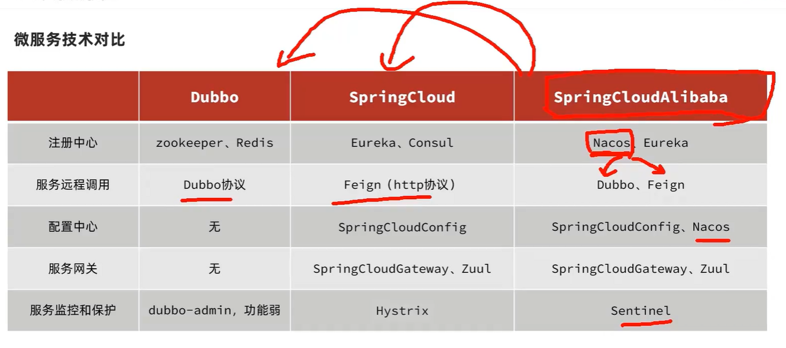
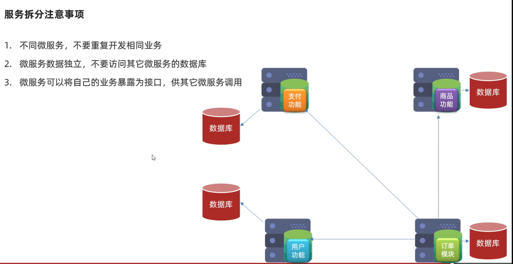

spingcloud和springboot的版本对应关系：[[官网](https://spring.io/projects/spring-cloud#overview)]

### 微服务基本概念

注册中心：维护每个节点的信息，监控每个节点的状态。

配置中心：随着微服务越来越多，不可能直接在微服务中直接修改配置，在配置中心统一配置。

**微服务技术对比**

### 服务拆分注意事项

