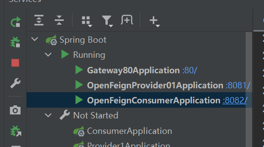

## Gateway

### 快速入门

在OpenFeign项目的基础上，加上Gateway服务。

在`application.yml`中配置provider和consumer在网关中的路由

```yml
server:
  port: 80

spring:
  application:
    name: gateway-80
  cloud:
    gateway:
      enabled: true  # 开启网关，默认是开启的
      routes:  # 设置路由，注意是数组，可以设置多个，按照id做隔离
        - id: provider-service-router  # 路由id，没有要求，保持唯一即可
          uri: http://localhost:8081  # 设置真正的服务ip:port
          predicates:  # 断言匹配
            - Path=/doOrder/**  # 和服务中的路径匹配，是正则匹配的模式
        - id: user-service-router  # 路由id，没有要求，保持唯一即可
          uri: http://localhost:8082  # 设置真正的服务ip:port
          predicates: # 断言匹配
            - Path=/userOrder/**  # 如果匹配到第一个路由，则第二个就不会走了，注意这不是负载均衡
# eureka的配置
eureka:
  instance:
    instance-id: ${spring.application.name}:${server.port}
    prefer-ip-address: true
  client:
    service-url:
      defaultZone: http://101.42.7.230:8761/eureka
```

由于Gateway只是起一个网关的作用，所以不需要spring web依赖。在启动类中，开启`@EnableEurekaClient`，因为Gateway也是一个Eureka客户端。

```java
@SpringBootApplication
@EnableEurekaClient  // 网关也是eureka客户端
public class Gateway80Application {

    public static void main(String[] args) {
        SpringApplication.run(Gateway80Application.class, args);
    }

}
```

测试：访问http://localhost/doOrder和http://localhost/userOrder



### 和nginx结合模拟小集群

参考pdf。

### 9.Gateway 微服务==名==动态路由，负载均衡

从之前的配置里面我们可以看到我们的 URL 都是写死的，这不符合我们微服务的要求，我们微服务是只要知道服务的名字，根据名字去找，而直接写死就没有负载均衡的效果了
默认情况下 Gateway 会根据注册中心的服务列表，以注册中心上微服务名为路径创建动态路由进行转发，从而实现动态路由的功能需要注意的是 uri 的协议为 lb（load Balance），表示启用 Gateway 的负载均衡功能。==lb://serviceName== 是 spring cloud gateway 在微服务中自动为我们创建的负载均衡 uri。

```yml
server:
  port: 80

spring:
  application:
    name: gateway-80
  cloud:
    gateway:
      enabled: true  # 开启网关，默认是开启的
      routes:  # 设置路由，注意是数组，可以设置多个，按照id做隔离
        - id: provider-service-router  # 路由id，没有要求，保持唯一即可
#          uri: http://localhost:8081  # 设置真正的服务ip:port
          uri: lb://openfeign-provider-service  # 根据服务名实现负载均衡
          predicates:  # 断言匹配
            - Path=/doOrder/**  # 和服务中的路径匹配，是正则匹配的模式
        - id: user-service-router  # 路由id，没有要求，保持唯一即可
#          uri: http://localhost:8082  # 设置真正的服务ip:port
          uri: lb://openfeign-consumer-service
          predicates: # 断言匹配
            - Path=/userOrder/**  # 如果匹配到第一个路由，则第二个就不会走了，注意这不是负载均衡
# eureka的配置
eureka:
  instance:
    instance-id: ${spring.application.name}:${server.port}
    prefer-ip-address: true
  client:
    service-url:
      defaultZone: http://101.42.7.230:8761/eureka
```

### Gateway断言总结

断言用来定义路由的负载均衡规则。

具体见pdf。

### 拦截器

见pdf。

### 限流

见pdf。

### 跨域配置

见pdf。