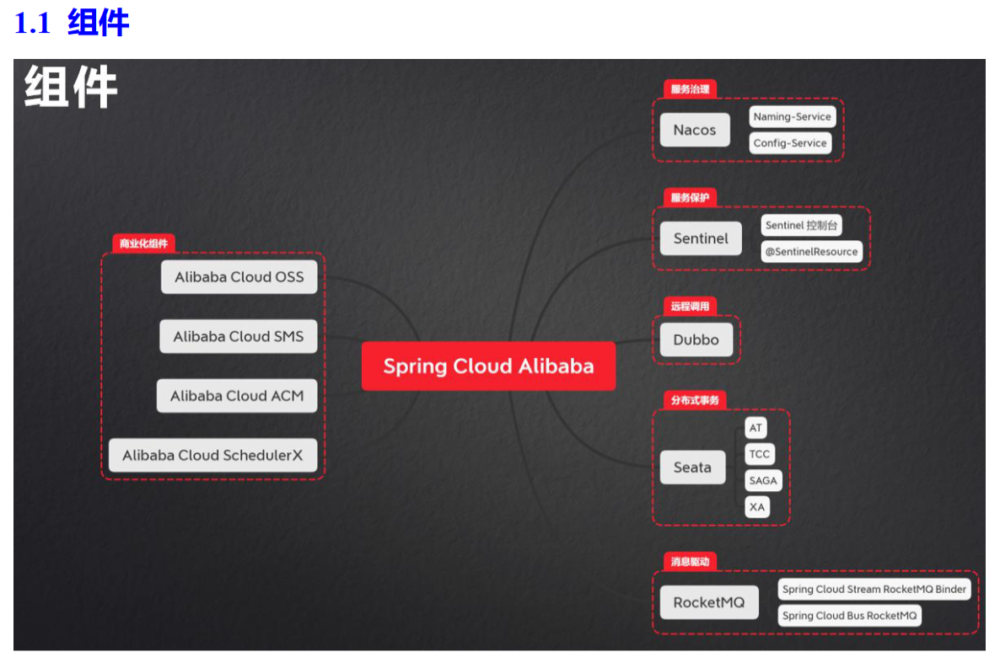
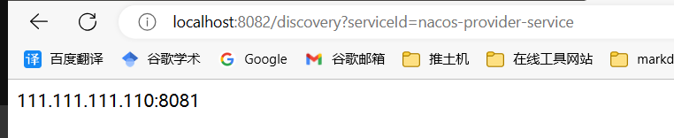

# Spring Cloud Alibaba

和Springboot版本对应说明：[官方](https://github.com/alibaba/spring-cloud-alibaba/wiki/%E7%89%88%E6%9C%AC%E8%AF%B4%E6%98%8E)

[官方文档](https://spring.io/projects/spring-cloud-alibaba#learn)



### naocs注册中心

详细操作和介绍见java目录下的21.nacos的使用。

### 快速入门

在创建naocs项目时，使用start.aliyun.com构建SpringCloudAlibaba项目。

创建provider

```java
@RestController
public class ProviderController {

    @GetMapping("hello")
    public String hello() {
        return "provider: hello";
    }
}

@SpringBootApplication
@EnableDiscoveryClient
public class ProviderApplication {

    public static void main(String[] args) {
        SpringApplication.run(ProviderApplication.class, args);
    }

}
```

```yml
server:
  port: 8081
spring:
  application:
    name: nacos-provider-service
  cloud:
    nacos:
      discovery:
        server-addr: localhost:8848
        username: nacos
        password: nacos
```

创建consumer类

```java
@RestController
public class ConsumerController {

    @Autowired
    private DiscoveryClient discoveryClient;

    @GetMapping("discovery")
    public String discovery(String serviceId) {
        // 根据实例名称拿到实例集合
        List<ServiceInstance> instances = discoveryClient.getInstances(serviceId);
        ServiceInstance serviceInstance = instances.get(0);
        System.out.println(serviceInstance.getHost() + ":" + serviceInstance.getPort());
        return serviceInstance.getHost() + ":" + serviceInstance.getPort();
    }
}

@SpringBootApplication
@EnableDiscoveryClient
public class NacosConsumerApplication {

    public static void main(String[] args) {
        SpringApplication.run(NacosConsumerApplication.class, args);
    }

}
```

测试运行



### 和Feign结合

和OpenFeign一起实现负载均衡。

在consumer的代码中引入feign依赖和springcloud依赖管理：

```xml
<?xml version="1.0" encoding="UTF-8"?>
<project xmlns="http://maven.apache.org/POM/4.0.0" xmlns:xsi="http://www.w3.org/2001/XMLSchema-instance"
         xsi:schemaLocation="http://maven.apache.org/POM/4.0.0 https://maven.apache.org/xsd/maven-4.0.0.xsd">
    <modelVersion>4.0.0</modelVersion>
    <groupId>com.example</groupId>
    <artifactId>nacosConsumer</artifactId>
    <version>0.0.1-SNAPSHOT</version>
    <name>02-consumer</name>
    <description>02-consumer</description>
    <properties>
        <java.version>1.8</java.version>
        <project.build.sourceEncoding>UTF-8</project.build.sourceEncoding>
        <project.reporting.outputEncoding>UTF-8</project.reporting.outputEncoding>
        <spring-boot.version>2.3.12.RELEASE</spring-boot.version>
        <spring-cloud-alibaba.version>2.2.10-RC1</spring-cloud-alibaba.version>
        <spring-cloud.version>Hoxton.SR12</spring-cloud.version>
    </properties>
    <dependencies>
        <dependency>
            <groupId>org.springframework.boot</groupId>
            <artifactId>spring-boot-starter-web</artifactId>
        </dependency>
        <dependency>
            <groupId>com.alibaba.cloud</groupId>
            <artifactId>spring-cloud-starter-alibaba-nacos-discovery</artifactId>
        </dependency>

        <dependency>
            <groupId>org.springframework.boot</groupId>
            <artifactId>spring-boot-starter-test</artifactId>
            <scope>test</scope>
            <exclusions>
                <exclusion>
                    <groupId>org.junit.vintage</groupId>
                    <artifactId>junit-vintage-engine</artifactId>
                </exclusion>
            </exclusions>
        </dependency>
        <dependency>
            <groupId>org.springframework.cloud</groupId>
            <artifactId>spring-cloud-starter-openfeign</artifactId>
        </dependency>
    </dependencies>
    <dependencyManagement>
        <dependencies>
            <dependency>
                <groupId>org.springframework.boot</groupId>
                <artifactId>spring-boot-dependencies</artifactId>
                <version>${spring-boot.version}</version>
                <type>pom</type>
                <scope>import</scope>
            </dependency>
            <dependency>
                <groupId>com.alibaba.cloud</groupId>
                <artifactId>spring-cloud-alibaba-dependencies</artifactId>
                <version>${spring-cloud-alibaba.version}</version>
                <type>pom</type>
                <scope>import</scope>
            </dependency>
            <!-- spring cloud 版本管理 -->
            <dependency>
                <groupId>org.springframework.cloud</groupId>
                <artifactId>spring-cloud-dependencies</artifactId>
                <version>${spring-cloud.version}</version>
                <type>pom</type>
                <scope>import</scope>
            </dependency>
        </dependencies>
    </dependencyManagement>

    <build>
        <plugins>
            <plugin>
                <groupId>org.apache.maven.plugins</groupId>
                <artifactId>maven-compiler-plugin</artifactId>
                <version>3.8.1</version>
                <configuration>
                    <source>1.8</source>
                    <target>1.8</target>
                    <encoding>UTF-8</encoding>
                </configuration>
            </plugin>
            <plugin>
                <groupId>org.springframework.boot</groupId>
                <artifactId>spring-boot-maven-plugin</artifactId>
                <version>${spring-boot.version}</version>
                <configuration>
                    <mainClass>com.example.NacosConsumerApplication</mainClass>
                    <skip>true</skip>
                </configuration>
                <executions>
                    <execution>
                        <id>repackage</id>
                        <goals>
                            <goal>repackage</goal>
                        </goals>
                    </execution>
                </executions>
            </plugin>
        </plugins>
    </build>

</project>
```

```java
@FeignClient(value = "nacos-provider-service")
public interface ConsumerFeign {

    @GetMapping("hello")
    public String userHello();
}

@RestController
public class ConsumerController {

    @Autowired
    private DiscoveryClient discoveryClient;

    @Autowired
    private ConsumerFeign consumerFeign;

    @GetMapping("discovery")
    public String discovery(String serviceId) {
        // 根据实例名称拿到实例集合
        List<ServiceInstance> instances = discoveryClient.getInstances(serviceId);
        ServiceInstance serviceInstance = instances.get(0);
        System.out.println(serviceInstance.getHost() + ":" + serviceInstance.getPort());
        return serviceInstance.getHost() + ":" + serviceInstance.getPort();
    }

    @GetMapping("userHello")
    public String userHello() {
        return consumerFeign.userHello();
    }
}

@SpringBootApplication
@EnableDiscoveryClient
@EnableFeignClients
public class NacosConsumerApplication {

    public static void main(String[] args) {
        SpringApplication.run(NacosConsumerApplication.class, args);
    }

}
```

### Nacos Discovery 对外暴露 Endpoint

详细见pdf。

Endpoint是什么？

"Nacos" 是一个开源的服务发现、配置管理和服务管理平台，用于帮助开发人员实现微服务架构中的服务注册、发现、配置以及动态管理。"Endpoint" 是 Nacos 中的一个概念，表示服务的网络地址或者终结点。

在 Nacos 中，"Endpoint" 通常指代一个服务实例的网络地址，可以是 IP 地址加上端口号，用于标识一个特定的服务提供者。服务消费者可以通过查询 Nacos 注册中心的 Endpoint 信息来发现并访问服务提供者。

举例来说，假设有一个微服务系统中的一个 "UserService" 服务，它有多个实例运行在不同的服务器上，每个实例的网络地址都可以称为一个 "Endpoint"。当其他服务需要调用 "UserService" 时，可以从 Nacos 注册中心获取 "UserService" 的所有可用 Endpoint，并选择一个来进行调用。

总之，Nacos 的 "Endpoint" 概念是关于服务实例的网络地址，用于在微服务架构中进行服务发现和通信。