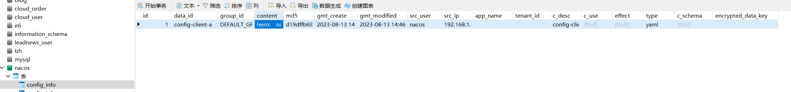
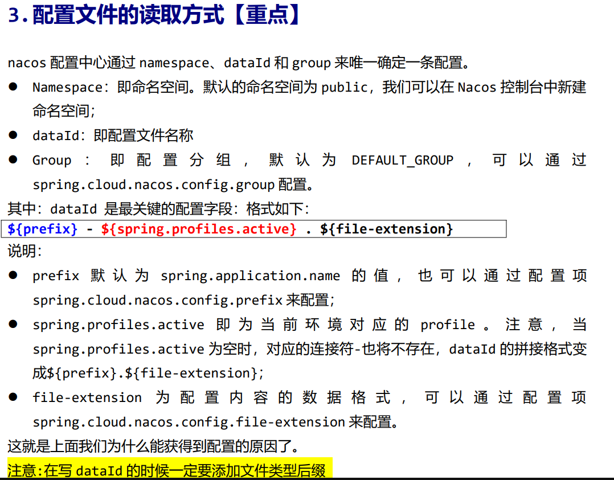
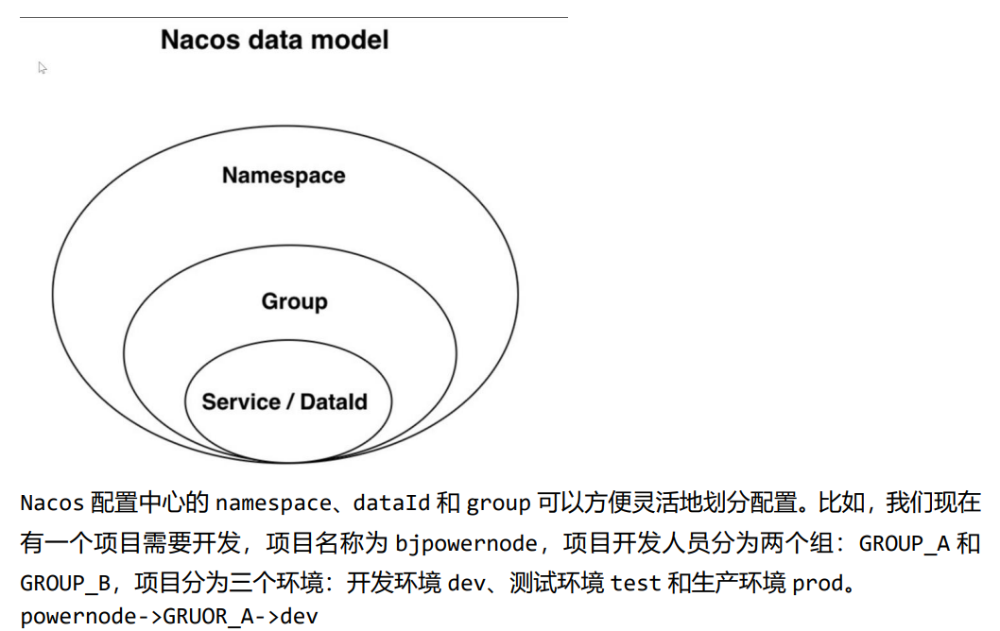
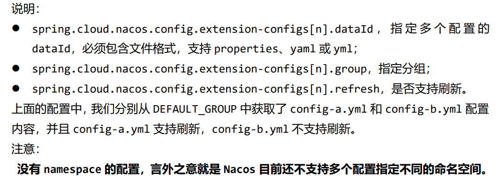
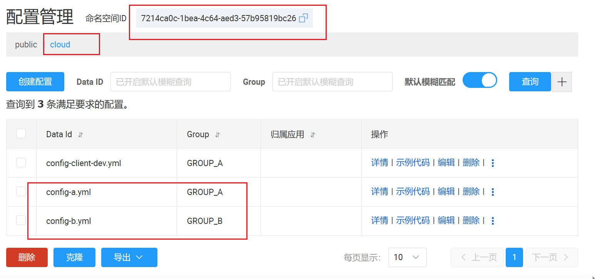

## Nacos配置文件中心

==nacos为什么要设置配置文件中心：==

Nacos（阿里巴巴开源项目）是一个用于动态配置管理和服务发现的平台，可以帮助开发人员更轻松地管理配置信息和服务注册。设置配置文件中心是Nacos的一个主要功能之一，有以下几个重要的原因：

1. **集中管理配置信息：** 在一个应用程序或者一个分布式系统中，通常有许多不同的配置参数，如数据库连接信息、服务的地址等。将这些配置信息集中管理在一个配置文件中心中，可以方便地进行统一的管理和维护，而不需要分散在各个代码文件中。

2. **动态配置更新：** 使用配置文件中心可以实现配置信息的动态更新。当配置信息需要修改时，可以直接在配置中心进行修改，而不需要重新编译、打包和部署应用程序。这样可以实现实时生效的配置更新，降低了系统维护的成本和风险。

3. **版本控制和历史记录：** 配置文件中心通常支持版本控制和历史记录功能，可以记录配置信息的修改历史，方便回溯和排查问题。这对于系统运维和故障排查非常有帮助。

4. **环境隔离：** 在开发、测试和生产环境中，往往需要使用不同的配置参数，如不同的数据库地址、缓存配置等。配置文件中心可以支持根据不同的环境加载不同的配置信息，实现环境隔离和灵活性。

5. **统一的访问接口：** 配置文件中心提供了统一的访问接口，应用程序可以通过接口来获取配置信息，无需关心配置信息的存储细节和格式。

总之，配置文件中心是Nacos的一个重要特性，它可以帮助开发团队更好地管理和维护配置信息，提高系统的灵活性、可维护性和可扩展性。

==配置中心的配置文件保存在哪里？==

Nacos 配置中心的配置文件默认是存储在 Nacos 服务器的数据库中。具体来说，Nacos 使用了数据库（如 MySQL、Derby 等）来存储配置数据和元数据。这些数据库表会被用来存储不同环境下的配置信息、配置的命名空间、集群信息、配置历史记录等。

Nacos 支持多种数据库，你可以根据需要选择合适的数据库类型作为配置文件的存储后端。默认情况下，Nacos 配置中心使用内嵌的 Derby 数据库，但在生产环境中，通常会选择更为稳定和可扩展的数据库，例如 MySQL、PostgreSQL 等。

需要注意的是，Nacos 除了支持数据库存储，还可以通过扩展来支持其他的存储后端，如支持使用外部的 Git 仓库作为配置文件的存储源。这样做可以将配置文件保存在 Git 仓库中，并与代码版本一起管理，实现配置与代码的统一管理。

总结来说，Nacos 配置中心的配置文件保存在所选的数据库中，你可以根据实际需求选择适合的数据库作为存储后端。

### 修改nacos默认存储为mysql

修改nacos安装目录下的`conf/application.properties`。（在文件的最后加）

```properties
spring.datasource.platform=mysql
db.num=1
db.url.0=jdbc:mysql://localhost:3306/nacos?characterEncoding=utf8&connectTimeout=1000&socketTimeout=3000&autoReconnect=true
db.user=root
db.password=123456
```

创建数据库nacos，运行同一目录下的sql脚本`mysql-schema.sql`。

### 创建配置文件中心项目

使用 Spring Cloud Alibaba Nacos Config，可基于 Spring Cloud 的编程模型快速接 入 Nacos 配置管理功能。

新加入的配置文件，在mysql-nacos-config中的config-info表里。



在项目中创建接收配置的对象：

```java
@Data
@AllArgsConstructor
@NoArgsConstructor
@Component
@RefreshScope  // 刷新的域，当配置文件修改后可以动态刷新
public class Hero {

    @Value("${hero.name}")
    private String name;
    @Value("${hero.age}")
    private Integer age;
    @Value("${hero.address}")
    private String address;

}
```

==注==

> 在这段代码中，`@Value`注解的作用是将属性值从配置文件中注入到`Hero`类的相应字段中。具体来说，它会从配置文件中读取`${hero.name}`、`${hero.age}`和`${hero.address}`对应的属性值，然后将这些值注入到`name`、`age`和`address`字段中。
>
> ==在这里的`@Value`注解是Spring框架提供的一个特性===，用于实现属性值的注入。通过在字段上使用`@Value`注解，您可以将配置文件中的属性值与Java类的字段关联起来，从而在运行时将这些值注入到对象中。
>
> 另外，您在代码开头使用的`@Data`、`@AllArgsConstructor`、`@NoArgsConstructor`、`@Component`和`@RefreshScope`注解的作用如下：
>
> - `@Data`: Lombok注解，它会自动生成一些通用的方法，如`toString`、`equals`、`hashCode`等，从而简化POJO类的编写。
> - `@AllArgsConstructor`: Lombok注解，自动生成一个包含所有字段的构造函数。
> - `@NoArgsConstructor`: Lombok注解，自动生成一个无参构造函数。
> - `@Component`: 表示这个类是一个Spring组件，会被Spring自动扫描并管理。
> - `@RefreshScope`: 用于启用刷新作用域，当配置文件发生变化时，通过调用Spring Cloud Config Server来刷新bean，以便在运行时获取最新的配置值。
>
> 综合起来，这段代码中的`Hero`类被定义为一个Spring组件，使用了Lombok注解来简化构造函数和通用方法的编写，通过`@Value`注解将配置文件中的属性值注入到相应的字段中，并且使用`@RefreshScope`允许在配置文件修改后动态刷新Bean的配置。

```java
@RestController
public class HeroController {

    @Autowired
    private Hero hero;

    @GetMapping("heroInfo")
    public String heroInfo() {
        return hero.toString();
    }
}
```

```yml
# bootstrap.yml
server:
  port: 8080
spring:
  application:
    name: config-client-a
  cloud:
    nacos:
      config:  # 指定配置中心的地址和配置中心使用的数据格式
        server-addr: localhost:8848
        file-extension: yaml
```


### 配置文件的读取方式



### 配置文件的划分



具体配置文件的分级操作过程见pdf。

在nacos的主页命名空间里创建新的命名空间，并复制该命名空间的id。根据配置文件的读取方式小节的内容，修改配置文件。

```yml
# bootstrap.yml
server:
  port: 8080
spring:
  application:
    name: config-client-a
  cloud:
    nacos:
      config:  # 指定配置中心的地址和配置中心使用的数据格式
        server-addr: localhost:8848
        file-extension: yml
        namespace: 7214ca0c-1bea-4c64-aed3-57b95819bc26  # 命名空间 需要使用id
        group: GROUP_A
        prefix: config-client  # 配置文件前缀，如果不写 默认使用${spring.application.name}的值
  profiles:
    active: dev  # spring的环境配置
```

### 获取多配置文件

即从多个配置文件中获取配置，组成一个完整的Hero类。

```yml
server:
  port: 8080
spring:
  application:
    name: config-client-a
  cloud:
    nacos:
      config:  # 指定配置中心的地址和配置中心使用的数据格式
        server-addr: localhost:8848
        file-extension: yml
        namespace: 7214ca0c-1bea-4c64-aed3-57b95819bc26  # 命名空间 需要使用id
        extension-configs:
          - data-id: config-a.yml
            group: GROUP_A
            refresh: true  # 是否支持刷新
          - data-id: config-b.yml
            group: GROUP_B
            refresh: false
  profiles:
    active: dev  # spring的环境配置
```



在nacos中的配置是这样的：



### 两端的配置文件写什么内容

