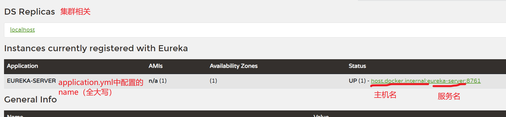
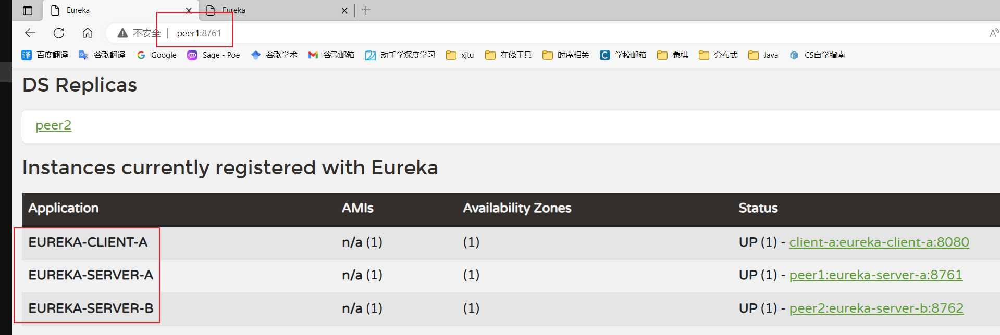
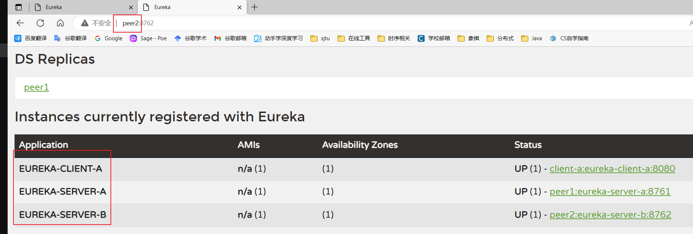

### Eureka注册中心

默认端口号是8761，在`application.yml`中这样设置：

```yaml
server:
	port: 8761 #为什么是 8761，eureka默认端口
spring:
	application:
		name: eureka-server #服务名
```

在启动类上添加注解：`@EnableEurekaServer`，开启eureka服务。

启动服务成功之后，访问http://localhost:8761/，出现如下页面：



### Eureka集群


上图中的集群中，有三个server主机，如果一个客户端注册到任意其中一台上，其他服务主机，都会把该客户端注册到自己的服务列表上。这样就保证了服务的高可用性。

首先把本地的hosts文件添加如下两行：

```
127.0.0.1 peer1
127.0.0.1 peer2
```

现在注册两个服务器：

`server-a`

```yaml
server:
  port: 8761
spring:
  application:
    name: eureka-server-a  # peer1

eureka:
  client:
    service-url:
      defaultZone: http://peer2:8762/eureka
  instance:
    hostname: peer1
    instance-id: ${eureka.instance.hostname}:${spring.application.name}:${server.port}
    prefer-ip-address: true
    lease-renewal-interval-in-seconds: 5
```

`server-b`

```yaml
server:
  port: 8762
spring:
  application:
    name: eureka-server-b  # peer1

eureka:
  client:
    service-url:
      defaultZone: http://peer1:8761/eureka
  instance:
    hostname: peer2
    instance-id: ${eureka.instance.hostname}:${spring.application.name}:${server.port}
    prefer-ip-address: true
    lease-renewal-interval-in-seconds: 5
```

在客户端中，绑定到任一两个中一个，就可以把服务注册到两个注册中心上。

`client-a`

```yaml
server:
  port: 8080  # 客户端端口
spring:
  application:
    name: eureka-client-a
eureka:
  client:
    service-url:
      defaultZone: http://peer1:8761/eureka
  instance:
    hostname: client-a
    instance-id: ${eureka.instance.hostname}:${spring.application.name}:${server.port}
    prefer-ip-address: true
    lease-renewal-interval-in-seconds: 5
```

peer1服务器的注册信息：



peer2服务器的注册信息：



### Eureka的功能

服务的注册、服务的续约（心跳机制）、服务的下线（主动下线）、服务的剔除（被动下线，主动剔除）

### 源码分析

参考动力节点的pdf教程（01Eureka教程）。