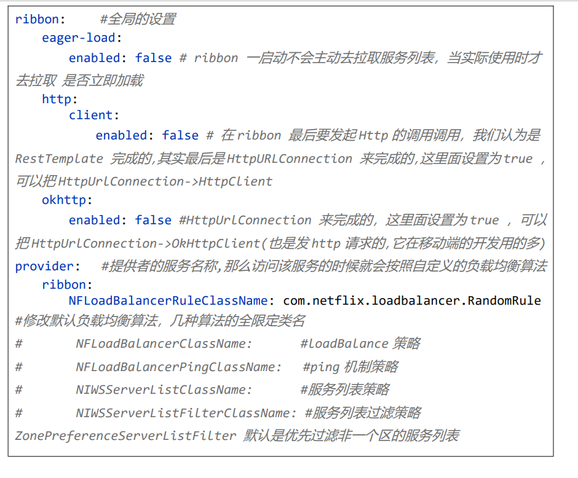
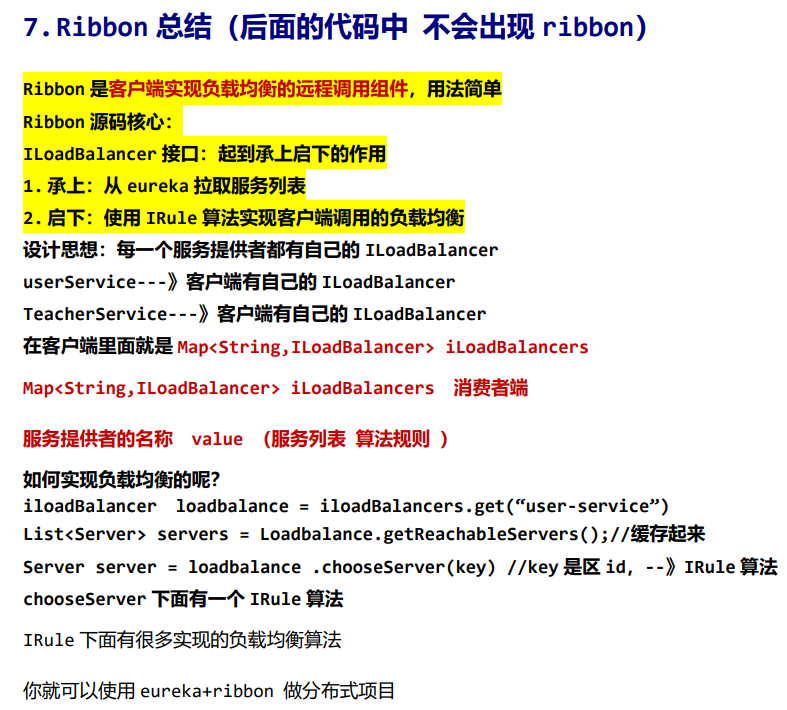

## Spring Cloud Ribbon

Spring Cloud Ribbon 是一个基于 HTTP 和 TCP 的客户端负载均衡工具，它基于 Netflix Ribbon 实现。通过 Spring Cloud 的封装，可以让我们轻松地将面向服务的 REST 模版请求 自动转换成客户端负载均衡的服务调用。

Ribbon要和RestTemplate（springboot中的web注解：controller,service等）或者OpenFeign结合使用。

### RestTemplate

引入：在`pom.xml`中引入`spring-boot-starter-web` 或 `spring-boot-starter-webflux`。

#### 基本使用

1. 创建 `RestTemplate` 实例：通常，可以通过在配置类中创建一个 `RestTemplate` Bean 来实现，这样它可以在整个应用程序中被注入和重用。（全局变量）

   ```java
   import org.springframework.context.annotation.Bean;
   import org.springframework.context.annotation.Configuration;
   import org.springframework.web.client.RestTemplate;
   
   @Configuration
   public class AppConfig {
       @Bean
       public RestTemplate restTemplate() {
           return new RestTemplate();
       }
   }
   ```

2. 发送 HTTP 请求：通过注入 `RestTemplate` 实例，你可以在应用程序的其他部分使用它来发送 HTTP 请求。

   ```java
   import org.springframework.beans.factory.annotation.Autowired;
   import org.springframework.stereotype.Service;
   import org.springframework.web.client.RestTemplate;
   
   @Service
   public class MyService {
       private final RestTemplate restTemplate;
   
       @Autowired
       public MyService(RestTemplate restTemplate) {
           this.restTemplate = restTemplate;
       }
   
       public void doSomeHttpRequest() {
           String apiUrl = "https://api.example.com/data";
           ResponseEntity<String> response = restTemplate.getForEntity(apiUrl, String.class);
   
           // 处理响应
           if (response.getStatusCode().is2xxSuccessful()) {
               String responseBody = response.getBody();
               // 处理响应数据
           } else {
               // 处理错误情况
           }
       }
   }
   ```

在实际使用中，你可以根据需要调用 `RestTemplate` 的不同方法，例如 `getForObject`、`postForObject` 等，来满足不同的 HTTP 请求需求。`RestTemplate` 还支持处理请求参数、请求头、响应解析等功能，可以根据具体需求灵活配置。不过需要注意的是，从 Spring 5 开始，推荐使用 `WebClient` 来替代 `RestTemplate`，因为 `WebClient` 是基于 Reactor 的响应式编程模型，更适用于异步非阻塞的场景。但如果你仍然喜欢使用同步的方式，`RestTemplate` 仍然是一个不错的选择。

#### getForEntity

`getForEntity` 方法返回的是一个 `ResponseEntity` 对象，它包含了完整的 HTTP 响应信息，包括响应状态码、响应头、响应体等。

`ResponseEntity` 是 Spring Framework 提供的一个通用泛型类，它的定义如下：

```java
public class ResponseEntity<T> {
    private final HttpHeaders headers;
    private final HttpStatus statusCode;
    private final T body;

    // 构造方法、getter等省略
}
```

- `headers`：表示响应头信息，它是一个 `HttpHeaders` 对象，可以用于获取响应头的各种属性。
- `statusCode`：表示 HTTP 响应状态码，是一个 `HttpStatus` 枚举值，可以通过该值了解请求是否成功以及具体的状态。
- `body`：表示响应主体，它是一个泛型类型 `T`，可以根据实际的响应数据类型来获取相应的数据。

通过 `ResponseEntity`，你可以获取完整的响应信息，并根据需要对响应头和响应体进行处理。

下面是一个简单的例子：

```java
import org.springframework.http.ResponseEntity;

public class MyService {
    private final RestTemplate restTemplate;

    @Autowired
    public MyService(RestTemplate restTemplate) {
        this.restTemplate = restTemplate;
    }

    public void getData() {
        String apiUrl = "https://api.example.com/data";
        ResponseEntity<String> response = restTemplate.getForEntity(apiUrl, String.class);

        // 获取响应状态码
        HttpStatus statusCode = response.getStatusCode();
        System.out.println("Status Code: " + statusCode);

        // 获取响应头信息
        HttpHeaders headers = response.getHeaders();
        String contentType = headers.getFirst("Content-Type");
        System.out.println("Content-Type: " + contentType);

        // 获取响应主体
        String responseBody = response.getBody();
        System.out.println("Response Body: " + responseBody);
    }
}
```

在这个例子中，`getData` 方法发送了一个 GET 请求并使用 `getForEntity` 方法获取了完整的响应信息。然后，通过 `ResponseEntity` 可以获取状态码、响应头、响应体等信息并进行处理。

#### postForEntity

`postForEntity` 方法是 `RestTemplate` 提供的用于发送 POST 请求的方法。它与 `getForEntity` 类似，不同之处在于 `postForEntity` 方法用于发送带有请求主体的 POST 请求，并且可以将响应解析为指定的类型。

以下是 `postForEntity` 方法的签名：

```java
public <T> ResponseEntity<T> postForEntity(String url, Object request, Class<T> responseType, Object... uriVariables) throws RestClientException;
```

参数说明：
- `url`：请求的目标 URL。
- `request`：请求主体的数据对象，可以是任何对象。
- `responseType`：指定响应主体数据的类型。
- `uriVariables`：可选参数，用于填充 URL 中的占位符。

示例代码：

假设我们有一个简单的数据模型 `Book`，定义如下：

```java
public class Book {
    private Long id;
    private String title;
    private String author;

    // 构造方法、getter和setter省略
}
```

然后我们可以使用 `postForEntity` 方法来发送一个 POST 请求并将 `Book` 对象作为请求主体，同时期望响应的返回类型也是 `Book` 类型。

```java
import org.springframework.http.ResponseEntity;

public class MyService {
    private final RestTemplate restTemplate;

    @Autowired
    
        this.restTemplate = restTemplate;
    }

    public Book createBook(Book newBook) {
        String apiUrl = "https://api.example.com/books";
        ResponseEntity<Book> response = restTemplate.postForEntity(apiUrl, newBook, Book.class);

        // 获取响应状态码
        HttpStatus statusCode = response.getStatusCode();
        System.out.println("Status Code: " + statusCode);

        // 获取响应头信息
        HttpHeaders headers = response.getHeaders();
        String contentType = headers.getFirst("Content-Type");
        System.out.println("Content-Type: " + contentType);

        // 获取响应主体（新创建的图书对象）
        Book createdBook = response.getBody();
        System.out.println("Created Book: " + createdBook);

        return createdBook;
    }
}
```

在上面的例子中，我们发送了一个 POST 请求到 `https://api.example.com/books`，请求主体是一个 `Book` 对象，期望响应的数据类型也是 `Book`。`postForEntity` 方法会将响应解析为 `ResponseEntity<Book>`，我们通过 `ResponseEntity` 获取了响应的状态码、响应头和响应主体（即新创建的图书对象）。

#### getForObject

除了`getForEntity`方法之外，`RestTemplate`还提供了许多其他常用的方法。以下是其中一些常用的方法及其示例：

1. `getForObject`：发送 GET 请求并将响应主体解析为指定的类型。

```java
public class MyService {
    private final RestTemplate restTemplate;

    @Autowired
    public MyService(RestTemplate restTemplate) {
        this.restTemplate = restTemplate;
    }

    public MyDataObject getDataObject() {
        String apiUrl = "https://api.example.com/data";
        MyDataObject response = restTemplate.getForObject(apiUrl, MyDataObject.class);
        return response;
    }
}
```

### 快速入门

注册中心是：云服务器上的eureka注册中心。

两个隐藏的provider程序：

```java
@RestController
public class ProviderController {

    @GetMapping("info")
    public String info() {
        return "我是provider-1";
    }
}
```

```java
@RestController
public class ProviderController {

    @GetMapping("info")
    public String info() {
        return "我是provider-2";
    }
}
```

```yml
server:
  port: 8080  # 8081
spring:
  application:
    name: provider
eureka:
  client:
    service-url:
      defaultZone: http://101.42.7.230:8761/eureka
    instance:
      hostname: localhost
      instance-id: ${eureka.instance.hostname}:${spring.application.name}:${server.port}
      prefer-ip-address: true
      lease-renewal-interval-in-seconds: 5
```

用户访问`consumer`相关的服务，`consumer`在内部调用两个provider的服务。

```java
@RestController
public class TestController {

    @Autowired
    private RestTemplate restTemplate;

    /**
     *
     * 思考ribbon是怎么将http://provider/info路径请求成功的
     * http://localhost:8080/info
     * 1. 拦截这个请求
     * 2. 拦截主机名称
     * 3. 借助eureka来做服务发现 list<>
     * 4. 通过负载均衡算法拿到一个服务ip port
     * 5. 重建url
     * 5. 发起请求
     *
     * @param serviceName
     * @return
     */

    @GetMapping("testRibbon")
    public String testRibbon(String serviceName) {
        // 默认从eureka拉取服务列表
        String result = restTemplate.getForObject("http://" + serviceName + "/info", String.class);
        return result;
    }

}
```

在启动类中：

```java
@SpringBootApplication
@EnableEurekaClient
public class ConsumerApplication {

    public static void main(String[] args) {
        SpringApplication.run(ConsumerApplication.class, args);
    }

    /**
     * 以全局变量的方式往容器中放入一个restTemplate对象，这样在别处用的时候就不用重新创建了
     * @return
     */
    @Bean
    @LoadBalanced  // 这个注解启用ribbon，让ribbon拦截http请求，并根据服务名访问注册中心的服务
    public RestTemplate restTemplate() {
        return new RestTemplate();
    }

}
```

```yml
server:
  port: 8082
spring:
  application:
    name: consumer
eureka:
  client:
    service-url:
      defaultZone: http://101.42.7.230:8761/eureka
    instance:
      hostname: consumer
      instance-id: ${eureka.instance.hostname}:${spring.application.name}:${server.port}
      prefer-ip-address: true
      lease-renewal-interval-in-seconds: 5
```

### 修改默认的负载均衡算法

上面的例子，用户通过`consumer`访问`provider`服务是以轮询的方式进行负载均衡的。

在`application.yml`中指定负载均衡的算法：

```yml
provider: #提供者的服务名称,那么访问该服务的时候就会按照自定义的负载均衡算法
    ribbon:
    	NFLoadBalancerRuleClassName: com.netflix.loadbalancer.RandomRule#几种算法的全限定类名
```

或者在启动类中（Application.java），注入指定算法的设置类：

```java
@Bean
public IRule myRule() {
    //指定调用所有的服务都用此算法
    return new RandomRule();
}
```

### Ribbon默认配置

Ribbon 有很多默认的配置，查看 `DefaultClientConfigImpl`




### Ribbon总结


