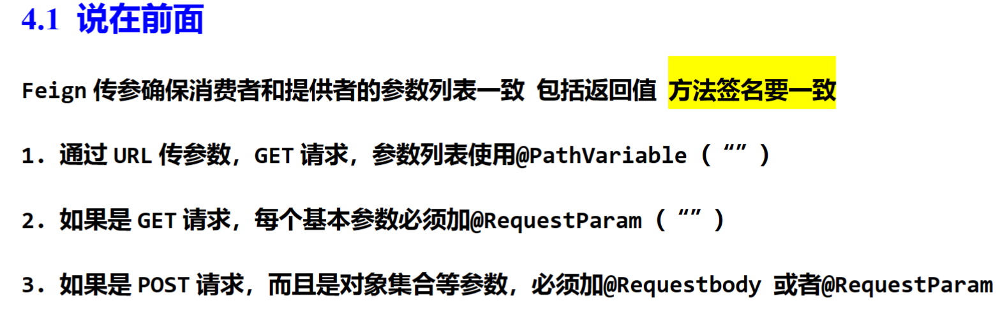
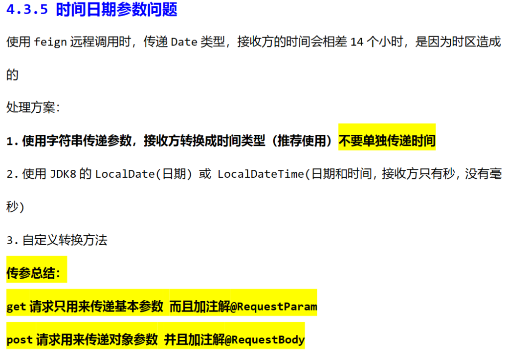
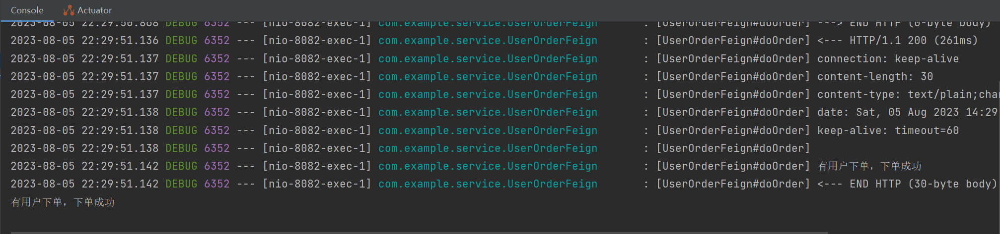

## OpenFeign

### 基本概念

openFeign就是springboot帮你创建了一个webclient，让这个webclient帮你发送和接受http请求，可以理解成客户端的nginx。

Spring Cloud OpenFeign是Spring Cloud生态系统中的一个组件，它是基于Spring Cloud Netflix项目中的Netflix Feign库的封装和增强版本。OpenFeign为开发人员提供了一种简化和优雅的方式来定义和调用HTTP API。

==OpenFeign的主要目标是简化微服务架构中的服务之间的通信。通常，在微服务架构中，一个服务需要调用其他服务的API，传统的方式是使用HTTP客户端进行调用。OpenFeign使得这个过程更加简洁、易于理解和维护。==

主要特性和优点包括：

1. 声明式API定义：使用OpenFeign，开发人员可以使用简单的注解来声明API的接口，并定义方法的参数、返回值等信息，而无需手动编写HTTP请求。

2. 集成Ribbon：OpenFeign默认集成了Ribbon负载均衡器，使得在服务调用时可以自动进行负载均衡。

3. 支持熔断器：OpenFeign集成了Hystrix熔断器，可以在服务调用失败或超时时提供降级和容错策略，防止故障在整个系统中扩散。

4. 支持Spring Boot和Spring Cloud：OpenFeign与Spring Boot和Spring Cloud完美集成，可以与其他Spring Cloud组件无缝协作。

5. 自定义拦截器：OpenFeign允许开发人员通过自定义拦截器来对请求和响应进行进一步的处理。

使用OpenFeign的示例代码：

```java
import org.springframework.cloud.openfeign.FeignClient;
import org.springframework.web.bind.annotation.GetMapping;

@FeignClient(name = "example-service") // 声明Feign客户端，指定要调用的服务名
public interface ExampleServiceClient {

    @GetMapping("/api/resource") // 定义调用的API路径和HTTP方法
    String getResource();
}
```

在上面的示例中，我们声明了一个名为`ExampleServiceClient`的Feign客户端，它将调用名为`example-service`的服务的`/api/resource`路径上的API。

请注意，为了使用OpenFeign，您需要在项目中添加相应的依赖。在Spring Cloud项目中，通常会使用`spring-cloud-starter-openfeign`依赖来引入OpenFeign。

### 简单例子

好的，下面给出一个更具体的示例，演示如何在Spring Cloud项目中使用OpenFeign来调用其他服务的API。

假设我们有两个微服务：`user-service`和`order-service`。`user-service`提供有关用户信息的API，而`order-service`需要调用`user-service`的API来获取用户信息。

1. 创建`user-service`：

首先，创建`user-service`，该服务提供获取用户信息的API。创建一个名为`UserController`的类：

```java
@RestController
@RequestMapping("/api/users")
public class UserController {

    @GetMapping("/{userId}")
    public String getUser(@PathVariable Long userId) {
        // Simulate fetching user information based on the userId
        return "User ID: " + userId + ", Name: John Doe, Email: john.doe@example.com";
    }
}
```

2. 创建`order-service`：

接下来，创建`order-service`，该服务需要调用`user-service`的API来获取用户信息。首先，添加OpenFeign的依赖：

```xml
<!-- pom.xml -->
<dependency>
    <groupId>org.springframework.cloud</groupId>
    <artifactId>spring-cloud-starter-openfeign</artifactId>
</dependency>
```

然后，创建一个名为`UserServiceClient`的Feign客户端，用于调用`user-service`的API：

```java
// UserServiceClient.java
import org.springframework.cloud.openfeign.FeignClient;
import org.springframework.web.bind.annotation.GetMapping;
import org.springframework.web.bind.annotation.PathVariable;

@FeignClient(name = "user-service") // 声明Feign客户端，指定要调用的服务名
public interface UserServiceClient {

    @GetMapping("/api/users/{userId}") // 定义调用的API路径和HTTP方法
    String getUser(@PathVariable("userId") Long userId);
}
```

3. 在`order-service`中使用`UserServiceClient`：

在`order-service`中注入`UserServiceClient`，并在需要调用用户信息的地方使用它：

```java
@RestController
@RequestMapping("/api/orders")
public class OrderController {

    private final UserServiceClient userServiceClient;

    @Autowired
    public OrderController(UserServiceClient userServiceClient) {
        this.userServiceClient = userServiceClient;
    }

    @GetMapping("/{orderId}")
    public String getOrder(@PathVariable Long orderId) {
        // Simulate fetching order information based on the orderId
        // Now, let's call the getUser method of the UserServiceClient to get user information
        Long userId = 123L; // Assuming orderId 123 is associated with userId 123
        String userInformation = userServiceClient.getUser(userId);
        return "Order ID: " + orderId + ", User Information: " + userInformation;
    }
}
```

在上述示例中，`OrderController`中使用了`UserServiceClient`来调用`user-service`的API，并获取了用户信息，然后将其返回作为订单信息。

这样，通过使用OpenFeign，`order-service`就能够以声明式的方式调用`user-service`的API，而无需显式地编写HTTP请求代码。

### 快速入门

openFeign就是springboot帮你创建了一个webclient，让这个webclient帮你发送和接受http请求，可以理解成客户端的nginx。

先创建一个提供服务的应用：

```json
@RestController
public class ProviderController {

    @GetMapping("doOrder")
    public String doOrder() {
        return "有用户下单，下单成功";
    }
}
```

```yml
server:
  port: 8081

spring:
  application:
    name: openfeign-provider-service
eureka:
  client:
    service-url:
      defaultZone: http://101.42.7.230:8761/eureka
    instance:
      hostname: provider
      instance-id: ${eureka.client.instance.hostname}:${spring.application.name}:${server.port}
      prefer-ip-address: true
      lease-renewal-interval-in-second: 5
```

在创建一个调用provider服务的服务：

```java
// 由于是代理webClient，所以要指定这个代理访问哪个服务
@FeignClient(value = "openfeign-provider-service")  // 和spring.application.name一样
public interface UserOrderFeign {

    @GetMapping("doOrder")
    public String doOrder();
}
```

==在这里，@FeignClient不指定url时，默认根据服务发现（发现eureka中注册的服务）调用对应的服务。==

```java
@RestController
public class UserOrderController {

    @Autowired
    private UserOrderFeign orderFeign;  // 在启动类中开启@EnableFeignClients

    @GetMapping("userOrder")
    public String userDoOrder() {
        String res = orderFeign.doOrder();
        System.out.println(res);
        return res;
    }
}
```

```java
@SpringBootApplication
@EnableEurekaClient
@EnableFeignClients
public class OpenFeignConsumerApplication {

	public static void main(String[] args) {
		SpringApplication.run(OpenFeignConsumerApplication.class, args);
	}

}
```

```yml
server:
  port: 8082

spring:
  application:
    name: openfeign-consumer-service
eureka:
  client:
    service-url:
      defaultZone: http://101.42.7.230:8761/eureka
    instance:
      hostname: consumer
      instance-id: ${eureka.client.instance.hostname}:${spring.application.name}:${server.port}
      prefer-ip-address: true
      lease-renewal-interval-in-second: 5
```

### OpenFeign参数调用方式



详细例子查看[pdf](G:\A文件夹\课程\Java\动力节点\springcloud入门\文档\03OpenFeign.pdf)。

#### 4.3.5 时间日期参数问题



### OpenFeign日志功能

从前面的测试中我们可以看出，没有任何关于远程调用的日志输出，如请头，参数Feign 提供了日志打印功能，我们可以通过配置来调整日志级别，从而揭开Feign 中Http 请求的所有细节。

- 日志级别

  NONE 默认的，不显示日志
  BASE 仅记录请求方法，URL ，响应状态码及执行时间
  HEADERS 在BASE 之上增加了请求和响应头的信息
  FULL 在HEADERS 之上增加了请求和响应的正文及无数据

#### 创建配置类

```java
@Configuration
public class FeignConfig {

    @Bean
    Logger.Level feignLogger() {
        return Logger.Level.FULL;
    }
}
```

```yml
logging:
  level:
    com.example.service.UserOrderFeign: debug
```


