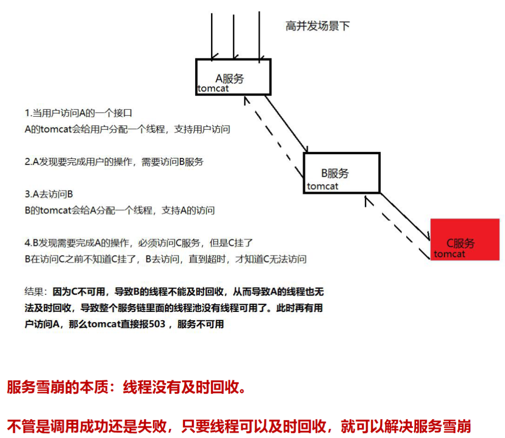
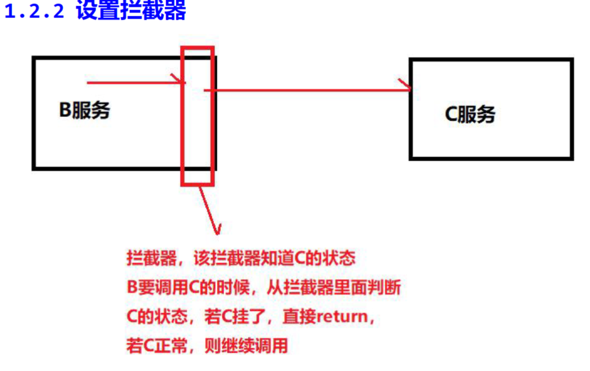

## Spring Cloud Hystrix

==Spring Cloud Hystrix在新版本的spring cloud中已经被移除。==

现在[官网](https://spring.io/projects/spring-cloud-circuitbreaker)上熔断器有两个：Resilience4J、Spring Retry

### 服务雪崩

#### 解决雪崩

1.2.1 修改调用的超时时长（不推荐）
将服务间的调用超时时长改小，这样就可以让线程及时回收，保证服务可用

优点：非常简单，也可以有效的解决服务雪崩
缺点：不够灵活，有的服务需要更长的时间去处理（写库，整理数据）

1.2.2 设置拦截器

### Hystrix简介

熔断器，也叫断路器！（正常情况下 断路器是关的 只有出了问题才打开）用来保护微服务不雪崩的方法。思想和我们上面画的拦截器一样。Hystrix 是Netflix 公司开源的一个项目，它提供了熔断器功能，能够阻止分布式系统中出现联动故障。Hystrix 是通过隔离服务的访问点阻止联动故障的，并提供了故障的解决方案，从而提高了整个分布式系统的弹性。

Spring Cloud Hystrix是Spring Cloud生态系统中的一个组件，用于帮助开发人员构建分布式系统中的容错功能。在分布式系统中，一个服务的不可用可能会导致整个系统的故障。Hystrix旨在解决这个问题，通过提供故障保护和容错机制，使得分布式系统更加稳定和可靠。

Hystrix提供了以下主要功能：

1. **断路器（Circuit Breaker）**：Hystrix通过实现断路器模式，当一个服务出现故障或者响应时间过长时，可以快速切换到备用逻辑，避免连锁故障，从而保护整个系统。

2. **服务降级（Fallback）**：当某个服务不可用时，Hystrix可以提供一个备选方案，返回预先定义好的默认值或执行备选逻辑，从而避免因为服务故障而导致整个请求失败。

3. **资源隔离（Isolation）**：Hystrix可以为每个依赖服务创建独立的线程池或信号量，避免一个依赖服务的问题影响到其他服务。

4. **请求缓存和请求合并**：Hystrix支持对相同请求的结果进行缓存，从而减少重复请求。同时，它还可以合并多个请求，减少网络开销。

5. **实时监控和报告**：Hystrix可以提供实时的监控和统计信息，帮助开发人员了解依赖服务的健康状态和性能。

Spring Cloud Hystrix通常与Spring Cloud Ribbon（用于服务间的负载均衡）一起使用，以提供更全面的分布式系统容错解决方案。

需要注意的是，截至我知识截止日（2021年9月），Spring Cloud Hystrix处于维护模式，Spring Cloud官方推荐使用Resilience4j或者Sentinel作为替代方案。这两者也提供类似于Hystrix的容错和故障保护功能。所以，如果您在使用较新的版本Spring Cloud，请考虑使用Resilience4j或者Sentinel。

### 快速入门

当有服务调用的时候，才会出现服务雪崩，所以Hystrix 常和OpenFeign，Ribbon 一起出现。

具体实现见8.resilience4j.md

### 4.手写熔断器

具体实现见pdf。