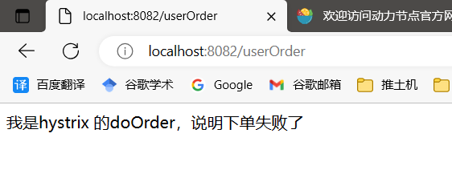

## resilience4j

熔断机制：

### 常用配置

Resilience4J在`application.yml`（或`application.properties`）中的常用配置项如下。这些配置项用于调整Resilience4J Circuit Breaker、Rate Limiter和Retry等组件的行为：

1. Circuit Breaker 配置项：

```yaml
# 全局配置，也可为每个 Circuit Breaker 单独配置
resilience4j.circuitbreaker.configs.default:
  registerHealthIndicator: true        # 是否注册健康指示器
  slidingWindowSize: 10               # 滑动窗口大小，用于计算失败率
  minimumNumberOfCalls: 5             # 最小调用次数阈值，低于此值不会触发断路器
  permittedNumberOfCallsInHalfOpenState: 3   # 半开状态下允许的调用次数
  slidingWindowType: COUNT_BASED      # 滑动窗口类型，COUNT_BASED或TIME_BASED
  waitDurationInOpenState: 5000      # 在开启状态下等待多久后进入半开状态
  failureRateThreshold: 50           # 失败率阈值，超过此阈值会触发断路器开启
  automaticTransitionFromOpenToHalfOpenEnabled: true  # 是否自动从开启状态切换到半开状态

# 为具体的服务或方法指定 Circuit Breaker 的配置
resilience4j.circuitbreaker.configs:
  myServiceCircuitBreaker:    # Circuit Breaker 的名称，用于绑定到具体的服务或方法
    registerHealthIndicator: false
    slidingWindowSize: 20
    minimumNumberOfCalls: 10
    permittedNumberOfCallsInHalfOpenState: 5
    slidingWindowType: COUNT_BASED
    waitDurationInOpenState: 10000
    failureRateThreshold: 60
```

2. Rate Limiter 配置项：

```yaml
resilience4j.ratelimiter.configs.default:
  limitRefreshPeriod: 1000     # 限制刷新周期，用于计算限制速率
  limitForPeriod: 5            # 刷新周期内允许的最大请求数
  timeoutDuration: 0           # 请求等待超时时间，0 表示不等待
  limitRefreshPeriod: 1000     # 限制刷新周期，用于计算限制速率

resilience4j.ratelimiter.configs:
  myServiceRateLimiter:        # Rate Limiter 的名称，用于绑定到具体的服务或方法
    limitForPeriod: 10
    limitRefreshPeriod: 2000
    timeoutDuration: 0
```

3. Retry 配置项：

```yaml
resilience4j.retry.configs.default:
  maxAttempts: 3              # 最大重试次数，包括第一次调用
  waitDuration: 500          # 每次重试之间的等待时间，单位毫秒
  retryExceptions:           # 要进行重试的异常类列表
    - java.io.IOException
    - org.springframework.web.client.HttpServerErrorException
    - com.example.MyCustomException

resilience4j.retry.configs:
  myServiceRetry:            # Retry 的名称，用于绑定到具体的服务或方法
    maxAttempts: 5
    waitDuration: 1000
    retryExceptions:
      - java.io.IOException
      - org.springframework.web.client.HttpServerErrorException
```

这些是Resilience4J在`application.yml`中的一些常用配置项。您可以根据自己的实际需求进行相应的调整和定制。注意，上述配置中使用了全局配置和具体服务/方法的配置，您可以根据需要选择适合您场景的方式来配置Resilience4J组件的行为。

### 和OpenFeign结合使用

在`application.yml`中开启feign的熔断设置

```yml
feign:
  circuitbreaker:
    enabled: true
```

```java
@FeignClient(value = "openfeign-provider-service", fallback = UserOrderFeignHystrix.class)
public interface UserOrderFeign {

    @GetMapping("doOrder")
    public String doOrder();
}
```

```java
@Component
public class UserOrderFeignHystrix implements UserOrderFeign {

    @Override
    public String doOrder() {
        System.out.println("我是hystrix 的doOrder，说明下单失败了");
        return "我是hystrix 的doOrder，说明下单失败了";
    }
}
```

```java
@RestController
public class UserOrderController {

    @Resource
    private UserOrderFeign orderFeign;

//    @Autowired
//    private CircuitBreakerRegistry circuitBreakerRegistry;

    @GetMapping("userOrder")
    public String userDoOrder() {
//        CircuitBreaker breaker = circuitBreakerRegistry.circuitBreaker("openfeign-provider-service");
//        CircuitBreaker.Metrics metrics = breaker.getMetrics();
//        System.out.println("metrics = " + metrics.toString());
        String res = orderFeign.doOrder();
        System.out.println(res);
        return res;
    }
}
```


