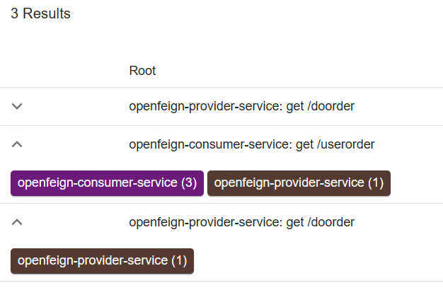

## 链路追踪

链路追踪就是：追踪微服务的调用路径

### 链路追踪的由来

在微服务框架中，一个由客户端发起的请求在后端系统中会经过多个不同的服务节点调用来协同产生最后的请求结果，每一个请求都会开成一条复杂的分布式服务调用链路，链路中的任何一环出现高延时或错误都会引导起整个请求最后的失败。（不建议微服务中链路调用超过 3次）

### 分布式链路调用的监控

[zipkin官网](https://zipkin.io/pages/quickstart.html)

sleuth+zipkin（zipkin 就是一个可视化的监控控制台）

Zipkin 是 Twitter 的一个开源项目，允许开发者收集 Twitter 各个服务上的监控数据，并提供查询接口。

该系统让开发者可通过一个 Web 前端轻松的收集和分析数据，例如用户每次请求服务的处理时间等，可方便的监测系统中存在的瓶颈。

使用：下载之后直接使用java运行

```shell
java -jar zipkin-server-2.24.3-exec.jar
```

zipkin的控制台是http://localhost:9411

### 快速入门

在OpenFeign那个例子上加上zipkin。

在pom.xml中加上依赖：

```xml
<dependency>
    <groupId>org.springframework.cloud</groupId>
	<artifactId>spring-cloud-starter-zipkin</artifactId>
</dependency>
```

在`application.yml`中加入如下配置：

```yml
spring:
    zipkin:
        base-url: http://localhost:9411
    sleuth:
        sampler:
            probability: 1 #配置采样率 默认的采样比例为: 0.1，即 10%，所设置的值介于 0 到 1 之间，1 则表示全部采集
            rate: 10 #为了使用速率限制采样器,选择每秒间隔接受的 trace 量，最小数字为 0，最大值为 2,147,483,647（最大 int） 默认为 10
```

结果：

