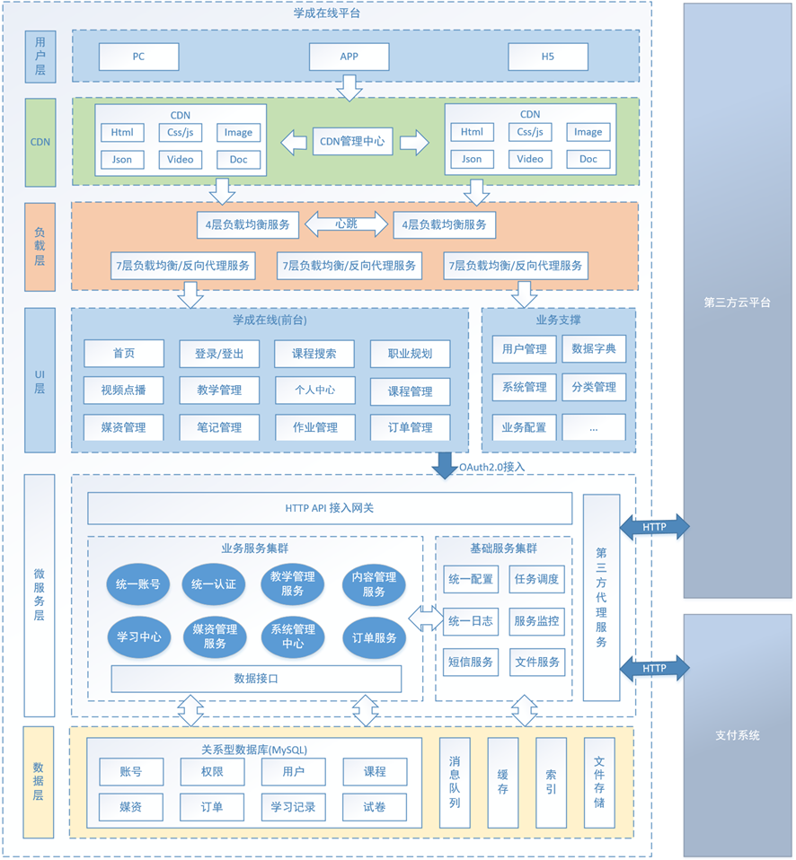

## 学成在线项目介绍

B2B2C模式的项目。B2B2C是一种电子商务类型的网络购物商业模式，B是Business的简称，C是Consumer的简称，第一个B指的是商品或服务的供应商，第二个B指的是从事电子商务的企业，C则是表示消费者。

B2B的定义：企业跟企业之间的电子商务运作方式。
 B2C的定义：企业跟消费者之间的电子商务运作方式。

### 项目业务拆分

用户端、机构端、运营端。

核心模块包括：内容管理、媒资管理、课程搜索、订单支付、选课管理、认证授权等。

下图是项目的功能模块图：

#### 流程图

#### 1、课程编辑与发布流程

#### 2、课程发布后学生登录平台进行选课、在线学习

免费课程可直接学习，收费课程需要下单购买。

学生选课流程如下：

### 技术架构

本项目采用前后端分离架构，后端采用SpringBoot、SpringCloud技术栈开发，数据库使用了MySQL，还使用的Redis、消息队列、分布式文件系统、Elasticsearch等中间件系统。

划分的微服务包括：内容管理服务、媒资管理服务、搜索服务、订单支付服务、 学习中心服务、系统管理服务、认证授权服务、网关服务、注册中心服务、配置中心服务等。

下图是项目的技术架构图：

各层职责说明如下：

| 名称     | 功能描述                                                     |
| -------- | ------------------------------------------------------------ |
| 用户层   | 用户层描述了本系统所支持的用户类型包括：pc用户、app用户、h5用户。pc用户通过浏览器访问系统、app用户通过android、ios手机访问系统，H5用户通过h5页面访问系统。 |
| CDN      | CDN全称Content  Delivery Network，即内容分发网络，本系统所有静态资源全部通过CDN加速来提高访问速度。系统静态资源包括：html页面、js文件、css文件、image图片、pdf和ppt及doc教学文档、video视频等。 |
| 负载均衡 | 系统的CDN层、UI层、服务层及数据层均设置了负载均衡服务，上图仅在UI层前边标注了负载均衡。 每一层的负载均衡会根据系统的需求来确定负载均衡器的类型，系统支持4层负载均衡+7层负载均衡结合的方式，4层负载均衡是指在网络传输层进行流程转发，根据IP和端口进行转发，7层负载均衡完成HTTP协议负载均衡及反向代理的功能，根据url进行请求转发。 |
| UI层     | UI层描述了系统向pc用户、app用户、h5用户提供的产品界面。根据系统功能模块特点确定了UI层包括如下产品界面类型： 1）面向pc用户的门户系统、学习中心系统、教学管理系统、系统管理中心。  2）面向h5用户的门户系统、学习中心系统。  3）面向app用户的门户系统、学习中心系统。 |
| 微服务层 | 微服务层将系统服务分类三类：业务服务、基础服务、第三方代理服务。 业务服务：主要为学成在线核心业务提供服务，并与数据层进行交互获得数据。 基础服务：主要管理学成在线系统运行所需的配置、日志、任务调度、短信等系统级别的服务。 第三方代理服务：系统接入第三方服务完成业务的对接，例如认证、支付、视频点播/直播、用户认证和授权。 |
| 数据层   | 数据层描述了系统的数据存储的内容类型，关系性数据库：持久化的业务数据使用MySQL。 消息队列：存储系统服务间通信的消息，本身提供消息存取服务，与微服务层的系统服务连接。 索引库：存储课程信息的索引信息，本身提供索引维护及搜索的服务，与微服务层的系统服务连接。 缓存：作为系统的缓存服务，作为微服务的缓存数据便于查询。 文件存储：提供系统静态资源文件的分布式存储服务，文件存储服务器作为CDN服务器的数据来源，CDN上的静态资源将最终在文件存储服务器上保存多份。 |