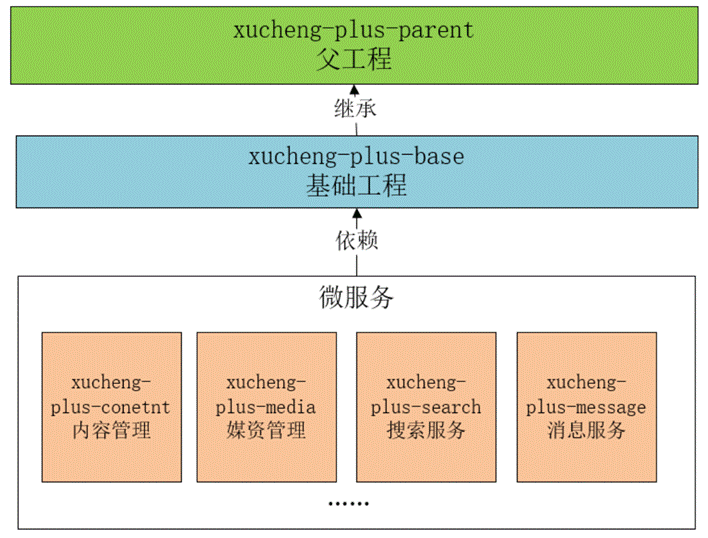

### 环境及配置

在企业开发环境中，项目中用到的一些服务端软件如：MySQL、Nacos配置中心、RabbitMQ消息队列等通常会安装在企业局域网的服务器中，开发人员去远程连接它们。在教学中我们在自己的电脑上安装虚拟机，虚拟机代表了企业局域网中的服务器。

黑马教程中给的是Centos7，这里使用Ubuntu。

### 基础工程搭建

学成在线使用 Maven 来进行项目的管理和构建。整个项目分为三大类工程：父工程、基础工程 和微服务工程。

每一种类的工程都有不同的作用，下面是对其功能进行说明：

- 父工程

  - 对依赖包的版本进行管理 

  - 本身为Pom工程，对子工程进行聚合管理 

- 基础工程

  - 继承父类工程

  - 提供基础类库

  - 提供工具类库   

- 微服务工程

  - 分别从业务、技术方面划分模块，每个模块构建为一个微服务。

  - 每个微服务工程依赖基础工程，间接继承父工程。

  - 包括：内容管理服务、媒资管理服务、搜索服务、订单支付服务等。

#### 构建父工程

