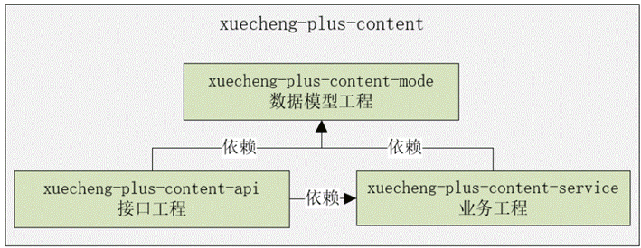

## 内容管理模块

第2章 内容管理模块v3.1.docx

### 模块划分

整个流程分为前端、接口层、业务层三部分。

所以模块工程的结构如下图所示：



xuecheng-plus-content-api：接口工程，为前端提供接口。

xuecheng-plus-content-service: 业务工程，为接口工程提供业务支撑。

xuecheng-plus-content-model: 数据模型工程，存储数据模型类、数据传输类型等。

结合项目父工程、项目基础工程后，如下图：


xuecheng-plus-content：内容管理模块工程，负责聚合xuecheng-plus-content-api、xuecheng-plus-content-service、xuecheng-plus-content-model。

### 创建工程

首先创建xuecheng-plus-content总模块。

content的pom.xml文件：

```xml
XML
<?xml version="1.0" encoding="UTF-8"?>
<project xmlns="http://maven.apache.org/POM/4.0.0" xmlns:xsi="http://www.w3.org/2001/XMLSchema-instance"
         xsi:schemaLocation="http://maven.apache.org/POM/4.0.0 https://maven.apache.org/xsd/maven-4.0.0.xsd">
    <modelVersion>4.0.0</modelVersion>
    <parent>
        <artifactId>xuecheng-plus-parent</artifactId>
        <groupId>com.xuecheng</groupId>
        <version>0.0.1-SNAPSHOT</version>
        <relativePath>../xuecheng-plus-parent</relativePath>
    </parent>
    <artifactId>xuecheng-plus-content</artifactId>
    <name>xuecheng-plus-content</name>
    <description>xuecheng-plus-content</description>
    <packaging>pom</packaging>

  <modules>
    <module>xuecheng-plus-content-api</module>
    <module>xuecheng-plus-content-model</module>
    <module>xuecheng-plus-content-service</module>
   </modules>
</project>
```

创建api，model，service三个子工程。

xuecheng-plus-content-model的pom.xml文件：

```xml
<?xml version="1.0" encoding="UTF-8"?>
<project xmlns="http://maven.apache.org/POM/4.0.0" xmlns:xsi="http://www.w3.org/2001/XMLSchema-instance"
         xsi:schemaLocation="http://maven.apache.org/POM/4.0.0 https://maven.apache.org/xsd/maven-4.0.0.xsd">
    <modelVersion>4.0.0</modelVersion>
    <parent>
        <artifactId>xuecheng-plus-content</artifactId>
        <groupId>com.xuecheng</groupId>
        <version>0.0.1-SNAPSHOT</version>
    </parent>
    <artifactId>xuecheng-plus-content-model</artifactId>
    

    <dependencies>
        <dependency>
            <groupId>com.xuecheng</groupId>
            <artifactId>xuecheng-plus-base</artifactId>
            <version>0.0.1-SNAPSHOT</version>
        </dependency>
    </dependencies>

</project>
```

xuecheng-plus-content-service的pom.xml文件

```xml
<?xml version="1.0" encoding="UTF-8"?>
<project xmlns="http://maven.apache.org/POM/4.0.0" xmlns:xsi="http://www.w3.org/2001/XMLSchema-instance"
         xsi:schemaLocation="http://maven.apache.org/POM/4.0.0 https://maven.apache.org/xsd/maven-4.0.0.xsd">
    <modelVersion>4.0.0</modelVersion>
    <parent>
        <artifactId>xuecheng-plus-content</artifactId>
        <groupId>com.xuecheng</groupId>
        <version>0.0.1-SNAPSHOT</version>
    </parent>
    <artifactId>xuecheng-plus-content-service</artifactId>
    
        <dependencies>
        <dependency>
            <groupId>com.xuecheng</groupId>
            <artifactId>xuecheng-plus-content-model</artifactId>
            <version>0.0.1-SNAPSHOT</version>
        </dependency>
     </dependencies>
</project>

```

xuecheng-plus-content-api的pom.xml文件：(xuecheng-plus-content-api接口工程的父工程是xuecheng-plus-content，它依赖了xuecheng-plus-base基础工程。)

```xml
<?xml version="1.0" encoding="UTF-8"?>
<project xmlns="http://maven.apache.org/POM/4.0.0" xmlns:xsi="http://www.w3.org/2001/XMLSchema-instance"
         xsi:schemaLocation="http://maven.apache.org/POM/4.0.0 https://maven.apache.org/xsd/maven-4.0.0.xsd">
    <modelVersion>4.0.0</modelVersion>
    <parent>
        <artifactId>xuecheng-plus-content</artifactId>
        <groupId>com.xuecheng</groupId>
        <version>0.0.1-SNAPSHOT</version>
    </parent>
    <artifactId>xuecheng-plus-content-api</artifactId>


    <dependencies>
        <dependency>
            <groupId>com.xuecheng</groupId>
            <artifactId>xuecheng-plus-content-service</artifactId>
            <version>0.0.1-SNAPSHOT</version>
        </dependency>
    </dependencies>

</project>
```

最后的文件结构：


### 创建content数据库

数据库中包含12个表：course_audit,course_base,course_category,course_market,course_publish,course_publish_pre,course_teacher,mq_message,mq_message_history,teachplan,teachplan_media,teachplan_work。

创建这12个表的sql文件`xcplus_content`：

course_audit：

```sql
DROP TABLE IF EXISTS `course_audit`;
/*!40101 SET @saved_cs_client     = @@character_set_client */;
/*!50503 SET character_set_client = utf8mb4 */;
CREATE TABLE `course_audit` (
  `id` bigint NOT NULL AUTO_INCREMENT,
  `course_id` bigint NOT NULL COMMENT '课程id',
  `audit_mind` varchar(255) CHARACTER SET utf8mb4 COLLATE utf8mb4_general_ci DEFAULT NULL COMMENT '审核意见',
  `audit_status` varchar(10) CHARACTER SET utf8mb4 COLLATE utf8mb4_general_ci NOT NULL COMMENT '审核状态',
  `audit_people` varchar(50) CHARACTER SET utf8mb4 COLLATE utf8mb4_general_ci DEFAULT NULL COMMENT '审核人',
  `audit_date` datetime DEFAULT NULL COMMENT '审核时间',
  PRIMARY KEY (`id`) USING BTREE
) ENGINE=InnoDB DEFAULT CHARSET=utf8mb4 COLLATE=utf8mb4_general_ci ROW_FORMAT=DYNAMIC;
/*!40101 SET character_set_client = @saved_cs_client */;
```

course_base:

```sql
DROP TABLE IF EXISTS `course_base`;
/*!40101 SET @saved_cs_client     = @@character_set_client */;
/*!50503 SET character_set_client = utf8mb4 */;
CREATE TABLE `course_base` (
  `id` bigint NOT NULL AUTO_INCREMENT COMMENT '主键',
  `company_id` bigint NOT NULL COMMENT '机构ID',
  `company_name` varchar(255) CHARACTER SET utf8 COLLATE utf8_general_ci DEFAULT NULL COMMENT '机构名称',
  `name` varchar(100) CHARACTER SET utf8 COLLATE utf8_general_ci NOT NULL COMMENT '课程名称',
  `users` varchar(500) CHARACTER SET utf8 COLLATE utf8_general_ci DEFAULT NULL COMMENT '适用人群',
  `tags` varchar(50) CHARACTER SET utf8 COLLATE utf8_general_ci DEFAULT NULL COMMENT '课程标签',
  `mt` varchar(20) CHARACTER SET utf8 COLLATE utf8_general_ci NOT NULL COMMENT '大分类',
  `st` varchar(20) CHARACTER SET utf8 COLLATE utf8_general_ci NOT NULL COMMENT '小分类',
  `grade` varchar(32) CHARACTER SET utf8 COLLATE utf8_general_ci NOT NULL COMMENT '课程等级',
  `teachmode` varchar(32) CHARACTER SET utf8 COLLATE utf8_general_ci NOT NULL COMMENT '教育模式(common普通，record 录播，live直播等）',
  `description` text CHARACTER SET utf8 COLLATE utf8_general_ci COMMENT '课程介绍',
  `pic` varchar(500) CHARACTER SET utf8 COLLATE utf8_general_ci DEFAULT NULL COMMENT '课程图片',
  `create_date` datetime DEFAULT NULL COMMENT '创建时间',
  `change_date` datetime DEFAULT NULL COMMENT '修改时间',
  `create_people` varchar(50) CHARACTER SET utf8 COLLATE utf8_general_ci DEFAULT NULL COMMENT '创建人',
  `change_people` varchar(50) CHARACTER SET utf8 COLLATE utf8_general_ci DEFAULT NULL COMMENT '更新人',
  `audit_status` varchar(10) CHARACTER SET utf8 COLLATE utf8_general_ci NOT NULL COMMENT '审核状态',
  `status` varchar(10) CHARACTER SET utf8 COLLATE utf8_general_ci NOT NULL DEFAULT '1' COMMENT '课程发布状态 未发布  已发布 下线',
  PRIMARY KEY (`id`) USING BTREE
) ENGINE=InnoDB AUTO_INCREMENT=122 DEFAULT CHARSET=utf8mb3 ROW_FORMAT=DYNAMIC COMMENT='课程基本信息';
/*!40101 SET character_set_client = @saved_cs_client */;
```

course_category:

```sql
--
-- Table structure for table `course_category`
--

DROP TABLE IF EXISTS `course_category`;
/*!40101 SET @saved_cs_client     = @@character_set_client */;
/*!50503 SET character_set_client = utf8mb4 */;
CREATE TABLE `course_category` (
  `id` varchar(20) CHARACTER SET utf8 COLLATE utf8_general_ci NOT NULL COMMENT '主键',
  `name` varchar(32) CHARACTER SET utf8 COLLATE utf8_general_ci NOT NULL COMMENT '分类名称',
  `label` varchar(32) CHARACTER SET utf8 COLLATE utf8_general_ci DEFAULT NULL COMMENT '分类标签默认和名称一样',
  `parentid` varchar(20) CHARACTER SET utf8 COLLATE utf8_general_ci NOT NULL DEFAULT '0' COMMENT '父结点id（第一级的父节点是0，自关联字段id）',
  `is_show` tinyint DEFAULT NULL COMMENT '是否显示',
  `orderby` int DEFAULT NULL COMMENT '排序字段',
  `is_leaf` tinyint DEFAULT NULL COMMENT '是否叶子',
  PRIMARY KEY (`id`) USING BTREE
) ENGINE=InnoDB DEFAULT CHARSET=utf8mb3 ROW_FORMAT=DYNAMIC COMMENT='课程分类';
/*!40101 SET character_set_client = @saved_cs_client */;
```

course_market:

```sql
--
-- Table structure for table `course_market`
--

DROP TABLE IF EXISTS `course_market`;
/*!40101 SET @saved_cs_client     = @@character_set_client */;
/*!50503 SET character_set_client = utf8mb4 */;
CREATE TABLE `course_market` (
  `id` bigint NOT NULL COMMENT '主键，课程id',
  `charge` varchar(32) CHARACTER SET utf8 COLLATE utf8_general_ci NOT NULL COMMENT '收费规则，对应数据字典',
  `price` float(10,2) DEFAULT NULL COMMENT '现价',
  `original_price` float(10,2) DEFAULT NULL COMMENT '原价',
  `qq` varchar(32) CHARACTER SET utf8 COLLATE utf8_general_ci DEFAULT NULL COMMENT '咨询qq',
  `wechat` varchar(64) CHARACTER SET utf8 COLLATE utf8_general_ci DEFAULT NULL COMMENT '微信',
  `phone` varchar(32) CHARACTER SET utf8 COLLATE utf8_general_ci DEFAULT NULL COMMENT '电话',
  `valid_days` int DEFAULT NULL COMMENT '有效期天数',
  PRIMARY KEY (`id`) USING BTREE
) ENGINE=InnoDB DEFAULT CHARSET=utf8mb3 ROW_FORMAT=DYNAMIC COMMENT='课程营销信息';
/*!40101 SET character_set_client = @saved_cs_client */;
```

course_publish:

```sql
--
-- Table structure for table `course_publish`
--

DROP TABLE IF EXISTS `course_publish`;
/*!40101 SET @saved_cs_client     = @@character_set_client */;
/*!50503 SET character_set_client = utf8mb4 */;
CREATE TABLE `course_publish` (
  `id` bigint NOT NULL COMMENT '主键',
  `company_id` bigint NOT NULL COMMENT '机构ID',
  `company_name` varchar(255) CHARACTER SET utf8 COLLATE utf8_general_ci DEFAULT NULL COMMENT '公司名称',
  `name` varchar(100) CHARACTER SET utf8 COLLATE utf8_general_ci NOT NULL COMMENT '课程名称',
  `users` varchar(500) CHARACTER SET utf8 COLLATE utf8_general_ci NOT NULL COMMENT '适用人群',
  `tags` varchar(32) CHARACTER SET utf8 COLLATE utf8_general_ci DEFAULT NULL COMMENT '标签',
  `username` varchar(32) CHARACTER SET utf8 COLLATE utf8_general_ci DEFAULT NULL COMMENT '创建人',
  `mt` varchar(20) CHARACTER SET utf8 COLLATE utf8_general_ci NOT NULL COMMENT '大分类',
  `mt_name` varchar(255) CHARACTER SET utf8 COLLATE utf8_general_ci NOT NULL COMMENT '大分类名称',
  `st` varchar(20) CHARACTER SET utf8 COLLATE utf8_general_ci NOT NULL COMMENT '小分类',
  `st_name` varchar(255) CHARACTER SET utf8 COLLATE utf8_general_ci NOT NULL COMMENT '小分类名称',
  `grade` varchar(32) CHARACTER SET utf8 COLLATE utf8_general_ci NOT NULL COMMENT '课程等级',
  `teachmode` varchar(32) CHARACTER SET utf8 COLLATE utf8_general_ci NOT NULL COMMENT '教育模式',
  `pic` varchar(500) CHARACTER SET utf8 COLLATE utf8_general_ci NOT NULL COMMENT '课程图片',
  `description` text CHARACTER SET utf8 COLLATE utf8_general_ci COMMENT '课程介绍',
  `market` text CHARACTER SET utf8 COLLATE utf8_general_ci COMMENT '课程营销信息，json格式',
  `teachplan` text CHARACTER SET utf8 COLLATE utf8_general_ci COMMENT '所有课程计划，json格式',
  `teachers` text CHARACTER SET utf8 COLLATE utf8_general_ci COMMENT '教师信息，json格式',
  `create_date` datetime DEFAULT NULL COMMENT '发布时间',
  `online_date` datetime DEFAULT NULL COMMENT '上架时间',
  `offline_date` datetime DEFAULT NULL COMMENT '下架时间',
  `status` varchar(10) CHARACTER SET utf8 COLLATE utf8_general_ci DEFAULT '1' COMMENT '发布状态',
  `remark` varchar(500) CHARACTER SET utf8 COLLATE utf8_general_ci DEFAULT NULL COMMENT '备注',
  `charge` varchar(32) CHARACTER SET utf8 COLLATE utf8_general_ci DEFAULT NULL COMMENT '收费规则，对应数据字典--203',
  `price` float(10,2) DEFAULT NULL COMMENT '现价',
  `original_price` float(10,2) DEFAULT NULL COMMENT '原价',
  `valid_days` int DEFAULT NULL COMMENT '课程有效期天数',
  PRIMARY KEY (`id`) USING BTREE
) ENGINE=InnoDB DEFAULT CHARSET=utf8mb3 ROW_FORMAT=DYNAMIC COMMENT='课程发布';
/*!40101 SET character_set_client = @saved_cs_client */;
```

course_publish_pre:

```sql
--
-- Table structure for table `course_publish_pre`
--

DROP TABLE IF EXISTS `course_publish_pre`;
/*!40101 SET @saved_cs_client     = @@character_set_client */;
/*!50503 SET character_set_client = utf8mb4 */;
CREATE TABLE `course_publish_pre` (
  `id` bigint NOT NULL COMMENT '主键',
  `company_id` bigint NOT NULL COMMENT '机构ID',
  `company_name` varchar(255) CHARACTER SET utf8 COLLATE utf8_general_ci DEFAULT NULL COMMENT '公司名称',
  `name` varchar(100) CHARACTER SET utf8 COLLATE utf8_general_ci NOT NULL COMMENT '课程名称',
  `users` varchar(500) CHARACTER SET utf8 COLLATE utf8_general_ci NOT NULL COMMENT '适用人群',
  `tags` varchar(32) CHARACTER SET utf8 COLLATE utf8_general_ci DEFAULT NULL COMMENT '标签',
  `username` varchar(32) CHARACTER SET utf8 COLLATE utf8_general_ci DEFAULT NULL COMMENT '创建人',
  `mt` varchar(20) CHARACTER SET utf8 COLLATE utf8_general_ci NOT NULL COMMENT '大分类',
  `mt_name` varchar(255) CHARACTER SET utf8 COLLATE utf8_general_ci NOT NULL COMMENT '大分类名称',
  `st` varchar(20) CHARACTER SET utf8 COLLATE utf8_general_ci NOT NULL COMMENT '小分类',
  `st_name` varchar(255) CHARACTER SET utf8 COLLATE utf8_general_ci NOT NULL COMMENT '小分类名称',
  `grade` varchar(32) CHARACTER SET utf8 COLLATE utf8_general_ci NOT NULL COMMENT '课程等级',
  `teachmode` varchar(32) CHARACTER SET utf8 COLLATE utf8_general_ci NOT NULL COMMENT '教育模式',
  `pic` varchar(500) CHARACTER SET utf8 COLLATE utf8_general_ci NOT NULL COMMENT '课程图片',
  `description` text CHARACTER SET utf8 COLLATE utf8_general_ci COMMENT '课程介绍',
  `market` text CHARACTER SET utf8 COLLATE utf8_general_ci COMMENT '课程营销信息，json格式',
  `teachplan` text CHARACTER SET utf8 COLLATE utf8_general_ci COMMENT '所有课程计划，json格式',
  `teachers` text CHARACTER SET utf8 COLLATE utf8_general_ci COMMENT '教师信息，json格式',
  `create_date` datetime DEFAULT NULL COMMENT '提交时间',
  `audit_date` datetime DEFAULT NULL COMMENT '审核时间',
  `status` varchar(10) CHARACTER SET utf8 COLLATE utf8_general_ci DEFAULT '1' COMMENT '状态',
  `remark` varchar(500) CHARACTER SET utf8 COLLATE utf8_general_ci DEFAULT NULL COMMENT '备注',
  `charge` varchar(32) CHARACTER SET utf8 COLLATE utf8_general_ci DEFAULT NULL COMMENT '收费规则，对应数据字典--203',
  `price` float(10,2) DEFAULT NULL COMMENT '现价',
  `original_price` float(10,2) DEFAULT NULL COMMENT '原价',
  `valid_days` int DEFAULT NULL COMMENT '课程有效期天数',
  PRIMARY KEY (`id`) USING BTREE
) ENGINE=InnoDB DEFAULT CHARSET=utf8mb3 ROW_FORMAT=DYNAMIC COMMENT='课程发布';
/*!40101 SET character_set_client = @saved_cs_client */;
```

course_teacher:

```sql
--
-- Table structure for table `course_teacher`
--

DROP TABLE IF EXISTS `course_teacher`;
/*!40101 SET @saved_cs_client     = @@character_set_client */;
/*!50503 SET character_set_client = utf8mb4 */;
CREATE TABLE `course_teacher` (
  `id` bigint NOT NULL AUTO_INCREMENT COMMENT '主键',
  `course_id` bigint DEFAULT NULL COMMENT '课程标识',
  `teacher_name` varchar(60) CHARACTER SET utf8mb4 COLLATE utf8mb4_general_ci DEFAULT NULL COMMENT '教师标识',
  `position` varchar(255) CHARACTER SET utf8mb4 COLLATE utf8mb4_general_ci DEFAULT NULL COMMENT '教师职位',
  `introduction` varchar(1024) CHARACTER SET utf8mb4 COLLATE utf8mb4_general_ci DEFAULT NULL COMMENT '教师简介',
  `photograph` varchar(1024) CHARACTER SET utf8mb4 COLLATE utf8mb4_general_ci DEFAULT NULL COMMENT '照片',
  `create_date` datetime DEFAULT NULL COMMENT '创建时间',
  PRIMARY KEY (`id`) USING BTREE,
  UNIQUE KEY `courseid_teacherId_unique` (`course_id`,`teacher_name`) USING BTREE
) ENGINE=InnoDB AUTO_INCREMENT=21 DEFAULT CHARSET=utf8mb4 COLLATE=utf8mb4_general_ci ROW_FORMAT=DYNAMIC COMMENT='课程-教师关系表';
/*!40101 SET character_set_client = @saved_cs_client */;
```

mq_message:

```sql
--
-- Table structure for table `mq_message`
--

DROP TABLE IF EXISTS `mq_message`;
/*!40101 SET @saved_cs_client     = @@character_set_client */;
/*!50503 SET character_set_client = utf8mb4 */;
CREATE TABLE `mq_message` (
  `id` bigint NOT NULL AUTO_INCREMENT COMMENT '消息id',
  `message_type` varchar(32) CHARACTER SET utf8 COLLATE utf8_general_ci NOT NULL COMMENT '消息类型代码: course_publish ,  media_test',
  `business_key1` varchar(64) CHARACTER SET utf8 COLLATE utf8_general_ci DEFAULT NULL COMMENT '关联业务信息',
  `business_key2` varchar(255) CHARACTER SET utf8 COLLATE utf8_general_ci DEFAULT NULL COMMENT '关联业务信息',
  `business_key3` varchar(512) CHARACTER SET utf8 COLLATE utf8_general_ci DEFAULT NULL COMMENT '关联业务信息',
  `execute_num` int unsigned NOT NULL DEFAULT '0' COMMENT '通知次数',
  `state` char(1) CHARACTER SET utf8 COLLATE utf8_general_ci NOT NULL DEFAULT '0' COMMENT '处理状态，0:初始，1:成功',
  `returnfailure_date` datetime DEFAULT NULL COMMENT '回复失败时间',
  `returnsuccess_date` datetime DEFAULT NULL COMMENT '回复成功时间',
  `returnfailure_msg` varchar(2048) CHARACTER SET utf8 COLLATE utf8_general_ci DEFAULT NULL COMMENT '回复失败内容',
  `execute_date` datetime DEFAULT NULL COMMENT '最近通知时间',
  `stage_state1` char(1) CHARACTER SET utf8 COLLATE utf8_general_ci NOT NULL DEFAULT '0' COMMENT '阶段1处理状态, 0:初始，1:成功',
  `stage_state2` char(1) CHARACTER SET utf8 COLLATE utf8_general_ci NOT NULL DEFAULT '0' COMMENT '阶段2处理状态, 0:初始，1:成功',
  `stage_state3` char(1) CHARACTER SET utf8 COLLATE utf8_general_ci NOT NULL DEFAULT '0' COMMENT '阶段3处理状态, 0:初始，1:成功',
  `stage_state4` char(1) CHARACTER SET utf8 COLLATE utf8_general_ci NOT NULL DEFAULT '0' COMMENT '阶段4处理状态, 0:初始，1:成功',
  PRIMARY KEY (`id`) USING BTREE
) ENGINE=InnoDB AUTO_INCREMENT=4 DEFAULT CHARSET=utf8mb3 ROW_FORMAT=DYNAMIC;
/*!40101 SET character_set_client = @saved_cs_client */;

```

mq_message_history:

```sql
--
-- Dumping data for table `mq_message`
--

LOCK TABLES `mq_message` WRITE;
/*!40000 ALTER TABLE `mq_message` DISABLE KEYS */;
/*!40000 ALTER TABLE `mq_message` ENABLE KEYS */;
UNLOCK TABLES;

--
-- Table structure for table `mq_message_history`
--

DROP TABLE IF EXISTS `mq_message_history`;
/*!40101 SET @saved_cs_client     = @@character_set_client */;
/*!50503 SET character_set_client = utf8mb4 */;
CREATE TABLE `mq_message_history` (
  `id` bigint NOT NULL COMMENT '消息id',
  `message_type` varchar(32) CHARACTER SET utf8 COLLATE utf8_general_ci NOT NULL COMMENT '消息类型代码',
  `business_key1` varchar(64) CHARACTER SET utf8 COLLATE utf8_general_ci DEFAULT NULL COMMENT '关联业务信息',
  `business_key2` varchar(255) CHARACTER SET utf8 COLLATE utf8_general_ci DEFAULT NULL COMMENT '关联业务信息',
  `business_key3` varchar(512) CHARACTER SET utf8 COLLATE utf8_general_ci DEFAULT NULL COMMENT '关联业务信息',
  `execute_num` int unsigned DEFAULT NULL COMMENT '通知次数',
  `state` int(10) unsigned zerofill DEFAULT NULL COMMENT '处理状态，0:初始，1:成功，2:失败',
  `returnfailure_date` datetime DEFAULT NULL COMMENT '回复失败时间',
  `returnsuccess_date` datetime DEFAULT NULL COMMENT '回复成功时间',
  `returnfailure_msg` varchar(255) CHARACTER SET utf8 COLLATE utf8_general_ci DEFAULT NULL COMMENT '回复失败内容',
  `execute_date` datetime DEFAULT NULL COMMENT '最近通知时间',
  `stage_state1` char(1) CHARACTER SET utf8 COLLATE utf8_general_ci DEFAULT NULL,
  `stage_state2` char(1) CHARACTER SET utf8 COLLATE utf8_general_ci DEFAULT NULL,
  `stage_state3` char(1) CHARACTER SET utf8 COLLATE utf8_general_ci DEFAULT NULL,
  `stage_state4` char(1) CHARACTER SET utf8 COLLATE utf8_general_ci DEFAULT NULL,
  PRIMARY KEY (`id`) USING BTREE
) ENGINE=InnoDB DEFAULT CHARSET=utf8mb3 ROW_FORMAT=DYNAMIC;
/*!40101 SET character_set_client = @saved_cs_client */;
```

teachplan:

```sql
--
-- Table structure for table `teachplan`
--

DROP TABLE IF EXISTS `teachplan`;
/*!40101 SET @saved_cs_client     = @@character_set_client */;
/*!50503 SET character_set_client = utf8mb4 */;
CREATE TABLE `teachplan` (
  `id` bigint NOT NULL AUTO_INCREMENT,
  `pname` varchar(64) CHARACTER SET utf8 COLLATE utf8_general_ci NOT NULL COMMENT '课程计划名称',
  `parentid` bigint NOT NULL COMMENT '课程计划父级Id',
  `grade` smallint NOT NULL COMMENT '层级，分为1、2、3级',
  `media_type` varchar(10) CHARACTER SET utf8 COLLATE utf8_general_ci DEFAULT NULL COMMENT '课程类型:1视频、2文档',
  `start_time` datetime DEFAULT NULL COMMENT '开始直播时间',
  `end_time` datetime DEFAULT NULL COMMENT '直播结束时间',
  `description` varchar(500) CHARACTER SET utf8 COLLATE utf8_general_ci DEFAULT NULL COMMENT '章节及课程时介绍',
  `timelength` varchar(30) CHARACTER SET utf8 COLLATE utf8_general_ci DEFAULT NULL COMMENT '时长，单位时:分:秒',
  `orderby` int DEFAULT '0' COMMENT '排序字段',
  `course_id` bigint NOT NULL COMMENT '课程标识',
  `course_pub_id` bigint DEFAULT NULL COMMENT '课程发布标识',
  `status` int NOT NULL DEFAULT '1' COMMENT '状态（1正常  0删除）',
  `is_preview` char(1) CHARACTER SET utf8 COLLATE utf8_general_ci DEFAULT '0' COMMENT '是否支持试学或预览（试看）',
  `create_date` datetime DEFAULT NULL COMMENT '创建时间',
  `change_date` datetime DEFAULT NULL COMMENT '修改时间',
  PRIMARY KEY (`id`) USING BTREE
) ENGINE=InnoDB AUTO_INCREMENT=290 DEFAULT CHARSET=utf8mb3 ROW_FORMAT=DYNAMIC COMMENT='课程计划';
/*!40101 SET character_set_client = @saved_cs_client */;
```

teachplan_media:

```sql
--
-- Table structure for table `teachplan_media`
--

DROP TABLE IF EXISTS `teachplan_media`;
/*!40101 SET @saved_cs_client     = @@character_set_client */;
/*!50503 SET character_set_client = utf8mb4 */;
CREATE TABLE `teachplan_media` (
  `id` bigint NOT NULL AUTO_INCREMENT COMMENT '主键',
  `media_id` varchar(32) CHARACTER SET utf8mb4 COLLATE utf8mb4_general_ci DEFAULT NULL COMMENT '媒资文件id',
  `teachplan_id` bigint NOT NULL COMMENT '课程计划标识',
  `course_id` bigint NOT NULL COMMENT '课程标识',
  `media_fileName` varchar(150) CHARACTER SET utf8mb4 COLLATE utf8mb4_general_ci NOT NULL COMMENT '媒资文件原始名称',
  `create_date` datetime DEFAULT NULL,
  `create_people` varchar(60) CHARACTER SET utf8mb4 COLLATE utf8mb4_general_ci DEFAULT NULL COMMENT '创建人',
  `change_people` varchar(60) CHARACTER SET utf8mb4 COLLATE utf8mb4_general_ci DEFAULT NULL COMMENT '修改人',
  PRIMARY KEY (`id`) USING BTREE
) ENGINE=InnoDB AUTO_INCREMENT=58 DEFAULT CHARSET=utf8mb4 COLLATE=utf8mb4_general_ci ROW_FORMAT=DYNAMIC;
/*!40101 SET character_set_client = @saved_cs_client */;
```

teachplan_work:

```sql
--
-- Table structure for table `teachplan_work`
--

DROP TABLE IF EXISTS `teachplan_work`;
/*!40101 SET @saved_cs_client     = @@character_set_client */;
/*!50503 SET character_set_client = utf8mb4 */;
CREATE TABLE `teachplan_work` (
  `id` bigint NOT NULL AUTO_INCREMENT COMMENT '主键',
  `work_id` bigint NOT NULL COMMENT '作业信息标识',
  `work_title` varchar(60) CHARACTER SET utf8mb4 COLLATE utf8mb4_general_ci NOT NULL COMMENT '作业标题',
  `teachplan_id` bigint NOT NULL COMMENT '课程计划标识',
  `course_id` bigint DEFAULT NULL COMMENT '课程标识',
  `create_date` datetime DEFAULT NULL,
  `course_pub_id` bigint DEFAULT NULL,
  PRIMARY KEY (`id`) USING BTREE
) ENGINE=InnoDB AUTO_INCREMENT=45 DEFAULT CHARSET=utf8mb4 COLLATE=utf8mb4_general_ci ROW_FORMAT=DYNAMIC;
/*!40101 SET character_set_client = @saved_cs_client */;
```

### 使用mybatis-plus生成PO类

本项目使用mybatis-plus的generator工程生成PO类、Mapper接口、Mapper的xml文件，地址在：https://github.com/baomidou/generator

具体的生成过程参考黑马word教程里的步骤。

### 接口设计

#### 课程查询

课程查询有三个场景：分页查询模型类、查询条件模型类、响应模型类

##### 分页查询

由于分页查询这一类的接口在项目较多，这里针对分页查询的参数（当前页码、每页显示记录数）单独在**xuecheng-plus-base**基础工程中定义。

### 生成接口文档

swagger

