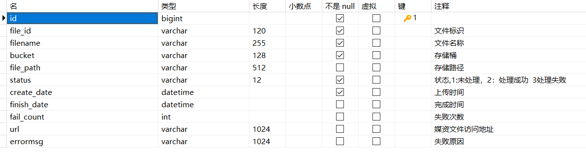
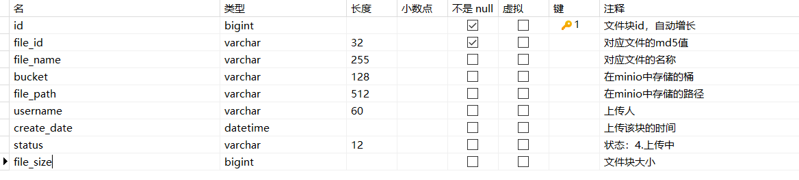

## 7.9 额外实现

### 7.9.1 任务补偿机制

问题：如果有线程抢占了某个视频的处理任务，如果线程处理过程中挂掉了，该视频的状态将会一直是处理中，其它线程将无法处理，这个问题需要用补偿机制。

单独启动一个任务找到待处理任务表中超过执行期限但仍在处理中的任务，将任务的状态改为执行失败。

==任务执行期限是处理一个视频的最大时间，比如定为30分钟，通过任务的启动时间去判断任务是否超过执行期限。==

大家思考这个sql该如何实现？

大家尝试自己实现此任务补偿机制。

#### 数据库表结构

表`media_process`:



根据status字段判断视频文件是否正在处理，如果status值为4（正在处理），且当前时间减去create_date超过30分钟，就把status的值修改为3（处理失败），并更新其他字段的值。

#### 具体实现流程

1. 编写检查超时的sql

   ```sql
   SELECT * FROM `media_process_history`
   WHERE TIMESTAMPDIFF(MINUTE,create_date,finish_date) < 30
   ```

2. 在media_process的mapper接口中添加相应的接口

   `MediaProcessMapper.java`

   ```java
   /**
    * 查询是否有执行超过30分钟的视频处理任务
    * @param nowDate 当前任务执行的时间
    * @return List<MediaProcess>
    */
   @Select("SELECT * FROM media_process_history WHERE TIMESTAMPDIFF(MINUTE,create_date,#{date}) > 30")
   List<MediaProcess> selectTimeoutProcess(@Param("date")Date nowDate);
   ```

3. 实现service代码

   ```java
   /**
    * 超时任务列表
    * @param shardIndex 分片序号
    * @param shardTotal 分片总数
    * @param count 获取记录数（cpu核心数）
    * @return List<MediaProcess>
    */
   @Override
   public List<MediaProcess> getTimeoutMediaProcessList(int shardIndex, int shardTotal, int count) {
       List<MediaProcess> mediaTimeoutProcessList = mediaProcessMapper.selectTimeoutProcess(LocalDateTime.now(), shardIndex, shardTotal, count);
       return mediaTimeoutProcessList;
   }
   ```

4. 业务逻辑在task中实现

   查询相应超时记录，把status和errMsg字段更新后保存到`media_process`表里。

   ```java
   /**
    * 处理视频超时任务
    * @throws Exception
    */
   @XxlJob("videoTimeoutJobHandler")
   public void videoTimeoutJobHandler() throws Exception {
       // 分片参数
       int shardIndex = XxlJobHelper.getShardIndex();
       int shardTotal = XxlJobHelper.getShardTotal();
       List<MediaProcess> mediaTimeoutProcessList = null;
       int size = 0;
       try {
           // 取出cpu核心数作为一次检查超时的记录条数
           int availableProcessors = Runtime.getRuntime().availableProcessors();
           mediaTimeoutProcessList = mediaFileProcessService.getTimeoutMediaProcessList(LocalDateTime.now(), shardIndex, shardTotal, availableProcessors);
           size = mediaTimeoutProcessList.size();
           log.debug("取出的超时任务数量是 {} 条", size);
           if (size <= 0) {
               return ;
           }
       } catch (Exception e) {
           log.error("取出的超时任务超时", size);
           e.printStackTrace();
       }
       // 启动size个线程的线程池
       ExecutorService fixedThreadPool = Executors.newFixedThreadPool(size);
       // 定义size个插销
       CountDownLatch countDownLatch = new CountDownLatch(size);
       mediaTimeoutProcessList.forEach(mediaProcess -> {
           // 将任务加入线程池
           fixedThreadPool.execute(() -> {
               try {
                   // 把status值设置为3，并把errMsg更新
                   Long taskId = mediaProcess.getId();
                   String fileId = mediaProcess.getFileId();
                   mediaFileProcessService.saveProcessFinishStatus(taskId, "3", fileId, null, "处理视频超时（30分钟）");
                   log.debug("删除超时任务");
               } catch (Exception e) {
                   e.printStackTrace();
                   log.error("删除超时任务失败，失败原因: {}", e.getMessage());
               } finally {
                   countDownLatch.countDown();
               }
           });
       });
       // 等待，给一个充裕的超时事件，防止无限等待，到达超时时间还没有处理完成则结束任务
       countDownLatch.await(30, TimeUnit.MINUTES);
   }
   ```

### 7.9.2 达到最大失败次数（暂时未实现）

问题：需要找到前端对应的接口。

当任务达到最大失败次数时一般就说明程序处理此视频存在问题，这种情况就需要人工处理，在页面上会提示失败的信息，人工可手动执行该视频进行处理，或通过其它转码工具进行视频转码，转码后直接上传mp4视频。

### 7.9.3 分块文件清理问题

上传一个文件进行分块上传，上传一半不传了，之前上传到minio的分块文件要清理吗？怎么做的？

1、在数据库中有一张文件表记录minio中存储的文件信息。

2、文件开始上传时会写入文件表，状态为上传中，上传完成会更新状态为上传完成。

3、当一个文件传了一半不再上传了说明该文件没有上传完成，会有定时任务去查询文件表中的记录，如果文件未上传完成则删除minio中没有上传成功的文件目录。

#### 实现思路

难点：怎么判断文件上传了一半不再上传了？上传分块文件只在上传视频时有用，上传分块文件时不会往`media_files`表里添加记录，只有所有分块上传完成，并合并成功后，才会往`media_files`里插入数据。所以要建立一个`media_minio_files`表，每上传一个分块就往`media_minio_files`表里插入一条分块信息，记录包括分块的上传时间。如果超过30分钟分块记录还没有被删除，说明上传到一半不传了，把minio里的分块目录删除，并删除对应的数据库里的记录。在文件合并成功后，数据库里的分块文件上传记录也要删除。

#### media_minio_files表结构



#### 具体实现流程

1. 上传文件块的时候，上传一个文件块完毕要把这个块的信息保存到表里。

   ```java
   /**
    * 把文件分块信息入库
    * @param fileMd5 文件md5
    * @param fileName 文件名称
    * @param bucket minio桶
    * @param objectName minio中块的存储路径
    * @param chunkSize 块大小
    * @return MediaMinioFiles
    */
   @Transactional
   @Override
   public MediaMinioFiles addMediaChunkToDb(String fileMd5, String fileName, String bucket, String objectName, Long chunkSize) {
       MediaMinioFiles mediaMinioFile = new MediaMinioFiles();
       mediaMinioFile.setFileId(fileMd5);
       mediaMinioFile.setFilename(fileName);
       mediaMinioFile.setBucket(bucket);
       mediaMinioFile.setFilePath(objectName);
       mediaMinioFile.setFileSize(chunkSize);
       mediaMinioFile.setStatus("4");  // 上传中
       int insert = mediaMinioFilesMapper.insert(mediaMinioFile);
       if (insert < 0) {
           log.error("保存分块文件信息到数据库失败，{}", mediaMinioFile.toString());
           XueChengPlusException.cast("保存分块文件信息失败");
       }
       log.debug("保存分块文件信息到数据库成功，{}", mediaMinioFile.toString());
       return mediaMinioFile;
   }
   
   /**
    * 上传分块
    * @param fileMd5 文件md5
    * @param chunk 分块序号
    * @param localChunkFilePath 分块文件本地路径
    * @return RestResponse
    */
   @Override
   public RestResponse uploadChunk(String fileMd5, int chunk, String localChunkFilePath) {
       // 得到分块文件的目录路径
       String chunkFileFolderPath = getChunkFileFolderPath(fileMd5);
       // 得到分块文件的路径
       String chunkFilePath = chunkFileFolderPath + chunk;
       // mimeType
       String mimeType = getMimeType(null);
       // 将文件存储到 minio
       boolean b = addMediaFilesToMinIO(localChunkFilePath, mimeType, bucketVideoFiles, chunkFilePath);
       // 将分块信息存到数据库中
       currentProxy.addMediaChunkToDb(fileMd5, null, bucketVideoFiles, chunkFilePath, 1024 * 5L);
       if (!b) {
           log.debug("上传分块文件失败: {}", chunkFilePath);
           return RestResponse.validfail(false, "上传分块失败");
       }
       log.debug("上传分块文件成功: {}", chunkFilePath);
       return RestResponse.success(true);
   }
   ```

2. 如果没有上传失败，在成功合并块文件之后，要把上面数据库中记录删除。

   ```java
   /**
    * 删除数据库中的分块文件上传记录
    * @param fileMd5 文件md5
    */
   @Transactional
   public void clearChunkFromDb(String fileMd5) {
       LambdaQueryWrapper<MediaMinioFiles> deleteQueryWrapper = new LambdaQueryWrapper<>();
       deleteQueryWrapper.eq(MediaMinioFiles::getFileId, fileMd5);
       try {
           mediaMinioFilesMapper.delete(deleteQueryWrapper);
           log.debug("删除分块上传记录成功");
       } catch (Exception e) {
           e.printStackTrace();
           log.error("删除分块上传记录失败");
       }
   }
   ```

   在合并分块的最后几行：

   ```java
   // 文件入库
   currentProxy.addMediaFilesToDb(companyId, fileMd5, uploadFileParamsDto, bucketVideoFiles, mergeFilePath);
   // 清除文件分块
   clearChunkFiles(chunkFileFolderPath, chunkTotal);
   // 清除数据库中文件分块上传信息
   currentProxy.clearChunkFromDb(fileMd5);
   return RestResponse.success(true);
   ```

3. 如果上传文件一半失败，要根据数据库中`media_minio_files`表中存的块的路径删除所有超时块。

   首先查询所有的超时块，得到上传的超时块列表：
   
   ```java
   /**
    * 拿到数据库中所有上传超时的文件分块信息
    * @param time 当前任务执行时间
    * @return List<MediaMinioFiles>
    */
   @Override
   public List<MediaMinioFiles> getChunkTimeoutFiles(LocalDateTime time) {
       List<MediaMinioFiles> mediaMinioFiles = mediaMinioFilesMapper.selectTimeoutChunks(DateUtil.toDateTime(time));
       return mediaMinioFiles;
   }
   ```
   
   删除minio中所有超时块，并且删除所有超时记录
   
   ```java
   @XxlJob("videoChunkTimeoutJobHandler")
   public void videoChunkTimeoutJobHandler() {
       log.debug(">>>>>>>>>> 开始执行检查上传超时块任务");
       // 拿到所有的超时分块任务
       List<MediaMinioFiles> chunkTimeoutFiles = mediaFileService.getChunkTimeoutFiles(LocalDateTime.now());
       if (chunkTimeoutFiles == null) {  // 没有超时任务
           log.debug("没有超时任务");
           return ;
       }
       // 根据记录中的file_path，删除minio中的所有文件
       chunkTimeoutFiles.forEach(chunk -> {
           String filePath = chunk.getFilePath();
           mediaFileService.clearSingleChunkFile(filePath);
       });
       // 删除数据库中对应的记录
       mediaFileService.clearChunkFromDb(null, LocalDateTime.now());
   }
   ```
   
   

