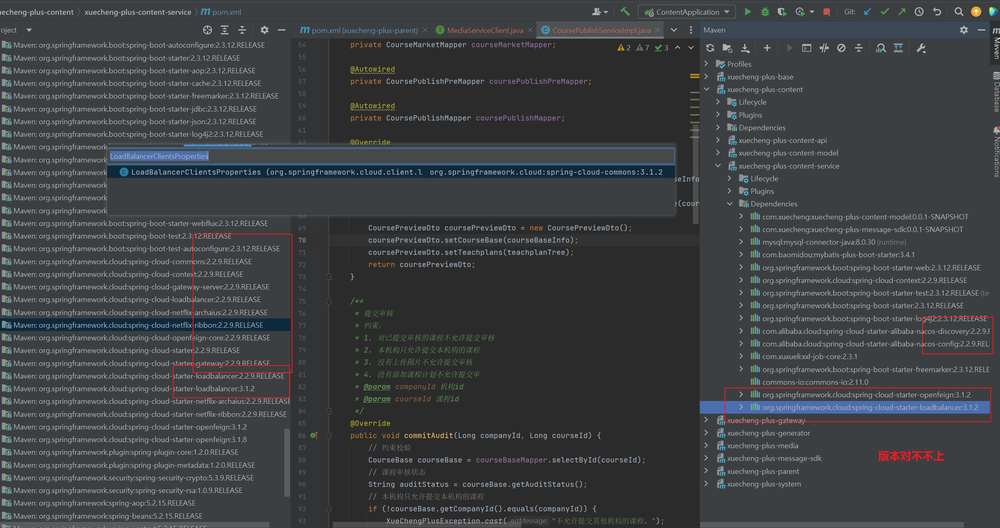

## 第4章课程发布v3.1

### 模板文件点击目录没有反应

在提供的`course_templates.ftl`模板文件中，点击目录的tab不会跳转。尝试解决方法如下所示：

在模板文件的`<body>`中添加如下的js代码：（添加tab切换逻辑）

```js
<script>
    function turnTab(tabType) {
        let articleBoxDiv = document.getElementsByClassName("article-box")[0];
        let childrenDivs = articleBoxDiv.children;
        for (let i = 0; i < childrenDivs.length; i ++) {
            let child = childrenDivs[i];
            let className = child.className;
            let a = document.getElementById(className);
            if (className === tabType) {
                console.log("切换tab到: ", tabType);
                child.style.display = "block";
                // 给对应的a标签tab添加active类样式
                a.className = "active";
            } else {
                child.style.display = "none";
                a.className = "";
            }
        }
    }
</script>
```

把对应的a标签修改如下所示：

```html
<a href="javascript:;" id="articleClass" class="active" onclick="turnTab('articleClass')">课程介绍</a>
<a href="javascript:;" id="articleItem" onclick="turnTab('articleItem')">目录</a>
<a href="javascript:;" id="artcleAsk" onclick="turnTab('artcleAsk')">问答</a>
<a href="javascript:;" id="artcleNot" onclick="turnTab('artcleNot')">笔记</a>
<a href="javascript:;" id="artcleCod" onclick="turnTab('artcleCod')">评价</a>
```

### Feign调用media-api失败（已解决）

参考：[[csdn](https://blog.csdn.net/qq_34279995/article/details/123282857)]

==尝试参考nacos里的示例代码一点一点的debug==

使用feign调用出现连接错误，最底层异常是 UnknownHostException,也就是直接使用服务名去请求了；最终解决方法，未加对应的负载实现;

加入此解决;

```xml
<dependency>
	<groupId>org.springframework.cloud</groupId>
	<artifactId>spring-cloud-loadbalancer</artifactId>
</dependency>
```

分析：在feign调用的时候比如 A 服务调用B服务A 拿到的是B服务的服务名称 b-service

那么在调用的时候是 http://b-service/xx

这时候会判断feignclient 是否设置url 属性，如果设置了，那么直接使用url属性的值进行调用，如果没有 就会使用对应的LoadBalance api 从对应的注册中心获取服务的实例地址，也就是说当使用服务名调用的时候，负载均衡总需要一个，Ribbon 或spring-cloud-loadbalancer ;

不然就无法将服务名替换成对应的真实服务地址进行调用;

在pom文件依赖中，只添加以下依赖：

```xml
<!--  添加feign依赖  -->
<dependency>
    <groupId>org.springframework.cloud</groupId>
    <artifactId>spring-cloud-starter-openfeign</artifactId>
    <version>3.1.2</version>
</dependency>
```

出现报错：

```java
Caused by: org.springframework.beans.factory.BeanCreationException: Error creating bean with name 'com.xuecheng.content.feignclient.MediaServiceClient': Unexpected exception during bean creation; nested exception is java.lang.IllegalStateException: No Feign Client for loadBalancing defined. Did you forget to include spring-cloud-starter-loadbalancer?
	at org.springframework.beans.factory.support.AbstractAutowireCapableBeanFactory.createBean(AbstractAutowireCapableBeanFactory.java:529)
	at org.springframework.beans.factory.support.AbstractBeanFactory.lambda$doGetBean$0(AbstractBeanFactory.java:324)
	at org.springframework.beans.factory.support.DefaultSingletonBeanRegistry.getSingleton(DefaultSingletonBeanRegistry.java:234)
	at org.springframework.beans.factory.support.AbstractBeanFactory.doGetBean(AbstractBeanFactory.java:322)
	at org.springframework.beans.factory.support.AbstractBeanFactory.getBean(AbstractBeanFactory.java:202)
	at org.springframework.beans.factory.config.DependencyDescriptor.resolveCandidate(DependencyDescriptor.java:276)
	at org.springframework.beans.factory.support.DefaultListableBeanFactory.doResolveDependency(DefaultListableBeanFactory.java:1307)
	at org.springframework.beans.factory.support.DefaultListableBeanFactory.resolveDependency(DefaultListableBeanFactory.java:1227)
	at org.springframework.beans.factory.annotation.AutowiredAnnotationBeanPostProcessor$AutowiredFieldElement.resolveFieldValue(AutowiredAnnotationBeanPostProcessor.java:657)
	... 21 more
Caused by: java.lang.IllegalStateException: No Feign Client for loadBalancing defined. Did you forget to include spring-cloud-starter-loadbalancer?
```

原因是：

你遇到的这个错误提示表明你的Spring Cloud项目在使用OpenFeign时缺少了负载均衡的配置。Spring Cloud OpenFeign 需要与一个负载均衡器一起工作，比如 Netflix Ribbon 或 Spring Cloud LoadBalancer。

在Spring Cloud 2020.0.0版本（也称为Ilford）及以后的版本中，Netflix Ribbon 已经不再被官方推荐使用，转而推荐使用 Spring Cloud LoadBalancer。如果你正在使用这些版本或更新的版本，确保已经添加了Spring Cloud LoadBalancer的依赖。

对于Spring Cloud 2020.0.0版本及以后的版本，你可以通过添加以下依赖来引入Spring Cloud LoadBalancer：

```xml
<dependency>
    <groupId>org.springframework.cloud</groupId>
    <artifactId>spring-cloud-starter-loadbalancer</artifactId>
</dependency>
```

确保你的`@FeignClient`注解使用的服务名在你的服务注册中心（如Eureka、Consul等）中是可用的，这样LoadBalancer才能找到并进行正确的服务实例选择。

在添加了上述依赖之后，重新构建并启动你的项目，看是否解决了问题。如果仍然有问题，可能需要检查以下方面：

1. 确认你的服务注册与发现组件正常运行，并且服务实例已成功注册。
2. 检查`application.properties`或`application.yml`配置文件中的相关负载均衡配置。
3. 如果你使用的是不同版本的Spring Cloud，可能需要对应的Spring Cloud LoadBalancer版本，所以请根据Spring Cloud文档来对应相应版本。
4. 检查是否有其他配置或代码可能影响到FeignClient的创建。

如果问题依旧存在，可以尝试查看更详细的错误日志，或者提供更多的上下文信息，以便进一步诊断问题所在。

仍然没有解决：

参考：[[csdn](https://blog.csdn.net/weixin_54227075/article/details/122971524)]，继续尝试



把`openfeign`和nacos discover的版本对应上之后，出现新的报错：

```java
Caused by: org.springframework.beans.factory.BeanCreationException: Error creating bean with name 'com.xuecheng.content.feignclient.MediaServiceClient': Unexpected exception during bean creation; nested exception is java.lang.IllegalStateException: No bean found of type interface org.springframework.cloud.openfeign.Targeter for media-api
	at org.springframework.beans.factory.support.AbstractAutowireCapableBeanFactory.createBean(AbstractAutowireCapableBeanFactory.java:529)
	at org.springframework.beans.factory.support.AbstractBeanFactory.lambda$doGetBean$0(AbstractBeanFactory.java:324)
	at org.springframework.beans.factory.support.DefaultSingletonBeanRegistry.getSingleton(DefaultSingletonBeanRegistry.java:234)
	at org.springframework.beans.factory.support.AbstractBeanFactory.doGetBean(AbstractBeanFactory.java:322)
	at org.springframework.beans.factory.support.AbstractBeanFactory.getBean(AbstractBeanFactory.java:202)
	at org.springframework.beans.factory.config.DependencyDescriptor.resolveCandidate(DependencyDescriptor.java:276)
	at org.springframework.beans.factory.support.DefaultListableBeanFactory.doResolveDependency(DefaultListableBeanFactory.java:1307)
	at org.springframework.beans.factory.support.DefaultListableBeanFactory.resolveDependency(DefaultListableBeanFactory.java:1227)
	at org.springframework.beans.factory.annotation.AutowiredAnnotationBeanPostProcessor$AutowiredFieldElement.resolveFieldValue(AutowiredAnnotationBeanPostProcessor.java:657)
	... 21 more
Caused by: java.lang.IllegalStateException: No bean found of type interface org.springframework.cloud.openfeign.Targeter for media-api
```

分析原因[[csdn](https://blog.csdn.net/shenguoxiao/article/details/129091730)]：因为nacos配置中心的`feign-dev.yaml`配置了hystrix，但是当前`pom.xml`里没有添加（版本问题需要添加）。

```xml
<dependency>
    <groupId>org.springframework.cloud</groupId>
    <artifactId>spring-cloud-starter-netflix-hystrix</artifactId>
</dependency>
```

==总结：各种包的版本和springboot, springcloud版本对不上==

当前项目的版本

```xml
<spring-boot.version>2.3.12.RELEASE</spring-boot.version>
<spring-cloud.version>Hoxton.SR12</spring-cloud.version>
<spring-cloud-alibaba.version>2.2.9.RELEASE</spring-cloud-alibaba.version>
```

引入nacos和feign依赖：

```xml
 <dependency>
    <groupId>com.alibaba.cloud</groupId>
    <artifactId>spring-cloud-starter-alibaba-nacos-discovery</artifactId>
</dependency>

<!-- nacos配置依赖 -->
<dependency>
    <groupId>com.alibaba.cloud</groupId>
    <artifactId>spring-cloud-starter-alibaba-nacos-config</artifactId>
</dependency>
<dependency>
    <groupId>org.springframework.cloud</groupId>
    <artifactId>spring-cloud-starter-openfeign</artifactId>
    <!--<version>2.2.9.RELEASE</version>-->
</dependency>
<dependency>
    <groupId>org.springframework.cloud</groupId>
    <artifactId>spring-cloud-starter-loadbalancer</artifactId>
    <!--<version>2.2.9.RELEASE</version>-->
</dependency>

<dependency>
    <groupId>org.springframework.cloud</groupId>
    <artifactId>spring-cloud-starter-netflix-hystrix</artifactId>
</dependency>
```

### 熔断器版本太旧

#### 解决：

要调用：

```java
import org.springframework.cloud.openfeign.FallbackFactory;  // 正确调用
import feign.hystrix.FallbackFactory;  // 错误调用
```

```xml
<dependency>
    <groupId>org.springframework.cloud</groupId>
    <artifactId>spring-cloud-starter-openfeign</artifactId>
    <exclusions>
        <exclusion>
            <groupId>io.github.openfeign</groupId>
            <artifactId>feign-hystrix</artifactId>
        </exclusion>
    </exclusions>
    <!--<version>2.2.9.RELEASE</version>-->
</dependency>
<dependency>
    <groupId>org.springframework.cloud</groupId>
    <artifactId>spring-cloud-starter-netflix-hystrix</artifactId>
</dependency>
```

**迁移到Resilience4j**： 如果问题依然存在，且你使用的是较新版本的Spring Cloud，可能需要考虑迁移到Resilience4j。因为Hystrix已经进入维护模式，不再推荐使用。对于Resilience4j的熔断器配置，你需要引入相应的Spring Cloud Starter。

#### @FeignClient里的熔断实现

在使用Spring Cloud和Feign时，你可以通过几种方式来配置和实现熔断功能，这些方式主要基于Hystrix或Resilience4j（作为Hystrix的一个现代替代）。以下是一些常见的熔断实现方式：

##### 1. 使用Hystrix

如果你的项目中包含了`spring-cloud-starter-netflix-hystrix`，那么可以使用Hystrix来实现熔断。这里是如何在Feign客户端中使用Hystrix进行熔断处理的示例：

```java
@FeignClient(name = "client-name", fallback = YourFallback.class)
public interface YourFeignClient {
    // ...
}

@Component
public class YourFallback implements YourFeignClient {
    @Override
    public String yourMethod() {
        return "fallback response";
    }
}
```

在上面的代码中，`YourFallback`类提供了Feign客户端的后备逻辑。一旦调用失败触发了熔断，就会执行该类中相应的方法。

##### 2. 使用FallbackFactory

你也可以使用`FallbackFactory`来创建一个fallback类，这样可以获取导致回退的原因：

```java
@FeignClient(name = "client-name", fallbackFactory = YourFallbackFactory.class)
public interface YourFeignClient {
    // ...
}

@Component
public class YourFallbackFactory implements FallbackFactory<YourFeignClient> {
    @Override
    public YourFeignClient create(Throwable cause) {
        return new YourFeignClient() {
            @Override
            public String yourMethod() {
                return "fallback due to " + cause.getMessage();
            }
        };
    }
}
```

##### 3. 使用Resilience4j

官方教程：[[Resilience4j](https://resilience4j.readme.io/v1.7.0/docs/getting-started-3)]

在`@FeignClient`中指定Resilience4j实现的fallback函数，你需要进行以下步骤：

1. **定义一个fallback类**：创建一个实现了Feign客户端接口的类。这个类将包含服务降级的逻辑。

```java
public class MyFeignClientFallback implements MyFeignClient {

    @Override
    public String getDataFromRemote() {
        // 实现服务降级逻辑
        return "Default Response";
    }
}
```

2. **使用`fallback`属性**：在`@FeignClient`注解中，使用`fallback`属性来指定你的fallback类。

```java
@FeignClient(name = "myFeignClient", fallback = MyFeignClientFallback.class)
public interface MyFeignClient {
    @GetMapping("/some/endpoint")
    String getDataFromRemote();
}
```

3. **配置Resilience4j**：在你的应用配置文件中为Feign客户端配置Resilience4j。

```yaml
resilience4j.circuitbreaker:
  instances:
    myFeignClient:
      registerHealthIndicator: true
      slidingWindowSize: 100
      minimumNumberOfCalls: 10
      permittedNumberOfCallsInHalfOpenState: 3
      waitDurationInOpenState: 10s
      failureRateThreshold: 50
      eventConsumerBufferSize: 10
      recordExceptions:
        - java.io.IOException
        - org.springframework.web.client.HttpServerErrorException
        - java.util.concurrent.TimeoutException
```

在这里，`myFeignClient`是你的Feign客户端和断路器的名称。

4. **启用断路器**：确保在Feign的配置中启用了断路器。

```java
@Configuration
public class FeignConfig {

    @Bean
    public Feign.Builder feignBuilder() {
        FeignDecorators decorators = FeignDecorators.builder()
                .withCircuitBreaker(CircuitBreaker.ofDefaults("myFeignClient"))
                .build();

        return Resilience4jFeign.builder(decorators);
    }
}
```

5. **(可选)创建一个配置类**：如果需要，可以创建一个配置类来自定义断路器的行为。

```java
@Configuration
public class MyFeignClientConfig {

    @Bean
    public CircuitBreakerConfig customCircuitBreakerConfig() {
        return CircuitBreakerConfig.custom()
                // 自定义配置
                .build();
    }

    // 其他可能的自定义Bean
}
```

6. **测试**：实施完这些配置后，你应该测试服务的断路功能以确保它按预期工作。

通过这种方式，如果Feign客户端的远程调用失败，Resilience4j将会启动断路器逻辑，并且`MyFeignClientFallback`类中定义的服务降级方法将被调用。


### 实现课程审核通过（todo）

~~课程审核通过后需要把`course_publish_pre`表里的记录转存到`course_publish`里~~，要课程发布之后才王`course_publish`表里插入数据。

### 把文件转换成MultiPart格式

Feign 是一个 Java HTTP 客户端库，通常用于微服务之间的通信。如果你想要通过 Feign 客户端发送一个文件，通常需要使用 `MultipartFile` 接口来处理上传的文件。下面是一个简单的示例，展示了如何定义一个 Feign 客户端接口来上传文件：

```java
@FeignClient(value = "fileUploadClient", url = "http://localhost:8080")
public interface FileUploadClient {

    @PostMapping(value = "/upload", consumes = MediaType.MULTIPART_FORM_DATA_VALUE)
    String handleFileUpload(@RequestPart(value = "file") MultipartFile file);
}
```

在这个接口中，`@RequestPart` 注解用于指定传递给服务端的文件部分，而 `consumes = MediaType.MULTIPART_FORM_DATA_VALUE` 则声明了这个请求会消费多部分的表单数据。

现在，如果你想要将一个本地文件转换为 `MultipartFile`，你可以使用 `MockMultipartFile` 来进行测试或者使用 `org.springframework.web.multipart.commons.CommonsMultipartFile` 来实现真正的转换。这里有一个如何将 `File` 转换为 `MultipartFile` 的示例：

```java
import org.springframework.web.multipart.MultipartFile;
import org.springframework.mock.web.MockMultipartFile;
import java.nio.file.Files;
import java.nio.file.Path;
import java.io.IOException;

public class FileConverter {

    public MultipartFile convertFileToMultipart(File file) throws IOException {
        Path path = file.toPath();
        String name = file.getName();
        String originalFileName = file.getName();
        String contentType = Files.probeContentType(path);
        byte[] content = null;
        
        try {
            content = Files.readAllBytes(path);
        } catch (final IOException e) {
        }
        
        MultipartFile result = new MockMultipartFile(name,
                                                     originalFileName, contentType, content);
        
        return result;
    }
}
```

在这个示例中，`convertFileToMultipart` 方法会将一个 `java.io.File` 对象转换为 `MultipartFile`，这样你就可以使用 Feign 客户端来上传文件了。

请注意，如果你在生产代码中而不是测试中这么做，你可能不会想使用 `MockMultipartFile`，而是通过其它方式来创建 `MultipartFile` 实例。`MockMultipartFile` 主要用于测试目的，因为它来自 `spring-test` 模块。

如果你需要在非测试环境中将 `File` 转换为 `MultipartFile`，那么可能需要自定义实现，因为 Spring 框架默认没有提供直接从 `java.io.File` 到 `MultipartFile` 的转换。通常，`MultipartFile` 是由 Spring 的 `DispatcherServlet` 在处理上传的文件时自动填充的。

上传文件时，通常还需要确保你的服务端也支持多部分文件上传处理，通常通过添加 `@EnableMultipartResolver` 注解和配置相应的 `MultipartResolver` bean 来实现。

#### 文档中给出的模板

```java
package com.xuecheng.content.config;

import feign.codec.Encoder;
import feign.form.spring.SpringFormEncoder;
import org.apache.commons.fileupload.FileItem;
import org.apache.commons.fileupload.disk.DiskFileItemFactory;
import org.apache.commons.io.IOUtils;
import org.springframework.beans.factory.ObjectFactory;
import org.springframework.beans.factory.annotation.Autowired;
import org.springframework.boot.autoconfigure.http.HttpMessageConverters;
import org.springframework.cloud.openfeign.support.SpringEncoder;
import org.springframework.context.annotation.Bean;
import org.springframework.context.annotation.Configuration;
import org.springframework.context.annotation.Primary;
import org.springframework.context.annotation.Scope;
import org.springframework.http.MediaType;
import org.springframework.web.multipart.MultipartFile;
import org.springframework.web.multipart.commons.CommonsMultipartFile;

import java.io.File;
import java.io.FileInputStream;
import java.io.OutputStream;

/**
 * @author Mr.M
 * @version 1.0
 * @description TODO
 * @date 2022/10/15 22:13
 */
@Configuration
public class MultipartSupportConfig {

    @Autowired
    private ObjectFactory<HttpMessageConverters> messageConverters;

    @Bean
    @Primary//注入相同类型的bean时优先使用
    @Scope("prototype")
    public Encoder feignEncoder() {
        return new SpringFormEncoder(new SpringEncoder(messageConverters));
    }

    //将file转为Multipart
    public static MultipartFile getMultipartFile(File file) {
        FileItem item = new DiskFileItemFactory().createItem("file", MediaType.MULTIPART_FORM_DATA_VALUE, true, file.getName());
        try (FileInputStream inputStream = new FileInputStream(file);
             OutputStream outputStream = item.getOutputStream();) {
            IOUtils.copy(inputStream, outputStream);

        } catch (Exception e) {
            e.printStackTrace();
        }
        return new CommonsMultipartFile(item);
    }
}

```

==代码解析：==

这段代码定义了一个Spring的配置类（通过`@Configuration`注解标识），该类的目的是配置一个支持multipart（多部分）上传的Feign客户端。下面分别解释代码中的各个部分：

1. `@Configuration`：这是一个类级别的注解，它告诉Spring框架这个类包含了一个或多个定义了`@Bean`的方法。Spring容器将这些方法返回的对象视为可管理的bean。

2. `@Autowired`：自动注入Spring的`ObjectFactory<HttpMessageConverters>`。这是一个工厂，能够生成`HttpMessageConverters`实例。`HttpMessageConverters`是Spring MVC用来转换HTTP请求和响应的对象。

3. `@Bean`：这是一个方法级别的注解，用于告诉Spring框架这个方法将返回一个对象，该对象应该被注册为Spring应用程序上下文中的bean。

4. `@Primary`：当有多个相同类型的bean可用时，`@Primary`注解的bean将被优先考虑。在这种情况下，这意味着当有多个`Encoder`类型的bean时，`feignEncoder`方法返回的`Encoder`实例将作为首选。

5. `@Scope("prototype")`：这表明每次注入或通过Spring应用程序上下文显式请求时，都会创建一个新的`Encoder`实例，而不是使用单例模式。

6. `feignEncoder`方法：该方法定义了一个Feign的`Encoder`，它是用于编码请求体的组件。在这种情况下，它使用`SpringFormEncoder`，这是一个专门用于处理`multipart/form-data`请求的编码器。该编码器装饰了`SpringEncoder`，它是基于Spring的消息转换器的编码器。这种配置允许Feign客户端发送包含文件和表单字段的多部分请求。

7. `getMultipartFile`静态方法：这个方法将一个`java.io.File`对象转换为Spring的`MultipartFile`对象，这样它就可以被Feign客户端用于文件上传。它使用Apache Commons FileUpload库的`DiskFileItemFactory`和`FileItem`来创建一个`MultipartFile`。这个方法首先创建一个`FileItem`实例，然后将文件内容复制到它的输出流中，最后创建并返回一个`CommonsMultipartFile`对象。

这段代码的关键是它配置了Feign以支持多部分表单数据的编码方式，允许开发者通过Feign客户端上传文件。需要注意的是，`getMultipartFile`方法在将IO流复制到`outputStream`后并没有显示地关闭`outputStream`，因为`try-with-resources`语句会自动关闭实现了`AutoCloseable`的资源。

#### @Scope

`@Scope` 注解在 Spring 框架中用来指定 Spring 容器如何创建 bean 实例。默认情况下，Spring 容器会为每个定义的 bean 创建一个单一的实例（单例模式），但是可以通过 `@Scope` 注解来改变这个行为。`@Scope` 注解可以指定为某个 bean 设置不同的作用域。

`@Scope("prototype")` 的作用

当你在一个 bean 定义上使用 `@Scope("prototype")` 时，Spring 容器会为每次请求该 bean 时创建一个新的实例。这意味着如果你在代码中多次请求同一个 `prototype` 作用域的 bean，你将每次获得一个不同的实例。这对于那些有状态的对象很有用，这些对象不应该被多个依赖共享。

`@Scope` 的常用方式

`@Scope` 注解可以使用以下几种常用的作用域：

1. `singleton`（默认作用域）：对于每个 Spring IoC 容器只创建一个实例。
2. `prototype`：每次请求都会创建一个新实例。
3. `request`：每个 HTTP 请求都会创建一个实例，仅在 Web 应用程序上下文中有效。
4. `session`：每个 HTTP 会话都会创建一个实例，仅在 Web 应用程序上下文中有效。
5. `globalSession`：每个全局 HTTP 会话都会创建一个实例，仅用于 Portlet 应用程序。
6. `application`：在 ServletContext 的生命周期内是唯一的，仅在 Web 应用程序上下文中有效。
7. `websocket`：在 WebSocket 的生命周期内是唯一的，仅在 Web 应用程序上下文中有效。

使用方式示例：
```java
@Component
@Scope("singleton") // 可省略，因为这是默认值
public class SingletonBean {
    // 类定义
}

@Component
@Scope("prototype")
public class PrototypeBean {
    // 类定义
}

@Component
@Scope(ConfigurableBeanFactory.SCOPE_PROTOTYPE)
public class AnotherPrototypeBean {
    // 类定义
}

@Component
@Scope(value = WebApplicationContext.SCOPE_REQUEST, proxyMode = ScopedProxyMode.TARGET_CLASS)
public class RequestScopedBean {
    // 类定义
}
```
`proxyMode` 属性通常与 `request`、`session` 和 `application` 等作用域一起使用，这是因为在不同的请求或会话中，对应的实例可能不同，需要通过代理来进行中介，以确保在每个上下文中使用的是正确的实例。

Spring在不同的上下文（如 Web 上下文）中提供了额外的作用域。这些特殊的作用域通常用于基于 Web 的应用程序，其中 bean 的生命周期需要绑定到 HTTP 请求、会话或全局 Web 应用程序上下文。

