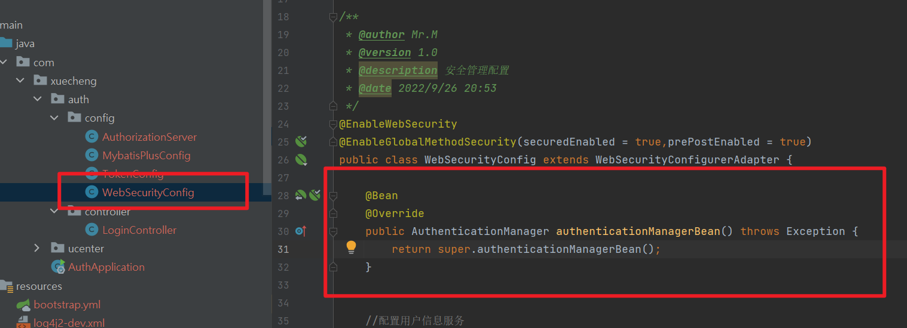

## 第五章 认证授权v3.1

### 项目启动问题

#### AuthenticationManager无法注入

解决：[[csdn](https://blog.csdn.net/weixin_45498999/article/details/107999761)]

在`WebSSecurityConfig`中添加：

#### 无法创建checkcode的Bean

解决方法参考第4章的熔断器版本太旧的解决方法。

