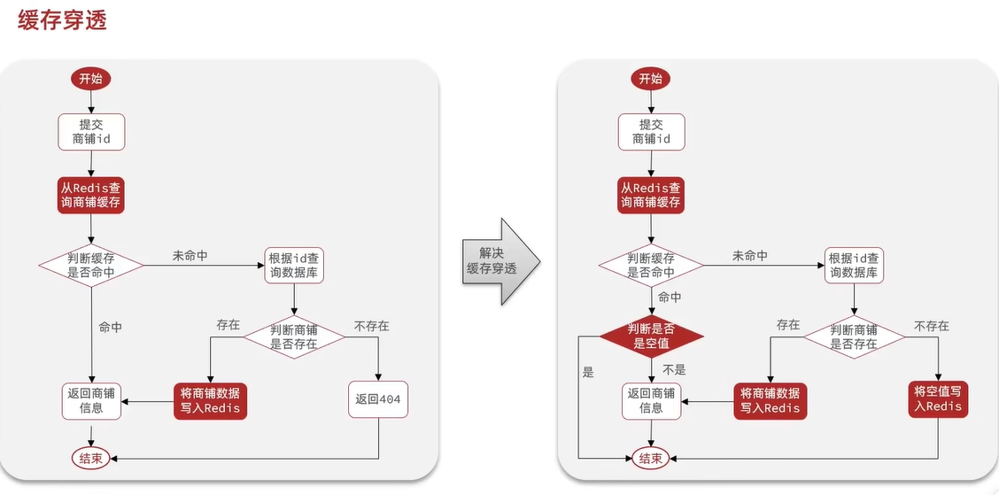

## Redis-HMDP

参考：[[csdn](https://blog.csdn.net/qq_66345100/article/details/131986713)]

### 什么是NoSQL

sql是关系型数据库。

nosql是非关系型数据库。

### Redis基本操作

RDF连接虚拟机里的Redis：https://blog.csdn.net/qq_39535807/article/details/106449156

### Redis的java客户端

https://redis.io/docs/latest/develop/connect/clients/java/


Jedis是线程不安全的。使用Jedis连接池进行优化。


### StringRedisTemplate

为什么要使用StringRedisTemplate？

在RedisTemplate set对象时，会自动触发序列化（默认JDK自带的序列化）把对象，但是JDK默认的序列化方案会把字符串转换成字节流（OutputStream），会出现乱码，所以要重写序列化逻辑，直接把字符串写入redis，避免转换成字节流后再写入redis出现乱码。Redis中key一般是一个字符串，所以直接用string序列化，value一般是对象，所以使用json序列化。


Json序列化器会额外写入@class（对象的字节码）：


手动实现Json序列化器：


在value中对象的json序列化和反序列化完全在后端逻辑中自己实现，这样可以节省空间（没有@class字节码）。

### Redis在项目中的各种应用

Redis中的各种数据结构和应用场景。


### 基于session短信登陆


这里重点关注第三步：检验登陆状态中的“保存用户到ThreadLocal”中。

每一个进入tomcat的请求都是一个线程对象，这样ThreadLocal就会在对应的线程空间开辟空间保存对应的用户信息。

### TreadLocal

略。

### Session共享

用Redis代替tomcat中存储的session。


### Redis实现共享session登陆


验证码还有多长时间过期：redis中的key过期时间。

用户访问一次，redis中的token的过期时间就更新。

###  登陆拦截器的优化


### 什么是缓存


### 商户信息添加缓存


### 缓存更新策略


第三步可能会出现线程安全问题，多个线程同时对缓存和数据库操作（当更新的都是同一条数据时），就会出现线程安全问题。


第二个方案可以给key加上超时时间兜底。但是要保证更新数据库和删除缓存都成功，否则会出现数据库和缓存数据不一致的情况。（单体可以加事务控制，微服务可以用分布式事务控制）


### 缓存穿透





### 缓存雪崩


### 缓存击穿


互斥锁保证一致性，逻辑过期保证可用性。

### 互斥锁解决缓存击穿


### JMeter的使用

并发测试


### 逻辑过期解决缓存击穿


### 缓存工具封装


```java
@Component
@Slf4j
public class CacheClient {

    private final StringRedisTemplate stringRedisTemplate;

    public CacheClient(StringRedisTemplate stringRedisTemplate) {
        this.stringRedisTemplate = stringRedisTemplate;
    }

    /**
     * 将数据加入Redis，并设置有效期
     *
     * @param key
     * @param value
     * @param timeout
     * @param unit
     */
    public void set(String key, Object value, Long timeout, TimeUnit unit) {
        stringRedisTemplate.opsForValue().set(key, JSONUtil.toJsonStr(value), timeout, unit);
    }

    /**
     * 将数据加入Redis，并设置逻辑过期时间
     *
     * @param key
     * @param value
     * @param timeout
     * @param unit
     */
    public void setWithLogicalExpire(String key, Object value, Long timeout, TimeUnit unit) {
        RedisData redisData = new RedisData();
        redisData.setData(value);
        // unit.toSeconds()是为了确保计时单位是秒
        redisData.setExpireTime(LocalDateTime.now().plusSeconds(unit.toSeconds(timeout)));
        stringRedisTemplate.opsForValue().set(key, JSONUtil.toJsonStr(value), timeout, unit);
    }

    /**
     * 根据id查询数据（处理缓存穿透）
     *
     * @param keyPrefix  key前缀
     * @param id         查询id
     * @param type       查询的数据类型
     * @param dbFallback 根据id查询数据的函数,数据库降级处理的逻辑
     * @param timeout    有效期
     * @param unit       有效期的时间单位
     * @param <T>
     * @param <ID>
     * @return
     */
    public <T, ID> T handleCachePenetration(String keyPrefix, ID id, Class<T> type,
                                            Function<ID, T> dbFallback, Long timeout, TimeUnit unit) {
        String key = keyPrefix + id;
        // 1、从Redis中查询店铺数据
        String jsonStr = stringRedisTemplate.opsForValue().get(key);

        T t = null;
        // 2、判断缓存是否命中
        if (StrUtil.isNotBlank(jsonStr)) {
            // 2.1 缓存命中，直接返回店铺数据
            t = JSONUtil.toBean(jsonStr, type);
            return t;
        }

        // 2.2 缓存未命中，判断缓存中查询的数据是否是空字符串(isNotBlank把null和空字符串给排除了)
        if (Objects.nonNull(jsonStr)) {
            // 2.2.1 当前数据是空字符串（说明该数据是之前缓存的空对象），直接返回失败信息
            return null;
        }
        // 2.2.2 当前数据是null，则从数据库中查询店铺数据
        t = dbFallback.apply(id);

        // 4、判断数据库是否存在店铺数据
        if (Objects.isNull(t)) {
            // 4.1 数据库中不存在，缓存空对象（解决缓存穿透），返回失败信息
            this.set(key, "", CACHE_NULL_TTL, TimeUnit.SECONDS);
            return null;
        }
        // 4.2 数据库中存在，重建缓存，并返回店铺数据
        this.set(key, t, timeout, unit);
        return t;
    }

    /**
     * 缓存重建线程池
     */
    public static final ExecutorService CACHE_REBUILD_EXECUTOR = Executors.newFixedThreadPool(10);

    /**
     * 根据id查询数据（处理缓存击穿）
     *
     * @param keyPrefix  key前缀
     * @param id         查询id
     * @param type       查询的数据类型
     * @param dbFallback 根据id查询数据的函数
     * @param timeout    有效期
     * @param unit       有效期的时间单位
     * @param <T>
     * @param <ID>
     * @return
     */
    public <T, ID> T handleCacheBreakdown(String keyPrefix, ID id, Class<T> type,
                                          Function<ID, T> dbFallback, Long timeout, TimeUnit unit) {
        String key = keyPrefix + id;
        // 1、从Redis中查询店铺数据，并判断缓存是否命中
        String jsonStr = stringRedisTemplate.opsForValue().get(key);
        if (StrUtil.isBlank(jsonStr)) {
            // 1.1 缓存未命中，直接返回失败信息
            return null;
        }
        // 1.2 缓存命中，将JSON字符串反序列化未对象，并判断缓存数据是否逻辑过期
        RedisData redisData = JSONUtil.toBean(jsonStr, RedisData.class);
        // 这里需要先转成JSONObject再转成反序列化，否则可能无法正确映射Shop的字段
        JSONObject data = (JSONObject) redisData.getData();
        T t = JSONUtil.toBean(data, type);
        LocalDateTime expireTime = redisData.getExpireTime();
        if (expireTime.isAfter(LocalDateTime.now())) {
            // 当前缓存数据未过期，直接返回
            return t;
        }

        // 2、缓存数据已过期，获取互斥锁，并且重建缓存
        String lockKey = LOCK_SHOP_KEY + id;
        boolean isLock = tryLock(lockKey);
        if (isLock) {
            // 获取锁成功，开启一个子线程去重建缓存
            CACHE_REBUILD_EXECUTOR.submit(() -> {
                try {
                    // 查询数据库
                    T t1 = dbFallback.apply(id);
                    // 将查询到的数据保存到Redis
                    this.setWithLogicalExpire(key, t1, timeout, unit);
                } finally {
                    unlock(lockKey);
                }
            });
        }

        // 3、获取锁失败，再次查询缓存，判断缓存是否重建（这里双检是有必要的）
        jsonStr = stringRedisTemplate.opsForValue().get(key);
        if (StrUtil.isBlank(jsonStr)) {
            // 3.1 缓存未命中，直接返回失败信息
            return null;
        }
        // 3.2 缓存命中，将JSON字符串反序列化未对象，并判断缓存数据是否逻辑过期
        redisData = JSONUtil.toBean(jsonStr, RedisData.class);
        // 这里需要先转成JSONObject再转成反序列化，否则可能无法正确映射Shop的字段
        data = (JSONObject) redisData.getData();
        t = JSONUtil.toBean(data, type);
        expireTime = redisData.getExpireTime();
        if (expireTime.isAfter(LocalDateTime.now())) {
            // 当前缓存数据未过期，直接返回
            return t;
        }

        // 4、返回过期数据
        return t;

    }

    /**
     * 获取锁
     *
     * @param key
     * @return
     */
    private boolean tryLock(String key) {
        Boolean flag = stringRedisTemplate.opsForValue().setIfAbsent(key, "1", 10, TimeUnit.SECONDS);
        // 拆箱要判空，防止NPE
        return BooleanUtil.isTrue(flag);
    }

    /**
     * 释放锁
     *
     * @param key
     */
    private void unlock(String key) {
        stringRedisTemplate.delete(key);
    }
}
```

### 优惠券秒杀

### 全局唯一id

分布式存储


实现：


### 秒杀下单优惠券

优惠券有库存信息、和普通优惠券的id关联信息。

下图是基本的秒杀下单流程，还没有用到redis


### 超卖问题


乐观锁解决：


直接用库存代替版本：


### 乐观锁解决超卖问题

乐观锁的实现：


这个时候出现了卖不完的情况，怎么解决秒杀失败率高的问题。

优化成库存只要大于0，就可以减库存

   


### 一人一单


代码实现：

```java
    /**
     * 抢购秒杀券
     *
     * @param voucherId
     * @return
     */
    @Transactional
    @Override
    public Result seckillVoucher(Long voucherId) {
        // 1、查询秒杀券
        SeckillVoucher voucher = seckillVoucherService.getById(voucherId);
        // 2、判断秒杀券是否合法
        if (voucher.getBeginTime().isAfter(LocalDateTime.now())) {
            // 秒杀券的开始时间在当前时间之后
            return Result.fail("秒杀尚未开始");
        }
        if (voucher.getEndTime().isBefore(LocalDateTime.now())) {
            // 秒杀券的结束时间在当前时间之前
            return Result.fail("秒杀已结束");
        }
        if (voucher.getStock() < 1) {
            return Result.fail("秒杀券已抢空");
        }
        // 3、创建订单
        Long userId = ThreadLocalUtls.getUser().getId();
        synchronized (userId.toString().intern()) {  // 对用户的id加锁
            // 创建代理对象，使用代理对象调用第三方事务方法， 防止事务失效
            IVoucherOrderService proxy = (IVoucherOrderService) AopContext.currentProxy();
            return proxy.createVoucherOrder(userId, voucherId);
        }
    }

    /**
     * 创建订单
     *
     * @param userId
     * @param voucherId
     * @return
     */
    @Transactional
    public Result createVoucherOrder(Long userId, Long voucherId) {
//        synchronized (userId.toString().intern()) {
        // 1、判断当前用户是否是第一单
        int count = this.count(new LambdaQueryWrapper<VoucherOrder>()
                .eq(VoucherOrder::getUserId, userId));
        if (count >= 1) {
            // 当前用户不是第一单
            return Result.fail("用户已购买");
        }
        // 2、用户是第一单，可以下单，秒杀券库存数量减一
        boolean flag = seckillVoucherService.update(new LambdaUpdateWrapper<SeckillVoucher>()
                .eq(SeckillVoucher::getVoucherId, voucherId)
                .gt(SeckillVoucher::getStock, 0)
                .setSql("stock = stock -1"));
        if (!flag) {
            throw new RuntimeException("秒杀券扣减失败");
        }
        // 3、创建对应的订单，并保存到数据库
        VoucherOrder voucherOrder = new VoucherOrder();
        long orderId = redisIdWorker.nextId(SECKILL_VOUCHER_ORDER);
        voucherOrder.setId(orderId);
        voucherOrder.setUserId(ThreadLocalUtls.getUser().getId());
        voucherOrder.setVoucherId(voucherOrder.getId());
        flag = this.save(voucherOrder);
        if (!flag) {
            throw new RuntimeException("创建秒杀券订单失败");
        }
        // 4、返回订单id
        return Result.ok(orderId);
//        }
    }
```

### 集群下的线程安全问题

Synchornized只能实现一个jvm内的锁监视，在集群模式下这样的方式就会出现问题。


### 分布式锁原理


### Redis实现分布式锁


代码：（创建分布式锁）

```java
public class SimpleRedisLock implements Lock {

    /**
     * RedisTemplate
     */
    private StringRedisTemplate stringRedisTemplate;

    /**
     * 锁的名称
     */
    private String name;

    public SimpleRedisLock(StringRedisTemplate stringRedisTemplate, String name) {
        this.stringRedisTemplate = stringRedisTemplate;
        this.name = name;
    }


    /**
     * 获取锁
     *
     * @param timeoutSec 超时时间
     * @return
     */
    @Override
    public boolean tryLock(long timeoutSec) {
        String id = Thread.currentThread().getId() + "";  // 加锁的时候加上线程的id
        // SET lock:name id EX timeoutSec NX
        Boolean result = stringRedisTemplate.opsForValue()
                .setIfAbsent("lock:" + name, id, timeoutSec, TimeUnit.SECONDS);
        return Boolean.TRUE.equals(result);
    }

    /**
     * 释放锁
     */
    @Override
    public void unlock() {
        stringRedisTemplate.delete("lock:" + name);
    }
}
```

代码：（使用分布式锁）

```java
        // 3、创建订单（使用分布式锁）
        Long userId = ThreadLocalUtls.getUser().getId();
        SimpleRedisLock lock = new SimpleRedisLock(stringRedisTemplate, "order:" + userId);
        boolean isLock = lock.tryLock(1200);
        if (!isLock) {
            // 索取锁失败，重试或者直接抛异常（这个业务是一人一单，所以直接返回失败信息）
            return Result.fail("一人只能下一单");
        }
        try {
            // 索取锁成功，创建代理对象，使用代理对象调用第三方事务方法， 防止事务失效
            IVoucherOrderService proxy = (IVoucherOrderService) AopContext.currentProxy();
            return proxy.createVoucherOrder(userId, voucherId);
        } finally {
            lock.unlock();
        }
```

### 分布式锁误删


### 分布式的原子问题

怎么保证判断锁标识和删除锁两个操作的一致性？


### Lua脚本解决多条命令的原子性问题


lua代码：

```lua
---
--- Generated by EmmyLua(https://github.com/EmmyLua)
--- Created by ghp.
--- DateTime: 2023/7/13 16:19
---
-- 比较缓存中的线程标识与当前线程标识是否一致
if (redis.call('get', KEYS[1]) == ARGV[1]) then
    -- 一致，直接删除
    return redis.call('del', KEYS[1])
end
-- 不一致，返回0
return 0
```

### java调用lua脚本改造分布式锁


java调用lua代码：

```java
package com.hmdp.utils.lock.impl;

import cn.hutool.core.lang.UUID;
import com.hmdp.utils.lock.Lock;
import org.springframework.core.io.ClassPathResource;
import org.springframework.data.redis.core.StringRedisTemplate;
import org.springframework.data.redis.core.script.DefaultRedisScript;

import java.util.Collections;
import java.util.concurrent.TimeUnit;

/**
 * @author ghp
 * @title
 * @description
 */
public class SimpleRedisLock implements Lock {

    /**
     * RedisTemplate
     */
    private StringRedisTemplate stringRedisTemplate;

    /**
     * 锁的名称
     */
    private String name;
    /**
     * key前缀
     */
    private static final String KEY_PREFIX = "lock:";
    /**
     * ID前缀
     */
    private static final String ID_PREFIX = UUID.randomUUID().toString(true) + "-";

    public SimpleRedisLock(StringRedisTemplate stringRedisTemplate, String name) {
        this.stringRedisTemplate = stringRedisTemplate;
        this.name = name;
    }


    /**
     * 获取锁
     *
     * @param timeoutSec 超时时间
     * @return
     */
    @Override
    public boolean tryLock(long timeoutSec) {
        String threadId = ID_PREFIX + Thread.currentThread().getId() + "";
        // SET lock:name id EX timeoutSec NX
        Boolean result = stringRedisTemplate.opsForValue()
                .setIfAbsent(KEY_PREFIX + name, threadId, timeoutSec, TimeUnit.SECONDS);
        return Boolean.TRUE.equals(result);
    }

    /**
     * 加载Lua脚本
     */
    private static final DefaultRedisScript<Long> UNLOCK_SCRIPT;

    static {
        UNLOCK_SCRIPT = new DefaultRedisScript<>();
        UNLOCK_SCRIPT.setLocation(new ClassPathResource("lua/unlock.lua"));
        UNLOCK_SCRIPT.setResultType(Long.class);
    }

    /**
     * 释放锁
     */
    @Override
    public void unlock() {
        // 执行lua脚本
        stringRedisTemplate.execute(
                UNLOCK_SCRIPT,
                Collections.singletonList(KEY_PREFIX + name),
                ID_PREFIX + Thread.currentThread().getId()
        );
    }
}
```


### Redisson

https://github.com/redisson/redisson


### Redisson使用


配置：

```java
@Configuration
public class RedissonConfig {

    @Value("${spring.redis.host}")
    private String host;
    @Value("${spring.redis.port}")
    private String port;
    @Value("${spring.redis.password}")
    private String password;

    /**
     * 创建Redisson配置对象，然后交给IOC管理
     *
     * @return
     */
    @Bean
    public RedissonClient redissonClient() {
        // 获取Redisson配置对象
        Config config = new Config();
        // 添加redis地址，这里添加的是单节点地址，也可以通过 config.userClusterServers()添加集群地址
        config.useSingleServer().setAddress("redis://" + this.host + ":" + this.port)
                .setPassword(this.password);
        // 获取RedisClient对象，并交给IOC进行管理
        return Redisson.create(config);
    }
}
```

使用：

```java
        // 3、创建订单（使用分布式锁）
        Long userId = ThreadLocalUtls.getUser().getId();
        RLock lock = redissonClient.getLock(RedisConstants.LOCK_ORDER_KEY + userId);
        boolean isLock = lock.tryLock();
```

### Redisson可重入锁


用lua脚本保证获取和释放锁的原子性。

获取锁：


释放锁：


### Redison的锁重试机制和看门狗


### Redisson的multiLock（主从一致）

连锁：每个都是独立的锁。


