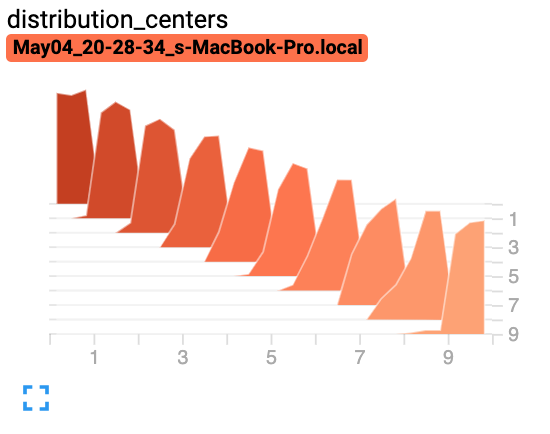

### 直方图

参考：[add_histogram](https://www.cnblogs.com/BlueBlueSea/p/14817395.html)

源码：[pytorch官网](https://pytorch.org/docs/stable/tensorboard.html?highlight=add_histogram#torch.utils.tensorboard.writer.SummaryWriter.add_histogram)

- 函数

  ```python
  add_histogram(tag, values, global_step=None, bins='tensorflow', walltime=None, max_bins=None)
  ```

- 例子

  ```python
  from torch.utils.tensorboard import SummaryWriter
  import numpy as np
  writer = SummaryWriter()
  for i in range(10):
      x = np.random.random(1000)	# 1000个点的分布
      writer.add_histogram('distribution centers', x + i, i)	# 把第i步的1000个点整体平移i
  writer.close()
  ```

  结果：

  