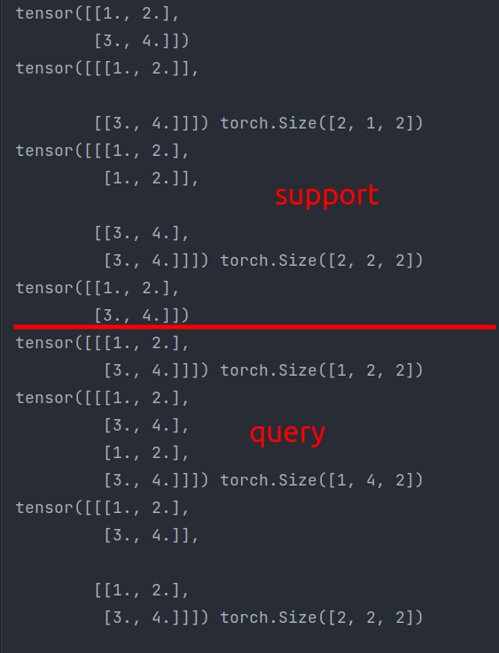

- 例子

  ```python
  # 模拟 patch loss 相似度实现
  support = torch.range(1, 4).reshape(2, 2)
  print(support)
  support = support.unsqueeze(1)
  print(support, support.shape)
  support = support.repeat(1, 2, 1)
  print(support, support.shape)
  
  query = torch.range(1, 4).reshape(2, 2)
  print(query)
  query = query.unsqueeze(0)
  print(query, query.shape)
  query = query.repeat(1, 2, 1)
  print(query, query.shape)
  query = query.reshape(2, 2, 2)
  print(query, query.shape)
  ```

  