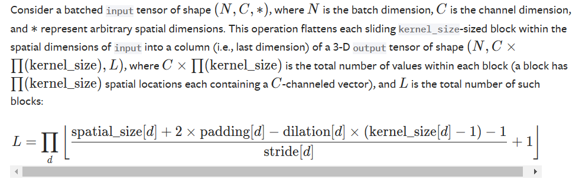
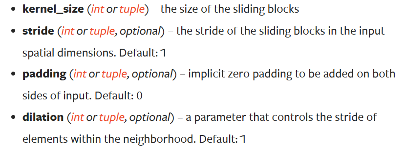
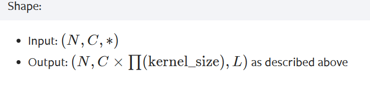

### [torch.nn.Unfold](https://pytorch.org/docs/stable/generated/torch.nn.Unfold.html)

- 作用：从一个batch的数据中提取滑动块（窗口）。

- 函数：

    ```python
    torch.nn.Unfold(kernel_size, dilation=1, padding=0, stride=1)
	```

	

- 参数：

  

- 输出：

  

- 例子：

  ```shell
  >>> unfold = nn.Unfold(kernel_size=(2, 3))
  >>> input = torch.randn(2, 5, 3, 4)
  >>> output = unfold(input)
  >>> # each patch contains 30 values (2x3=6 vectors, each of 5 channels)
  >>> # 4 blocks (2x3 kernels) in total in the 3x4 input
  >>> output.size()
  torch.Size([2, 30, 4])
  
  >>> # Convolution is equivalent with Unfold + Matrix Multiplication + Fold (or view to output shape)
  >>> inp = torch.randn(1, 3, 10, 12)
  >>> w = torch.randn(2, 3, 4, 5)
  >>> inp_unf = torch.nn.functional.unfold(inp, (4, 5))
  >>> out_unf = inp_unf.transpose(1, 2).matmul(w.view(w.size(0), -1).t()).transpose(1, 2)
  >>> out = torch.nn.functional.fold(out_unf, (7, 8), (1, 1))
  >>> # or equivalently (and avoiding a copy),
  >>> # out = out_unf.view(1, 2, 7, 8)
  >>> (torch.nn.functional.conv2d(inp, w) - out).abs().max()
  tensor(1.9073e-06)
  ```

  