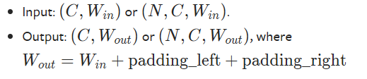

### [torch.nn.ReplicationPad1d](https://pytorch.org/docs/stable/generated/torch.nn.ReplicationPad1d.html)(*padding*)

- 作用：使用输入边界的复制填充输入张量。

  > Pads the input tensor using replication of the input boundary.

对于N维的填充，使用[`torch.nn.functional.pad()`](https://pytorch.org/docs/stable/generated/torch.nn.functional.pad.html#torch.nn.functional.pad)

- 参数：**padding**(int, tuple)

  如果是int，所有边界使用一样的填充。如果是二元组，使用(padding_leftpadding_left, padding_rightpadding_right)。

- 输入：

  

- 例子：

  ```shell
  >>> m = nn.ReplicationPad1d(2)
  >>> input = torch.arange(8, dtype=torch.float).reshape(1, 2, 4)
  >>> input
  tensor([[[0., 1., 2., 3.],
           [4., 5., 6., 7.]]])
  >>> m(input)
  tensor([[[0., 0., 0., 1., 2., 3., 3., 3.],
           [4., 4., 4., 5., 6., 7., 7., 7.]]])
  >>> # using different paddings for different sides
  >>> m = nn.ReplicationPad1d((3, 1))
  >>> m(input)
  tensor([[[0., 0., 0., 0., 1., 2., 3., 3.],
           [4., 4., 4., 4., 5., 6., 7., 7.]]])
  >>> input = torch.arange(8, dtype=torch.float).reshape(2, 2, 2)
  >>> input
  tensor([[[0., 1.],
           [2., 3.]],
  
          [[4., 5.],
           [6., 7.]]])
  >>> m(input)
  tensor([[[0., 0., 0., 1., 1., 1.],
           [2., 2., 2., 3., 3., 3.]],
  
          [[4., 4., 4., 5., 5., 5.],
           [6., 6., 6., 7., 7., 7.]]])
  ```

  