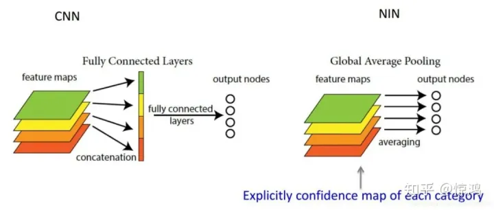

- 其次，在GAP被提出之前，常用的方式是将feature map直接拉平成一维向量（下图左），但是GAP不同，是将每个通道的二维图像做平均，最后也就是每个通道对应一个均值（下图右）。

  

  

- 可以看到，GAP的设计非常简单直接，但是为什么要这么做呢？或者说GAP区别于全连接的方式有哪些优势呢？

  1. **抑制过拟合**。直接拉平做全连接层的方式依然保留了大量的空间信息，假设feature map是32个通道的10x10图像，那么拉平就得到了32x10x10的向量，如果是最后一层是对应两类标签，那么这一层就需要3200x2的权重矩阵，而GAP不同，将空间上的信息直接用均值代替，32个通道GAP之后得到的向量都是32的向量，那么最后一层只需要32x2的权重矩阵。相比之下GAP网络参数会更少，而全连接更容易在大量保留下来的空间信息上面过拟合。
  2. **可解释的雏形**。在《NIN》原文当中有这样一句话，GAP相比全连接更加自然地加强了类别和feature map之间的联系，（这个类别指的是分类的类别）因此，feature map可以很容易地解释成categories confidence maps。后半句可能有些难以理解，这块我们在第二节展开来讲。如果之前对Class Activation Mapping （CAM） 有过了解的同学可能会不禁感叹：“这其实就是CAM的核心思想！”
  3. **输入尺寸更加灵活。**在第1点的举例里面可以看到feature map经过GAP后的神经网络参数不再与输入图像尺寸的大小有关，也就是输入图像的长宽可以不固定。

  除了这些优势，GAP也有个缺点——训练的收敛速度会变慢。