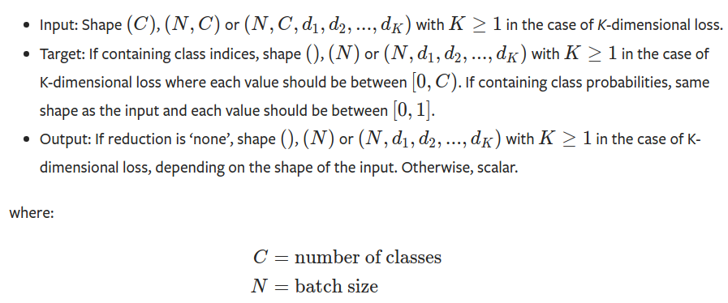

### [torch.nn.CrossEntropyLoss](https://pytorch.org/docs/stable/generated/torch.nn.CrossEntropyLoss.html)

- 函数：

  ```python
  torch.nn.CrossEntropyLoss(weight=None, size_average=None, ignore_index=-100, reduce=None, reduction='mean', label_smoothing=0.0)
  ```

- 用途：

  logits: 未归一化的概率， 一般也就是 softmax层的输入。

  用于训练一个C分类问题。如果提供了`weight`选项，该选项应该是一个1维的向量，给每个类分配权重。这个选项在有一个不平衡的训练集下非常有效。

- 输入

  模型的输出，包含每个类的的分。输入应该是一个没有归一化的logits(即网络的输出还没有经过softmax)。或者经过了也行。

  输入的形状：

  - unbatched input：

    长度为C的向量

  - batched input：

    $(minibatch, C)$ 或者 $(minibatch, C, d_1, d_2, ..., d_K)$ ，其中，K>=1，对应K维的情况。这个高维度可以应用在，计算每张2维图像上每个像素之间的交叉熵损失。

- 标签：（有两种情况）

  - 标签是是类的索引 $[0, C)$。当`reduction=none`时，损失公式如下：
    $$
    \mathcal{l}(x,y) = L = \{l_1, ..., l_N\}^T \\
    l_n = -w_{y_n} \log \frac{exp(x_{n, y_n})}{\sum^C_{c=1} \exp(x_{n,c})} \cdot \mathbb{1}\{y_n \neq ignore\_index\}
    $$

    其中，x 是输ed (see入，y是标签，w是标签的权重，默认是1，C是类的数量，N是batch大小，即有几个样本，ignore_index是是否包含当前样本的损失。

    `reduction != none`：
    $$
    \mathcal{l}(x,y) = \begin{cases}
    \sum^N_{n=1} \frac{1}{\sum^N_{n=1} w_{y_n} \cdot 1 \{y_n \neq ignore\_index\}} l_n, if \quad reduction='mean'; \\
    \sum^N_{n=1} l_n, if \quad reduction='sum'.
    
    \end{cases}
    $$
    
  - 标签是每个类的概率
  
- 注意：

  当目标包含类索引时，该标准的性能通常更好，因为这允许优化计算。仅当每个小批量项目的单个类标签限制性太大时，才考虑提供目标类概率。

  

- 形状：

  

  

- 例子：

  ```python
  '''CrossEntropyLoss'''
  import torch
  import torch.nn as nn
  import numpy as np
  loss = nn.CrossEntropyLoss(reduction='none')
  input = torch.tensor([
      [1, 2, 3],
      [4, 5, 6]
  ], dtype=torch.float32)
  target = torch.tensor([1, 0], dtype=torch.long)
  print(f'input = {input}, target = {target}')
  output = loss(input, target)
  print(f'output = {output}')
  xn = torch.tensor([1,2,3])
  z = -np.log(np.exp(2.) / (np.exp(1.) + np.exp(2.) + np.exp(3.)))
  print(z)
  '''
  input = tensor([[1., 2., 3.],
          [4., 5., 6.]]), target = tensor([1, 0])
  output = tensor([1.4076, 2.4076])
  1.4076059644443801
  2.40760596444438
  '''
  ```

  这里如上面的`reduction=none`时的计算公式：

  input里有两个样本，其中第一个样本从模型中出来之后，对每个类的打分分别为：[1, 2, 3]，其实际分类是1，那么计算如下：
  $$
  l_1 = -\log \frac{e_2}{e_1 + e_2 + e_3} = 1.4076 \\
  l_2 = -\log \frac{e_1}{e_1 + e_2 + e_3} = 2.4076, \\
  其中，y_1 = 1,对应索引的第2个位置，即分数为2的地方。
  $$
  如果`reduction=mean(default)`那么对上面两个取平均，
  $$
  l = (l_1 + l_2) / 2 = 1.9076
  $$