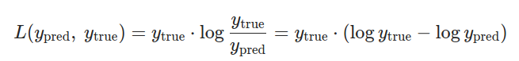
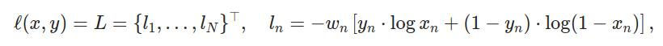

### [CrossEntropyLoss](https://pytorch.org/docs/stable/generated/torch.nn.CrossEntropyLoss.html)

- 使用时候的注意事项
  第一个参数是x，第二个参数才是y！！！

- 函数：

  ```python
  torch.nn.CrossEntropyLoss(weight=None, size_average=None, ignore_index=-100, reduce=None, reduction='mean', label_smoothing=0.0)
  ```

- 用途：

  logits: 未归一化的概率， 一般也就是 softmax层的输入。

  用于训练一个C分类问题。如果提供了`weight`选项，该选项应该是一个1维的向量，给每个类分配权重。这个选项在有一个不平衡的训练集下非常有效。

- 输入

  模型的输出，包含每个类的的分。输入应该是一个没有归一化的logits(即网络的输出还没有经过softmax)。或者经过了也行。

  输入的形状：

  - unbatched input：

    长度为C的向量

  - batched input：

    $(minibatch, C)$ 或者 $(minibatch, C, d_1, d_2, ..., d_K)$ ，其中，K>=1，对应K维的情况。这个高维度可以应用在，计算每张2维图像上每个像素之间的交叉熵损失。

- 标签：（有两种情况）

  - 标签是是类的索引 $[0, C)$。当`reduction=none`时，损失公式如下：
    $$
    \mathcal{l}(x,y) = L = \{l_1, ..., l_N\}^T \\
    l_n = -w_{y_n} \log \frac{exp(x_{n, y_n})}{\sum^C_{c=1} \exp(x_{n,c})} \cdot \mathbb{1}\{y_n \neq ignore\_index\}
    $$

    其中，x 是输ed (see入，y是标签，w是标签的权重，默认是1，C是类的数量，N是batch大小，即有几个样本，ignore_index是是否包含当前样本的损失。

    `reduction != none`：
    $$
    \mathcal{l}(x,y) = \begin{cases}
    \sum^N_{n=1} \frac{1}{\sum^N_{n=1} w_{y_n} \cdot 1 \{y_n \neq ignore\_index\}} l_n, if \quad reduction='mean'; \\
    \sum^N_{n=1} l_n, if \quad reduction='sum'.
    
    \end{cases}
    $$
    
  - 标签是每个类的概率
  
- 注意：

  当目标包含类索引时，该标准的性能通常更好，因为这允许优化计算。仅当每个小批量项目的单个类标签限制性太大时，才考虑提供目标类概率。

  

- 形状：

  

  

- 例子：

  ```python
  '''CrossEntropyLoss'''
  import torch
  import torch.nn as nn
  import numpy as np
  loss = nn.CrossEntropyLoss(reduction='none')
  input = torch.tensor([
      [1, 2, 3],
      [4, 5, 6]
  ], dtype=torch.float32)
  target = torch.tensor([1, 0], dtype=torch.long)
  print(f'input = {input}, target = {target}')
  output = loss(input, target)
  print(f'output = {output}')
  xn = torch.tensor([1,2,3])
  z = -np.log(np.exp(2.) / (np.exp(1.) + np.exp(2.) + np.exp(3.)))
  print(z)
  '''
  input = tensor([[1., 2., 3.],
          [4., 5., 6.]]), target = tensor([1, 0])
  output = tensor([1.4076, 2.4076])
  1.4076059644443801
  2.40760596444438
  '''
  ```

  这里如上面的`reduction=none`时的计算公式：

  input里有两个样本，其中第一个样本从模型中出来之后，对每个类的打分分别为：[1, 2, 3]，其实际分类是1，第二个样本的实际标签是0，那么计算如下：
  $$
  l_1 = -\log \frac{e^2}{e^1 + e^2 + e^3} = 1.4076 \\
  l_2 = -\log \frac{e^1}{e^1 + e^2 + e^3} = 2.4076, \\
  其中，y_1 = 1,对应索引的第2个位置，即分数为2的地方。
  $$
  如果`reduction=mean(default)`那么对上面两个取平均，
  $$
  l = (l_1 + l_2) / 2 = 1.9076
  $$


### [MSELoss](https://pytorch.org/docs/stable/generated/torch.nn.MSELoss.html)

- 函数

  ```python
  torch.nn.MSELoss(size_average=None, reduce=None, reduction='mean')
  ```

- 计算公式
  $$
  \mathcal{l}(x,y) = L = \{ l_1, ..., l_N \}^T, \qquad l_n = (x_n - y_n)^2
  $$
  
- 例子

  ```shell
  >>> loss = nn.MSELoss()
  >>> input = torch.randn(3, 5, requires_grad=True)
  >>> target = torch.randn(3, 5)
  >>> output = loss(input, target)
  >>> output.backward()
  ```

  

### [TripletMarginLoss](https://pytorch.org/docs/stable/generated/torch.nn.TripletMarginLoss.html)

- 函数

  ```python
  torch.nn.TripletMarginLoss(margin=1.0, p=2.0, eps=1e-06, swap=False, size_average=None, reduce=None, reduction='mean')
  ```

- 计算公式
  $$
  L(a,p,n) = max\{ d(a_i, p_i) - d(a_i, n_i) + margin, 0 \}
  $$
  其中， $d(a, b)$ 是距离函数，默认是 $\Vert \mathrm{x}_i - \mathrm{y}_i \Vert_p$ 。

- 例子

  

```shell
>>> triplet_loss = nn.TripletMarginLoss(margin=1.0, p=2)
>>> anchor = torch.randn(100, 128, requires_grad=True)
>>> positive = torch.randn(100, 128, requires_grad=True)
>>> negative = torch.randn(100, 128, requires_grad=True)
>>> output = triplet_loss(anchor, positive, negative)
>>> output.backward()
```

### [KLDIVLOSS](https://pytorch.org/docs/stable/generated/torch.nn.KLDivLoss.html)

KL散度损失

注意：在pytorch中，第一个参数`input`是模型输出的值，`target`是数据集的观测值。而数学中，$KL(P \Vert Q)$ 中的 $P$ 表示数据集的观测， $Q$ 表示模型的输出。

- 函数

  ```python
  torch.nn.KLDivLoss(size_average=None, reduce=None, reduction='mean', log_target=False)
  ```

- 计算公式

  两个相同形状的张量 $y_{pred}$ ， $y_{true}$ ，其中前者是`input`，后者是`target`。那么KL散度的计算公式：

  

  为了避免下溢问题，`input`应该在log空间（softmax输出）。`log_target=True`时，`target`也应该在log空间。

  总之，这个函数进行如下的计算：

  ```python
  if not log_target: # default
      loss_pointwise = target * (target.log() - input)
  else:
      loss_pointwise = target.exp() * (target - input)
  ```

  然后根据参数`reduction`：

  ```python
  if reduction == "mean":  # default
      loss = loss_pointwise.mean()
  elif reduction == "batchmean":  # mathematically correct
      loss = loss_pointwise.sum() / input.size(0)
  elif reduction == "sum":
      loss = loss_pointwise.sum()
  else:  # reduction == "none"
      loss = loss_pointwise
  ```

- 例子

  ```python
  >>> import torch.nn.functional as F
  >>> kl_loss = nn.KLDivLoss(reduction="batchmean")
  >>> # input should be a distribution in the log space
  >>> input = F.log_softmax(torch.randn(3, 5, requires_grad=True), dim=1)
  >>> # Sample a batch of distributions. Usually this would come from the dataset
  >>> target = F.softmax(torch.rand(3, 5), dim=1)
  >>> output = kl_loss(input, target)
  
  >>> kl_loss = nn.KLDivLoss(reduction="batchmean", log_target=True)
  >>> log_target = F.log_softmax(torch.rand(3, 5), dim=1)
  >>> output = kl_loss(input, log_target)
  ```

  

### BCELOSS

二元交叉熵损失函数在深度学习中广泛应用于二分类问题中，如图像分类、文本分类等任务中。通过最小化二元交叉熵损失，模型可以学习到更好的分类决策边界，从而提高模型的分类性能。

计算二元交叉熵损失。

注意：模型的输出最后要过Sigmod之后在送入损失函数。

- 函数

  ```python
  torch.nn.BCELoss(weight=None, size_average=None, reduce=None, reduction='mean')
  ```

- 计算公式

  

- 例子

  ```python
  >>> m = nn.Sigmoid()
  >>> loss = nn.BCELoss()
  >>> input = torch.randn(3, requires_grad=True)
  >>> target = torch.empty(3).random_(2)
  >>> output = loss(m(input), target)
  >>> output.backward()
  ```

  
